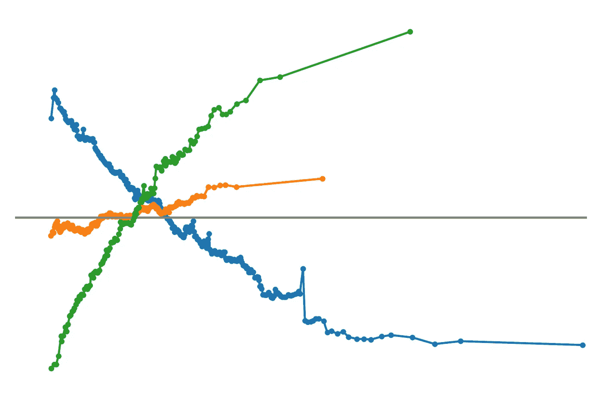

# 深入探讨使用 Python 绘制的累积局部效应图（ALEs）

> 原文：[`towardsdatascience.com/deep-dive-on-accumulated-local-effect-plots-ales-with-python-0fc9698ed0ee?source=collection_archive---------4-----------------------#2024-05-20`](https://towardsdatascience.com/deep-dive-on-accumulated-local-effect-plots-ales-with-python-0fc9698ed0ee?source=collection_archive---------4-----------------------#2024-05-20)

## 使用 ALEs 解释机器学习模型的直觉、算法和代码

 [Conor O'Sullivan](https://conorosullyds.medium.com/?source=post_page---byline--0fc9698ed0ee--------------------------------)

·发布于 [Towards Data Science](https://towardsdatascience.com/?source=post_page---byline--0fc9698ed0ee--------------------------------) ·阅读时间：10 分钟·2024 年 5 月 20 日

--

（来源：作者）

高度相关的特征可能会对你的模型解释产生严重影响。它们违反了许多 XAI 方法的假设，并使得很难理解特征与目标之间的关系。同时，移除这些特征并不总是可行的，因为这可能会影响模型的表现。我们需要一种即使在多重共线性的情况下也能提供清晰解释的方法。幸运的是，我们可以依赖 ALEs [1]。

ALEs 是一种全局解释方法。像 PDPs 一样，它们展示了模型捕捉到的趋势。也就是说，特征与目标变量之间是否存在线性、非线性或无关系。然而，我们将看到，识别这些趋势的方法是完全不同的。我们将：

+   让你直观理解 ALEs 是如何创建的。

+   正式定义用于创建 ALEs 的算法。

+   使用 [Alibi Explain](https://docs.seldon.io/projects/alibi/en/latest/) 包应用 ALEs。

我们将看到，与其他 XAI 方法如 SHAP、LIME、ICE Plots 和 Friedman 的 H-stat 不同，ALEs 提供的解释对多重共线性具有稳健性。
