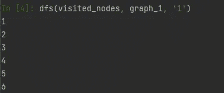
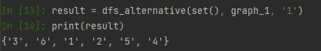
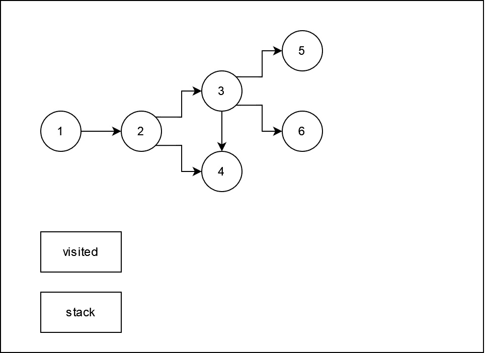
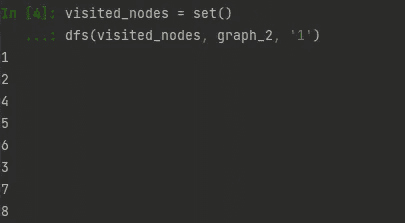
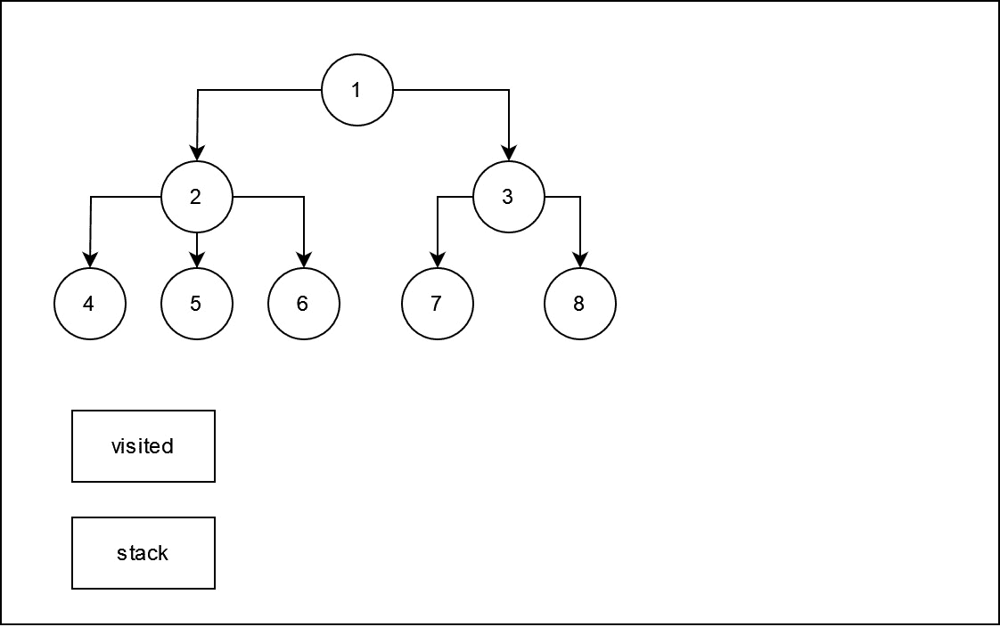

# 深度优先搜索 — 基本图算法

> 原文：[`towardsdatascience.com/deep-first-search-fundamental-graph-algorithm-d22991d5c144?source=collection_archive---------16-----------------------#2024-09-26`](https://towardsdatascience.com/deep-first-search-fundamental-graph-algorithm-d22991d5c144?source=collection_archive---------16-----------------------#2024-09-26)

## Python 中 DFS 算法的递归实现，并附带示例和逐步讲解

 [Robert Kwiatkowski](https://robertkwiatkowski01.medium.com/?source=post_page---byline--d22991d5c144--------------------------------)

·发表于 [Towards Data Science](https://towardsdatascience.com/?source=post_page---byline--d22991d5c144--------------------------------) ·阅读时间 5 分钟·2024 年 9 月 26 日

--

图片由 [Shubham Dhage](https://unsplash.com/@theshubhamdhage?utm_source=medium&utm_medium=referral) 提供，来源：[Unsplash](https://unsplash.com/?utm_source=medium&utm_medium=referral)

## **介绍**

在计算机科学中，算法是各种有用技术（如人工智能）的核心，帮助我们高效地解决一系列现实生活中的挑战。其中，图算法因其广泛的应用而占有特殊地位，因为许多问题可以通过图来建模。图是由节点（或顶点）和连接节点的边组成，表示节点之间的关系（或连接）。

一些例子：

+   **社交网络**：在社交网络中，如 Facebook 或 Instagram，用户可以被表示为节点，用户之间的友谊或连接则是边。[ [1](https://www.researchgate.net/publication/368287579_Graph_Models_of_Social_Media_Network_As_Applied_to_Facebook_and_Facebook_Messenger_Groups/citation/download) ]

+   **路线规划与导航**：在地图中，地点（城市、交叉口或地标）被建模为节点，而它们之间的道路或路径则是边。[ [2](https://www.sciencedirect.com/science/article/pii/S1877050920315799) ]

+   **网页爬取**：互联网可以看作一个庞大的图，其中网页是节点，它们之间的超链接则是边。

+   **调度与任务管理**：许多任务之间的依赖关系可以建模为有向无环图（DAGs），其中任务是节点，任务之间的依赖关系是边。

+   **网络连通性**：在计算机网络中，设备（路由器、计算机）是节点，通信链接是边。

用于遍历或探索图的基本算法之一是 **深度优先搜索（DFS）**。它用于探索（访问）图中的所有节点。另一种补充且基础的算法是广度优先搜索（BFS），这将是另一个单独文章的主题。

在这里，我们将深入了解 DFS 是如何工作的，通过简单的代码、直观的例子以及一些很酷的动画，逐步展示这个算法是如何执行的。

DFS 可以通过两种方式实现：迭代式和递归式。这里，我将向你展示如何通过递归实现，因为在我看来，递归更容易理解和编码。如果你还不熟悉递归，这也是一个学习递归如何工作的绝佳机会。DFS 实现将使用纯 Python 代码。

以下是实现 DFS 算法的代码。

函数有三个输入：一个已访问节点的集合（通常最初为空）、一个图的定义和一个起始节点。逻辑简单而有效：

1. 首先，我们检查是否已经访问了给定节点

a. 如果是，跳过检查它的邻居

b. 如果没有，打印该节点并开始访问它的邻居（“for 循环”）

2. 重复，直到所有节点都在已访问节点列表中

在这种情况下，函数返回 None（即什么都不返回），因为它打印了已访问的节点并将它们写入外部定义的集合。我们可以更改它的行为，使其返回一个包含所有已访问节点的集合，而不是像这样打印值：

**示例 1**

首先，我们必须定义我们的示例图。为此，我们将使用邻接矩阵作为 Python 字典。在每个键值对中，键是一个节点，值是与该节点连接的节点列表（邻居）。

以下是创建第一个示例图的代码。在这种情况下，它是一个有向图（为了清晰和简便），但 DFS 同样适用于无向图。

执行函数调用命令后，输出将是已访问的节点系列：

*图片来自作者*

或者使用下面的替代版本的代码。在这里，我们可以通过小小的改变输入，避免使用任何全局变量，而直接传递一个空集合。输出将是：

*图片来自作者*

让我们可视化地展示函数栈和最终集合是如何一步步构建的。下面的动画展示了这一过程。

*图片来自作者*

**示例 2**

在这个例子中，我们将构建并遍历一种特殊类型的图——决策树。图的定义如下。

在对这个图执行 DFS 后，输出将是：

图片来自作者

下方的动画展示了图形的样子以及深度优先搜索（DFS）如何遍历它。

DFS 遍历一棵树；图片来源：作者

**总结**

深度优先搜索（DFS）是图论中一个重要的算法，广泛应用于多个领域，从社交网络到决策树。它的递归性质使得理解和实现变得简单，正如本文中的示例所展示的那样。DFS 的简单性以及它能够高效地遍历图中的所有节点，使其成为解决各种计算问题的强大工具。理解 DFS 的工作原理为掌握其他算法，如广度优先搜索（BFS）和路径寻找算法（如 Dijkstra 或 A*）打下了基础。

尝试使用更大更复杂的图形进行实验，并探索它在不同数据结构下的表现。在未来的文章中，我们将探讨其他遍历方法，如广度优先搜索（BFS），并进一步研究它们的使用案例、优点和局限性。

继续练习并挑战自己的极限，很快像深度优先搜索（DFS）这样的图算法就会成为你的第二天性。祝编程愉快！

参考文献

[1] Tsok, Samuel & Yakubu, Hosea & Solomon, Rwat. (2023). 社交媒体网络的图模型及其在 Facebook 和 Facebook Messenger 群组中的应用。《国际计算机科学与工程杂志》。第 9 卷，第 1 页，10.56201/ijcsmt.v9.no1.2023.pg1.12。[[链接](https://www.researchgate.net/publication/368287579_Graph_Models_of_Social_Media_Network_As_Applied_to_Facebook_and_Facebook_Messenger_Groups)]

[2] Tianlun Dai, Wenchao Zheng, Jiayue Sun, Cun Ji, Tao Zhou, Mingtong Li, Wei Hu, Ziqiang Yu, 实时动态图上的连续路线规划，《计算机科学文集》，第 174 卷，2020 [[链接](https://www.sciencedirect.com/science/article/pii/S1877050920315799)]
