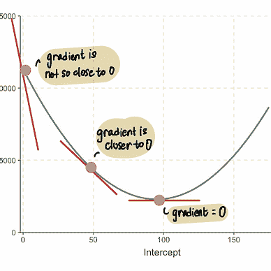
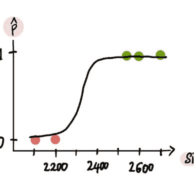

# 深度学习图解，第二部分：神经网络是如何学习的？

> 原文：[`towardsdatascience.com/deep-learning-illustrated-part-2-how-does-a-neural-network-learn-481f70c1b474?source=collection_archive---------1-----------------------#2024-02-08`](https://towardsdatascience.com/deep-learning-illustrated-part-2-how-does-a-neural-network-learn-481f70c1b474?source=collection_archive---------1-----------------------#2024-02-08)

## 一份关于神经网络如何学习的图解和直观指南

 [Shreya Rao](https://medium.com/@shreya.rao?source=post_page---byline--481f70c1b474--------------------------------)

·发表于[Towards Data Science](https://towardsdatascience.com/?source=post_page---byline--481f70c1b474--------------------------------) ·阅读时间 14 分钟·2024 年 2 月 8 日

--

欢迎来到《深度学习图解》系列的第二部分。在[上一篇文章](https://medium.com/towards-data-science/neural-networks-illustrated-part-1-how-does-a-neural-network-work-c3f92ce3b462)（一定要先读那篇！）中，我们讲解了神经网络是如何工作的，以及**训练过的**神经网络如何进行预测。我们还了解到，在训练过程中，神经网络通过优化获得了最佳的权重和偏置值。

 ## 深度学习图解，第一部分：神经网络是如何工作的？

### 神经网络的图解和直观指南

[towardsdatascience.com

在本文中，我们将深入探讨**训练**过程，并详细讲解神经网络是如何学习的。

> 📣 如果你还没有阅读我之前的文章，我强烈建议你从我的[机器学习基础](https://medium.com/@shreya.rao/list/machine-learning-starter-pack-b89c3a7f97ad)系列开始，特别是那篇关于[梯度下降](https://medium.com/towards-data-science/back-to-basics-part-dos-linear-regression-cost-function-and-gradient-descent-e3d7d05c56fd)的文章，因为你会发现那篇文章中的很多内容在这里也非常相关。

[Shreya Rao](https://medium.com/@shreya.rao?source=post_page-----481f70c1b474--------------------------------)

## 机器学习入门包

[查看列表](https://medium.com/@shreya.rao/list/machine-learning-starter-pack-b89c3a7f97ad?source=post_page-----481f70c1b474--------------------------------)3 个故事！

假设我们想要创建一个神经网络，通过以下特征预测冰淇淋销售的日收入…
