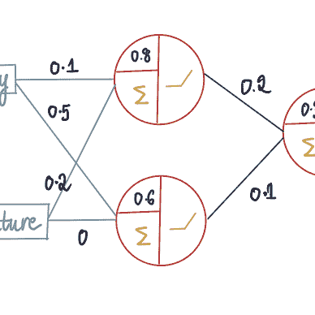
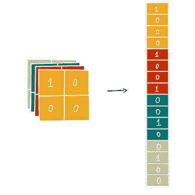

# 深度学习插图版，第四部分：循环神经网络

> 原文：[`towardsdatascience.com/deep-learning-illustrated-part-4-recurrent-neural-networks-d0121f27bc74?source=collection_archive---------3-----------------------#2024-06-11`](https://towardsdatascience.com/deep-learning-illustrated-part-4-recurrent-neural-networks-d0121f27bc74?source=collection_archive---------3-----------------------#2024-06-11)

## 一本关于 RNN 及 Softmax 激活函数内在工作的插图和直观指南

 [Shreya Rao](https://medium.com/@shreya.rao?source=post_page---byline--d0121f27bc74--------------------------------)

·发表于[Towards Data Science](https://towardsdatascience.com/?source=post_page---byline--d0121f27bc74--------------------------------) ·17 分钟阅读·2024 年 6 月 11 日

--

欢迎来到我们插图版深度学习之旅的第四部分！今天，我们将深入探讨循环神经网络（RNN）。我们将讨论一些你可能已经熟悉的概念，如输入、输出和激活函数，但会带有一些新的变化。如果这是你第一次加入我们的学习之旅，强烈建议你先阅读之前的文章，特别是第[1 部分](https://medium.com/towards-data-science/neural-networks-illustrated-part-1-how-does-a-neural-network-work-c3f92ce3b462)和第[2 部分](https://medium.com/towards-data-science/deep-learning-illustrated-part-2-how-does-a-neural-network-learn-481f70c1b474)，然后再继续阅读这篇文章。

[Shreya Rao](https://medium.com/@shreya.rao?source=post_page-----d0121f27bc74--------------------------------)

## 深度学习，插图版

[查看列表](https://medium.com/@shreya.rao/list/deep-learning-illustrated-ae6c27de1640?source=post_page-----d0121f27bc74--------------------------------)5 个故事！

循环神经网络（RNN）是专门设计用于处理**基于序列的问题**的独特模型，在这种问题中，当前位置依赖于前一个状态。

让我们通过一个来自[MIT 课程](https://www.youtube.com/watch?v=dqoEU9Ac3ek&t=2126s)的简单例子来解读什么是基于序列的问题。想象一下一个球体在特定时间点 tn 的位置。

如果我们被要求预测球的方向，在没有进一步信息的情况下，这就是一个猜测游戏——它可能朝任何方向移动。
