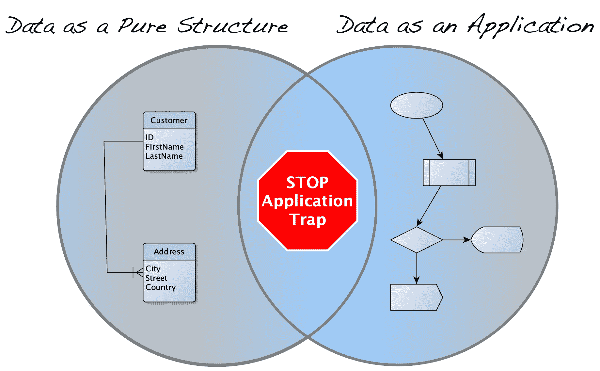

# 将你的数据作为产品交付，但不是作为应用

> 原文：[`towardsdatascience.com/deliver-your-data-as-a-product-but-not-as-an-application-99c4af23c0fb?source=collection_archive---------0-----------------------#2024-07-12`](https://towardsdatascience.com/deliver-your-data-as-a-product-but-not-as-an-application-99c4af23c0fb?source=collection_archive---------0-----------------------#2024-07-12)

## 数据作为产品是一个有趣的概念，但要小心应用陷阱

 [Bernd Wessely](https://medium.com/@bernd.wessely?source=post_page---byline--99c4af23c0fb--------------------------------)

·发表于[Towards Data Science](https://towardsdatascience.com/?source=post_page---byline--99c4af23c0fb--------------------------------) ·9 分钟阅读·2024 年 7 月 12 日

--

数据作为产品可以以两种形式提供 — 作者提供的图片

为了将你的[数据作为产品](https://martinfowler.com/articles/data-monolith-to-mesh.html#DomainDataAsAProduct)交付，而不仅仅是一个没有进一步业务背景的表格或文件，这是数据网格框架的一个关键原则。考虑是通过应用服务（API）还是作为纯数据结构来交付数据，都是一个重要的设计决策。我之前已经在我的[数据网格三部分系列的第二部分](https://medium.com/towards-data-science/challenges-and-solutions-in-data-mesh-part-2-7dfe97aa461a)中探讨了这个具体挑战。然而，本文将讨论超越数据网格概念的问题，因为我认为它是如此基础。我将概述关键区别，并阐明为什么你应该偏向“数据作为纯结构”而非“数据作为应用”。

# 数据作为产品

将数据转化为产品的概念在数据工程领域并不新鲜，甚至在数据网格框架定义之前就已被使用。然而，在创建一个由数据驱动的产品和将数据本身视为产品之间，有一个重要的区别 — 这里有一个很好的解释，说明了“数据作为产品”和“数据产品”之间的微妙差异。在本文中，我专注于“数据作为产品”，即使我为了简洁也使用了“数据产品”这个术语。
