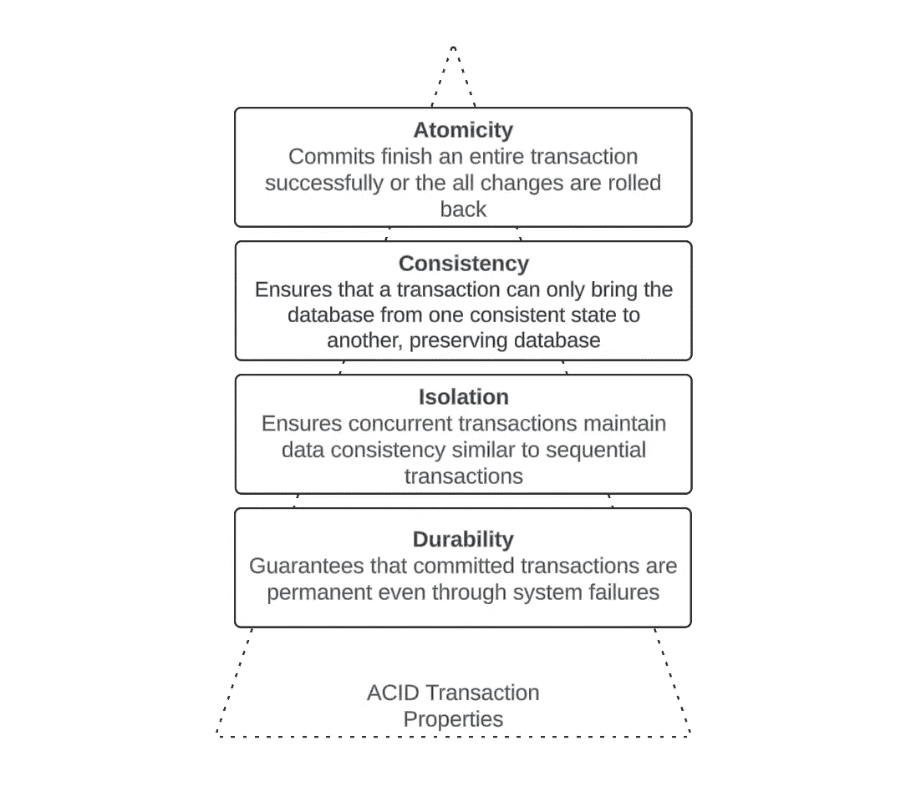
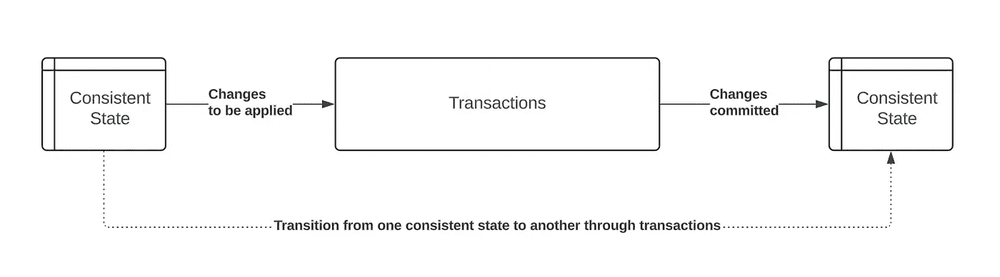
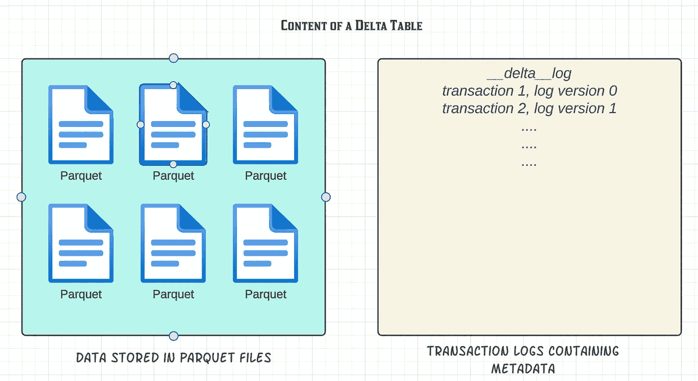
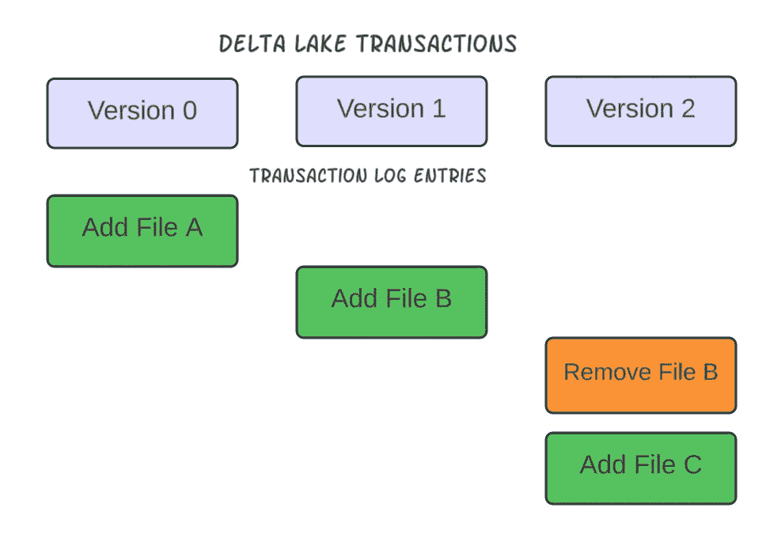
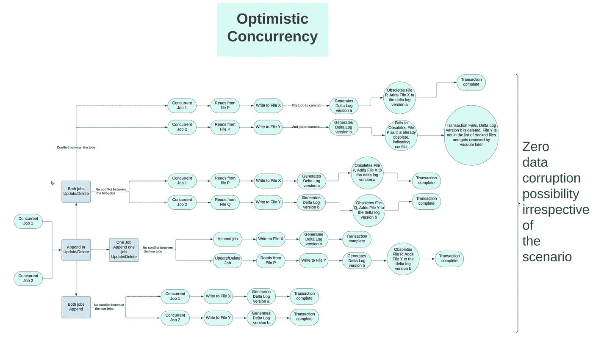
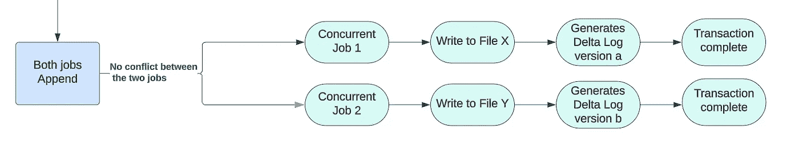
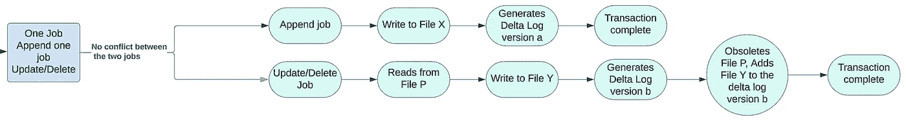
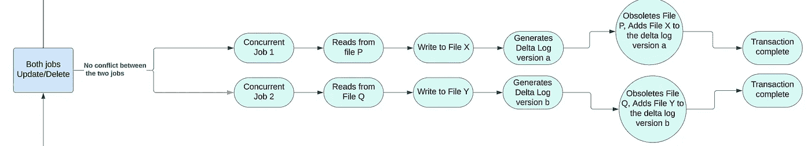
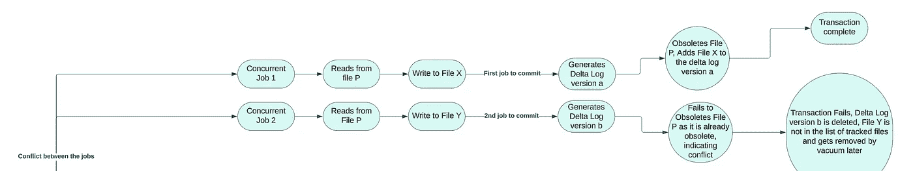

# Delta Lake 乐观并发控制：是锁定还是不锁定？

> 原文：[`towardsdatascience.com/delta-lake-optimistic-concurrency-control-to-lock-or-not-to-lock-9b6458821a52?source=collection_archive---------8-----------------------#2024-07-10`](https://towardsdatascience.com/delta-lake-optimistic-concurrency-control-to-lock-or-not-to-lock-9b6458821a52?source=collection_archive---------8-----------------------#2024-07-10)

## **Delta Lake 及其相关性**

 [Rudra Sinha](https://medium.com/@rudra_sinha?source=post_page---byline--9b6458821a52--------------------------------)

·发表于 [Towards Data Science](https://towardsdatascience.com/?source=post_page---byline--9b6458821a52--------------------------------) ·11 分钟阅读·2024 年 7 月 10 日

--

随着数据世界朝着通过 AI、ML 及其他趋势技术生成、存储、处理和消费海量数据的方向发展，独立可扩展的存储和计算能力的需求不断增加，以应对不断增加的数据集添加（APPEND）和变更（UPSERT & MERGE）需求，这些数据集正通过 AI、ML 等技术进行训练和使用。

尽管不同云服务提供商提供的基于 Parquet 的数据湖存储在数据湖实施的初期为我们提供了极大的灵活性，但随着当前商业和技术需求的发展，这些实现正面临越来越多的挑战。尽管我们仍然喜欢使用 Parquet 这种开放的存储格式，但现在我们需要像 ACID 事务、时间旅行和模式强制等功能来满足数据湖的需求。这些正是 Delta Lake 作为一个抽象层在基于 Parquet 的数据存储之上诞生的主要驱动因素。ACID 的简要参考见下图。

图片来源：作者

Delta Lake（当前 GA 版本 3.2.0）为我们带来了许多不同的功能，其中一些在上文中已经提到。但在本文中，我想讨论 ACID 事务的一个特定领域，即**一致性**，以及如何决定是直接使用 Delta Lake 的这一功能，还是在该功能周围添加我们自己的定制，以适应我们的用例。在此过程中，我们还将讨论一些 Delta Lake 的内部工作原理。让我们深入了解吧！

**什么是数据一致性？**

数据一致性是我们使用并滥用的基本数据库或数据术语，自从我们以某种形式存储数据以来，它就一直存在。简单来说，它是数据库或数据集中的数据的准确性、完整性和正确性，保护数据消费应用程序免受在持续事务改变底层数据时部分或意外的数据状态。

图片由作者提供

如上图所示，数据集上的数据查询应当获取左侧数据的一致性状态，直到事务完成并且更改已提交，创建出右侧的下一个一致性状态。在事务进行过程中，事务所做的更改不能被看到。

**Delta Lake 中的一致性**

Delta Lake 实现的一致性方式与关系型数据库的实现方式非常相似；然而，Delta Lake 必须解决一些挑战：

1.  数据以 parquet 格式存储，因此是不可变的，这意味着你不能修改现有的文件，但可以删除或覆盖它们。

1.  存储层和计算层是解耦的，因此事务和读取之间没有协调层。

这种协调和一致性是在 Delta Lake 中通过 Delta Lake 的核心——Delta 事务日志来实现的。

图片由作者提供

这个概念简单却极其强大。仅仅数据（parquet）文件的存在不足以使内容数据成为查询输出的一部分，直到该数据文件也被事务日志追踪。如果一个文件被标记为*过时*或*移除*，它依然会存在于指定位置（直到 Delta Lake 的清理过程删除文件），但不会被视为当前表格一致性状态的一部分。

图片由作者提供

事务日志还用于执行模式验证，以确保所有数据文件中数据结构的一致性。模式验证是基于原始 parquet 数据存储的一个主要缺失功能，每个应用程序都必须构建并维护模式验证机制。

这些基于 Delta 事务日志的概念使 Delta Lake 能够通过三个步骤实现事务流：

1.  ***读取***：

+   此阶段仅适用于更新插入（UPSERT）和合并（MERGE）。当事务提交到 Delta 表时，Delta 使用事务日志来确定当前一致版本中需要修改（重写）的底层文件。当前一致版本是通过事务日志中跟踪的 Parquet 文件内容来确定的。如果数据集位置中存在某个文件，但它没有在事务日志中被跟踪（要么被另一个事务标记为过时，要么由于事务失败而没有被添加到日志中），那么该文件的内容不被视为当前一致版本的一部分。一旦对受影响文件的判断完成，Delta Lake 会读取这些文件。

+   如果事务仅为追加（APPEND）类型，这意味着不会影响现有文件，因此 Delta Lake 不需要将任何现有文件读取到内存中。需要注意的是，Delta Lake 不需要读取底层文件来定义模式。模式定义是通过事务日志进行维护的，并且日志被用来验证并强制执行 Delta 表中所有底层文件的模式定义。

2. ***生成事务的输出并写入文件***：在此阶段，Delta Lake 首先在内存中执行事务（追加、删除或更新插入），然后将输出写入定义 Delta 表时使用的数据集位置的新的 Parquet 数据文件中。但请记住，仅仅数据文件的存在并不会使这些新文件的内容成为 Delta 表的一部分，至少在此时还不是。这个写入过程被视为 Delta 表中数据的“暂存”。

3. ***验证当前表的一致性状态并提交新的事务***：

+   Delta Lake 现在进入生成表的新一致状态的最终阶段。为了实现这一点，会检查现有的事务日志，以确定提议的更改是否与任何自上次读取一致状态以来可能已并发提交的其他更改发生冲突。当两个并发事务试图更改同一底层文件的内容时，就会发生冲突。让我们通过一个例子来详细说明这一点。假设，两个并发事务在 HR 表上试图更新存在于同一底层文件中的两行数据。因此，两个事务都会重写同一文件的内容，并带入它们的更改，同时在事务日志中尝试废弃该文件。第一个提交的事务不会遇到任何问题，它将生成一个新的事务日志，将新写入的文件添加到日志中，并将旧文件标记为废弃。现在考虑第二个事务进行提交并经过相同的步骤。该事务也需要将相同的旧文件标记为废弃，但它发现该文件已被另一个事务标记为废弃。这种情况现在被认为是第二个事务的冲突，Delta Lake 将不允许该事务提交，从而导致第二个事务的写入失败。

+   如果没有检测到冲突，所有在*写入*阶段所做的“暂存”更改都会通过将新文件添加到新的 Delta 事务日志中，以新的一致状态提交 Delta 表，并且写操作会被标记为成功。

+   如果 Delta Lake 检测到冲突，写操作会失败并抛出异常。此失败会阻止将任何 Parquet 文件添加到表中，从而避免可能导致数据损坏的情况。请注意，这里的数据损坏是逻辑上的，而非物理上的。这是一个非常重要的部分，值得记住，以便理解我们即将讨论的 Delta Lake 另一个伟大特性——*乐观并发控制*。

**Delta Lake 中的乐观并发控制是什么？**

简单来说，Delta Lake 允许在 Delta 表上进行并发事务，前提是大多数并发事务之间不会发生冲突，主要因为每个事务都会写入自己的 Parquet 文件；然而，如果两个并发事务试图修改同一底层文件的内容，就可能会发生冲突。值得再次注意的是，乐观并发控制不会导致数据损坏。

让我们通过流程图进一步阐明，展示可能的并发操作组合、冲突的可能性以及 Delta Lake 如何防止数据损坏，不论事务的类型如何。

图片由作者提供

让我们稍微详细地讨论一下这些场景。上面的流程图展示了每种组合场景中的两个并发事务。但你可以将并发事务的数量扩展到任意多个，逻辑保持不变。

1.  ***仅追加：*** 这是所有组合场景中最简单的一种。每个追加事务都会将新内容写入新文件，因此在*验证和提交*阶段永远不会发生任何冲突。

作者提供的图片

***2\. 追加与插入/删除组合***：同样，追加操作不会与任何其他事务发生冲突。因此，即使是这个组合场景也不会导致任何冲突。

作者提供的图片

***3\. 多个并发的插入/删除操作没有冲突***：请参考我之前用来解释冲突的示例。现在考虑两笔对 HR 表的事务，它们试图更新存在于两个不同文件中的两行数据。这意味着这两笔事务正在重写两个不同文件的新版本。因此，这两笔事务之间没有冲突，它们都会成功。这就是乐观并发控制的最大好处……允许对同一张表的并发修改，但修改的底层文件不同。同样，增量事务日志在其中起着重要作用。当第一笔事务提交时，它使文件 X 失效并将文件 Y 添加到新的事务日志中；而第二笔事务在提交时使文件 P 失效，并添加文件 Q，生成另一个事务日志。

作者提供的图片

***4\. 多个并发的插入/删除操作有冲突***：我在解释冲突时已经讲过这个场景，这是唯一可能发生冲突导致事务失败的场景。

作者提供的图片

**你需要缓解与冲突相关的失败吗？**

为什么我们需要讨论如何减轻失败的影响呢？一个简单的缓解方法就是重新运行失败的事务……就这么简单！！是吧？嗯，实际上并非如此！

是否需要在重新运行失败的事务之外采取缓解措施，取决于使用增量表的应用程序类型。应用程序的类型将决定可能出现多少次失败，以及重新运行事务在成本、服务级别协议（SLA）和功能上的开销。重新运行事务的成本将决定我们是否需要构建一个自定义解决方案，以避免这些高昂的重新运行费用。不过，请记住，定制解决方案将以其他一些权衡为代价。并发控制的实施将取决于组织以及它对优先事项的决策。

假设我们有一个基于 Delta 表的客户关系管理应用。该应用的分布式多用户特性以及通过应用触发的频繁行级数据更改意味着，在这种情况下，冲突事务的比例将非常高，因此重新运行失败的事务将会非常昂贵，从执行成本、SLA 和用户体验的角度来看也是如此。在这种情况下，管理并发所需的将是一个自定义事务管理解决方案。

另一方面，纯数据湖场景中，大多数事务是附加操作，偶尔进行更新或删除，这意味着冲突的情况可能低至 1%或更少。在这种情况下，重新运行失败的事务将比构建和维护一个自定义解决方案的成本低得多。更不用说，针对 1%或更少的失败机会，惩罚（通过实现自定义缓解措施）99%成功的事务是相当不合理的。

**并发管理的可能缓解方案**

在 Delta 表上实现锁机制是管理并发的常见方法。在这种方式下，一个事务将“获取”表的锁，所有其他事务将等待该事务完成并释放锁。获取锁的过程可以像更新一个文件并添加 Delta 表名一样简单。一旦事务完成，它将从文件中删除表名，从而“释放”锁。

这就是我最终回到本文标题的地方。*是否要锁定*。由于附加操作永远不会与其他事务发生冲突，因此对于附加事务，无论是事务应用还是数据湖，都不需要实现锁机制。而如上所述，关于 UPSERT 和 MERGE 是否需要加锁的决策，将取决于事务失败的百分比规模。您还可以考虑实现*附加无需加锁*与*UPSERT 和 MERGE 加锁*的结合方式。

本文的目标是解释 Delta Lake 在并发管理方面的内部工作原理，并帮助您理解是否需要构建自定义的并发管理解决方案。我希望本文能为您做出这一决策提供一个良好的起点。

Delta Lake 的未来版本将带来更加成熟的并发管理解决方案，可能会彻底消除对自定义并发管理解决方案的需求。一旦这些功能对所有用户普遍可用，我将及时撰写一篇文章来介绍。直到那时，祝您在 Delta Lake 上进行数据工程时一切顺利！

*注意：我想说明的是，我主要是在 Delta Lake 产品的[*官网*](http://delta.io)上进行关于该 Delta Lake 特性的研究。其余的内容则基于我个人的经验以及该特性的概念验证工作。促使我写这篇文章的原因是，我观察到我们常常忽视了产品的一些开箱即用的特性，反而去开发那些已经存在并且可以重复使用的解决方案。*
