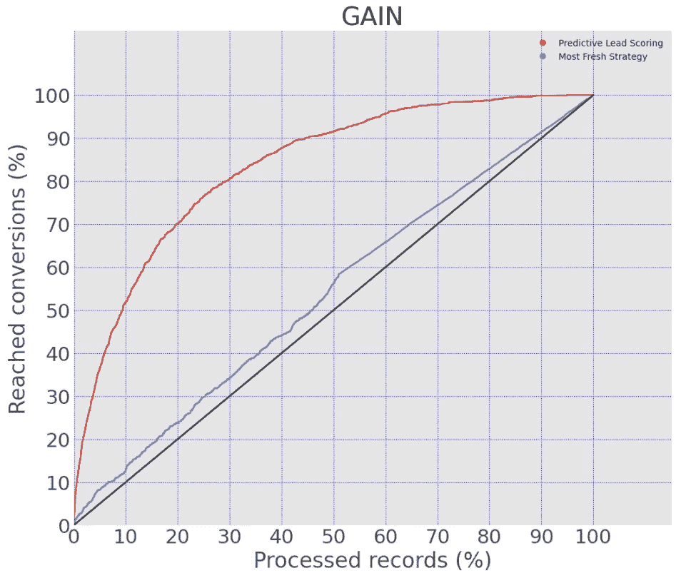
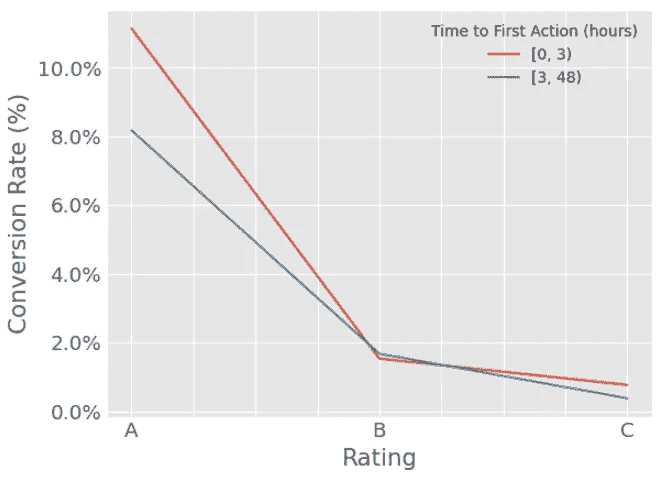

# 演示销售中的优先排序效果

> 原文：[`towardsdatascience.com/demonstrating-prioritization-effectiveness-in-sales-e3ebc077e44a?source=collection_archive---------16-----------------------#2024-06-28`](https://towardsdatascience.com/demonstrating-prioritization-effectiveness-in-sales-e3ebc077e44a?source=collection_archive---------16-----------------------#2024-06-28)

## 机器学习在联系人优先排序中的力量

 [Gonzalo Espinosa Duelo](https://medium.com/@gonzaloespinosaduelo?source=post_page---byline--e3ebc077e44a--------------------------------)

·发表于 [Towards Data Science](https://towardsdatascience.com/?source=post_page---byline--e3ebc077e44a--------------------------------) ·6 分钟阅读·2024 年 6 月 28 日

--

这张图片是使用 DALL-E 创建的

让我们想象两个处于 B2B/B2C 背景下的公司，它们是直接竞争对手，且规模相同。两家公司都有自己的销售团队，每天重复处理入站潜在客户的销售流程，但它们采用的销售策略截然不同。

他们的流程如下：

1.  在***A 公司***，销售团队早上开始时会拨打最新的潜在客户电话，确信这些**新联系人**是他们最好的选择。

1.  在***B 公司***，情况截然不同。这个团队从数据驱动的洞察开始他们的一天。他们投资了一个**预测性潜在客户评分**优先排序系统，分析多种因素——从用户档案到参与历史。

你怎么看？你认为哪种方法在优先排序潜在客户时更有效？

# 不再使用霰弹枪策略

在多年的优先排序算法实施工作中，我已经对来自各个行业的数十个不同系统进行了比较。

在今天的销售环境中，企业花费大量资源在 SDR（销售开发代表）或销售代理商身上，进行初步的接触和潜在客户资格认证。但他们通常缺乏精准的方法来识别最有潜力的客户，而是将所有潜在客户一视同仁，毫无优先排序。

大多数代理商根据自己的**人类标准**来优先排序潜在客户，这往往受到个人和未经验证的观点的偏见。相反，在少数实施优先排序方法的代理商中，**主流策略是基于‘新联系’标准**，这仍然非常初级。

在人工智能时代，这一事实让我感到震惊，但不幸的是，它仍在发生。

作为开发不同领域预测潜在客户评分系统的主要数据科学家，我可以明确表示，采用这些技术的公司**通过减少在低质量潜在客户上的工作来降低运营成本**，从而显著提高了投资回报率（ROI）。

此外，通过提高潜在客户管理的效率和效果，他们变得**更加精确地判断潜在客户的决策时间框架**，并推动更高的收入增长。

我观察到，正确采用预测潜在客户评分的公司**转化率提高了超过 12%**，在某些情况下甚至达到了 300%以上。

针对这一重要推动因素，本文讨论了**利用预测潜在客户评分**模型作为优先级系统的好处，与传统策略相比，以及使用这些方法最大化转化率的最有效行动。

一如既往，我将用实际数据支持我的论点。

# 机器学习的力量

以下图表展示了只使用“最新鲜”策略与“预测潜在客户评分”优先级排序的公司之间的转化增益比较。

该分析基于一个真实的商业案例，涉及一家 B2C 公司的 67,000 个联系人（其中 1500 人转化为客户）。

收益通过探索在特定比例的已处理潜在客户中达成的转化率，按照优先级标准进行排序来体现。

对于上述揭示的方法，其表现如下：

收益或表现：预测潜在客户评分 vs 最新鲜策略

黑线代表随机优先级排序，在处理 50%的潜在客户时提供 50%的转化率。

“最新鲜”策略提供的表现略优于随机处理，提供了 50%的潜在客户转化率，处理了 50%的潜在客户。

相比之下，机器学习方法在仅处理 50%的潜在客户的情况下实现了 92%的转化率。

> 尽管“最新鲜”方法提供的表现与随机处理相似，但预测潜在客户评分展现了更好的优先级排序效果。
> 
> 请注意，预测潜在客户评分通过处理 30%的潜在客户就达到了 81%的转化率，展现了令人印象深刻的帕累托效应。

# 成功的机器学习

到达这一点时，已经证明了***公司 B*将提供比*公司 A*更好的结果***。

***公司 A***认为他们最近有兴趣的潜在客户是最优质的潜在客户。他们相信**最近的兴趣表明他们正在考虑购买**。然而，事实可能并非如此。

> **一个最近的潜在客户可能只是好奇，但不一定准备购买**。

一些潜在客户可能仅仅出于随意的兴趣填写表单或注册，而没有真正的购买意图。相反，其他那些可能近期没有联系过的潜在客户，可能对产品或服务有更强烈的持续需求。

***公司 B***考虑了其他相关因素，如**用户档案、过去的互动、购买信号和行为指标**，这些都整合在一个工具中。

他们的预测性潜在客户评分也考虑了潜在客户的最近性，但并非仅仅依赖这一因素，而是将其视为一种附加信号，具体是否相关或更为重要，取决于潜在客户的档案。

> 这种基于数据驱动的方法使他们能够优先考虑那些具有最高转化潜力的潜在客户，而不仅仅是最近的那些。

通过使用预测性潜在客户评分，他们能够有效识别并**专注于那些更可能转化的潜在客户**，从而最大化他们的销售效率和整体转化率。

总结来说，尽管公司 A 认为最近性是与兴趣等同的唯一特征，公司的 B 基于数据驱动的方法提供了一个更精细和有效的潜在客户优先排序和转化策略。

# 附加部分

尽管“最新鲜”的策略并不是优先排序的最佳方法，但实际上**一些潜在客户可能对最近性比较敏感**。大多数时候，我观察到以下情形：

> **转化可能性更高的潜在客户也是对最近性最敏感的**

这非常有意义，因为识别出高兴趣水平的潜在客户，即具有高转化概率的客户，使他们离达成购买更近。可以理解的是，他们对销售措施的反应更快、更积极，快速行动的影响尤其显著。

对于这种类型的潜在客户，**最初几小时的联系**对于转化用户至关重要。快速回应能够在兴趣减弱之前利用这一高水平的兴趣，同时防止竞争对手的介入。

让我们在我们的商业案例中看看。

以下图表展示了三种不同评分或级别的转化率：前 30%（A 评分或最佳潜在客户），中间 40%（B 评分或普通潜在客户），底部 30%（C 评分或最差潜在客户）。这些评分是通过简单地对预测性潜在客户评分工具的概率输出进行分类得到的。

结果按首次行为时间（电话联系）进行划分。它区分了那些在表现出兴趣后的前三小时内尝试联系的潜在客户，以及那些在潜在客户创建时间后三到 48 小时内才尝试联系的潜在客户。

转化率与潜在客户评级，按首次销售行为时间进行划分

如图所示，我们的说法得到了验证：

> 如果在前三小时内未与最高评分的潜在客户取得联系，其转化率将下降 3 个百分点（-37%），而其他潜在客户则没有显著下降。

这个结论强调了优先排序高分联系人（top-scoring contacts）的重要性。这些高价值潜在客户不仅具有更高的转化率，并且占据了销售的大部分份额，而且他们对快速联系反应最为敏感，进一步**证明了优先排序的必要性**。

# 最后说明

上述内容讨论了通过机器学习模型实现优先级排序的收益，并展示了近期效应对最佳潜在客户的影响。

除了近期效应之外，还有一些与优先级相关的其他方面需要认真考虑，以促进销售，例如坚持性、重新参与和任务分配。

如果你喜欢这篇文章并对类似话题感兴趣，关注我并保持关注，获取更多更新内容。更多内容正在发布中！
