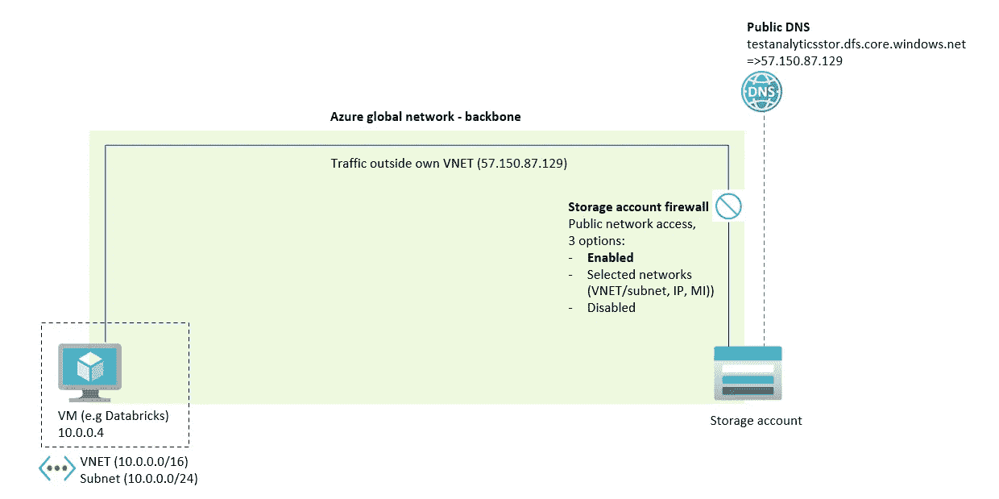

# 解密 Azure 存储账户网络访问

> 原文：[`towardsdatascience.com/demystifying-azure-storage-account-network-access-9e024d2f02c6?source=collection_archive---------7-----------------------#2024-10-30`](https://towardsdatascience.com/demystifying-azure-storage-account-network-access-9e024d2f02c6?source=collection_archive---------7-----------------------#2024-10-30)

## 服务端点和私有端点实操：包括 Azure 主干网、存储账户防火墙、DNS、VNET 和 NSG

 [René Bremer](https://rebremer.medium.com/?source=post_page---byline--9e024d2f02c6--------------------------------)

·发表于 [Towards Data Science](https://towardsdatascience.com/?source=post_page---byline--9e024d2f02c6--------------------------------) ·阅读时间：7 分钟·2024 年 10 月 30 日

--

连接的网络 — 图片来自 [Nastya Dulhiier on Unsplash](https://unsplash.com/@dulhiier)

# 1\. 引言

存储账户在建立企业数据湖的勋章架构中发挥着至关重要的作用。它们充当中心化的存储库，促进数据生产者与消费者之间的无缝数据交换。这种设置使得消费者能够执行数据科学任务并构建机器学习（ML）模型。此外，消费者还可以利用数据进行检索增强生成（RAG），通过类似 ChatGPT 的大型语言模型（LLM）与公司数据进行交互。

高度敏感的数据通常存储在存储账户中。在数据科学家和机器学习管道能够访问数据之前，必须采取深度防御措施。为了实现深度防御，必须采取多种措施，例如：1) 高级威胁防护以检测恶意软件，2) 使用 Microsoft Entra 进行身份验证，3) 通过授权进行精细化访问控制，4) 审计跟踪以监控访问，5) 数据外泄防护，6) 加密，最后但同样重要的 7) 使用服务端点或私有端点进行 [网络访问控制](https://learn.microsoft.com/en-us/azure/storage/common/storage-network-security?tabs=azure-portal)。

本文重点讨论存储账户的网络访问控制。在下一章中，将解释（解密）存储账户网络访问的不同概念。之后，将进行服务端点与私有端点的实践比较。最后，得出结论。

# 2\. 讨论网络访问的可能性

一个典型场景是虚拟机需要访问存储帐户的网络。这台虚拟机通常充当 Spark 集群来分析来自存储帐户的数据。下图提供了可用网络访问控制的概览。

2.1 虚拟机和存储帐户之间的网络概述 — 作者提供的图片

图中的组件可以描述如下：

**Azure 全球网络 — 主干网：** 流量始终通过 Azure 主干网在两个区域之间传输（除非客户强制不这样做），详见 [Microsoft 全球网络 — Azure | Microsoft Learn](https://learn.microsoft.com/en-us/azure/networking/microsoft-global-network)。这与存储帐户使用的防火墙规则以及是否使用服务端点或私有端点无关。

**Azure 存储防火墙：** 防火墙规则可以限制或禁用公共访问。常见规则包括将 VNET/子网、公共 IP 地址、系统分配的托管标识作为资源实例进行白名单管理，或允许受信任的服务。当 VNET/子网被列入白名单时，Azure 存储帐户会识别流量的来源及其私有 IP 地址。然而，存储帐户本身并未集成到 VNET/子网中 — 需要私有端点来实现这一目的。

**公共 DNS 存储帐户：** 存储帐户将始终具有一个可以通过网络工具访问的公共 DNS，详见 [Azure 存储帐户 — 公共访问禁用 — 但仍然有一定的连接性 — Microsoft Q&A](https://learn.microsoft.com/en-us/answers/questions/1920977/azure-storage-account-public-access-disabled-but-s?form=MG0AV3)。也就是说，即使在存储帐户防火墙中禁用公共访问，公共 DNS 仍然存在。

**虚拟网络 (VNET)：** 部署虚拟机的网络。虽然存储帐户从未在 VNET 内部部署，但 VNET 可以在 Azure 存储防火墙中列入白名单。或者，VNET 可以创建私有端点以实现安全的私有连接。

**服务端点：** 当在存储帐户防火墙中将 VNET/子网列入白名单时，必须为该 VNET/子网启用服务端点。当 VNET 和存储帐户位于同一地区时，服务端点应设置为 Microsoft.Storage；当 VNET 和存储位于不同地区时，应设置为 Microsoft.Storage.Global。请注意，服务端点也作为一个总括性术语，涵盖了在 Azure 存储防火墙中列入 VNET/子网白名单以及在 VNET/子网中启用服务端点这两个操作。

**私有端点：** 将存储帐户的网络接口卡 (NIC) 集成到虚拟机所在的 VNET 中。这一集成为存储帐户分配了一个私有 IP 地址，使其成为 VNET 的一部分。

**私有 DNS 存储账户：** 在 VNET 内，可以创建一个私有 DNS 区域，其中存储账户的 DNS 解析到私有端点。这是为了确保虚拟机仍能连接到存储账户的 URL，并且存储账户的 URL 解析为私有 IP 地址，而不是公共地址。

**网络安全组 (NSG)：** 部署一个 NSG 以限制虚拟机所在 VNET 的入站和出站访问。这可以防止数据外泄。然而，NSG 仅与 IP 地址或标签一起工作，而不与 URL 一起工作。要实现更高级的数据外泄保护，请使用 Azure 防火墙。为简便起见，本文省略了这一部分，改用 NSG 来阻止出站流量。

在下一章节中，将讨论服务端点和私有端点。

# 3. 实践操作：服务端点和私有端点

本章首先探索了网络访问不受限制的场景。然后，详细讨论了服务端点和私有端点，并提供了实际示例。

## 3.1 不限制网络访问 — 启用公共访问

假设以下场景，其中创建了一个虚拟机和一个存储账户。存储账户的防火墙启用了公共访问，见下图。

3.1.1 创建具有公共访问权限的虚拟机和存储账户

使用此配置，虚拟机可以通过网络访问存储账户。由于虚拟机也部署在 Azure 中，流量将通过 Azure 骨干网络并被接受，见下图。

3.1.2 流量未被阻止 — 启用公共网络访问

企业通常会建立防火墙规则来限制网络访问。这涉及禁用公共访问，或仅允许特定网络并将其列入白名单。下图展示了禁用公共访问并通过防火墙阻止流量的情况。

3.1.3 流量被阻止 — 在存储账户防火墙中阻止流量

在下一段中，使用服务端点和选定的网络防火墙规则再次授予网络访问存储账户的权限。

## 3.2 通过服务端点限制网络访问

要启用虚拟机 VNET 访问存储账户，请在 VNET 上激活服务端点。对于同一区域，使用 Microsoft.Storage；对于跨区域，使用 Microsoft.Storage.Global。接下来，在存储账户防火墙中将 VNET/子网列入白名单。流量再次被允许，见下图。

3.2.1 流量未被阻止 — 启用服务端点并添加到存储账户防火墙

现在流量被接受。当 VNET/子网从 Azure 存储账户防火墙中移除或禁用公共访问时，流量将再次被阻止。

如果在虚拟机的 VNET 中使用 NSG 阻止公共出站 IP，则流量也会被再次阻止。这是因为使用了存储帐户的公共 DNS，另请参见下图。

3.2.2 流量被阻止 — 虚拟机的 NSG 阻止公共出站流量

在这种情况下，应使用私有端点来确保流量不离开 VNET。此内容将在下一章节讨论。

## 3.3 通过私有端点限制访问

要为虚拟机恢复对存储帐户的网络访问，请使用私有端点。此操作将在虚拟机的 VNET 内为存储帐户创建一个网络接口卡（NIC），确保流量保持在 VNET 内。下图提供了进一步的说明。

3.3.1 流量未被阻止 — 已为存储帐户创建私有端点，禁用了公共访问

再次强调，可以使用 NSG 阻止所有流量，见下图。

3.3.2 流量被阻止 — 虚拟机的 NSG 阻止所有出站流量

然而，这一点与直觉相悖，因为首先在 VNET 中创建了私有端点，然后流量被同一 VNET 中的 NSG 阻止。

# 3. 结论

企业始终需要设置网络规则，以限制对其存储帐户的网络访问。在这篇博客中，既考虑了服务端点，也考虑了私有端点来限制访问。

对于服务端点和私有端点，以下内容都适用：

+   流量始终通过 Azure 主干网络在两个区域之间传输（除非客户强制不这样做），另请参见 [Microsoft 全球网络 — Azure | Microsoft Learn](https://learn.microsoft.com/en-us/azure/networking/microsoft-global-network)。无论存储帐户中使用的是什么防火墙规则，这一点始终成立。此外，是否使用服务端点或私有端点也不受影响。

+   存储帐户始终具有一个可以通过网络工具访问的公共 DNS，另请参见 [Azure 存储帐户 — 公共访问禁用 — 但仍有一定程度的连接性 — Microsoft Q&A](https://learn.microsoft.com/en-us/answers/questions/1920977/azure-storage-account-public-access-disabled-but-s?form=MG0AV3)。也就是说，即使在存储帐户防火墙中禁用了公共访问，DNS 仍然会保留。

对于服务端点，以下条件适用：

+   需要在 VNET/子网上启用服务端点，并在 Azure 存储帐户防火墙中将 VNET/子网列入白名单。

+   需要流量离开连接到存储帐户的虚拟机的 VNET。见上文，流量将留在 Azure 主干网络上。

对于私有端点，以下条件适用：

+   可以在 Azure 存储防火墙中禁用公共访问。见上文，存储帐户的公共 DNS 条目将保留。

+   流量不会离开虚拟机所在的 VNET。

是否使用服务端点或私有端点需要考虑许多其他因素（成本、迁移工作量，因为服务端点比私有端点出现得早，使用私有端点时的网络复杂性，新版 Azure 服务对服务端点的支持有限，存储帐户中私有端点的硬性限制为 200）。

然而，如果要求是“必须满足”的条件：1）流量绝不能离开虚拟机的 VNET/子网，或 2）不允许在 Azure 存储防火墙中创建防火墙规则且必须进行严格限制，则服务端点不可行。

在其他情况下，可以考虑两种解决方案，最适合的方案应根据每个场景的具体需求来确定。
