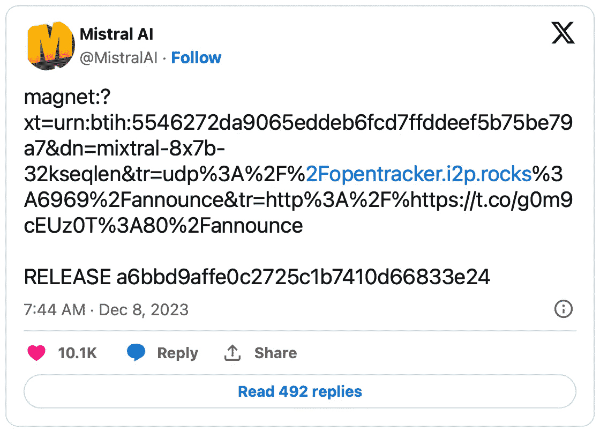

# 揭开 Mixtral of Experts 的神秘面纱

> 原文：[`towardsdatascience.com/demystifying-mixtral-of-experts-498fe3b9bcf4?source=collection_archive---------6-----------------------#2024-03-17`](https://towardsdatascience.com/demystifying-mixtral-of-experts-498fe3b9bcf4?source=collection_archive---------6-----------------------#2024-03-17)

## Mistral AI 的开源 Mixtral 8x7B 模型引起了广泛关注——这里是其内部的秘密

 [Samuel Flender](https://medium.com/@samuel.flender?source=post_page---byline--498fe3b9bcf4--------------------------------)

·发表于[Towards Data Science](https://towardsdatascience.com/?source=post_page---byline--498fe3b9bcf4--------------------------------) ·阅读时长 8 分钟·2024 年 3 月 17 日

--

图像由 GPT-4 生成

Mixtral 8x7B，Mistral AI 的全新稀疏专家混合（Mixtures of Experts）大语言模型，最近引起了轰动，标题如“ Mistral AI 推出 Mixtral 8x7B：一种稀疏专家混合（SMoE）语言模型[变革机器学习](https://www.marktechpost.com/2024/01/14/mistral-ai-introduces-mixtral-8x7b-a-sparse-mixture-of-experts-smoe-language-model-transforming-machine-learning/)”或“Mistral AI 的 Mixtral 8x7B 超越 GPT-3.5，[震撼 AI 世界](https://dataconomy.com/2023/12/12/mistral-ais-mixtral-8x7b-surpasses-gpt-3-5-shaking-up-the-ai-world/)”。

Mistral AI 是一家法国的人工智能初创公司，成立于 2023 年，由 Meta 和 Google 的前工程师创办。该公司发布了 Mixtral 8x7B——这可能是大语言模型历史上最不拘礼节的发布，2023 年 12 月 8 日，他们仅仅在 Twitter 账号上发布了 Torrent 磁力链接。

[Twitter](https://publish.twitter.com/?query=https%3A%2F%2Ftwitter.com%2FMistralAI%2Fstatus%2F1733150512395038967&widget=Tweet)

激发了许多关于 Mistral 发布模型的[恶搞图片](https://substackcdn.com/image/fetch/f_auto,q_auto:good,fl_progressive:steep/https%3A%2F%2Fsubstack-post-media.s3.amazonaws.com%2Fpublic%2Fimages%2Fdf306820-a61f-48c8-84aa-a83598fe1320_500x341.png)。

“[Mixtral of Experts](https://arxiv.org/abs/2401.04088)”（Jiang 等，2024）这篇研究论文在一个月后于今年 1 月 8 日发布在 Arxiv 上。让我们来看看，看看这些炒作是否有其道理。

（剧透警告：从技术层面来看，其实并没有太多新内容。）
