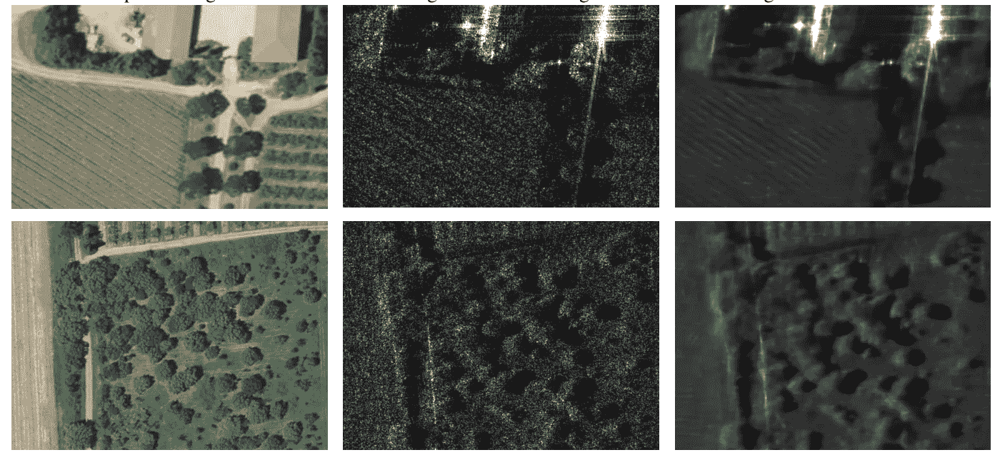
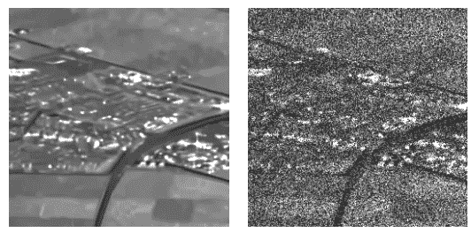
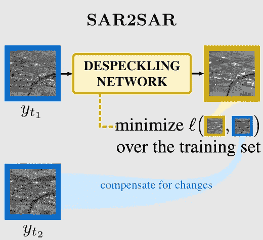
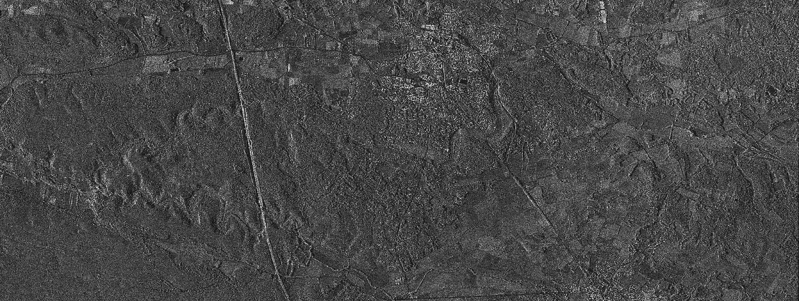
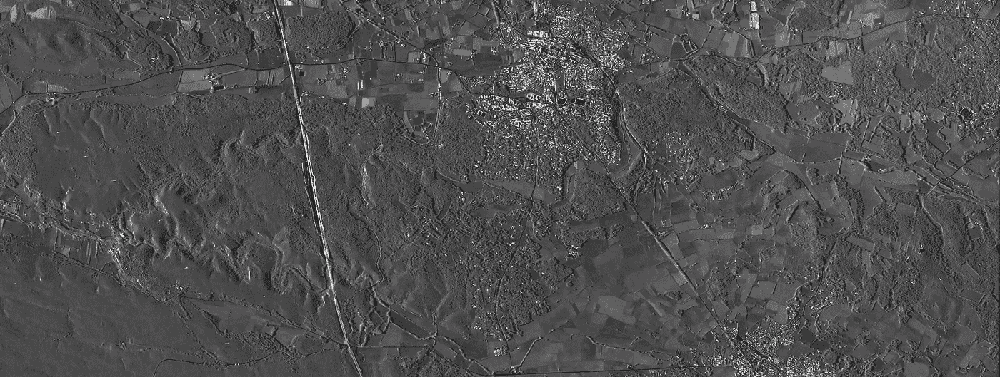
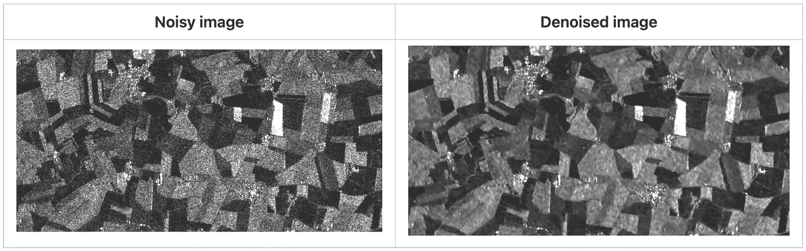
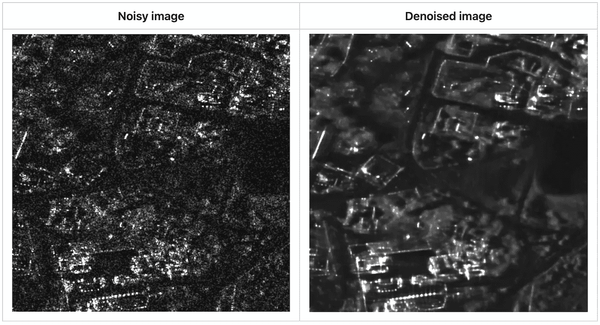
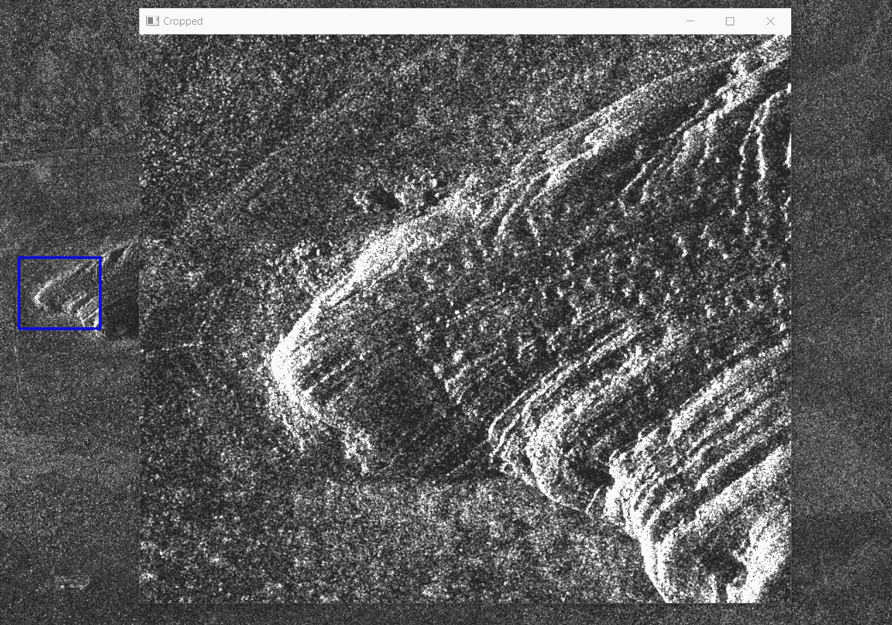
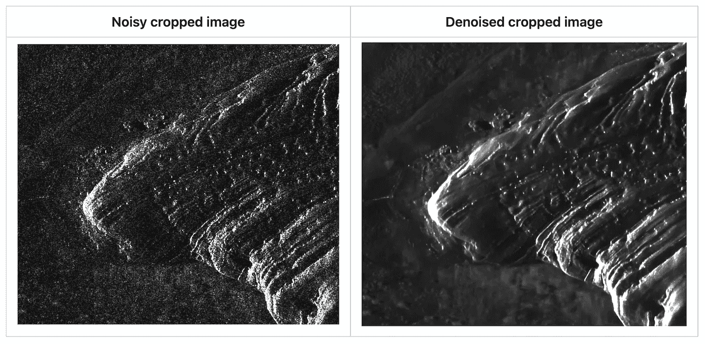

# 使用 Python 去噪雷达卫星图像从未如此简单

> 原文：[`towardsdatascience.com/denoising-radar-satellite-images-with-python-has-never-been-so-easy-f445241002a5?source=collection_archive---------5-----------------------#2024-04-23`](https://towardsdatascience.com/denoising-radar-satellite-images-with-python-has-never-been-so-easy-f445241002a5?source=collection_archive---------5-----------------------#2024-04-23)

## 最新版本的 deepdespeckling 发布介绍

[](https://medium.com/@brash6?source=post_page---byline--f445241002a5--------------------------------)[](https://towardsdatascience.com/?source=post_page---byline--f445241002a5--------------------------------) [Hadrien Mariaccia](https://medium.com/@brash6?source=post_page---byline--f445241002a5--------------------------------)

·发布于[《数据科学之路》](https://towardsdatascience.com/?source=post_page---byline--f445241002a5--------------------------------) ·阅读时间：8 分钟·2024 年 4 月 23 日

--



法国尼姆附近农业区域的光学和雷达图像

合成孔径雷达（SAR）图像在航空航天、军事、气象等多个领域得到了广泛应用。问题是这种图像在原始格式下**存在噪声**。虽然这些图像通常文件较大，但从科学角度来看，如何高效去噪是一项具有挑战性的任务，而且在现实世界中也非常有用。

在这篇《数据科学之路》文章中，我们介绍了[**deepdespeckling**](https://github.com/hi-paris/deepdespeckling)，这是一个开源的 Python 包，能够使用**新型基于深度学习的方法**去噪合成孔径雷达（SAR）图像。

我们很高兴地宣布，我们已发布了**deepdespeckling 的新版本**，该版本支持使用[MERLIN](https://arxiv.org/pdf/2110.13148.pdf)和[SAR2SAR](https://arxiv.org/pdf/2006.15037.pdf)方法去噪雷达卫星图像。

## 快速回顾一下卫星图像

卫星图像有**两大类**：

+   **光学图像**：我们在看天气预报时常见的图像类型。这些图像是由光学传感器拍摄的。

    尽管这些图像通常提供了高水平的细节，但在捕捉地球复杂情况时，至少面临着**两个重大挑战**：**夜间条件**和**恶劣天气**带来的限制。

+   **雷达图像：** 光学系统依赖于阳光（传感器是被动的），而雷达则发送电磁波并测量由地面物体反向散射的成分（传感器是主动的）。雷达传感器可以在任何时间和任何气象条件下获取数据，因为发射波的波长使其能够穿透云层。然而，它们遇到了一个固有的问题：**斑点噪声**。

## 什么是斑点噪声？

**斑点**是一种颗粒状干扰，由发射的无线电波的反射特性引起，降低了图像的质量，因此也影响了人眼的可解释性。



一张分别没有和有斑点噪声的图像示例

## 如何去除斑点噪声

存在多种方法，但深度学习在这项任务中带来了显著的改进。[**Emanuele Dalsasso**](https://emanueledalsasso.github.io/)**，Loïc Denis 和 Florence Tupin** 开发了两种基于深度学习的去斑点 SAR 图像方法：

+   [MERLIN](https://arxiv.org/pdf/2110.13148.pdf)（coMplex sElf-supeRvised despeckLINg）：一种基于单视复合 SAR 图像实部和虚部分离的自监督策略，我们在之前的 Towards Data Science 文章中介绍了这一方法。

+   [SAR2SAR](https://arxiv.org/pdf/2006.15037.pdf)：利用多时相时间序列训练神经网络，通过仅查看噪声图像来恢复 SAR 图像。**该方法是最新发布的** [**deepdespeckling**](https://github.com/hi-paris/deepdespeckling) **新功能的一部分。因此，我们将在本文中重点介绍该方法。**

# SAR2SAR

就像 MERLIN 一样，SAR2SAR 也从噪声到噪声（noise2noise）算法中汲取灵感，该算法证明可以在没有噪声干净示例的情况下训练一个去噪模型。这一特性在 SAR 去斑点中尤其重要，因为不存在没有斑点的获取图像。



SAR2SAR 基于这样一个假设：在不同时间获取的同一区域的两张图像分别受到**两种不相关的斑点噪声实现**的污染，这与应用噪声到噪声（noise2noise）原理的假设相符。这使得开发一个模型来去除地面范围检测（GRD）SAR 图像中的斑点成为可能，而此类图像仅提供幅度数据（相位在检测步骤中被抑制），因此无法在此类数据上使用 MERLIN。利用时间序列数据来生成一个数据集，其中包含同一场景的独立斑点噪声实现（采用基于预训练模型的变化补偿策略，以确保时间序列数据仅在斑点成分上有所不同）。

一旦模型训练完成，在推理过程中，SAR2SAR 只需要一张 GRD 图像，并且可以有效地用于抑制 Sentinel-1 GRD SAR 图像中的斑点噪声。

# SAR 图像获取。

根据照射场景（扫幅）与图像分辨率之间的折中，存在不同的获取模式。因此，每种获取模式会生成具有不同分辨率的图像，物体的外观也因此具有每种获取模式的特定性。

因此，必须为每种模式开发特定的模型。考虑到 MERLIN 应用的简便性，它只需要单个 SAR 图像，因此可以无缝收集每种特定模式的数据集。我们已经在以下图像上训练了 MERLIN：

+   使用条带模式获取的 TerraSAR-X 图像。

+   使用高分辨率 SpotLight 模式获取的 TerraSAR-X 图像。

+   使用 TOPS 模式获取的 Sentinel-1 图像。

# 使用 deepdespeckling 包。

## 包安装。

在安装 deepdespeckling 之前，确保安装了 gdal 依赖项，可以使用以下命令通过 conda 进行安装：

```py
conda install -c conda-forge gdal
```

然后，你可以按如下方式安装包：

```py
pip install deepdespeckling
```

## 使用 MERLIN 去噪一张图像。

> 要使用 MERLIN 去噪 SAR 图像，图像需要是.cos 或.npy 格式。

需要设置两个参数：

+   `model_name` *:* `"spotlight"`表示使用聚光模式获取的 SAR 图像，`"stripmap"`表示使用条带模式获取的 SAR 图像，或`"Sentinel-TOPS"`表示使用 TOPS 模式获取的图像。

+   `symetrise`*: 在 MERLIN 的噪声图像预处理步骤中，实部和虚部会被“**对称化**”（以符合 MERLIN 的理论假设）。如果要跳过此步骤，可以将`symetrise`参数设置为`False`。

```py
from deepdespeckling.utils.load_cosar import cos2mat
from deepdespeckling.utils.constants import PATCH_SIZE, STRIDE_SIZE
from deepdespeckling.merlin.merlin_denoiser import MerlinDenoiser

# Path to one image (cos or npy file)
image_path="path/to/cosar/image"
# Model name, can be "spotlight", "stripmap" or "Sentinel-TOPS"
model_name = "spotlight"
symetrise = True

image = cos2mat(image_path).astype(np.float32)

denoiser = MerlinDenoiser(model_name=model_name, symetrise=symetrise)
denoised_image = denoiser.denoise_image(image, patch_size=PATCH_SIZE, stride_size=STRIDE_SIZE)
```

这段代码将会把去噪后的图像存储在`denoised_image`变量中的**numpy 数组**中。



一个完整大小的噪声 SAR 图像示例。



使用 MERLIN 去噪的同一图像。

## 使用 SAR2SAR 去噪一张图像。

> 要使用 SAR2SAR 去噪 SAR 图像，图像需要是.tiff 或.npy 格式。

```py
from deepdespeckling.utils.load_cosar import cos2mat
from deepdespeckling.utils.constants import PATCH_SIZE, STRIDE_SIZE
from deepdespeckling.sar2sar.sar2sar_denoiser import Sar2SarDenoiser

# Path to one image (tiff or npy file)
image_path="path/to/cosar/image"

# Works exactly the same as with MERLIN
image = cos2mat(image_path).astype(np.float32)

# Denoise the image with SAR2SAR
denoiser = Sar2SarDenoiser()
denoised_image = denoiser.denoise_image(image, patch_size=PATCH_SIZE, stride_size=STRIDE_SIZE)
```



使用 SAR2SAR 的结果示例（转换为 png 后显示）。

## 使用 MERLIN 或 SAR2SAR 去噪一组图像。

对于 MERLIN 和 SAR2SAR，你可以选择**3 个不同的函数**来去噪存储在文件夹中的一组 SAR 图像：

+   `despeckle` 用于去噪完整大小的图像。

+   `despeckle_from_coordinates` 用于去噪由某些坐标定义的图像子部分。

+   `despeckle_from_crop` 用于去噪通过裁剪工具定义的图像子部分。

**去噪完整大小图像**

```py
from deepdespeckling.despeckling import despeckle

# Path to a folder of several images 
# images have to be in .tiff or .npy formats if using sar2sar 
# images have to be in .cos or .npy formats is using merlin ("spotlight", "stripmap" or "Sentinel-TOPS")
image_path="path/to/cosar/image"
# Folder where results are stored
destination_directory="path/where/to/save/results"

# Can be "sar2sar", "spotlight' or "stripmap"
model_name = "spotlight"
# symetrise parameter if using "spotlight", "stripmap" or "Sentinel-TOPS" (harmless if using "sar2sar")
symetrise = True

despeckle(image_path, destination_directory, model_name=model_name, symetrise=symetrise)
```

`despeckle` 函数将在`destination_directory`中创建多个文件夹：

+   `processed_images:` 存储在`image_path`中定义的文件夹内的原始图像的*npy*文件（numpy 数组转换）。

+   `noisy:` 预处理后的噪声图像，分别以*.npy*和*.png*格式保存。

+   `denoised:` 去噪后的图像，分别以*.npy*和*.png*格式保存。

**使用自定义坐标去噪图像的部分区域**

```py
from deepdespeckling.despeckling import despeckle_from_coordinates

# Path to a folder of several images 
# images have to be in .tiff or .npy formats if using sar2sar 
# images have to be in .cos or .npy formats is using merlin ("spotlight", "stripmap" or "Sentinel-TOPS")
image_path="path/to/cosar/image"
# Folder where results are stored
destination_directory="path/where/to/save/results"
# Example of coordinates of the subparts of the images to be despeckled
coordinates_dictionnary = {'x_start':2600,'y_start':1000,'x_end':3000,'y_end':1200}

# Can be "sar2sar", "spotlight", "stripmap" or "Sentinel-TOPS"
model_name = "spotlight"
# symetrise parameter if using "spotlight", "stripmap" or "Sentinel-TOPS" (harmless if using "sar2sar")
symetrise = True

despeckle_from_coordinates(image_path, coordinates_dict, destination_directory, 
                            model_name=model_name, symetrise=symetrise)
```

`despeckle_from_coordinates` 函数将创建与 `despeckle` 函数相同的文件夹，并使用指定的坐标裁剪图像。



使用自定义坐标去噪的图像示例（转换为 PNG 格式后显示）

**使用裁剪工具去噪图像的部分区域**

```py
from deepdespeckling.merlin.inference.despeckling import despeckle_from_crop

# Path to a folder of several images 
# images have to be in .tiff or .npy formats if using sar2sar 
# images have to be in .cos or .npy formats is using merlin ("spotlight", "stripmap" or "Sentinel-TOPS")
image_path="path/to/cosar/image"
# Folder where results are stored
destination_directory="path/where/to/save/results"

# If True it will crop a 256*256 image from the position of your click
# If False you will draw free-handly the area of your interest
fixed = True
# Can be "sar2sar", "spotlight", "stripmap" or "Sentinel-TOPS"
model_name = "spotlight"
# symetrise parameter if using "spotlight""stripmap" or "Sentinel-TOPS" (harmless if using "sar2sar")
symetrise = True

despeckle_from_crop(image_path, destination_directory, model_name=model_name, fixed=fixed, symetrise=symetrise)
```

> `despeckle_from_crop` 函数将首先启动裁剪工具：只需选择一个区域，满意后按“q”键即可完成裁剪



裁剪工具的实际操作



使用裁剪工具进行去噪的结果

然后，`despeckle_from_crop` 函数将创建：

+   与 `despeckle` 函数相同的文件夹，图像通过裁剪工具进行裁剪

+   `cropping_coordinates.txt` 文件，包含所选裁剪的坐标

## 深入了解

现在你已经了解了如何使用 deepdespeckling，要进一步了解其工作原理，你可以查看 [GitHub 仓库](https://github.com/hi-paris/deepdespeckling)。我们还提供了一个 [Sphinx 文档](https://hi-paris.github.io/deepdespeckling/)。

如果有任何问题或反馈，欢迎随时联系我！

## 作者

+   [Hadrien Mariaccia](https://www.linkedin.com/in/hadrien-mar/)

+   [Emanuele Dalsasso](https://emanueledalsasso.github.io/)

> 除非另有说明，所有图片均由作者提供

## **联系**

如果有任何问题，欢迎随时联系我。

要了解更多关于 Hi! PARIS 及其工程团队的信息：

+   [Hi! PARIS](https://www.hi-paris.fr/)

+   [Hi! PARIS 工程团队](https://engineeringteam.hi-paris.fr/)
