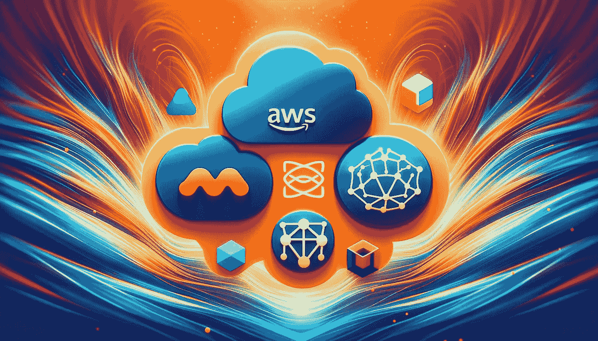

# 将 LLM 应用程序部署到 AWS，采用开源自助服务方式

> 原文：[`towardsdatascience.com/deploying-llm-apps-to-aws-the-open-source-self-service-way-c54b8667d829?source=collection_archive---------3-----------------------#2024-01-08`](https://towardsdatascience.com/deploying-llm-apps-to-aws-the-open-source-self-service-way-c54b8667d829?source=collection_archive---------3-----------------------#2024-01-08)

## 部署 LlamaIndex RAGs 到 AWS ECS Fargate 的逐步指南

 [Wenqi Glantz](https://medium.com/@wenqiglantz?source=post_page---byline--c54b8667d829--------------------------------)

·发表于[Towards Data Science](https://towardsdatascience.com/?source=post_page---byline--c54b8667d829--------------------------------) ·12 分钟阅读·2024 年 1 月 8 日

--

由作者使用 DALL-E 3 生成的图像

当 LLM 应用程序开发为使用第三方托管的 LLM（如 OpenAI）时，不需要 MLOps 的额外开销。这类容器化的 LLM 驱动应用程序或微服务可以通过 DevOps 实践进行部署。本文将探索如何将 LLM 应用程序部署到云提供商（如 AWS），并完全自动化基础设施和应用程序管道。LlamaIndex 为社区提供了现成的[RAGs 聊天机器人](https://github.com/run-llama/rags)。我们将以 RAGs 作为示例应用程序进行部署。

# IaC 自助服务

IaC（基础设施即代码）自动化基础设施的配置，确保配置的一致性和可重复性。实现 IaC 的工具有很多。本文将聚焦于[HashiCorp 的 Terraform](https://www.hashicorp.com/products/terraform)，主要是因为 Terraform 具有跨云平台的适应性。

IaC 自助服务的主要目的是赋能开发者，使其能够对管道拥有更多的访问权限、控制权和所有权，从而提高生产力。

对此感兴趣的朋友，我大约一年前写过一篇关于 DevOps 自助服务模型的[五部分系列文章](https://medium.com/@wenqiglantz/the-path-to-devops-self-service-a-five-part-series-5ea5d4552f9e?sk=e5666549c3cabbc619774f4b7b2a2747)，详细讲解了与 DevOps 自助服务模型相关的各个方面。

# 高级部署架构图
