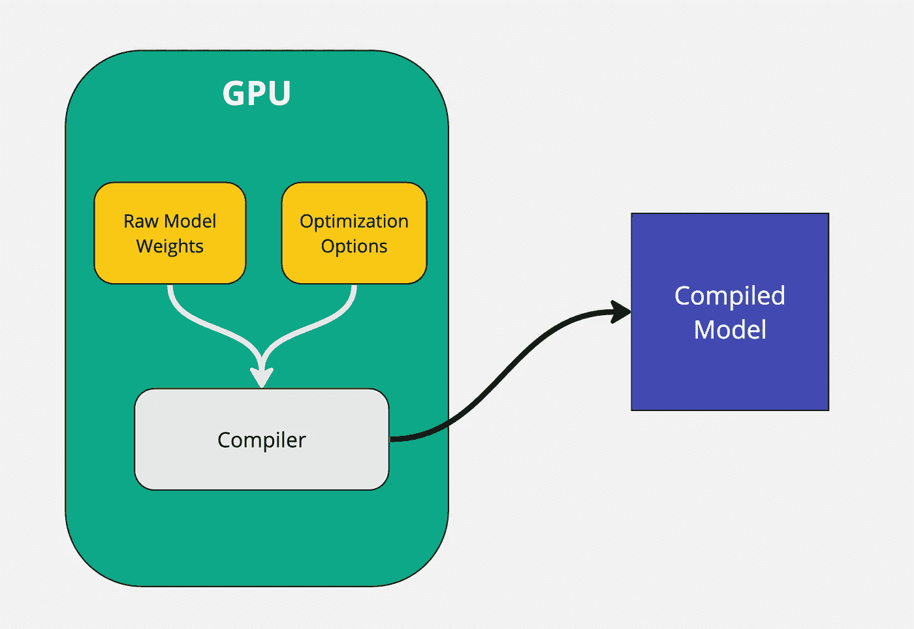
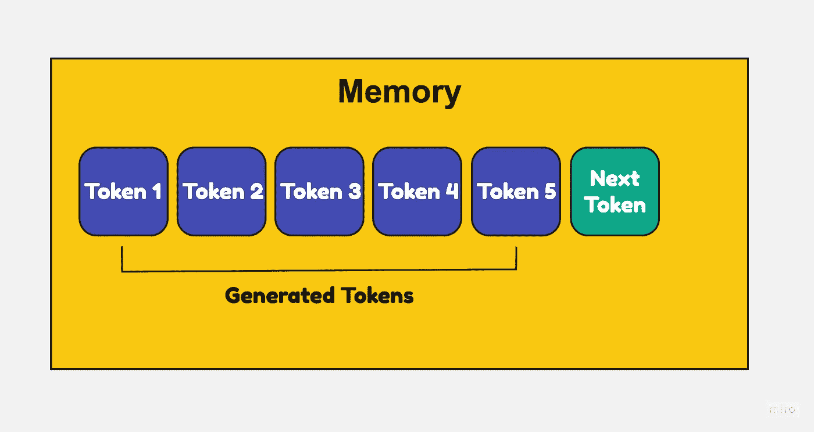
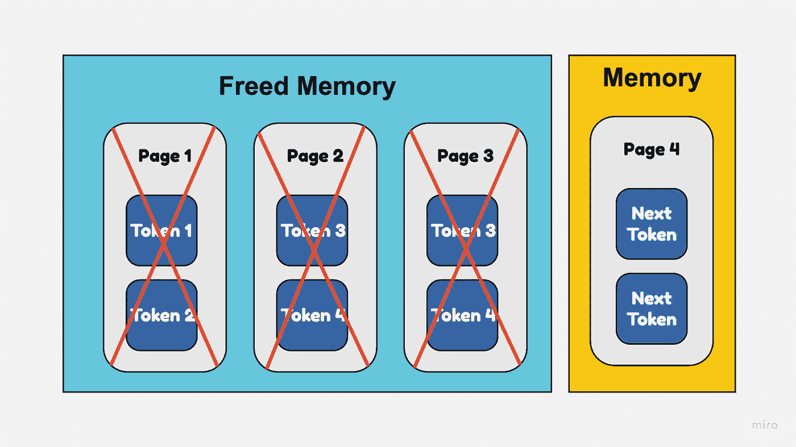
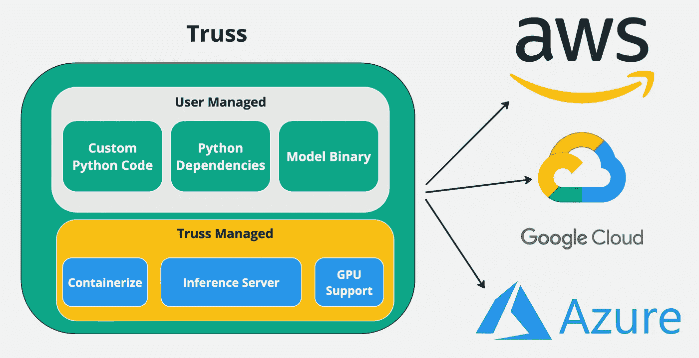
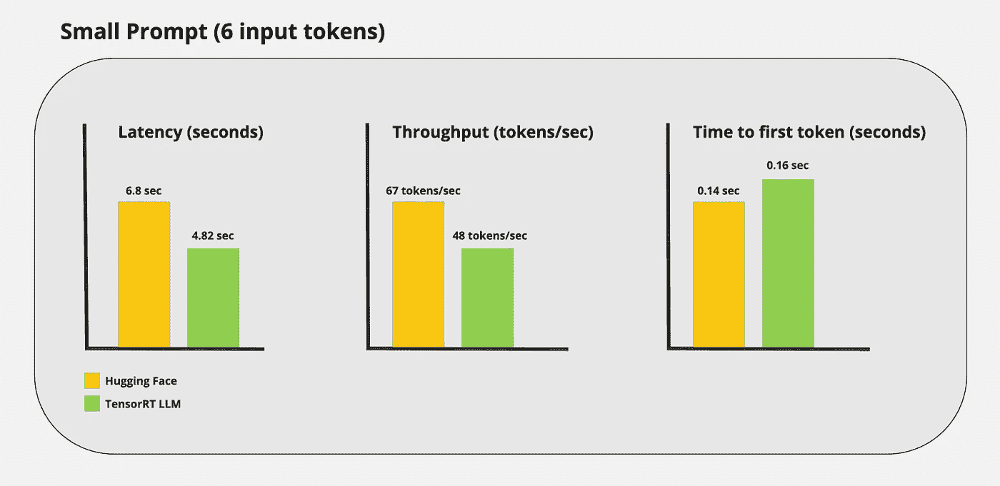
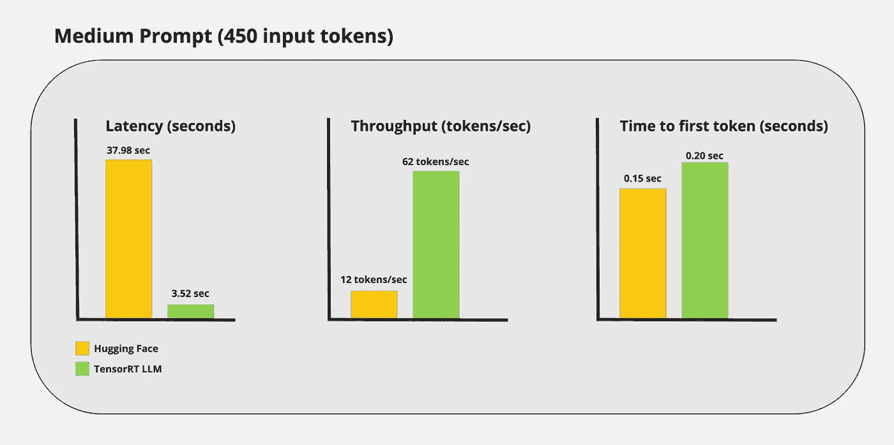
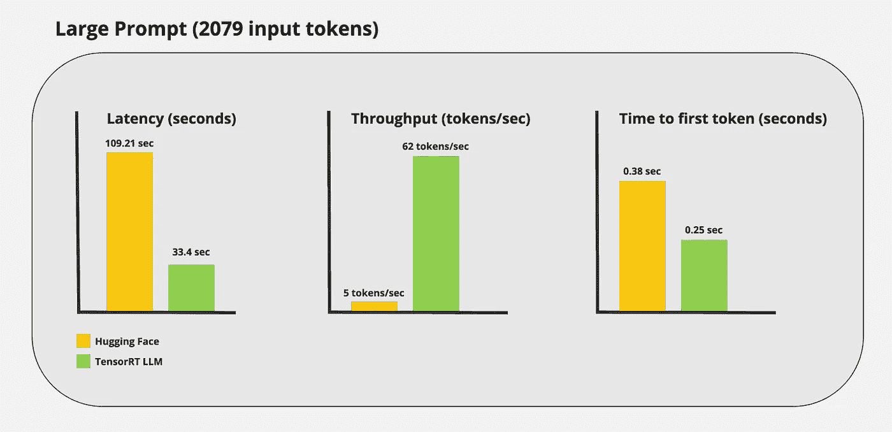

# 使用 TensorRT LLM 将 LLM 部署到生产环境

> 原文：[`towardsdatascience.com/deploying-llms-into-production-using-tensorrt-llm-ed36e620dac4?source=collection_archive---------2-----------------------#2024-02-22`](https://towardsdatascience.com/deploying-llms-into-production-using-tensorrt-llm-ed36e620dac4?source=collection_archive---------2-----------------------#2024-02-22)

## 加速推理性能的指南

[](https://medium.com/@het.trivedi05?source=post_page---byline--ed36e620dac4--------------------------------)[](https://towardsdatascience.com/?source=post_page---byline--ed36e620dac4--------------------------------) [Het Trivedi](https://medium.com/@het.trivedi05?source=post_page---byline--ed36e620dac4--------------------------------)

·发表于 [Towards Data Science](https://towardsdatascience.com/?source=post_page---byline--ed36e620dac4--------------------------------) ·14 分钟阅读·2024 年 2 月 22 日

--


图片来源：作者 — 使用 Stable Diffusion XL 创建

## 简介

开源的大型语言模型已经兑现了其炒作的承诺。许多使用 GPT-3.5 或 GPT-4 进行生产的公司已经意识到，这些模型在成本角度上根本不可扩展。因此，企业正在寻找更好的开源替代方案。最近的模型，如 Mixtral 和 Llama 2，在输出质量方面表现出色。但将这些模型扩展到支持数千个并发用户仍然是一个挑战。

虽然像 [vLLM](https://github.com/vllm-project/vllm) 和 [TGI](https://github.com/huggingface/text-generation-inference) 这样的框架在提升推理方面是一个很好的起点，但它们缺乏一些优化，导致它们在生产环境中的扩展性较差。

这就是 [TensorRT-LLM](https://github.com/NVIDIA/TensorRT-LLM) 的作用所在。TensorRT-LLM 是 Nvidia 设计的一个开源框架，旨在提升大型语言模型在生产环境中的性能。许多大公司，如 Anthropic、OpenAI、Anyscale 等，已经在使用这个框架为数百万用户提供 LLM 服务。

## 了解 TensorRT-LLM

与其他推理技术不同，TensorRT LLM 并不使用原始权重来提供模型。相反，它会编译模型并优化内核，以便在 Nvidia GPU 上实现高效服务。运行编译后的模型的性能远高于运行原始模型。这也是 TensorRT LLM 非常快速的主要原因之一。



原始模型被编译成优化后的二进制文件

原始模型权重以及优化选项（如量化级别、张量并行性、流水线并行性等）被传递给编译器。编译器根据这些信息输出一个针对特定 GPU 优化的模型二进制文件。

一个需要注意的重要事项是，整个模型编译过程必须在 GPU 上进行。生成的已编译模型是专门针对运行时使用的 GPU 进行优化的。例如，如果你在 A40 GPU 上编译模型，就不能在 A100 GPU 上运行该模型。因此，无论在编译时使用的是哪个 GPU，推理时必须使用相同的 GPU。

TensorRT LLM 并不支持所有大型语言模型。原因是每种模型架构不同，而 TensorRT 进行的是深度图优化。因此，大多数流行的模型如 Mistral、Llama 和 Qwen 都得到了支持。如果你对支持的模型的完整列表感兴趣，可以查看[TensorRT LLM Github 仓库](https://github.com/NVIDIA/TensorRT-LLM?tab=readme-ov-file#models)。

## 使用 TensorRT-LLM 的好处

TensorRT LLM Python 包使开发者能够在无需了解 C++ 或 CUDA 的情况下，以最高性能运行 LLM。此外，它还附带了一些方便的功能，如标记流、分页注意和 KV 缓存。让我们更深入地了解其中的一些主题。

1.  **分页注意**

大型语言模型需要大量内存来存储每个标记的键和值。随着输入序列变长，这种内存使用会急剧增加。

使用常规注意机制时，一个序列的键和值必须连续存储。因此，即使你在序列内存分配中间释放了空间，你也无法将该空间用于其他序列。这会导致碎片化和浪费。



“注意”：所有的标记必须保持在一个连续的内存块中，即使存在空闲空间。

使用分页注意时，每个键/值的页面可以放置在内存中的任何位置，不需要连续存储。因此，如果你释放了中间的一些页面，这部分空间现在可以被用于其他序列。

这可以防止内存碎片化，并提高内存利用率。生成输出序列时，页面可以根据需要动态分配和释放。



“分页注意”：可以通过删除整个页面来从内存中删除之前生成的标记。这为新序列腾出了空间。

2\. **高效的 KV 缓存**

KV 缓存代表“键值缓存”，用于缓存大型语言模型（LLM）的一部分，以提高推理速度并减少内存使用。

LLM 拥有数十亿个参数，使得它们在进行推理时变得缓慢且内存密集。KV 缓存通过缓存 LLM 的层输出和激活值，避免了每次推理时都需要重新计算这些值，从而帮助解决这个问题。

其工作原理如下：

+   在推理过程中，当 LLM 执行每一层时，输出会被缓存到一个带有唯一键的键值存储中。

+   当后续推理使用相同的层输入时，系统不会重新计算该层，而是通过键从缓存中获取输出。

+   这样可以避免冗余计算并减少激活内存，从而提高推理速度和内存效率。

好了，理论部分讲完了。让我们真正部署一个模型吧！

## 实践 Python 教程

使用 TensorRT-LLM 部署模型有两个步骤：

1.  编译模型

1.  将编译好的模型部署为 REST API 端点

## 步骤 1：编译模型

在本教程中，我们将使用 [Mistral 7B Instruct v0.2](https://huggingface.co/mistralai/Mistral-7B-Instruct-v0.2)。如前所述，编译阶段需要 GPU。我发现编译模型最简单的方法是在 Google Colab 笔记本上进行。

[](https://colab.research.google.com/drive/1tJSMGbqYDstnChytaFb9F37oBspDcsRL?usp=sharing&source=post_page-----ed36e620dac4--------------------------------) [## Mistral 7B 编译器 Google Colaboratory

### 编辑描述

[colab.research.google.com](https://colab.research.google.com/drive/1tJSMGbqYDstnChytaFb9F37oBspDcsRL?usp=sharing&source=post_page-----ed36e620dac4--------------------------------)

> TensorRT LLM 主要支持高端 Nvidia GPU。我在 A100 40GB GPU 上运行了 Google Colab，并将在部署时使用相同的 GPU。

```py
!git clone https://github.com/NVIDIA/TensorRT-LLM.git
%cd TensorRT-LLM/examples/llama
```

+   克隆 [TensorRT-LLM git 仓库](https://github.com/NVIDIA/TensorRT-LLM)。该仓库包含了我们需要的所有模块和脚本，用于编译模型。

```py
!pip install tensorrt_llm -U --pre --extra-index-url https://pypi.nvidia.com
!pip install huggingface_hub pynvml mpi4py
!pip install -r requirements.txt
```

+   安装必要的 Python 依赖项。

```py
from huggingface_hub import snapshot_download
from google.colab import userdata

snapshot_download(
    "mistralai/Mistral-7B-Instruct-v0.2",
    local_dir="tmp/hf_models/mistral-7b-instruct-v0.2",
    max_workers=4
)
```

+   从 hugging face 下载 Mistral 7B Instruct v0.2 模型权重，并将其存储在本地目录 `tmp/hf_models/mistral-7b-instruct-v0.2` 中。

+   如果你查看 Colab 中 `tmp/hf_models` 目录，你应该能看到模型权重。

```py
!python convert_checkpoint.py --model_dir ./tmp/hf_models/mistral-7b-instruct-v0.2 \
                             --output_dir ./tmp/trt_engines/1-gpu/ \
                             --dtype float16
```

+   原始模型权重无法被编译。相反，它们必须转换为特定的 tensorRT LLM 格式。

+   `convert_checkpoint.py` 脚本将原始的 Mistral 权重转换为兼容的格式。

+   `--model_dir` 是原始模型权重的路径。

+   `--output_dir` 是转换后的权重的路径。

```py
!trtllm-build --checkpoint_dir ./tmp/trt_engines/1-gpu/ \
            --output_dir ./tmp/trt_engines/compiled-model/ \
            --gpt_attention_plugin float16 \
            --gemm_plugin float16 \
            --max_input_len 32256
```

+   `trtllm-build` 命令用于编译模型。在此阶段，你还可以传入各种优化标志。为了简化，我没有使用任何额外的优化。

+   `--checkpoint_dir` 是 **转换后的** 模型权重的路径。

+   `--output_dir` 是编译好的模型保存的路径。

+   Mistral 7B Instruct v0.2 支持 32K 的上下文长度。我通过 `--max_input_length` 标志设置了这个上下文长度。

> 注意：编译模型可能需要 15 到 30 分钟。

一旦模型编译完成，你可以将编译好的模型上传到 [hugging face hub](https://huggingface.co/new)。为了将文件上传到 hugging face hub，你需要一个有效的访问令牌，并且该令牌具有 **WRITE** 权限。

```py
import os
from huggingface_hub import HfApi

for root, dirs, files in os.walk(f"tmp/trt_engines/compiled-model", topdown=False):
    for name in files:
        filepath = os.path.join(root, name)
        filename = "/".join(filepath.split("/")[-2:])
        print("uploading file: ", filename)
        api = HfApi(token=userdata.get('HF_WRITE_TOKEN'))
        api.upload_file(
            path_or_fileobj=filepath,
            path_in_repo=filename,
            repo_id="<your-repo-id>/mistral-7b-v0.2-trtllm"
        )
```

+   这段代码将编译好的模型，即*.engine*文件，上传到 Hugging Face 并与您的用户 ID 关联。

+   在代码中将**<your-repo-id>**替换为您的 Hugging Face 仓库，这通常是您的 Hugging Face 用户 ID。

太棒了！这就完成了模型编译部分。接下来是部署步骤。

## 第 2 步：部署编译好的模型

部署这个编译模型有很多种方式。您可以使用像[FastAPI](https://fastapi.tiangolo.com/)这样的简单工具，也可以使用更复杂的工具，如[triton 推理服务器](https://github.com/triton-inference-server/server)。

使用像 FastAPI 这样的工具时，开发者需要自行设置 API 服务器，编写 Dockerfile，并正确配置 CUDA。管理这些内容可能非常麻烦，并且破坏了整体的开发体验。

为了避免这些问题，我决定使用一个简单的开源工具叫做[Truss](https://github.com/basetenlabs/truss)。Truss 使得开发者能够轻松地将模型打包并支持 GPU，可以在任何云环境中运行。它具有许多很棒的功能，使得模型容器化变得轻松：

+   开箱即用的 GPU 支持，无需处理 CUDA。

+   自动生成 Dockerfile。无需自己编写。

+   生产级 API 服务器

+   简单的 Python 接口

使用 Truss 的主要好处是，您可以轻松地将一个支持 GPU 的模型容器化，并部署到任何云环境。



构建 Truss 一次，随时部署。

**创建 Truss**

创建或打开一个 Python 虚拟环境，Python 版本需≥ 3.8，并安装以下依赖：

```py
pip install --upgrade truss
```

**（可选）** 如果您想从头创建 Truss 项目，可以运行以下命令：

```py
truss init mistral-7b-tensort-llm
```

系统会提示您为模型命名。任何名称，例如 *Mistral 7B TensorRT LLM* 都可以。运行上述命令会自动生成部署 Truss 所需的文件。

为了加速这个过程，我有一个包含所需文件的 Github 仓库。请克隆下面的 Github 仓库：

[](https://github.com/htrivedi99/mistral-7b-tensorrt-llm-truss?source=post_page-----ed36e620dac4--------------------------------) [## GitHub - htrivedi99/mistral-7b-tensorrt-llm-truss

### 通过在 GitHub 上创建账户，贡献代码给 htrivedi99/mistral-7b-tensorrt-llm-truss 项目。

github.com](https://github.com/htrivedi99/mistral-7b-tensorrt-llm-truss?source=post_page-----ed36e620dac4--------------------------------)

这就是 `mistral-7b-tensorrt-llm-truss` 目录结构应该呈现的样子：

```py
├── mistral-7b-tensorrt-llm-truss
│   ├── config.yaml
│   ├── model
│   │   ├── __init__.py
│   │   └── model.py
|   |   └── utils.py
|   ├── requirements.txt
```

以下是上述文件用途的简要说明：

1.  `config.yaml` 用于设置模型的各种配置，包括其资源、依赖项、环境变量等。您可以在这里指定模型名称、要安装的 Python 依赖项以及要安装的系统软件包。

2\. `model/model.py`是 Truss 的核心。它包含了将在 Truss 服务器上执行的 Python 代码。在`model.py`中有两个主要方法：`load()`和`predict()`。

+   `load`方法是我们从 Hugging Face 下载已编译模型并初始化 TensorRT LLM 引擎的地方。

+   `predict`方法接收 HTTP 请求并调用模型。

3\. `model/utils.py`包含了一些供`model.py`使用的辅助函数。我并不是自己编写的`utils.py`文件，而是直接从[TensorRT LLM 仓库](https://github.com/NVIDIA/TensorRT-LLM/blob/main/examples/utils.py)中获取的。

4\. `requirements.txt`包含了运行已编译模型所需的 Python 依赖项。

**更深入的代码解释：**

`model.py`包含了要执行的主要代码，让我们深入研究一下这个文件。首先来看一下`load`函数。

```py
import subprocess
subprocess.run(["pip", "install", "tensorrt_llm", "-U", "--pre", "--extra-index-url", "https://pypi.nvidia.com"])

import torch
from model.utils import (DEFAULT_HF_MODEL_DIRS, DEFAULT_PROMPT_TEMPLATES,
                   load_tokenizer, read_model_name, throttle_generator)

import tensorrt_llm
import tensorrt_llm.profiler
from tensorrt_llm.runtime import ModelRunnerCpp, ModelRunner
from huggingface_hub import snapshot_download

STOP_WORDS_LIST = None
BAD_WORDS_LIST = None
PROMPT_TEMPLATE = None

class Model:
    def __init__(self, **kwargs):
        self.model = None
        self.tokenizer = None
        self.pad_id = None
        self.end_id = None
        self.runtime_rank = None
        self._data_dir = kwargs["data_dir"]

    def load(self):
        snapshot_download(
            "htrivedi99/mistral-7b-v0.2-trtllm",
            local_dir=self._data_dir,
            max_workers=4,
        )

        self.runtime_rank = tensorrt_llm.mpi_rank()

        model_name, model_version = read_model_name(f"{self._data_dir}/compiled-model")
        tokenizer_dir = "mistralai/Mistral-7B-Instruct-v0.2"

        self.tokenizer, self.pad_id, self.end_id = load_tokenizer(
            tokenizer_dir=tokenizer_dir,
            vocab_file=None,
            model_name=model_name,
            model_version=model_version,
            tokenizer_type="llama",
        )

        runner_cls = ModelRunner
        runner_kwargs = dict(engine_dir=f"{self._data_dir}/compiled-model",
                             lora_dir=None,
                             rank=self.runtime_rank,
                             debug_mode=False,
                             lora_ckpt_source="hf",
                            )

        self.model = runner_cls.from_dir(**runner_kwargs)
```

发生了什么：

+   在文件顶部，我们导入了必要的模块，特别是`tensorrt_llm`。

+   接下来，在`load`函数内部，我们使用`snapshot_download`函数下载已编译的模型。我的编译模型位于以下仓库 ID：`htrivedi99/mistral-7b-v0.2-trtllm`。如果你将已编译的模型上传到其他地方，请相应地更新此值。

+   然后，我们使用`model/utils.py`中提供的`load_tokenizer`函数下载模型的分词器。

+   最后，我们使用 TensorRT LLM 通过`ModelRunner`类加载已编译的模型。

很棒，让我们也看看`predict`函数。

```py
def predict(self, request: dict):

        prompt = request.pop("prompt")
        max_new_tokens = request.pop("max_new_tokens", 2048)
        temperature = request.pop("temperature", 0.9)
        top_k = request.pop("top_k",1)
        top_p = request.pop("top_p", 0)
        streaming = request.pop("streaming", False)
        streaming_interval = request.pop("streaming_interval", 3)

        batch_input_ids = self.parse_input(tokenizer=self.tokenizer,
                                      input_text=[prompt],
                                      prompt_template=None,
                                      input_file=None,
                                      add_special_tokens=None,
                                      max_input_length=1028,
                                      pad_id=self.pad_id,
                                      )
        input_lengths = [x.size(0) for x in batch_input_ids]

        outputs = self.model.generate(
            batch_input_ids,
            max_new_tokens=max_new_tokens,
            max_attention_window_size=None,
            sink_token_length=None,
            end_id=self.end_id,
            pad_id=self.pad_id,
            temperature=temperature,
            top_k=top_k,
            top_p=top_p,
            num_beams=1,
            length_penalty=1,
            repetition_penalty=1,
            presence_penalty=0,
            frequency_penalty=0,
            stop_words_list=STOP_WORDS_LIST,
            bad_words_list=BAD_WORDS_LIST,
            lora_uids=None,
            streaming=streaming,
            output_sequence_lengths=True,
            return_dict=True)

        if streaming:
            streamer = throttle_generator(outputs, streaming_interval)

            def generator():
                total_output = ""
                for curr_outputs in streamer:
                    if self.runtime_rank == 0:
                        output_ids = curr_outputs['output_ids']
                        sequence_lengths = curr_outputs['sequence_lengths']
                        batch_size, num_beams, _ = output_ids.size()
                        for batch_idx in range(batch_size):
                            for beam in range(num_beams):
                                output_begin = input_lengths[batch_idx]
                                output_end = sequence_lengths[batch_idx][beam]
                                outputs = output_ids[batch_idx][beam][
                                          output_begin:output_end].tolist()
                                output_text = self.tokenizer.decode(outputs)

                                current_length = len(total_output)
                                total_output = output_text
                                yield total_output[current_length:]
            return generator()
        else:
            if self.runtime_rank == 0:
                output_ids = outputs['output_ids']
                sequence_lengths = outputs['sequence_lengths']
                batch_size, num_beams, _ = output_ids.size()
                for batch_idx in range(batch_size):
                    for beam in range(num_beams):
                        output_begin = input_lengths[batch_idx]
                        output_end = sequence_lengths[batch_idx][beam]
                        outputs = output_ids[batch_idx][beam][
                                  output_begin:output_end].tolist()
                        output_text = self.tokenizer.decode(outputs)
                        return {"output": output_text}
```

发生了什么：

+   `predict`函数接受一些模型输入，例如`prompt`、`max_new_tokens`、`temperature`等。我们使用`request.pop`方法在函数顶部提取所有这些值。

+   接下来，我们使用`self.parse_input`辅助函数将提示格式化为 TensorRT LLM 所需的格式。

+   然后，我们调用 LLM 模型，使用`self.model.generate`函数生成输出。generate 函数接受多种参数，帮助控制 LLM 的输出。

+   我还添加了一些代码，通过生成`generator`对象来启用流式传输。如果流式传输被禁用，分词器会直接解码 LLM 的输出，并将其作为 JSON 对象返回。

太棒了！这部分代码就讲完了。让我们来容器化它。

**容器化模型：**

为了在云端运行我们的模型，我们需要将其容器化。Truss 会帮我们创建 Dockerfile 并将所有内容打包，所以我们不需要做太多。

在`mistral-7b-tensorrt-llm-truss`目录外创建一个名为`main.py`的文件。将以下代码粘贴到文件中：

```py
import truss
from pathlib import Path

tr = truss.load("./mistral-7b-tensorrt-llm-truss")
command = tr.docker_build_setup(build_dir=Path("./mistral-7b-tensorrt-llm-truss"))
print(command)
```

运行`main.py`文件并查看`mistral-7b-tensorrt-llm-truss`目录。你应该会看到一堆文件被自动生成。我们不需要担心这些文件的含义，这只是 Truss 在发挥作用。

接下来，让我们使用 docker 构建我们的容器。按顺序运行下面的命令：

```py
docker build mistral-7b-tensorrt-llm-truss -t mistral-7b-tensorrt-llm-truss:latest
docker tag mistral-7b-tensorrt-llm-truss <docker_user_id>/mistral-7b-tensorrt-llm-truss
docker push <docker_user_id>/mistral-7b-tensorrt-llm-truss
```

太棒了！我们准备好在云端部署模型了！

## 在 GKE 上部署模型

在本节中，我们将在 Google Kubernetes Engine 上部署模型。如果你还记得，在模型编译步骤中我们使用了 A100 40GB GPU 运行 Google Colab。为了使 TensorRT LLM 正常工作，我们需要在完全相同的 GPU 上进行推理部署。

我不会深入讲解如何设置 GKE 集群，因为这不在本文的范围内。但我会提供我在集群中使用的规格。以下是规格：

+   1 个节点，标准 Kubernetes 集群（非自动驾驶）

+   1.28.5 gke kubernetes 版本

+   1 个 Nvidia A100 40GB GPU

+   a2-highgpu-1g 机器（12 vCPU，85 GB 内存）

+   谷歌托管的 GPU 驱动程序安装（否则我们需要手动安装 Cuda 驱动程序）

+   所有这些将在一个临时实例上运行

一旦集群配置完成，我们就可以启动它并连接到集群。在集群激活并成功连接后，创建以下 Kubernetes 部署：

```py
apiVersion: apps/v1
kind: Deployment
metadata:
  name: mistral-7b-v2-trt
  namespace: default
spec:
  replicas: 1
  selector:
    matchLabels:
      component: mistral-7b-v2-trt-layer
  template:
    metadata:
      labels:
        component: mistral-7b-v2-trt-layer
    spec:
      containers:
      - name: mistral-container
        image: htrivedi05/mistral-7b-v0.2-trt:latest
        ports:
          - containerPort: 8080
        resources:
          limits:
            nvidia.com/gpu: 1
      nodeSelector:
        cloud.google.com/gke-accelerator: nvidia-tesla-a100
---
apiVersion: v1
kind: Service
metadata:
  name: mistral-7b-v2-trt-service
  namespace: default
spec:
  type: ClusterIP
  selector:
    component: mistral-7b-v2-trt-layer
  ports:
  - port: 8080
    protocol: TCP
    targetPort: 8080
```

这是一个标准的 Kubernetes 部署，它运行一个带有镜像 `htrivedi05/mistral-7b-v0.2-trt:latest` 的容器。如果你在前一节创建了自己的镜像，可以使用自己的镜像。否则，随意使用我的镜像。

你可以通过运行以下命令来创建部署：

```py
kubectl create -f mistral-deployment.yaml
```

Kubernetes pod 配置需要几分钟时间。一旦 pod 启动，之前编写的加载函数将被执行。你可以通过运行以下命令查看 pod 的日志：

```py
kubectl logs <pod-name>
```

模型加载完成后，你将在 pod 日志中看到类似 `Completed model.load() execution in 449234 ms` 的内容。为了通过 HTTP 向模型发送请求，我们需要进行端口转发。你可以使用以下命令来实现：

```py
kubectl port-forward svc/mistral-7b-v2-trt-service 8080
```

太棒了！我们终于可以开始向模型发送请求了！打开任意 Python 脚本并运行以下代码：

```py
import requests

data = {"prompt": "What is a mistral?"}
res = requests.post("http://127.0.0.1:8080/v1/models/model:predict", json=data)
res = res.json()
print(res)
```

你将看到如下输出：

```py
{"output": "A Mistral is a strong, cold wind that originates in the Rhone Valley in France. It is named after the Mistral wind system, which is associated with the northern Mediterranean region. The Mistral is known for its consistency and strength, often blowing steadily for days at a time. It can reach speeds of up to 130 kilometers per hour (80 miles per hour), making it one of the strongest winds in Europe. The Mistral is also known for its clear, dry air and its role in shaping the landscape and climate of the Rhone Valley."}
```

当令牌被流式传输时，TensorRT LLM 的性能是显而易见的。以下是如何做到这一点的示例：

```py
data = {"prompt": "What is mistral wind?", "streaming": True, "streaming_interval": 3}
res = requests.post("http://127.0.0.1:8080/v1/models/model:predict", json=data, stream=True)

for content in res.iter_content():
    print(content.decode("utf-8"), end="", flush=True)
```

这个 mistral 模型有一个相当大的上下文窗口，因此可以随意尝试不同的提示。

## 性能基准测试

仅通过查看流式传输的令牌，你可能就能看出 TensorRT LLM 的速度非常快。不过，我希望得到真实的数字，以捕捉使用 TensorRT LLM 带来的性能提升。我运行了一些自定义基准测试并得到了以下结果：

**小提示：**



Hugging Face 与 TensorRT LLM 在小提示下的基准测试

**中等提示：**



Hugging Face 与 TensorRT LLM 在中等提示下的基准测试

**大提示：**



Hugging Face 与 TensorRT LLM 在大提示下的基准测试

## 结论

在这篇博客文章中，我的目标是演示如何使用 TensorRT LLM 实现最先进的推理。我们从编译 LLM 到在生产环境中部署模型，涵盖了所有内容。

虽然 TensorRT LLM 比其他推理优化器更为复杂，但其性能不言自明。该工具提供最先进的 LLM 优化，同时完全开源，并设计用于商业用途。这个框架仍处于早期阶段，并在积极开发中。我们今天看到的性能将在未来几年得到提升。

希望你在这篇文章中找到了有价值的内容。感谢阅读！

## 喜欢这个故事吗？

*考虑* [*免费订阅*](https://medium.com/@het.trivedi05/subscribe) *吧。*

[](https://medium.com/@het.trivedi05/subscribe?source=post_page-----ed36e620dac4--------------------------------) [## 每当 Het Trivedi 发布新内容时，您将收到电子邮件。

### 每当 Het Trivedi 发布新内容时，您将收到电子邮件。通过注册，如果您尚未拥有 Medium 账号，系统将为您创建一个…

medium.com](https://medium.com/@het.trivedi05/subscribe?source=post_page-----ed36e620dac4--------------------------------)

## 图片

除非另有说明，所有图片均由作者创建。
