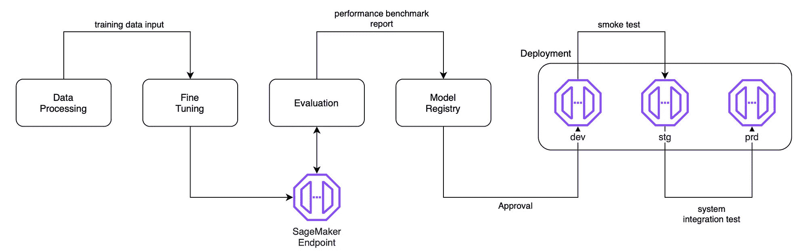
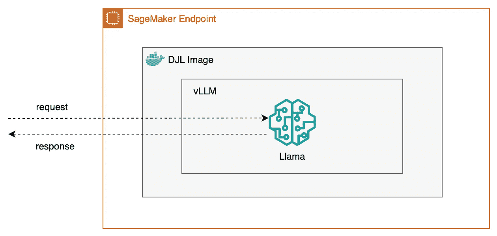

# 通过 vLLM 使用 SageMaker 端点部署 Llama 模型

> 原文：[`towardsdatascience.com/deploying-your-llama-model-via-vllm-using-sagemaker-endpoint-f02b424da124?source=collection_archive---------8-----------------------#2024-09-12`](https://towardsdatascience.com/deploying-your-llama-model-via-vllm-using-sagemaker-endpoint-f02b424da124?source=collection_archive---------8-----------------------#2024-09-12)

## 利用 AWS 的 MLOps 平台为 LLM 模型提供服务

 [Jake Teo](https://medium.com/@teosiyang?source=post_page---byline--f02b424da124--------------------------------)

·发表于[Towards Data Science](https://towardsdatascience.com/?source=post_page---byline--f02b424da124--------------------------------) ·8 分钟阅读·2024 年 9 月 12 日

--

需要推理端点的 MLOps 工作流中的实例（由作者创建）。

在任何机器学习项目中，目标是训练一个可以供他人使用，以得出良好预测的模型。为了实现这一目标，需要提供模型进行推理。在这个工作流中，几个部分需要这个推理端点，即在模型评估时，模型在发布到开发、预发布环境，最后到生产环境供最终用户使用之前。

在本文中，我将演示如何使用 AWS 的 SageMaker 端点和其 DJL 镜像，部署最新的 LLM 和服务技术，即 Llama 和 vLLM。这些组件是什么，它们如何组成推理端点？

各个组件如何协同工作，服务于 AWS 中的模型。SageMaker 端点是 GPU 实例，DJL 是模板 Docker 镜像，vLLM 是模型服务器（由作者创建）。

**SageMaker**是 AWS 提供的一项服务，包含一整套工具和服务，用于管理机器学习生命周期。其推理服务被称为 SageMaker 端点。在底层，它本质上是由 AWS 自主管理的虚拟机。

**DJL**（Deep Java Library）是由 AWS 开发的开源库，用于开发 LLM 推理 Docker 镜像，包括 vLLM[2]。该镜像用于…
