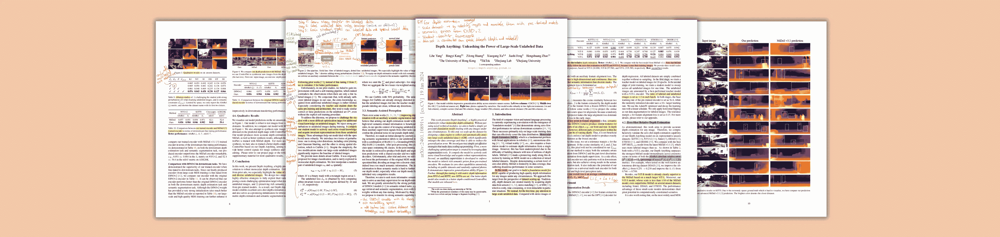

# Depth Anything — 单目深度估计的基础模型

> 原文：[`towardsdatascience.com/depth-anything-a-foundation-model-for-monocular-depth-estimation-8a7920b5c9cc?source=collection_archive---------3-----------------------#2024-03-20`](https://towardsdatascience.com/depth-anything-a-foundation-model-for-monocular-depth-estimation-8a7920b5c9cc?source=collection_archive---------3-----------------------#2024-03-20)

## [🚀Sascha 的论文俱乐部](https://towardsdatascience.com/tagged/saschas-paper-club)

## Depth Anything：释放大规模未标记数据的力量，L. Yang 等人

 [Sascha Kirch](https://medium.com/@SaschaKirch?source=post_page---byline--8a7920b5c9cc--------------------------------)

·发布于[Towards Data Science](https://towardsdatascience.com/?source=post_page---byline--8a7920b5c9cc--------------------------------) ·阅读时间：11 分钟·2024 年 3 月 20 日

--

图片来自[Sascha Kirch](https://medium.com/@SaschaKirch)的[出版物](https://arxiv.org/abs/2401.10891)

单目深度估计，即从二维图像预测三维空间中的距离。正如几乎所有关于深度估计的论文所指出的那样，这个“病态且固有模糊的问题”是计算机视觉和机器人学中的一个基础性问题。同时，基础模型主导了基于深度学习的自然语言处理（NLP）和计算机视觉领域。若我们能够将它们的成功应用于深度估计，岂不是太棒了？

在今天的论文讲解中，我们将深入探讨 Depth Anything，这是一种用于单目深度估计的基础模型。我们将了解它的架构、训练过程中使用的技巧以及它如何用于度量深度估计。

> **论文：** [Depth Anything: Unleashing the Power of Large-Scale Unlabeled Data](https://arxiv.org/abs/2401.10891)，Lihe Yang 等，2024 年 1 月 19 日
> 
> **资源：** [GitHub](https://github.com/LiheYoung/Depth-Anything) — [项目页面](https://depth-anything.github.io/) — [演示](https://huggingface.co/spaces/LiheYoung/Depth-Anything) — [检查点](https://huggingface.co/spaces/LiheYoung/Depth-Anything/tree/main)
> 
> **会议：** CVPR2024
> 
> **类别：** 基础模型，单目深度估计
> 
> [**其他讲解**](https://medium.com/@SaschaKirch/list/paper-walkthroughs-by-sascha-kirch-89c7847da8e2)**:**
> 
> [BYOL] — [CLIP] — [GLIP] — [Segment Anything] — [DINO] — [DDPM]
