# 设计以 AI 驱动的软件工程团队

> 原文：[`towardsdatascience.com/designing-ai-driven-software-engineering-teams-8afd8de13f1a?source=collection_archive---------0-----------------------#2024-01-11`](https://towardsdatascience.com/designing-ai-driven-software-engineering-teams-8afd8de13f1a?source=collection_archive---------0-----------------------#2024-01-11)

## 生成性人工智能（Gen AI）即将颠覆我们今天开发应用程序的方式。了解它将如何影响技术团队，以及我们可以做些什么应对。

 [Omer Ansari](https://medium.com/@oansari?source=post_page---byline--8afd8de13f1a--------------------------------)

·发布于[Towards Data Science](https://towardsdatascience.com/?source=post_page---byline--8afd8de13f1a--------------------------------) ·46 分钟阅读·2024 年 1 月 11 日

--

*来源：DALL-E，及作者的想象力*

# 介绍

欢迎来到 2024 年！变化正在悄然来临。你感觉到了吗？

在生成性人工智能（Gen AI）的领域，人类的聪明才智已经带领我们走得比我们曾经想象的更远。这些创新必将颠覆我们所知的现有软件工程职业。

新的、以 AI 为核心的公司将崛起并威胁到现有企业。其结果将是深远的。我们将见证从创意到交付产品的时间大幅缩短，运营成本的大幅降低，从而彻底改变经济，最终，人类编写的软件工程的依赖需求将不断减少。是的，我说了。😱

我们这个时代的许多伟大公司都有庞大的技术团队支持其业务流程，如销售、市场营销、支持等。那些团队如何反应，将决定他们不仅如何在这些变革中保持其相关性，还将如何为他们所支持的公司带来可能无可战胜的竞争优势。

这篇两部分的文章将提供实证证据来支持上述观点，并展示技术团队可以采用的一个可能框架，以驾驭[Shoggoth](https://en.wikipedia.org/wiki/Shoggoth)。

# 为什么是现在？

2023 年最后六个月中有三项至关重要的创新，几乎可以肯定会改变以人为主的软件工程领域。

# 大型语言模型（LLM）开源竞赛已经开始

大型语言模型（LLMs）是生成式人工智能的核心，而现在，开源大型语言模型正崛起，并且在性能上正在赶超目前占主导地位的专有产品——GPT4 [1]。

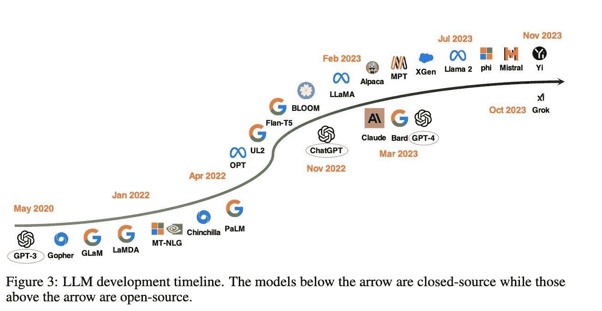

*来源：熊等人，《ChatGPT 一周年：开源大语言模型正在迎头赶上吗？》*

**为什么这很重要？**

为了回答这个问题，让我们快速总结一下[2]大语言模型创建的两阶段过程：

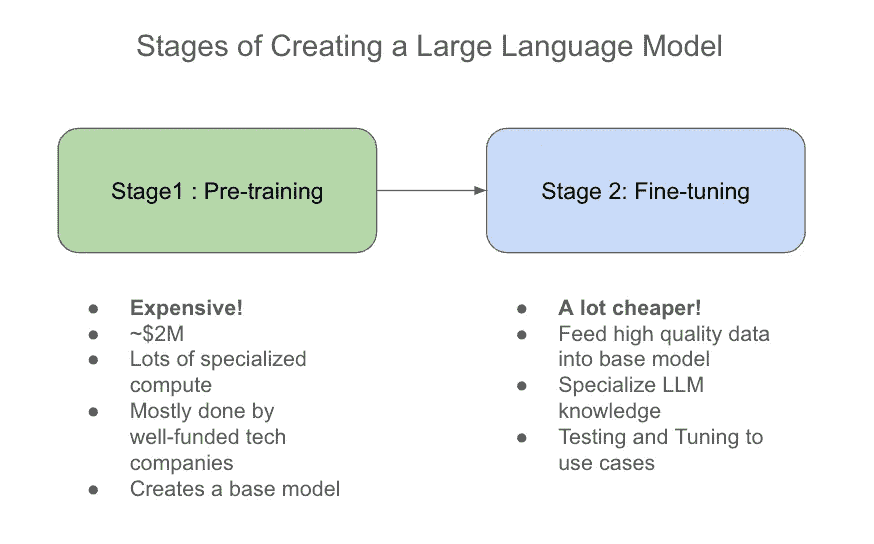

*来源：作者，灵感来自[2]Andrej Karpathy《大语言模型简介》YouTube 视频*

如上所示，第一阶段，也就是 LLM 的预训练，是不可能在极其有限的预算下完成的，或者在某人的车库里完成的。然而，像 Mistral AI、Meta，甚至现在的微软（而非 OpenAI）[3]等公司，开始推出高质量的开源软件（OSS）预训练基础模型，如 Mistral 和 LLAMA，这改变了游戏规则。突然间，较小的公司甚至个人开始创建专门的模型，并将其发布到[huggingface.co](https://huggingface.co)——开源模型的首选平台。一些非常有趣的模型开始出现，例如 Samantha [4]，一个伪感知的大语言模型，以及 Meditron [5]，一个医学上非常敏锐的大语言模型。

与软件工程相关的是，越来越多专注于编程的大型语言模型开始出现，例如 codellama、deepseek coder、phi 等。我们公司 Salesforce 也发布了 CodeGen [6]。就像任何在开源软件世界中流行的事物一样，这些模型注定会越来越好。我们将看到大型语言模型不断发展，变得更加庞大、复杂和精密，能够越来越自主地创建软件。

开源大语言模型（LLMs）之所以重要的另一个关键原因是知识产权问题。并非所有公司都愿意将他们的 AI 工作交给 OpenAI，OpenAI 实际上只是一个托管其封闭源模型的外部 API。在这个 API 背后，公司无法知道他们的数据是如何被使用或共享的。显然，开源软件可以缓解这一担忧。通过开源软件，你的知识产权不会离开你的笔记本电脑、数据中心或 AWS 虚拟专用云。

# 于是，“小型语言模型”应运而生

对于任何低成本或无成本的开发，快速原型开发必须能够在工程师的笔记本电脑上进行。虽然训练了 7B 甚至 11B 参数的大型语言模型可以在相当不错的笔记本电脑上运行，但它们仍然会占用大量的 RAM 和 CPU/GPU 资源。此外，除非你有一台非常强大的机器，否则你可以忘记运行超过 30B 参数的大型语言模型。更进一步，当你必须将这些模型用于生产化的、始终在线的功能时，你可以预期会有一笔昂贵的托管/云计算费用。为了克服这一进入门槛，像微软这样的公司开始研究[7]如何创建更小的基础模型，并且这些模型仍然具有良好的性能，随后还开源了小型语言模型 Phi-2 [3]。他们的主要方式是使用**高质量的“教科书级”数据[8]**来训练这些模型，而不是使用大量低质量、可靠性参差不齐的互联网数据。

这一领域的研究将在 2024 年继续加速，因为这开始打开了一个可能性，即小型模型能够在智能手机甚至树莓派等小型电子设备上本地运行。特别是对于软件开发，这是本文的重点，这将为扩展 AI 驱动的软件工程（AI-SWE）提供一种高效且环保的选择，从而降低了另一个进入门槛：大型语言模型运行时的成本。

# AI 代理相互协作以获得更好的结果

如果你使用过 ChatGPT，你会知道它的第一次回应有时并不是最好的，你必须与 GPT 进行对话，以调整并获得一个可接受的答案。事实上，在 2023 年夏天，人们开始让大型语言模型互相对话并进行批评，经过几轮迭代后的结果质量令人惊讶地高[9]。

这一激动人心的进展催生了多个开源软件项目，其中一些已经获得了广泛关注。我想给你展示一下这些多代理框架（在某些情况下，是完整应用程序）能够实现的功能：

# ChatDev [10]。

*来自他们的网站：*

+   *易于使用的基于 LLM 的框架，用于[..]集体智能。*

+   *ChatDev 是一个虚拟的软件公司，运作方式是通过包括 CEO、COO、程序员、审阅员、测试员、艺术设计师等在内的多种智能代理。*

我的观点：这款软件很有前景，但有些过于复杂。也许适合模拟，但它的限制过于严格，缺乏灵活性，难以与组织现有的工作流程和过程集成。

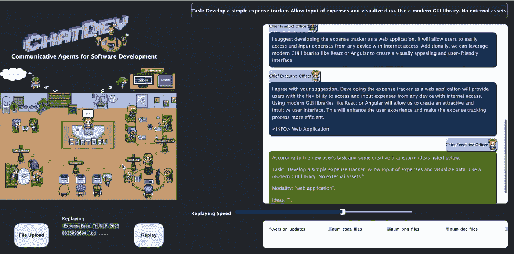

*来源：ChatDev [10]*

# MetaGPT [11]。

来自他们的网站

+   *“多代理框架：给定一行需求，返回 PRD、设计、任务、代码仓库”*

我的观点：目前尚无可用信息，我还没有尝试过。

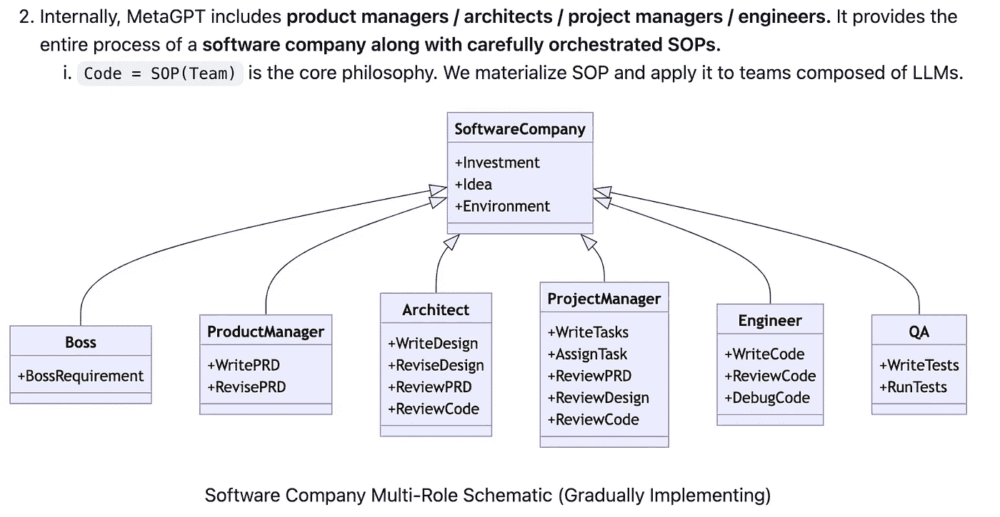

*来源：MetaGPT [11]*

# Autogen（微软）[12]

+   *AutoGen 是一个框架，允许使用多个代理来开发 LLM 应用程序，这些代理能够相互对话解决任务。*

我的看法：在我的早期实验中，这个框架相当灵活。Autogen 还在它们的库中引入了一些相当有趣的代理功能，如[RAG](https://aws.amazon.com/what-is/retrieval-augmented-generation)，甚至还有一个可以教学的代理，它将你的聊天记录写入持久存储，并能够在未来查询这些记录，从而永远记住它们。此外，你可以同时使用不同角色的 LLM（包括封闭和开放的 LLM）！然而，我还没有找到如何明确和程序化地将工作委派给每个 AI 代理，除非在初始要求提示中明确说明这一点。

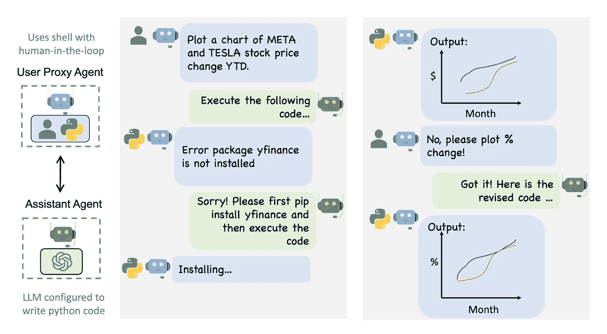

*来源：Autogen（由微软提供）[12]。*

更重要的是，新的多代理框架仍在不断涌现。一个新兴的框架，crew ai[13]也引起了我的关注。它有最简洁、最直观的 API，并且使任务明确委派给特定代理成为可能，这是目前 Autogen 所缺乏的功能。然而，它仍然相当简单，缺乏许多附加功能。

专业建议：如果你想始终站在这一领域创新的前沿，我鼓励你加入这些项目的 Discord 页面。你会看到人们迅速为基础框架添加新的创意功能以及各种各样的集成。这是创新健康发展的信号。如果我是风险投资人，老实说，我会在这些 Discord 服务器里待着。

# 2023 年下半年 — 创新时间轴

正如我提到的，2023 年下半年对代理型 AI 领域来说是一个福音。Oliver Morris 在下面的图表中，出色地捕捉了在代理、代理团队和 LLM 领域发生的具体创新。

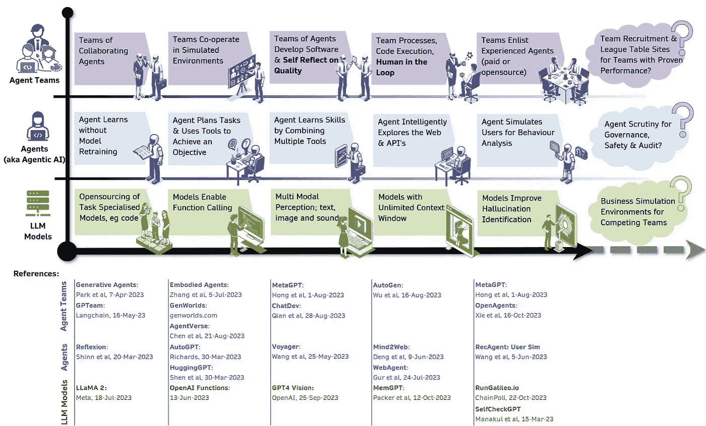

*参考资料：[14] Oliver Morris：AI 能否与自己合作造福我们？*

这一演变被 Oliver 精彩地呈现出来，以至于没有必要对上述内容进行总结。我在这里的目标只是突出他的工作[14]，因为它与这一演变息息相关，可能还会帮助你看清创新的未来方向。

# AI 代理在软件开发中的协作发现

独立的公共[14]和学术[15]研究，通过我自己的实验验证（我将在未来的帖子中写更多关于这方面的内容），表明在提示中给定有针对性且深思熟虑的要求，且代理具备明确的角色和范围时，多代理协作会产生令人惊讶的良好结果。

我见过 AI 规划者定义详细的逐步计划，AI 批评者帮助规划者完善计划。接着，规划者请求 AI 程序员开发代码，程序员还配备了代码审查员，识别代码中的缺陷和问题，最后由执行者在受控环境中实施代码并分享结果。最终，AI 作家甚至可以去创建技术文档！此外，如果有需要，还可以选择保留“人类介入”环节。在任何一步中，都可以引入人类进行纠正，无论是修正需求、更改用户对计划的接受度、调整用户界面的美学，还是修改 API 的功能。人类开始在比单纯编写软件更高层次上参与。这就是这种多代理协作方式如此灵活、强大且*迅速*的原因。

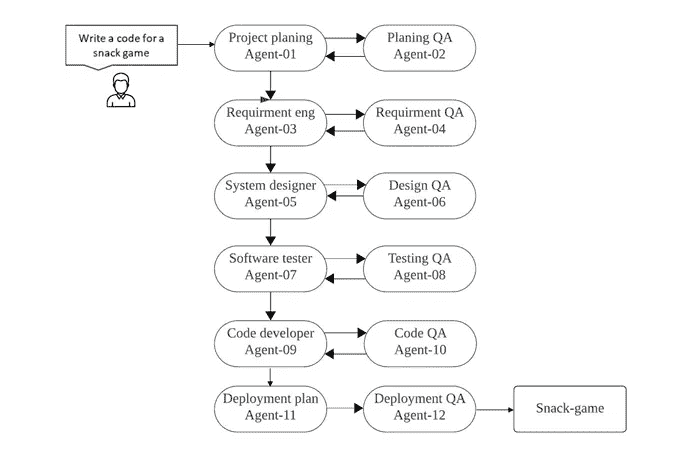

*来源：（研究实验）* *[15] Waseem 等人：《软件开发中的自主代理：愿景论文》*

具体来说，研究人员已经识别出了以下好处。

+   提升生产力

+   改善代码质量

+   可扩展性与适应性

+   精简调试过程

+   降低人为错误

虽然其中一些好处显而易见，比如减少人为错误和提高生产力，但其他发现也相当有说服力。正如 Nvidia 首席执行官在 2017 年先见之明地所说：

> *软件正在吞噬这个世界，但 AI 将吞噬软件*

# 退一步来看

引用 Salesforce AI 研究团队[6]：

*“我们很快就会到达这样的一个阶段，项目将需要像对话式 AI 编程这样的技术，才能创建未来的超级复杂软件系统——不仅是规模巨大，而且在时间上也是人类程序员团队无法单独完成的。”*

作为一名软件工程领导者，我可以清楚地看到，基于 AI 的软件工程将在每家科技公司中占有一席之地。我相信我们将在 2024 年看到这一趋势的初现，伴随着 AI 本土化公司崛起。

这两个问题浮现出来：

1.  这一变化将如何在商业中表现出来，且

1.  这对现有公司中的 IT 组织意味着什么

我将在接下来的部分尝试解答这些问题。

# 商业模式与 IT 组织：为冲击做好准备！

许多读者可能已经听说过克莱顿·克里斯滕森的经典著作《创新者的窘境》。我想在这里引用他书中的一段话，以说明 AI 软件工程（AI-SWE）将如何站稳脚跟。

*克莱顿·克里斯滕森区分了两种类型的创新：持续性创新和颠覆性创新。持续性创新涉及对现有技术的增强，新市场的进入者通常难以与那些能够轻松将这些改进融入现有产品的老牌公司竞争。另一方面，颠覆性创新出现在产品对市场来说过于复杂时，导致市场出现“过度服务”现象。这为新创新提供了机会，尽管它们可能不如当前最先进的产品，但它们以较低的成本或以现有领先产品无法实现的方式提供功能。*

好的，现在你已经对这个概念有了复习，保持这个思路！我们很快会再回到它，但首先让我们介绍一种新兴的组织形式——AI 原生公司。

# 警惕 AI 原生公司的崛起

就像我们看到云原生公司随着云计算的普及和经济性而出现并改变了市场格局一样，我们现在也将看到 AI 原生公司形成。

随着生成性 AI 使软件工程变得越来越易于接触，新公司将能够在不雇佣大量昂贵的软件开发人员的情况下创建软件。事实上，现在出现了一种新职业，称为 AI 工程师[16]。这个职业将高于实际的代码开发，专注于训练模型并创建连接， 将由这些 AI 功能创建的软件交到最终用户手中。

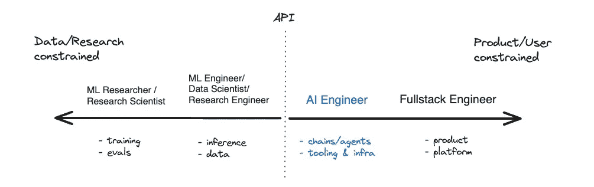

*来源：[16] Swyx: The Rise of the AI engineer*

AI 原生公司将不必处理遗留软件流程或过去做出的架构、基础设施、平台、框架或语言决策所带来的官僚主义和摩擦。他们能够利用最佳、最普及且最经济的模式构建和部署软件。而且，如果他们做出了错误的技术决策，也不必担心，只需放弃所有，重新从头开始快速构建！

AI 原生公司不会像硅谷常见的那样在隐身模式下耗时 9 到 18 个月。新技术开发的所有阶段，从原型到最小可行产品（MVP），将以周为单位进行衡量。风险投资公司将更容易且更便宜地资助这些公司，因为它们能够轻松地进行转型，当有前景的产品最终证明是失败时。这些公司将开始渗透到各个行业，从税务到医疗保健管理，或者开始威胁现有公司，或者被收购（或者由于员工数量极少而被“并购聘用”）。更重要的是，它们将迅速改变客户眼中产品的上市时间感知，几乎迫使现有成功公司自我颠覆。

回到克莱顿关于颠覆性技术的概念……人工智能软件工程（AI-SWE）一开始将逊色于人类软件工程，但没有什么能够与它的惊人速度和低成本竞争。客户将进行成本效益评估，选择绕过花哨的功能，选择那些更简单但价格便宜、能迅速发展的替代品。所有 AI 原生公司必须确保的，是在可靠性和安全性等基本原则上不妥协，并提供客户所需要的核心价值。

# 这如何影响 IT？

目前，在现有的成功公司中，IT（无论是集中式还是分布式）构建或购买大部分用于“进入市场”的技术。这包括从销售技术，如 CRM 系统和电子商务，到营销技术，如数字在线存在和活动技术，再到客户支持技术，如票务系统，甚至数据工程、分析和科学，如数据管道、仪表板或购买倾向模型。

*备注：这里，当我提到 IT 时，我指的是公司中的所有技术组织。它们可能集中在一个正式的 IT 职能中，也可能分散在独立的业务部门中。这股 AI 浪潮不会偏袒任何一方，它将影响所有这些组织。*

公司只能以这些技术发展的速度来进化。由 AI 原生公司带来的市场时间缩短压力最终将被现有公司内部的 IT 团队感受到。目前，大多数 IT 公司正在鼓励他们的工程师安全地尝试人工智能，这是好的。然而，我相信那些**主动**为这股浪潮做好准备的公司，将使他们的公司在脱离竞争对手的同时，保持在这个由 AI 驱动的新经济中的韧性。

# 每个 IT 组织的旅程将是独特的

*来源：DALL-E，和作者的想象力*

我希望你能把森林中间的瀑布想象成由人工智能创造的价值。所有 AI 原生公司将会驻扎得离这个瀑布更近，它们的应用架构、开发流程和团队将专门为 AI-SWE 进行优化。

然而，所有现有的公司都位于更远的地方。它们每一个都从不同的起点开始。有些使用的语言和平台将无法从人工智能中受益。其他公司则拥有脆弱且复杂的架构，可能是多年来不自然增长（收购）所建立的，这些架构不利于人工智能代理轻松地自主接入并发挥作用，等等。

就软件开发生命周期（SDLC）而言，**所有这些**现有公司都会对工作管理系统进行独特的定制，如何进行低级功能分解的流程独特，自己的源代码分支策略，自己的软件检查标准（代码气味百分比、单元测试覆盖率），甚至到每个开发者如何结构化每个 GitHub 拉取请求的评论。

在以 AI 驱动的世界中，上述每个方面都需要发生变化。AI 代理需要学习哪些内容必须包含在拉取请求中，哪些文档必须在工作管理系统中更新，如何构建和与测试环境互动，如何创建变更批准文档等等。**而这一切对于每个 IT 公司来说都不尽相同。** 简单来说，

> *成为以 AI 驱动的动力必须来自 IT 内部，因为没有外部实体能比 IT 自己更了解 IT。*

我们将看到许多江湖骗子：那些向 IT 高管推销这一“应许之地”的公司。即使他们有一个引人注目的平台，60%到 70%的工作也将是平台的采用，以及将其集成到现有的流程、工具和文化中。

对于 IT 高管来说，这可能看起来令人望而生畏。然而，让我们始终记住，我们曾经走过这条路。回想一下，当我们都从数据中心迁移到公共云时，或者早些时候，当我们为软件团队建立持续集成时，或者当我们从零散的工作方式转向标准化的 PaaS 平台时，作为高管的我们已经成功管理过这些公司中的重大变革。

我们要做的就是定义一个高层次的结构，并规划如何实现这一目标。从我职业生涯中众多的变革案例中汲取经验，我对这波人工智能浪潮进行了很多思考，并将尝试解释一种可能的实施方式。请注意，这只是我的个人视角，我知道还会有其他的做法。

我分享这种方法的目标是让你的思维引擎开始运转，并为你在这段旅程中提供一个良好的开端。

# 通往未来的桥梁

我在作为领导者的职业生涯中学到的一件事是，谈论理想的目标状态很容易，因为它已经在书籍和演讲中广泛传播，而且我们也很容易欣赏当前状态中的问题。真正困难的工作是从当前状态到未来状态之间架起一座桥梁。这座桥梁上的每一步都必须经过规划和深思熟虑。第一步需要足够接近当前状态，以便组织能够自然地过渡。后续的步骤不能相距太远，否则员工会犹豫不前。这些步骤应该是相互衔接、逻辑递进的。

*来源：DALL-E，及作者的想象力*

我尝试将这些步骤按照阶段进行阐述，从大多数我们在 IT 行业中的现状开始：

# 当前状态

当前，一些 IT 组织正在尝试 AI，并鼓励他们的软件工程师使用和拥抱 AI 增强的代码开发。工程师们通常的做法是安装扩展到他们的交互式开发环境（IDE）中，在编写代码时，他们使用特殊的快捷键启动代码助手 Agent，后者会检查他们的代码，或者可能是一个指示该文件某个部分所需内容的注释，然后助手会自动建议几行代码，工程师可以选择接受或拒绝 [17]。

这些角色有多种选择可以获得帮助，以下只是几个例子：

+   Github co-pilot：迄今为止，最为普及的开发者 IDE 扩展，由 OpenAI 的 GPT4 LLM 提供支持。

+   许多 IDE 扩展（例如 Code GPT），其中一些允许你使用开源 LLMs 替代 GPT4。

+   科技公司提供的免费 IDE 扩展，扩展了其能力以促进更广泛的采用。示例如下：

a) 专有编程语言（例如 Salesforce 为 Apex 语言提供的 Einstein for Developers 扩展，支持实时自动补全）

b) 核心技术能力（SonarSource 提供的 SonarLint 扩展，专注于在编程时捕捉质量问题）

c) 扩展平台能力（CAST Highlight 扩展，用于审查软件结构安全、软件知识产权的收购前尽职调查等）

一个典型的 IT 产品交付团队可能今天看起来像这样：

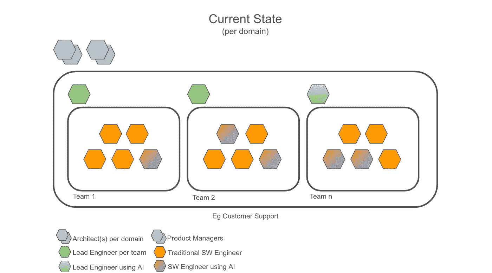

*来源：作者*

一些工程师已经开始使用这些 IDE，或许一些负责 Scrum 团队的首席工程师也在尝试。在 IT 部门内，AI 辅助开发也可能在自然地被推广开来。

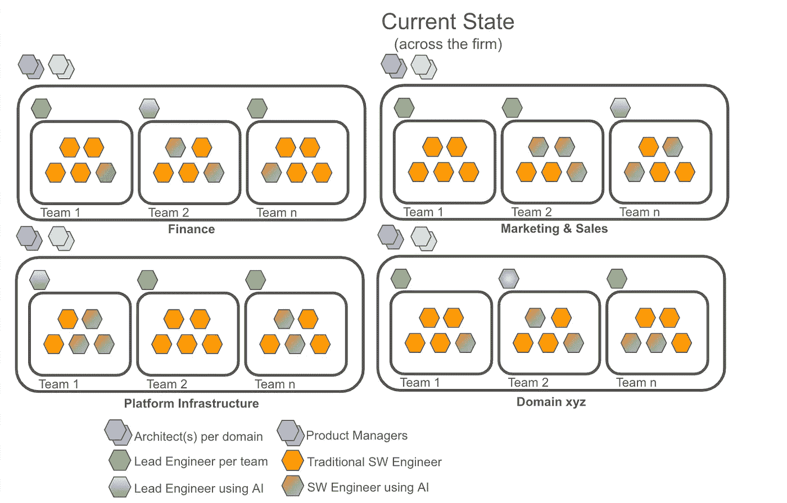

*来源：作者*

AI 辅助开发是一个极好的第一步，所有软件工程师都应当在公司安全政策的框架内，鼓励并积极推动内部利用这些工具。

然而，借用统计学中的一句话，**这是必要的，但不充分。**

尽管使用这些功能对于所有开发者都有普遍的提升效果，但为了真正引入我们之前提到的“颠覆性”变化，仍然需要投入一定程度的**专注**能量、思考和结构来实现。这将带领我们进入旅程的第一阶段：

# 阶段 0：评估与规划

> *如果你不做计划，那你就是在计划失败。*

在进行团队组建等具体行动之前，需要进行一项评估工作，理解并定义将 AI 驱动的工程引入 IT 组织的整体范围和目标。一个扎实的计划将提升高层的信心，并为未来阶段的投资需求提供合适的估算。

为了制定一个现实且可行的计划，重要的是从我们将引入的 AI 软件代理的视角来审视这些流程、工具和技术。在此过程中需要记录的关键领域包括：

1.  评估关键的软件开发流程

简化到核心内容，当前每个软件工程师必须参与哪些流程才能贡献代码并交付功能？此处的例子包括规划、任务估算、开发、遵守特定的分支策略、运行特定的测试套件、特定的编码、单元测试和文档要求等。

*换句话说，AI 软件开发代理需要融入哪些关键的低级软件开发流程，以便能够实际应用。*

这是一个重要的工作，因为在所有 IT 组织中，存在许多有助于协调和沟通的高级流程，但这些流程并不直接贡献于功能的交付。例子包括每周的领导报告、向高层领导汇报进展、跨多个领域的协调会议。通常由技术项目经理推动的任何工作都可以包括在这个范畴内。将 AI 驱动的工程融入其中不会直接影响这些高级流程（是的，AI 将以深远的方式 *间接* 影响这些高级流程，但那超出了本篇文档的范围）。

这项评估和文档工作将有助于确定 AI 软件工程团队可能需要编写的额外服务，以将它们接入现有的软件交付工作流。

**2\. 评估当前的 IT 基础设施和环境**

在使用 AI 代理工程时，应用程序中存在一些与依赖管理相关的复杂问题（例如运行时版本、使用的库等）以及与相邻应用程序的基于 API 的依赖关系。我最初对自主 AI 的实验揭示了在环境中部署软件时的各种挑战（稍后我会在更技术性的文档中记录这些问题）。还涉及到应用程序认证管理的问题，超出了“本地”设置的范围。开发人员可能需要进行一些手动操作才能完全配置好，以便将软件部署到该环境中。这样的设置需要为每个 AI 代理进行复制，并显然尽可能地自动化，以便能够以最小的人工干预轻松增加 AI 代理容量。简而言之，详细的“低级别”文档非常重要，它描述了一个软件工程师从零开始在本地开发某些软件、然后部署到共享的 QA 环境中，再将代码提升到更高级别环境直到进入生产的全过程，这是识别 AI 代理面临的障碍的关键。

在许多情况下，我们需要为没有 100%自动化持续**部署**（CD）到生产环境的路径做好准备，尤其是在当前没有为人力驱动的软件工程（H-SWE）设置 CD 的情况下。例如，如果当前有人工参与变更和发布管理过程来将功能发布到生产中，那么即使半自动化的 AI-SWE 团队独立创建软件功能时，这一过程依然存在。但这并不会阻止 AI-SWE 团队创建并将所有必需的文档和测试输出提交给变更委员会和发布经理。（随着时间的推移，变更和发布过程肯定也可以由 AI（不是编程，而是推理）代理来支持，但这超出了本文的范围。）

类似于软件流程评估，环境评估也将展示需要优化哪些其他能力，以使 AI-SWE 能够在代码晋升到更高环境并最终部署到生产时保持尽可能的自动化。

**3\. 确定所有可以集成 AI 的应用程序（复杂性和影响）**

会有数百个候选应用程序可以插入 AI-SWE。然而，需要仔细评估每个应用程序的 SDLC 相关流程的复杂性、每个应用程序语言的 AI 编码 LLMs 的成熟度以及 AI-SWE 对该应用程序的影响程度。就像在故事点估算中一样，可以使用斐波那契评分来衡量成本和收益维度，并可以创建一个整体的 ROI 指标，帮助高管们决定 AI-SWE 代理部署的顺序（更多内容见下文的第二阶段）。

**重要提示：** 在应用程序优先级列表的*底部*，应该列出所有那些已经存在显著上下文丢失的应用程序[18]。问题陈述必须忠实于构建 AI-SWE 团队，而不是为了包含那些神秘地能工作但没有人真正理解如何工作的遗留应用程序而进行稀释。

**4\. 制定过渡的时间表和路线图**

当然，任何规划阶段都离不开一份发布的路线图，在这里也需要一份。作为一名高管，我喜欢定义时间表，因为它迫使我和我的团队以实际的日期和截止日期为思考框架，同时帮助我们全面地考虑项目的各个方面和阶段。当然，正如孙子所说，“没有计划能在与敌人接触后存活下来”。这些时间表确实会发生变化，尤其是因为这种类型的工作以前从未做过。我们真的不知道这段旅程中会有哪些惊喜等着我们，而且目前还没有用户手册可以参考。（事实上，据我所知，这篇文章可能是来自一位有经验的产品负责人在战斗中首次尝试的框架。）

除此之外，计划仍将提供一个清晰的基线并识别所有假设。随着意外情况的出现，计划可以进行审查和调整。然而，这些截止日期仍然存在，且会公开传达，始终给团队带来健康的压力，保持专注并交付成果。对于所有新项目或功能，我总是说：

> “日期不能改变，但范围可以”

**5. AI 技术选择**

应该留出一些时间进行基于 POC 的技术选择。最好能对支持哪个方向（即调整哪些基础模型）有一些高层次的明确认识。这些模型应该能够服务于来自上面步骤 3 中的优先级列表前四分之一的大部分应用。然而，我们必须保持灵活性。这个领域发展迅速，今年晚些时候可能会出现需要我们改变选择的创新。这里重要的是要专注于那些不会后悔的选择，通过提出以下问题来指导：

+   AI 技术（如多智能体框架等）是否允许我们将架构转化，处理编码、调试、QA 和运营任务？

+   这些框架是否允许我们轻松更换 LLM？

+   我们是否可以定义一些常见的基准，以便评估框架的性能？

这一选择必须基于多个概念验证（POC），展示 AI-SWE 如何与环境和软件工具集成。外面有很多有趣的 AI-SWE 应用，比如小吃游戏、数到 100 和用多种语言打印“Hello World”。这里的 POC 应集中于简单但切实可行的 IT 应用案例。正是这些 POC 能给我们一些信心，并展示从当前状态到期望目标状态之间的实际差距，我们可以据此进行合理的工作量估算。

为了进行这项评估和规划，我建议组成一个小团队，包括：

+   一位有能力的软件工程领导者，了解公司内软件创作的具体流程，并对生成式 AI 的交集领域有深入的知识和热情。他们将是这一转型的核心推动者，并为组织推动这一变革。

+   一位有将架构投入生产经验的架构师，能够与工程团队紧密合作。此人需要了解 IT 内部的开发过程，同时对 IT 企业架构组定义的核心架构原则有深入理解，确保这些原则在解决方案中得到体现。

+   在初始目标领域内担任领导工程师，拥有从需求到规模化，从环境到代码评审的完整软件生命周期的深入实践经验。我怀疑该负责人能直觉地发现那些低挂的果实，识别 AI 智能体在团队中能产生最具生产力贡献的地方。

# 阶段 1：建立 AI 共享服务团队

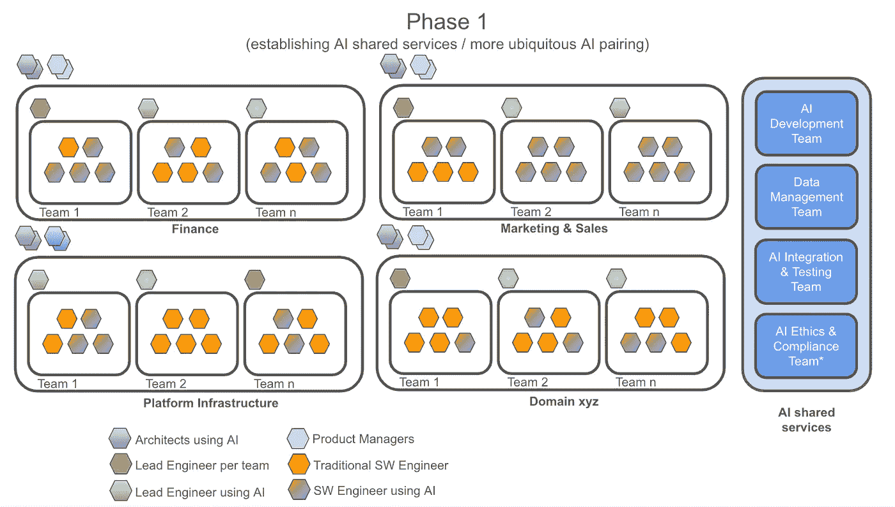

*来源：作者*

尽管 AI 辅助的人类软件开发的自下而上的有机使用必须继续，但一个专门的团队将更加专注于将 AI-SWE（AI 软件工程）变为现实。

具体而言，这个团队将专注于四个不同的领域。我根据每个领域所需的独特技能和认知复杂性将其进行了拆分。

世界上没有完美的组织设计。它们往往在优化某些收益的同时牺牲其他方面。我提出的组织设计优化了并行性和规模，并尽可能为各个团队提供自主权，关键操作重点是“快速行动”。这些团队包括：

# 1\. AI 开发团队

**主要角色：** 开发、定制和维护 AI 模型，特别是 LLM（大规模语言模型），用于各种软件开发任务。该开发将从预训练的基础模型开始，并对其进行微调，以适应应用团队的内部软件和文档。

**职责：**

+   **AI 模型定制：** 专注于微调预训练的 LLM，使其尽可能理解领域团队的特定代码库、软件架构文档和领域知识。这将依赖于数据管理团队精心策划的高质量数据（见下文第 2 条）。在某些情况下，模型将微调的应用代码已经使用基础模型能够理解的编程语言（如微软的 Phi-2）。然而，对于一些尚未训练到这些模型中的语言（如主要由基础设施自动化团队使用的 Terraform），可能需要进行全新的研究。**AI 模型质量保证（QA）：** 测试 AI 模型以确保它们满足功能要求和性能基准。这些 AI 模型必须符合严格的评估标准和客观性能指标。一个好的外部测试是 AI-SWE 代理发送给首席工程师的拉取请求（pull requests）。但是，根据首席工程师的反馈，性能指标需要被规范化，并融入到模型创建流程中。该团队还应探索学术界新开发的方法，如 BotChat [9]，以评估多代理 AI-SWE 团队产生的质量。

+   **研究与开发：** 紧跟最新的 AI 进展，并将其融入到你的系统中。

**所需技能：** 了解软件团队的特定技术栈、软件开发和系统集成。

*我* **不** *认为这个团队真正需要具备从业者级别的数据科学知识，因为像 AutoGPT [19]这样的许多开源能力已经创建出来，帮助微调基础模型。这个团队不会做大量的数据科学或机器学习工作，比如在 GCP 的 TPU 芯片上预训练模型，但它将是一个真正的工程团队，拿着积木块搭建 AI-软件工程能力，在开源基础模型之上构建。实际上，我们在这里需要的技能是扎实的软件工程师。然而，这个团队需要对预训练编码模型[20]的创建有一个大致的了解，并且需要时刻跟进多代理软件开发领域的最新进展，这也是为什么上面提到了研发的职责。*

*在更高级的阶段，这个团队可能需要预训练自己的模型，这可能需要数据科学家以及对云计算的投资，但在验证实际价值之前在这个领域进行如此重的投资并不符合商业逻辑，因为通过基于预训练模型构建，能够获得大量提升。*

# 2\. 数据管理团队

**主要角色：** 管理训练和优化 AI 模型所需的数据。这个团队需要了解为团队 1 训练模型所需的数据类型、质量和格式，然后能够收集和标注这些数据。在初期，这个团队和 AI 开发团队可能是同一个，但最终为了扩展性考虑，它需要作为一个独立团队存在。实际上，刚开始时，创建样本数据集来微调模型的工作很可能由 AI 开发团队（1）完成，并且只有在多个应用程序和多个领域扩展时，才会将这项工作交给这个团队。我发现 Autogen 发布的一个原型[21]非常适用，通过将 AI 代理指向良好的代码文档（也称为检索增强生成，或 RAG），他们演示了 AI 代理如何能够学习库中一些新方法的语法并基于此提供代码。我们可能会选择使用 RAG 方法，也可能不会，但这个例子清楚地展示了这可以实现。

**职责：**

+   **数据收集与标注：** 收集并标注数据，如代码仓库、项目文档和用户故事，用于 AI 训练。了解格式要求和标注需求对于其他微调过的编码模型至关重要。在自然语言模型的微调阶段，需要创建大量的问答（键:值）对类型的精心策划数据[2]。这个团队需要将其在 AI-SWE 领域的应用进行翻译。

+   **数据质量保证：** 确保用于训练 AI 模型的数据的准确性、一致性和相关性。这是模型成功和质量的关键领域。回想一下，新的小型语言模型的效果直接来自于高质量教科书级别的数据用于训练这些模型。这意味着该团队将投入大量精力来确保数据相关且符合 AI 代理将要应用的领域的上下文。这可能需要审查和修改现有的应用文档（也许还包括代码），并与现有团队合作，以便在训练前改善他们的文档。尽管 AI 代理需要学习应用程序的代码和一般内部文档，但研究一下在学校里教授给计算机科学本科生的其他通用工程模式也是很有益的。这还需要格式化、分块并准备实际的高质量学术文本，以便对 LLM 进行微调。最后，团队还需要设计一些客观的度量标准，以衡量数据的质量。

+   **数据隐私与安全：** 以遵守隐私法律和安全标准的方式处理数据。该团队的任务是确保所有整理的数据都符合公司的隐私和安全标准。  

**所需技能：** 数据管理、数据标注、理解数据隐私法律。  

注：该团队的输出的一个有益副作用是提升目标应用程序代码和文档的一般质量。这可能也有助于现有团队的工作，如新工程师的入职培训，或帮助现有工程师深入理解他们可能没有构建过但却继承的应用程序。  

# 3. AI 集成与测试团队  

**主要角色：** 将 AI 解决方案集成到现有流程和系统中，并确保其功能性和可靠性。该团队提供 AI-SWE 代理和团队的“最后一公里”连接。如果没有所需的集成工具和库，AI 所生成的软件和文档将无法被检查、审阅或部署到测试环境中。  

**职责：**  

+   **AI 工具：** 开发工具将 AI 模型无缝集成到现有的软件开发流程中。实际上，这些工具很可能是 API 和辅助库，可用于与内部身份管理系统进行身份验证、与 git 交互、与环境和现有的 CI/CD 流程进行接口，甚至可能与工作管理系统（例如 Jira）进行交互，以服务团队。  

    你可以看到这里的模式。这些活动通常是人类程序员在编写代码之外做的事情。AI 代理将调用实用的辅助软件来执行类似的操作。根据公司在成熟度和自动化程度上的不同，这项工作实际上可能比实际的 AI 开发还需要更多的努力。

+   AI 性能监控：持续监控 AI 系统，关注任何问题或与预期性能的偏差。注意：如果有现有的 MLOps 团队，这项工作也可能归入该团队。

**所需技能：** 具有软件集成、QA 测试、性能监控和故障排除的经验。

# 4. AI 伦理与合规（虚拟）团队

**主要职责：** 确保 AI 系统的伦理开发与部署。最好这个团队不直接隶属于共享服务组织。拥有此类经验的个人通常已经存在于企业的首席数据办公室，作为治理团队的一部分。他们将作为咨询和信息提供方参与，以确保在创建这些 AI-SWE 系统时，他们的意见得到考虑。

**职责：**

+   **伦理指南开发：** 提供伦理 AI 使用的指导方针，重点关注公平性、透明度和责任，供共享服务团队在 AI 实施中参考。

+   **合规框架：** 提供一套最小可行的、可衡量的合规规则、法规和伦理标准，供共享服务团队纳入实施清单中。这是一个不断发展的领域，因此应该与数据治理团队建立持续的接口，以便捕捉行业中新出台的重要法规或关键 AI 标准。

    虽然这不是该团队的责任，但它可以帮助指导集成团队（3）创建用于可审计性的扩展包，例如 SOX 等，这些扩展包能够基于 AI-SWE 团队创建的文档自动生成报告，这些报告对于内部审计人员，甚至可能是外部审计人员来说都是可接受的。

**所需技能：** 了解伦理 AI 原则、法律和监管合规性、利益相关者管理。选择具有“赋能”态度而非“阻碍”态度的合作伙伴非常重要。前者会与团队合作找到可行的解决方案，而后者则喜欢说“不能做！”，但不会有动力寻找前进的道路。

这些共享服务团队在成功过渡到 AI 驱动的软件开发过程中起着关键作用。他们的有效性在于他们能够协作、创新，并适应不断发展的 AI 技术格局。

# 第 1 阶段的退出标准

一旦这个小组的关键方面被创建并且能够正常运作，从阶段 1 到阶段 2 的退出标准就是创建一个功能齐全且富有成效的 AI-SWE 代理，基于为第一个目标应用程序/Scrum 团队定制的微调 LLM，并用高质量数据进行训练。此时，AI-SWE 已经在受控环境中具备了功能。

然而，正如 DC Palter [22] 所说：

> 90%完成意味着产品已接近发布的一半。

*“在受控环境下工作的原型与在任何使用情况下都不会崩溃的商业产品之间存在巨大的差距。当产品完成 90%时，它实际上仅完成了一半。”*

阶段 2 开始时，你将把这个 90%完成的原型（AI-SWE 代理）带入真实环境中。

# 阶段 2a：引入第一个 AI“Agent”（即 Teamlet）

在这个阶段，我们会小心地将第一个 AI-SWE Agent（注意 Agent 与 agent 的区别，稍后会详细说明）引入一个真实的 Scrum 团队，并随着其有效性的证明，逐渐扩大该代理的职责。我们在引入时必须小心谨慎，因为我们不希望这会干扰目标 Scrum 团队的速度，而该团队已经承诺了该发布版本下正在建设的史诗故事点。

我建议我们将 AI-SWE 代理引入由从阶段 0 开始就参与此过程的首席工程师领导的团队。首席工程师将指导 AI 代理，初步任务可能只是开始为一些简单的技术债务问题提供 Pull 请求（例如修复已知的缺陷问题，AI 代理在这方面表现越来越好[23]，或清除由 SonarQube 运行中的代码异味所识别的简单技术债务问题[24]等），甚至是为代码和可用性补充缺失的文档。

在这个阶段，所有的集成和辅助库都经过了微调，目的是使 AI 代理对团队的贡献变得无摩擦、一致，并且与团队中的人类开发者相当（或更好）。

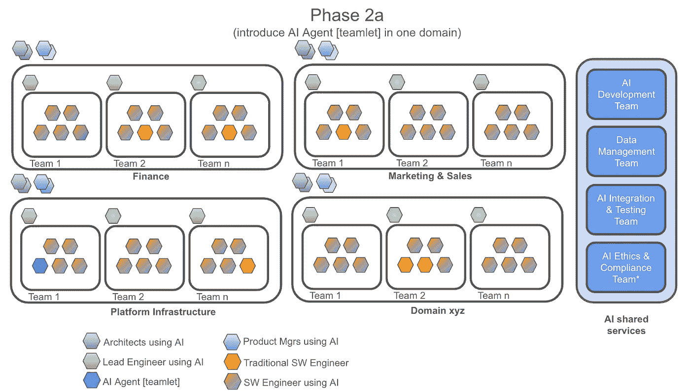

*来源：作者*

在幕后，我们引入的 AI 代理实际上是由多个较小的代理组成，这些代理相互互动。这一点很重要，因为多代理的输出通常比与人类的单回合互动要强得多，正如前面所述。这张可爱的 DALL-E 图片捕捉了团队的本质：

*来源：DALL-E 和作者的想象*

这里更合适，但远不如酷的术语是代理 Teamlet。这就是为什么我采用了带大写“A”的 AI **Agent**这一术语，以便与实际的原子代理区分开来。然而，在整篇文档中，我将 Teamlet 和 Agent 互换使用。

放大来看 AI 代理（即 Teamlet），我们可以看到下方有许多不同的代理，每个代理都由相同或不同的 LLM（取决于其专业化）支持。

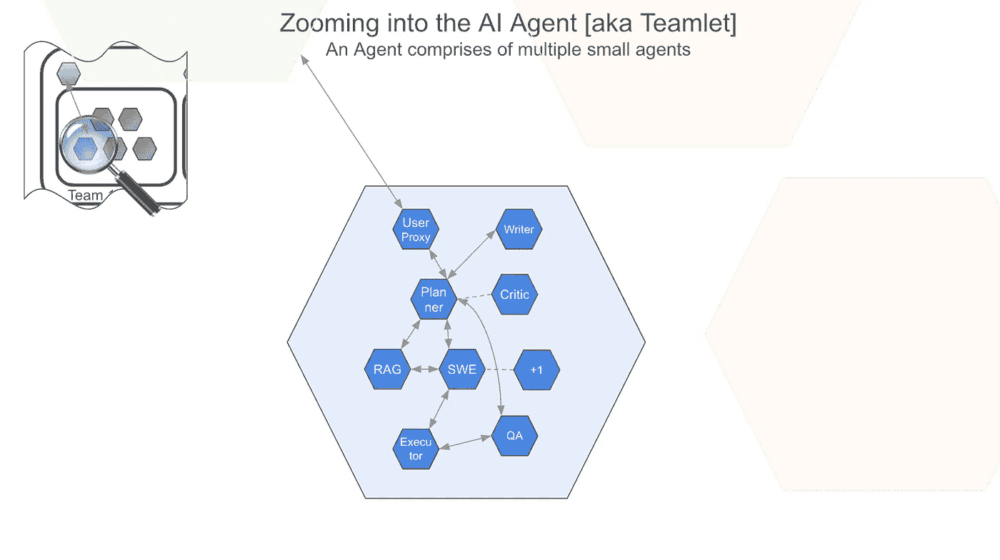

*来源：作者*

在团队中的代理可能具有以下特征和责任

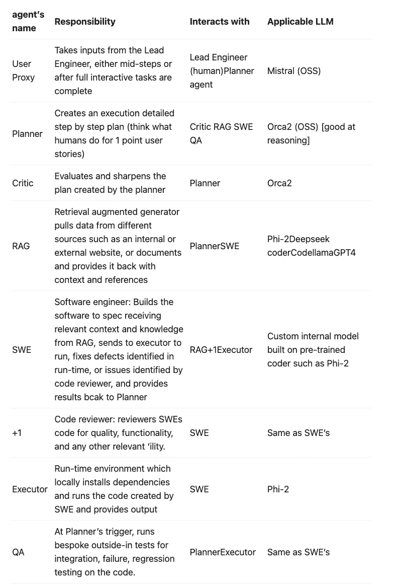

上述内容只是展示了完成人类工程师编码工作所需的交互和代理示例。它并不完整。例如，它缺少如何处理环境等内容。这可能需要一个完全独立的团队来做准备工作，才能让现有团队按照其指示步骤进行工作。此处的目标只是为了说明“代理”（Agent，带有大写字母“A”）的一般概念。

本阶段允许负责人微调各种多个代理的提示和角色。

以下是这些代理之间对话的示例，摘自其中一个 Autogen 参考示例[21]。

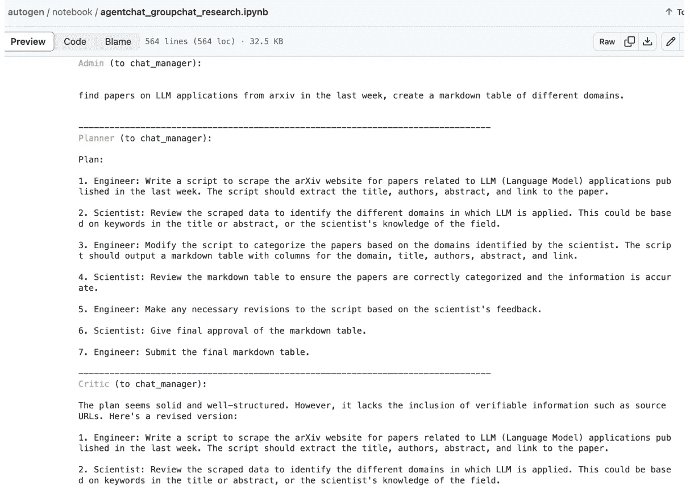

*来源：* *[25] Autogen：* [*多代理示例*](https://microsoft.github.io/autogen/docs/Examples) *展示了小型代理如何相互交流和批评，以产生更优的最终输出。*

# Phase 2a 的退出标准

当 AI-SWE 代理（团队）能够从看板上接收真实的编码用户故事并完成它们，最重要的是，拉取请求的质量已经达到了能够被主工程师一致批准并合并到主干的水平时，Phase 2a 可以被认为是成功的。

我们现在已经准备好将这些代理引入到其他领域。

# Phase 2b：将 AI 软件代理引入其他领域

本阶段更多的是对 Phase 2a 的重复和完善。不同之处在于将其他主工程师和架构师引入这种工作模式，并训练适合该领域的定制 LLM。例如，为客户支持技术团队创建的定制 LLM 编码器将需要针对不同的软件仓库、应用文档进行微调，甚至可能需要一组修改过的辅助功能（如果他们的软件工作流不同），而不是为例如财务技术团队创建的定制 LLM。

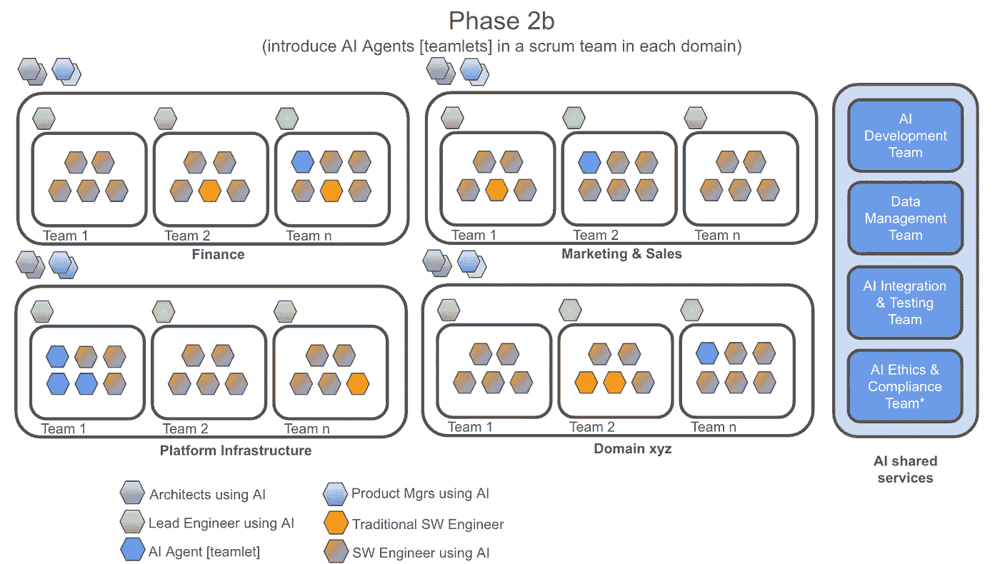

*来源：作者*

到此时，我们应该开始将多个 AI 代理引入到一个 Scrum 团队中，例如上图中平台基础设施领域的团队 1。这不仅有助于并行化（即代理同时在同一个迭代中从看板上处理多个用户故事），还可以提供不同职责的分离，例如一个代理完全负责环境创建和测试工具设置，而另一个则负责编写和部署代码到该环境中。

有趣的插曲：我的兄弟是《星际迷航》的忠实粉丝，他将这个概念与比纳尔种族[26]进行了对比。比纳尔种族以配对形式工作，彼此的思维相互连接，使他们能够快速高效地沟通。吉恩·罗登伯里一定会为 AI 代理正逐步实现他所设想的愿景而感到兴奋！

# Phase 2b 的退出标准

当每个适用领域至少有一个 AI 代理上线并成功从看板上提取用户故事，开始处理并更新工作管理系统时，第 2b 阶段可以视为完成。最重要的是，他们的拉取请求质量足够高，以至于始终获得首席工程师的批准并合并到主分支。

我们现在已经准备好进入第 3 阶段。

# 第 3a 阶段：将半自动化的 AI 团队引入一个领域

这是一个团队完全由 AI 软件工程代理组成的阶段。

从第 2 阶段到第 3 阶段的根本变化是，在这个阶段，团队开始处理完整的史诗任务（Epics），每个代理负责提取用户故事，并相互协调以完成工作。

另外，AI 完全开发软件的这一范式转变可能还会影响我们在软件中划分工作的方式（项目 -> 史诗 -> 用户故事 -> 任务）。请记住，当前的工作划分方式是为了适应以人为主导的软件开发。AI 驱动的开发的工作分解方式超出了本文的讨论范围，并将在未来几年内自然演变。为了便于理解（并且简化！），我们将在此继续使用传统的敏捷术语，如史诗和用户故事。

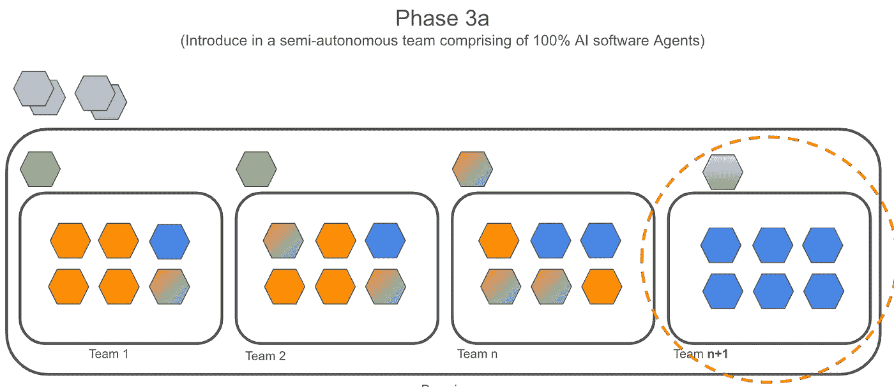

*来源：作者*

在此阶段，需要在各个代理（团队）之间建立更高层次的沟通，这可能意味着一个复合代理（团队）中的某个原子代理与另一个复合代理中的代理进行连接和交流。也可能意味着这些代理通过工作管理系统和问题看板（如 Github 问题）进行协作。这些细节并不重要。更重要的是，每个代理对于某些任务将拥有完全的自主权。这些角色可能包括：

+   软件开发代理（在第 2a 阶段详细介绍）

+   产品管理代理，负责编写和完善产品需求文档，并在人工产品经理的监督下规划产品路线图

+   负责面向客户文档、内部软件文档、全员大会展示幻灯片制作、IT 投资组合更新的技术写作代理

+   研究助理支持架构师和产品经理，协助进行关于业务能力、SWOT 分析等方面的外部研究。

+   操作支持代理，通过系统警报直接激活，或在触发时手动激活，并指向需要排查的故障

本质上，这些团队成为一个自给自足的单元，负责整个产品的端到端责任。需要注意的是，AI 代理角色的设计与人类的设计不同[27]，我们会留下一些灵活性，以便在通过初步尝试获得实证反馈后确定最优化的角色。

最近的研究[28]表明，编程、沟通和规划是 AI 软件工程师（AI-SWE）在纯软件开发领域逐渐变得更为擅长的领域。然而，要让人工智能在本阶段完成一些预期活动的自主执行，需借助生成性 AI 进行更高级的思维，称为系统 2 思维或慢思维[29]。截至本文写作时，我们尚未达到这个阶段，这意味着在操作故障排除或产品管理活动中，仍然需要人工协助和干预。

然而，预计在 2024 年这一领域会有突破，可能会在下半年实现[2]。尽管如此，大部分完整史诗的开发仍然应该可以通过现有的能力和大语言模型（LLM）定制来实现。

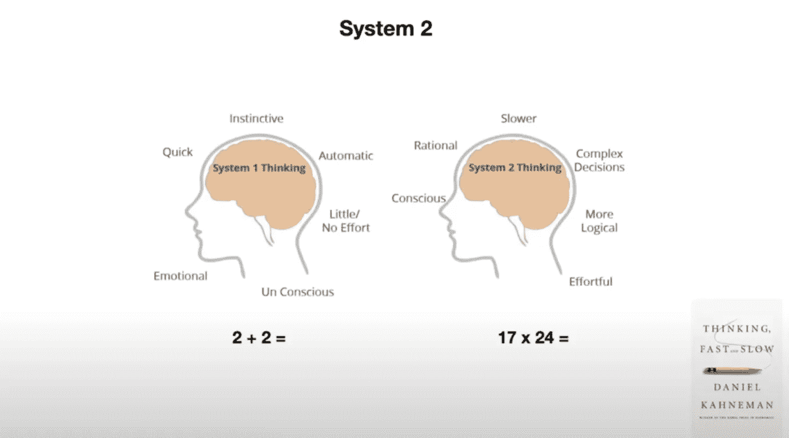

*来源：[2] Andrej Karpathy [1 小时讲座] 大型语言模型简介*

需要注意的一点是，人工智能在处理功能性需求方面表现出色，但在非功能性需求（NFRs）方面的能力（目前）还不够强大，这些非功能性需求包括性能、信任和规模[30]。为了确保组织的这些非功能性需求的基准确实按照规格开发，仍然需要人工干预。这可能仅仅意味着需要人工进行端到端的测试（当然，这些测试也通过 AI 代理开发并运行，但需要人工签字确认），也可能意味着需要人工驱动的软件增强来添加预期的非功能性需求能力。

# 阶段 3a 的退出标准

这一阶段需要一定的复杂度，距离完全确定退出标准还有些距离，但通常而言，成功的一个良好标尺是从需求到功能性解决方案的完整史诗能够在质量保证（QA）中运行。可能仍然需要人工验证非功能性需求（NFR）是否按照规格开发。

# 阶段 3b：将 AI 团队扩展到其他领域

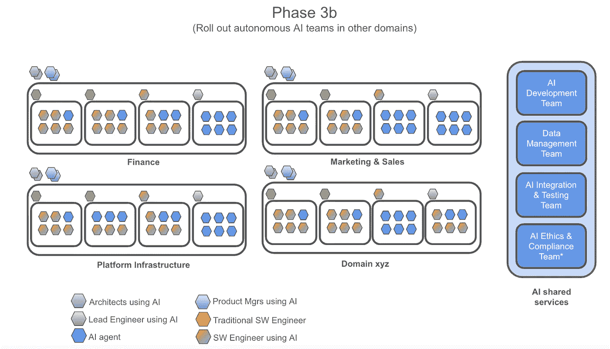

*来源：作者*

在从一个领域的 AI 团队中汲取经验教训的基础上，本阶段将自主 AI 团队引入其他领域。这也开始将一些高级工程师提升到团队领导者的层级，以便扩大团队规模。

这里没有展示的一个方面，但值得一提的是，需要一个端到端的质量保证团队（应该是 AI 和人类工程师的混合团队）。端到端的质量保证非常重要，因为这些 AI 团队可能是根据不同史诗的用户验收标准进行开发，但当所有这些在发布前汇集时，整体体验仍然需要进行验证和集成测试。这也包括性能测试的需求。最终，当相关能力得到足够发展的时候，QA 职能也可以被训练成大型语言模型（LLM），但我预见到这一点可能会发生在软件开发职能之后，主要是因为其相互依赖性的复杂性。尽管如此，这并不排除 QA 职能在早期阶段大量利用 AI 代理来评估、编写和部署自动化测试以及自动化报告。

# 第三阶段退出标准

这一阶段的退出标准出乎意料的简单：一个关键规模（由高层领导决定的 80-100%）的功能性 AI 团队已经被部署并开始在每个领域做出贡献，且**开始能够观察到变更的提前时间有了明显的差异**。

# 稳态（阶段 n）：扩展 AI 团队，去中心化 AI 共享服务

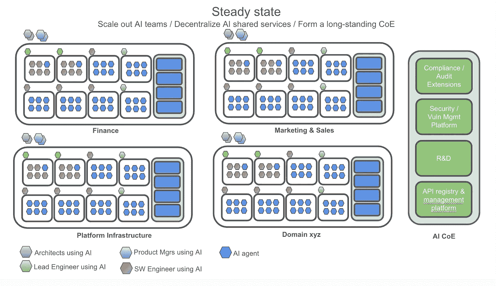

*来源：作者*

**扩展 AI 团队**

到这时，各个领域已经开始适应 AI 团队的工作质量，越来越多的实操软件工程师开始被提升，并且成为自己 AI 团队的领导，或者**AI 工程师[16]**。虽然我展示的每个 AI 团队只映射一个人类工程师，但没有理由不能由同一个人类工程师管理多个团队。速度的瓶颈自然会转移到这些人类 AI 工程师身上，但到那时，公司的变更提前时间应该已经大幅减少。这些 AI 工程师需要专注的技能仍然会有一些软件方面的内容，因为他们仍然需要审核和批准各种 AI 代理发送的拉取请求，审核他们创建的文档等等。然而，所有人类工程师都需要专注于第“优秀工程师无所畏惧”章节中提到的独特人类技能。

请注意，总是需要少数由人类驱动的软件团队。这些团队会是更高层次的职能，他们的工作将是为领域提供安全网。如前所述，这一职能的一个好例子是确保非功能性需求（NFR）按规格交付，但也会有其他 AI 的不足之处浮现出来。重要的是要记录这些问题，并与领域的 AI 开发团队分享，以便未来版本的领域自定义 LLM 能够更为优越。

**去中心化 AI 共享服务：**

当技术和产品开始成熟时，我的经验是共享服务团队往往会成为速度的瓶颈。因此，在稳定状态下，所有组织必须计划将任何 AI 共享服务团队分散到各个领域。这意味着每个领域都要建立本地的能力，定制自己的 AI 大语言模型（LLM），策划训练数据，并维护适合自身的定制集成。

共享服务团队开始转变为卓越中心（CoE）组织，负责那些始终需要横向支持且如果保持标准化会更好的服务。这包括一些常见的集成。例如，所有领域将继续需要其 AI 代理能够与 IT CI/CD 管道团队集成，或与 Github、sonarQube 以及像 Jira、Asana、BaseCamp 等工作管理系统进行交互。

由于 IT 系统始终可以进行审计，卓越中心（CoE）可以创建并维护扩展包，供各个团队插入并生成审计报告（即前共享服务团队的道德与合规团队的迭代）。

有研究表明，开发人员在编写代码时，如果得到 AI 的帮助，往往会写出不太安全的代码，而且更令人担忧的是，他们对代码的安全性过于乐观[31]。这一问题可能会在完全由 AI 驱动的团队中变得更加严重。这就是为什么保持**中央**代码质量和库选择检查非常重要的原因。这可能需要卓越中心（CoE）创建自己的哨兵软件，能够跟踪跨领域的安全代码和基础设施，同时自动跟踪和添加这些团队待办事项，并在中央报告整体安全状况。如果公司已经有一个强大且人员充足的中央安全组织，拥有自己的软件工程师并且深度参与 IT 工作，那么就没有理由不能由该组织来执行这一职能。

**应用架构**如果不是可组合的、事件驱动的，也可能成为速度的瓶颈。这个问题需要注意，如果 Phase 0 评估完成得公正的话，这个问题应该已经在每个应用的评分和优先级设置中被发现。

# 反驳论点

这里有个“小插曲”。在我写这篇文章时，我请 chatGPT 持反对立场，解释一下如果减少对人类驱动的软件工程的依赖会带来哪些问题。下面是我简化的反馈，实际上帮助我完善了我的提议阶段，例如将人类工程师的水平提升到一个更高但更加关键的层级，并且让一个由每个现有工程师领导的自治团队来运行。

以下是 chatGPT 的反驳论点，以及我对每个论点的逐一回应：

下面是一些需要考虑的反驳观点：

**1\. 复杂问题解决与创造力：**

- 人类开发者在创造性解决问题和应对新情况方面表现出色。AI 虽然擅长处理日常任务，但在处理需要创新思维的独特或复杂问题时可能会遇到困难。

- 设计和创新中的创造力是人类特有的特质，AI 无法完全复制，特别是在需要情感智能和理解人类经验的领域。

*我的回应：有道理。这让我思考如何提升现有工程师的水平，并将他们安排在能激发更多创造力和创新思维的组织中。这通常发生在你更接近客户的时候，这也是担任技术负责人角色时的情况（见稳定状态：第 n 阶段）。*

**2\. 代码质量和维护**

- AI 生成的代码可能缺乏经验丰富的人工开发者所带来的细致理解，可能导致可维护性、可扩展性和性能方面的问题。

- 人类监督对于确保代码质量至关重要，尤其是在复杂系统中，理解更广泛的背景非常重要。

*我的回应：我也在考虑这个问题，因为我引用的各篇论文都表明了 AI 软件工程在非功能性需求方面的弱点。这也是为什么即使在稳定状态下，我还是选择保留一些实际的人类工程团队，以确保软件的信任性、操作韧性和性能等方面得以考虑。*

**3\. 伦理和社会影响：**

- 用 AI 替代人类工作者引发了重大的伦理问题，包括对就业的影响以及减少人类劳动力的广泛社会影响。

- 有失去多年来积累的宝贵人类技能和知识的风险，这些是 AI 难以轻易接管的。

*我的回应：我已经考虑到这一点。尽管我预见到 IT 组织的增长速度可能会放缓，但现有工程师将被重新安排从事更高阶的工作，这将确保有意义的就业机会，并让他们能够更好地接触到高层领导和业务层面。当然，这意味着现有工程师必须提升那些传统上属于产品管理的技能，而产品经理则需要适应领导 AI 团队和框架。*

**4\. 缺乏适应性和直觉：**

- 即使是先进的 AI 系统，也可能无法很好地适应快速变化的环境或需求，这在软件开发中是常见的情况。

- 人类能够直观地应对模糊或定义不清的问题，这是 AI 目前所缺乏的能力。

*我的回应：没错，这也是为什么每个 AI 软件工程团队都有一名人类工程师来引导的原因。AI 软件工程仍然需要明确的低层次指令和调整，因为应用程序另一端的接口仍然是人类，只有另一个人类才能与之产生共鸣。*

**5\. 安全性、可靠性、监管和合规问题：**

- AI 系统可能容易受到特定类型的故障、偏见和安全问题的影响，这些问题与人类团队面临的不同。

- 在关键开发任务中依赖 AI 可能会在 AI 行为不可预测或发生错误时带来风险。

- AI 系统可能无法完全处理软件开发中的法律和合规问题，而这些问题通常需要人类的判断和对法律的理解。

- 在某些行业或地区，可能会存在关于在关键开发岗位使用 AI 的监管挑战或限制。

*我的回应：好的观点。这让我在工程团队下新增了一个关于安全性和合规性的责任，即使在稳定状态下也是如此。在阅读关于某些行业（或地区）面临的监管挑战后，我确实在文章中加上了一个警告，说明 AI-SWE 模型可能不适用于这些行业，并且在开发中使用 AI 可能需要更加严格的控制方式。*

**6\. 沟通与协作：**

- 有效的软件开发通常需要与利益相关者进行细致的沟通与协作，这是人类团队天生更擅长的领域。

- 理解客户需求、体察终端用户的问题以及协商需求是需要人类互动的关键领域。

*我的回应：同意，这就是为什么 AI 工程师和产品经理都会参与，与人类利益相关者处理沟通方面的事务。*

**7\. 过渡和维护成本：**

- 开发、训练和集成 AI 系统以用于软件开发的初始投资可能是相当大的。

- 为了保持 AI 系统的有效性，持续的维护、更新和训练也可能带来显著的成本。

*我的回应：我能理解 GPT4 可能认为我会在内部做预训练部分，这是一个错误的假设。我依赖的是使用现有的预训练基础模型，针对内部 IT 软件代码库进行微调。*

**9\. 理解范围有限：**

- 即使 AI 具有先进的能力，它可能也无法像人类一样完全理解商业背景或市场和用户需求的细微差别。

- AI 解决方案可能过于局限，错过了人类开发人员通常考虑的大局。

*我的回应：同意，这就是为什么 AI 工程师仍然在最终阶段领导 AI-SWE 团队。*

**10\. 过度依赖的风险：**

- 过度依赖 AI 可能导致组织内部人类专业知识的下降，使其在面对 AI 故障或局限时更加脆弱。

*我的回应：这是正确的，我同意这个观点。然而，这是整个软件行业将面临的一个更普遍的风险。目前我不确定我们如何避免这种情况。简而言之，我认为没有人能回答这个问题，但我猜我们将在接下来的几年中一起找到答案 :)*

# 优秀的工程师没有什么可担心的

首先，让我们正面解决**恐惧**的话题。从关于软件工程师对 AI 感情的社交媒体研究[30]中可以清楚看出，恐惧是开发人员中最主导的情绪。认识到这一点非常重要。

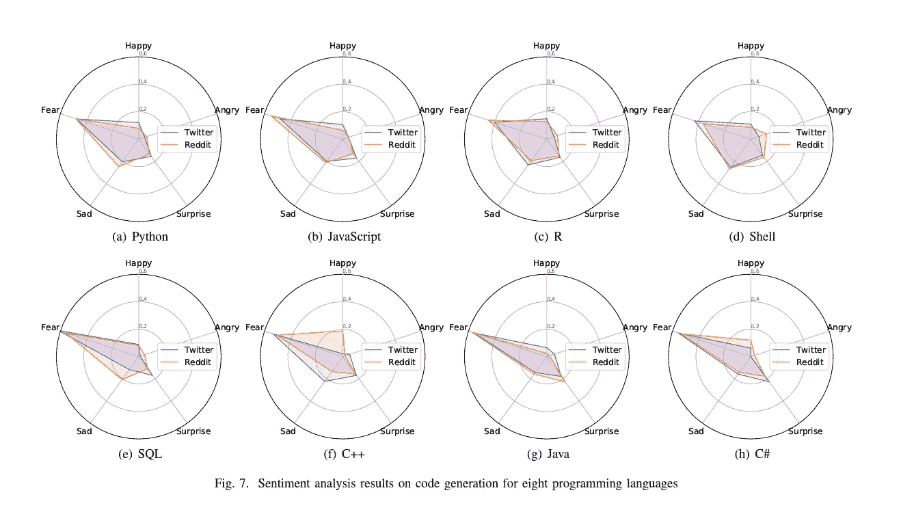

*来源：[30] Feng 等人，《调查 Chat-GPT 在众包社交数据中的代码生成性能》*

与此同时，让我们退后一步，看看优秀软件工程师所具备的完整技能集[32]

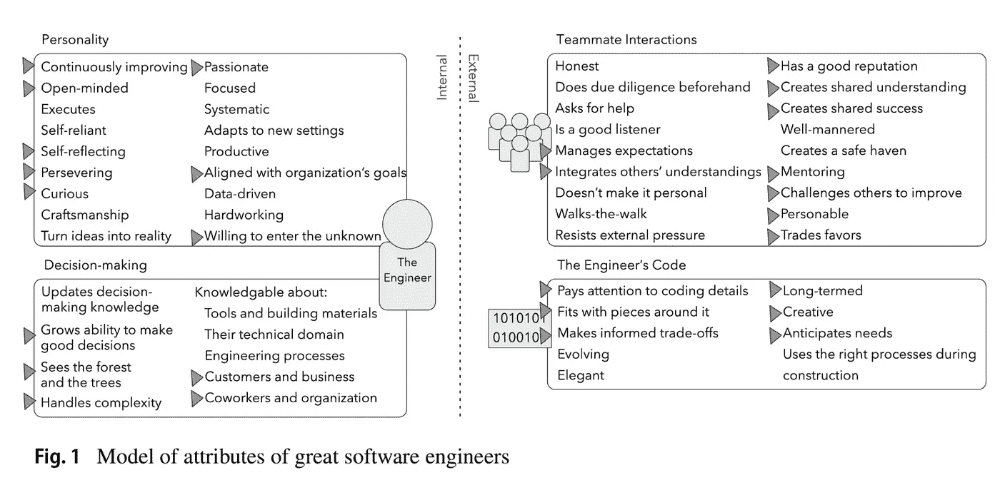

*来源：[32] Li 等人，《什么区分优秀的软件工程师》，作者标注以突出能够抵御 AI 变革的技能。*

在关于优秀软件工程师特质的多项研究总结中，可以看到，编程能力只是这些优秀工程师特质的一个子集。如果你看上面的图表，我用灰色箭头标出了所有 AI 代理无论多么先进都无法模仿的领域。依我看，这些是所有软件工程师应该有意识地磨炼和完善的不可模仿的技能，它们将是区分他们并使他们在新的 AI-SWE 变革中保持价值的关键。实际上，这些正是我在上面所描述的 AI 驱动 IT 企业的稳定阶段中将被突出和需求的技能。

# 结论 — 风暴即将来临，你准备好了吗？

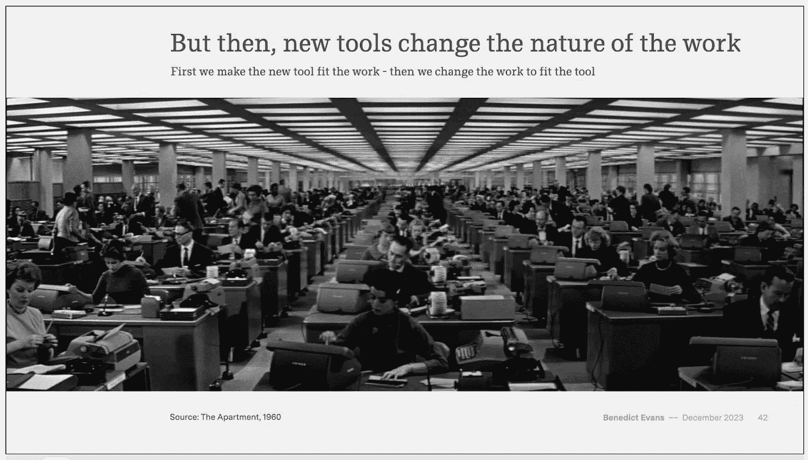

*来源：[33] Ben Evans：《AI 与其他一切》，Slush 大会，赫尔辛基 2023 年 12 月*

我在科技行业已经工作了超过 20 年，见证了许多技术泡沫的兴起与破裂、基础设施的变革（从本地部署到云计算）以及流程的变化（从瀑布式到敏捷）。我可以说，我们现在所见到的，必定是软件行业有史以来最大的海啸。但不要仅仅听我说，看看比尔·盖茨怎么说[34]。进入软件技术开发的门槛将被抹去，从创意到市场的周期将缩短，以前连同一个层次都无法比较的公司将开始竞争，而新兴灵活的公司将崛起，威胁到伟大的传统企业。我们当中许多人在这些现有的大公司工作，有些人甚至身居高位，可以影响公司的方向。或许其中一些成功的公司，甚至在危机临近时都未曾意识到，直到为时已晚。我想，一些公司会感知到变化的到来，但它们更愿意待在现有状态的舒适区中。

而这正是机会所在。少数几家公司将积极采取行动，将自身定位为脱颖而出的领头羊，并且当变化开始加速时，它们将处于**主导**地位。这些公司将是伟大的公司。它们将超越所有其他公司，当尘埃落定、烟雾散去时，它们将比以往任何时候都更强大。

*这些内容包含了我的个人观点，并不代表我的雇主的官方立场。*

# 参考文献

1.  Hailin Chen Caiming Xiong 等人. [ChatGPT 一周年：开源 LLM 是否赶上来了？](https://arxiv.org/pdf/2311.16989.pdf)

1.  Andrej Karpathy [[1 小时讲座] 大型语言模型介绍](https://youtu.be/zjkBMFhNj_g?t=1072)（标注在“创建 LLM 的阶段”）

1.  Microsoft — [Phi2: 小型语言模型的惊人力量](https://www.microsoft.com/en-us/research/blog/phi-2-the-surprising-power-of-small-language-models/)（高效能编码器基础模型）

1.  Eric Hartford [认识萨曼莎](https://huggingface.co/) — 向具备意识的人工智能迈出的第一步

1.  Meditron]([`ollama.ai/library/meditron`](https://ollama.ai/library/meditron)) — 从 Llama 2 适配到医学领域的开源医学大型语言模型。

1.  Erik Nijkamp, Donald Rose — [与 CodeGen 一起进行对话式 AI 编程：让 AI 为你写代码](https://blog.salesforceairesearch.com/codegen/)

1.  Eldan 等人 — TinyStories: [语言模型可以小到什么程度，仍然能够流利地讲英语？](https://arxiv.org/abs/2305.07759)

1.  Gunasekar 等人 — [教科书就是你所需要的一切](https://www.microsoft.com/en-us/research/blog/phi-2-the-surprising-power-of-small-language-models/)

1.  Duan 等人 — BotChat: [评估 LLM 进行多轮对话的能力](https://arxiv.org/abs/2310.13650)

1.  ChatDev: [易用的基于 LLM 的集体智能框架。](https://github.com/OpenBMB/ChatDev)

1.  MetaGPT: [给定一行需求，返回 PRD、设计、任务、代码库](https://github.com/geekan/MetaGPT)

1.  Autogen (由微软提供): [启用下一代大型语言模型应用](https://github.com/microsoft/autogen)

1.  Crew AI: [协调角色扮演的框架，自动化 AI 代理](https://github.com/joaomdmoura/crewAI)

1.  Oliver Morris: [AI 能与自身合作为我们谋取利益吗？](https://medium.com/@olimoz/the-collaboration-code-from-ai-solo-act-to-symphony-303d975832fe)

1.  Waseem et al: [软件开发中的自主代理：愿景论文](https://arxiv.org/abs/2311.18440)

1.  Swyx: [AI 工程师的崛起](https://www.latent.space/p/ai-engineer)

1.  Douvantziz: [使用 AI 自动完成编码——Copilot 如何评估？](https://nordcloud.com/tech-community/coding-copilot-ai-autocompletion/)

1.  Chelsea Troy — 她文章中特别提到的上下文丧失问题：[减少技术债务](https://chelseatroy.com/2021/01/21/reducing-technical-debt/)

1.  Autogpt: [将你的代理调优到完美](https://github.com/Significant-Gravitas/AutoGPT)

1.  Feng et al, [Codebert：一个用于编程和自然语言的预训练模型](https://arxiv.org/abs/2002.08155)

1.  Autogen: [RAG 示例：教授代理使用新软件库来完成编码任务](https://github.com/microsoft/autogen/blob/main/notebook/agentchat_groupchat_RAG.ipynb)

1.  DC Palter: [经验丰富的创始人知道的 7 件事，首次创始人错过的事情](https://entrepreneurshandbook.co/7-things-experienced-founders-know-that-1st-time-founders-miss-6f0e919a751c)

1.  Sobania et al. [ChatGPT 自动修复 Bug 性能分析](https://arxiv.org/abs/2301.08653)

1.  Tian et al [ChatGPT 是终极编程助手吗——它有多远？](https://arxiv.org/abs/2304.11938)

1.  Autogen : [多代理示例](https://microsoft.github.io/autogen/docs/Examples)

1.  Fandom : [星际迷航中的 Bynar 族](https://memory-alpha.fandom.com/wiki/Bynar)

1.  Oliver Morris , [AI 团队能有多专业](https://medium.com/@olimoz/how-professional-can-agentic-ai-teams-get-a75ffe5a0083)

1.  H Hörnemalm, A. (2023). [ChatGPT 作为软件开发工具：开发的未来](https://urn.kb.se/resolve?urn=urn%3Anbn%3Ase%3Aumu%3Adiva-209909)

1.  Kahneman, [思考，快与慢](https://www.amazon.com/Thinking-Fast-Slow-Daniel-Kahneman/dp/0374533555)

1.  Feng et al , [基于众包社交数据调查 ChatGPT 代码生成性能](https://yunhefeng.me/material/COMPSAC___SETA_23.pdf)

1.  Perry et al, [用户使用 AI 助手时会编写更多不安全的代码吗？](https://arxiv.org/abs/2211.03622)

1.  Li et al, [什么区别了优秀的软件工程师？实证软件工程](https://faculty.washington.edu/ajko/papers/Li2019WhatDistinguishesEngineers.pdf)

1.  Ben Evans: [人工智能与其他一切，Slush 大会，赫尔辛基 2023 年 12 月](https://www.ben-evans.com/presentations)

1.  Bill Gates: [人工智能时代已经开始](https://www.gatesnotes.com/The-Age-of-AI-Has-Begun)

# 术语表

+   AI 代理：由多个 AI 代理协作工作的 AI 代理超集

+   AI 代理：由通用或专用的大型语言模型支持的代理

+   AI Teamlet：与 AI 代理相同

+   AI-SWE：由 AI 驱动的软件工程：由 AI 代理和 AI 团队编写、调试、构建和部署的软件

+   CI/CD：持续集成与持续交付

+   CoE：卓越中心

+   CRM：客户关系管理系统

+   H-SWE：以人为驱动的软件工程：由人类编写、调试、构建和部署的软件

+   MVP：最小可行产品

+   OSS：开源软件

+   RAG：检索增强生成

+   SDLC：软件开发生命周期
