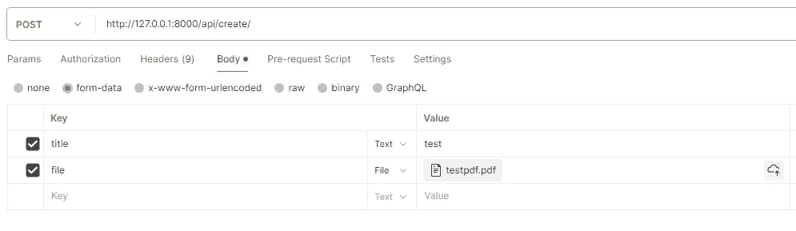
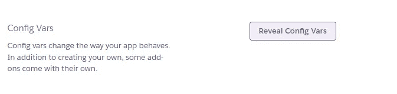
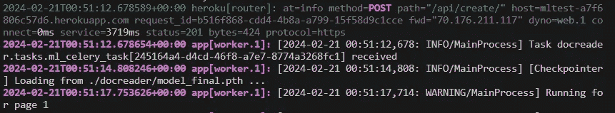

# 设计与部署机器学习 Python 应用程序（第二部分）

> 原文：[`towardsdatascience.com/designing-and-deploying-a-machine-learning-python-application-part-2-99eb37787b2b?source=collection_archive---------4-----------------------#2024-02-24`](https://towardsdatascience.com/designing-and-deploying-a-machine-learning-python-application-part-2-99eb37787b2b?source=collection_archive---------4-----------------------#2024-02-24)

## 你不需要是 Atlas 就能将你的模型部署到云端

[](https://medium.com/@noahhaglund?source=post_page---byline--99eb37787b2b--------------------------------)[](https://towardsdatascience.com/?source=post_page---byline--99eb37787b2b--------------------------------) [Noah Haglund](https://medium.com/@noahhaglund?source=post_page---byline--99eb37787b2b--------------------------------)

·发表于 [Towards Data Science](https://towardsdatascience.com/?source=post_page---byline--99eb37787b2b--------------------------------) ·阅读时间 16 分钟 ·2024 年 2 月 24 日

--


图像来自 Midjourney

现在我们已经有了训练好的 Detectron2 模型（[请参见第一部分](https://medium.com/towards-data-science/training-and-deploying-a-custom-detectron2-model-for-object-detection-using-pdf-documents-part-1-c724f61d8b4b)），让我们将其作为应用程序的一部分进行部署，以便向他人提供推理能力。

即使本系列的第一部分和第二部分使用 Detectron2 进行物体检测，无论你使用的是哪种机器学习库（*Detectron、Yolo、PyTorch、Tensorflow 等*），无论你的使用场景是（*计算机视觉、自然语言处理、深度学习 等*），这里讨论的关于模型部署的各种话题对于所有开发机器学习过程的人都将有所帮助。

尽管数据科学和计算机科学在许多方面有所重叠，但训练和部署机器学习模型将两者结合起来，因为那些致力于开发高效准确模型的人通常并不是负责部署模型的人，反之亦然。另一方面，偏向计算机科学的人可能对机器学习或相关库的了解不足，无法判断是否可以通过对机器学习过程的配置来解决应用瓶颈，还是需要通过后端和托管服务来解决。

为了帮助你部署一个利用 ML 的应用，本文将首先讨论：（1）可以帮助数据科学人员做决策的高层计算机科学设计概念，以平衡负载并缓解瓶颈；（2）低层设计，讲解如何通过使用 Python Web 框架 Django、Django Rest Framework API、分布式任务队列 Celery、Docker、Heroku 和 AWS S3 来部署 Detectron2 推理过程。

跟随本文的学习，提前具备以下知识将会有所帮助：

+   扎实的 Python 知识

+   对 Django、Django Rest Framework、Docker、Celery 和 AWS 的理解

+   熟悉 Heroku

# 高层设计

为了深入探讨高层设计，让我们讨论一些关键问题和潜在解决方案。

## 问题 1：内存

从[第一部分](https://medium.com/towards-data-science/training-and-deploying-a-custom-detectron2-model-for-object-detection-using-pdf-documents-part-1-c724f61d8b4b)保存的机器学习模型，命名为 model_final.pth，起始大小为大约 325MB。此外，基于（1）Python 运行时、（2）Detectron2、（3）大型依赖项如 Torch 和（4）Django Web 框架的应用程序在部署时将使用约 150MB 的内存。

> 因此，至少我们一开始就需要大约 475MB 的内存。

我们可以仅在机器学习（ML）过程需要运行时加载 Detectron2 模型，但这仍然意味着我们的应用最终会占用约 475MB 的内存。如果你的预算有限，并且无法垂直扩展应用程序，那么内存就会成为许多托管平台上的一个重要限制。例如，Heroku 提供了名为“dynos”的容器来运行应用程序，基础支付计划的 dynos 起始内存为 512MB，当内存超过 512MB 时，会开始写入磁盘，并且当内存使用达到 250%（1280MB）时，dyno 会崩溃并重启。

关于内存，Detectron2 推理将根据图像中检测到的物体数量引发内存使用的波动，因此确保在此过程中内存可用非常重要。

对于那些想加速推理，但又担心内存限制的人，批量推理在这里也无济于事。[正如 Detectron2 仓库中的一位贡献者所指出的](https://github.com/facebookresearch/detectron2/issues/1539)，使用批量推理时：

> N 张图像所需的内存是 1 张图像的 N 倍……你可以改为在循环中逐张预测 N 张图像。

总的来说，这总结了**问题 #1**：

> 将长时间运行的 ML 过程作为应用的一部分，通常会非常占用内存，因为模型的大小、ML 依赖项以及推理过程都需要大量内存。

## 问题 2：时间

集成 ML 的部署应用程序可能需要设计成能够管理长期运行的过程。

以使用 Detectron2 的应用程序为例，模型会接收一张图像作为输入并输出推理坐标。对于一张图像，推理可能只需几秒钟，但假设我们正在处理一个包含每页一张图像的长 PDF 文档（如[第一部分](https://medium.com/towards-data-science/training-and-deploying-a-custom-detectron2-model-for-object-detection-using-pdf-documents-part-1-c724f61d8b4b)中的训练数据），这可能会需要一些时间。

在这个过程中，Detectron2 推理将是 CPU 或 GPU 限制的，具体取决于你的配置。请查看下面的 Python 代码块以进行更改（推理完全可以使用 CPU，但正如[第一部分](https://medium.com/towards-data-science/training-and-deploying-a-custom-detectron2-model-for-object-detection-using-pdf-documents-part-1-c724f61d8b4b)中提到的，训练需要 GPU/Cuda）：

```py
from detectron2.config import get_cfg
cfg = get_cfg()
cfg.MODEL.DEVICE = "cpu" #or "cuda"
```

此外，推理后保存图像，比如保存到 AWS S3，将引入 I/O 限制的进程。总体而言，这可能会堵塞后端，进而引发**问题 #2**：

> 单线程的 Python 应用程序在运行某个进程时，不会同时处理额外的 HTTP 请求，无论是并发请求还是其他类型的请求。

## 问题 3：扩展性

在考虑 Python 应用程序的水平可扩展性时，必须注意，Python（假设它是通过 CPython 编译/解释的）受限于全局解释器锁（GIL），这意味着它[只允许一个线程持有 Python 解释器的控制权](https://realpython.com/python-gil/)。因此，Python 不完全适用多线程范式，虽然应用程序可以实现多线程，使用如 Gunicorn 等 Web 服务器，但它们是并发执行的，这意味着线程并不是并行运行的。

我知道这一切听起来相当抽象，尤其是对于数据科学领域的朋友们，所以下面我会提供一个示例来说明这个问题。

你就是你的应用程序，现在你的硬件——大脑——正在处理两个请求，清理柜台和在手机上发短信。你有两只手来完成这两项任务，现在你就像一个多线程的 Python 应用程序，正在同时做这两件事。但实际上，你并不是在*确切*的同一时刻考虑两件事，而是先开始清理动作，然后把注意力转移到手机上看你正在输入的内容，再看回柜台，确保没有漏掉任何地方。

> 实际上，你正在并发地处理这些任务。

GIL 的工作原理是一样的，每次处理一个线程，但通过在它们之间切换来实现并发。这意味着多线程处理 Python 应用程序仍然对运行后台任务或 I/O 密集型任务（例如下载文件）有用，而主执行线程仍在运行。用前面的类比来说，清理台面的后台任务（即下载文件）仍在进行，而你在考虑发短信时，但你仍然需要将焦点转回到清洁的手上，以便处理下一步。

这种“焦点的变化”在同时处理多个请求时可能看起来并不是什么大问题，但当你需要同时处理数百个请求时，突然之间，这就成为了大规模应用程序的一个限制因素，因为它们需要对终端用户保持足够的响应能力。

因此，我们有问题 #3：

> GIL 阻止了多线程成为 Python 应用程序的良好扩展解决方案。

## 解决方案

现在我们已经识别出了关键问题，让我们来讨论一些潜在的解决方案。

前面提到的问题按重要性排序，因为我们首先需要管理内存（问题 #1），确保应用程序不会崩溃，然后为应用程序留出空间以便一次处理多个请求（问题 #2），同时仍确保我们在大规模下处理多个请求的方式是有效的（问题 #3）。

那么，让我们直接开始解决问题 #1。

根据托管平台的不同，我们需要充分了解可用的配置，以便进行扩展。由于我们将使用 Heroku，欢迎查看关于 [dyno 扩展](https://devcenter.heroku.com/articles/scaling)的指南。在不需要垂直扩展 dyno 的情况下，*我们可以通过添加另一个* [*进程*](https://devcenter.heroku.com/articles/process-model) 来进行扩展。例如，在 [Basic dyno 类型](https://devcenter.heroku.com/articles/dyno-types)中，开发者可以在同一个 dyno 上部署 web 进程和 worker 进程。这种做法有几个好处：

+   这使得多进程处理成为可能。

+   现在，dyno 资源被复制了，这意味着每个进程都有一个 512MB 的内存阈值。

+   在成本方面，每个进程每月费用为 7 美元（所以如果有一个 web 进程和一个 worker 进程，则每月为 14 美元）。比起垂直扩展 dyno 来增加内存要便宜得多，如果你想将 512MB 的内存分配扩展到 1024MB，单个 dyno 每月需要 50 美元。

回到前面关于清洁台面和发短信的类比，与其通过为身体添加额外的手臂来让自己更复杂，不如让两个人（并行多进程）来执行这些独立的任务。我们通过增加工作负载的多样性来扩展，而不是通过扩展单一的进程，从而为我们节省了开支。

好的，但是有两个独立的进程，那它们之间有什么区别呢？

使用 Django 时，我们的 web 进程将会初始化为：

```py
python manage.py runserver
```

并且使用分布式任务队列（如 Celery），worker 将使用以下方式初始化：

```py
celery -A <DJANGO_APP_NAME_HERE> worker
```

[Heroku 的设计理念](https://devcenter.heroku.com/articles/process-model#mapping-the-unix-process-model-to-web-apps)中，web 进程是我们核心 web 框架的服务器，而 worker 进程则用于处理队列库、定时任务或其他在后台执行的工作。两者都代表已部署应用的实例，因此，考虑到核心依赖和运行时，内存占用大约为 ~150MB。然而，我们可以确保只有 worker 进程运行机器学习任务，从而避免 web 进程占用 ~325MB 以上的内存。这有多个好处：

+   内存使用量，尽管对于 worker 进程仍然较高，但将分配到系统外的节点，从而确保在执行机器学习任务时遇到的任何问题可以被单独处理和监控，避免影响 web 进程。这有助于缓解问题 #1。

+   新发现的并行处理方法确保了 web 进程在执行长时间运行的机器学习任务时仍能响应请求，帮助解决问题 #2。

+   我们通过实现多进程的方式来为扩展做准备，帮助解决问题 #3。

由于我们还没有完全解决关键问题，让我们再深入探讨一下，在进入低层次的细节之前。[Heroku 如是说](https://devcenter.heroku.com/articles/python-gunicorn)：

> 同时处理传入 HTTP 请求的 web 应用比一次只处理一个请求的 web 应用更加高效地利用 dyno 资源。因此，我们建议在开发和运行生产服务时使用支持并发请求处理的 web 服务器。
> 
> Django 和 Flask web 框架内置了便捷的 web 服务器，但这些阻塞型服务器每次只能处理一个请求。如果你在 Heroku 上使用这些服务器部署，dyno 资源将得不到充分利用，应用程序也会显得不响应。

我们通过利用 worker 的多进程来处理机器学习任务，已经领先一步，但可以进一步通过使用 Gunicorn 来优化：

> [Gunicorn](https://gunicorn.org/) 是一个纯 Python 的 HTTP 服务器，专为 WSGI 应用设计。它允许你通过在单个 dyno 中运行多个 Python 进程并发地运行任何 Python 应用。它提供了性能、灵活性和配置简便性之间的完美平衡。

好的，很棒，现在我们可以利用更多的进程，但有一个问题：每一个新的 Gunicorn worker 进程都将代表一个应用副本，这意味着它们将使用基础 ~150MB 的内存*，此外还会使用 Heroku 进程的内存。比如说，如果我们通过 `pip install gunicorn` 安装并使用以下命令初始化 Heroku web 进程：

```py
gunicorn <DJANGO_APP_NAME_HERE>.wsgi:application --workers=2 --bind=0.0.0.0:$PORT
```

Web 进程的基本 ~150MB 内存将变成 ~300MB 内存（基础内存使用量乘以 Gunicorn worker 数量）。

在谨慎考虑 Python 应用程序多线程的限制下，我们也可以通过以下方式为工作线程添加线程：

```py
gunicorn <DJANGO_APP_NAME_HERE>.wsgi:application --threads=2 --worker-class=gthread --bind=0.0.0.0:$PORT
```

即使是在问题 #3 中，我们仍然可以找到使用线程的方式，因为我们希望确保我们的网络进程能够同时处理多个请求，同时注意应用程序的内存占用。在这里，我们的线程可以处理微小的请求，同时确保机器学习任务在其他地方进行分发。

无论是哪种方式，通过利用 Gunicorn 工作进程、线程或两者结合，我们都在为我们的 Python 应用程序配置处理多个请求的能力。我们通过采用多种方式实现并发和/或并行任务处理，基本上解决了问题 #2，同时确保应用程序的关键机器学习任务不依赖于潜在的陷阱，比如多线程，从而为扩展做好准备，并深入解决问题 #3。

好的，那么那个棘手的問題 #1 呢？归根结底，机器学习过程通常会以某种方式消耗硬件资源，无论是内存、CPU 还是 GPU。*然而*，通过使用分布式系统，我们的机器学习任务与主要的 web 进程紧密相连，但通过 Celery 工作线程并行处理。我们可以通过选择的 Celery [代理](https://docs.celeryq.dev/en/3.1/getting-started/brokers/index.html) 跟踪机器学习任务的开始和结束，并以更加隔离的方式查看度量数据。在这里，Celery 和 Heroku 工作进程的配置由你决定，但这是将一个长时间运行、内存密集型的机器学习任务集成到应用程序中的一个非常好的起点。

# 低级设计和设置

现在我们已经有机会深入了解并大致了解我们正在构建的系统，接下来让我们把它整合起来，聚焦于具体细节。

为了方便你，[这里是我将在本节中提到的代码库](https://github.com/nzh2534/mltutorial/tree/main)。

首先，我们将从设置 Django 和 Django Rest Framework 开始，安装指南分别可以在 [这里](https://docs.djangoproject.com/en/5.0/intro/install/) 和 [这里](https://www.django-rest-framework.org/#installation) 找到。该应用程序的所有需求可以在代码库的 requirements.txt 文件中找到（同时，Detectron2 和 Torch 将从 Dockerfile 中指定的 Python wheel 构建，以保持 Docker 镜像的体积较小）。

接下来的部分将是设置 Django 应用程序，配置后端以保存到 AWS S3，并使用 DRF 暴露端点，所以如果你已经熟悉这部分内容，可以跳过并直接进入 *机器学习任务设置与部署* 部分。

## Django 设置

继续创建一个文件夹用于 Django 项目并进入该目录。激活您正在使用的虚拟环境/conda 环境，确保按照 [第一部分](https://medium.com/towards-data-science/training-and-deploying-a-custom-detectron2-model-for-object-detection-using-pdf-documents-part-1-c724f61d8b4b) 中的安装说明安装 Detectron2，并安装相关的要求。

在终端中执行以下命令：

```py
django-admin startproject mltutorial
```

这将创建一个名为“mltutorial”的 Django 项目根目录。继续进入该目录，您可以找到 manage.py 文件和一个名为 mltutorial 的子目录（这是您项目的实际 Python 包）。

```py
mltutorial/
    manage.py
    mltutorial/
        __init__.py
        settings.py
        urls.py
        asgi.py
        wsgi.py
```

打开 settings.py，并将‘rest_framework’，‘celery’和‘storages’（需要用于 boto3/AWS）添加到 INSTALLED_APPS 列表中，以将这些包注册到 Django 项目中。

在根目录中，让我们创建一个应用程序，用于存放后端的核心功能。执行另一个终端命令：

```py
python manage.py startapp docreader
```

这将在根目录中创建一个名为 docreader 的应用程序。

我们还将在 docreader 中创建一个名为 mltask.py 的文件。在其中，定义一个简单的函数来测试我们的设置，该函数接收一个变量 file_path 并打印出来：

```py
def mltask(file_path):
  return print(file_path)
```

现在进入结构部分，Django 应用程序使用 [模型-视图-控制器](https://www.geeksforgeeks.org/mvc-design-pattern/)（MVC）设计模式，定义了在 [models.py](https://docs.djangoproject.com/en/5.0/topics/db/models/) 中的模型， [views.py](https://docs.djangoproject.com/en/5.0/topics/http/views/) 中的视图，以及在 Django [模板](https://docs.djangoproject.com/en/5.0/topics/templates/) 和 [urls.py](https://docs.djangoproject.com/en/5.0/topics/http/urls/) 中的控制器。使用 Django Rest Framework，我们将在此管道中包含序列化，它提供了一种将本地 Python 数据结构序列化和反序列化为表示形式（如 json）的方法。因此，公开端点的应用程序逻辑如下：

> 数据库 ← → models.py ← → serializers.py ← → views.py ← → urls.py

在 docreader/models.py 中，写入以下内容：

```py
from django.db import models
from django.dispatch import receiver
from .mltask import mltask
from django.db.models.signals import(
    post_save
)

class Document(models.Model):
    title = models.CharField(max_length=200)
    file = models.FileField(blank=False, null=False)

@receiver(post_save, sender=Document)
def user_created_handler(sender, instance, *args, **kwargs):
    mltask(str(instance.file.file))
```

这将设置一个模型 Document，该模型要求每个条目在数据库中保存时都必须有一个标题和文件。一旦保存，@receiver 装饰器会监听一个保存后的信号，意味着指定的模型 Document 已经保存到数据库。一旦保存，user_created_handler() 将获取保存实例的文件字段，并将其传递给我们的机器学习功能。

每当对 models.py 进行更改时，您需要运行以下两个命令：

```py
python manage.py makemigrations
python manage.py migrate
```

接下来，在 docreader 中创建一个 serializers.py 文件，允许序列化和反序列化 Document 的标题和文件字段。在其中写入：

```py
from rest_framework import serializers
from .models import Document

class DocumentSerializer(serializers.ModelSerializer):
    class Meta:
        model = Document
        fields = [
            'title',
            'file'
        ]
```

接下来，在 views.py 中，我们可以定义我们的 CRUD 操作，让我们定义创建和列出文档条目的功能，使用 [通用视图](https://www.django-rest-framework.org/api-guide/generic-views/)（它本质上允许您使用常见视图模式的抽象快速编写视图）：

```py
from django.shortcuts import render
from rest_framework import generics
from .models import Document
from .serializers import DocumentSerializer

class DocumentListCreateAPIView(
    generics.ListCreateAPIView):

    queryset = Document.objects.all()
    serializer_class = DocumentSerializer
```

最后，更新 mltutorial 中的 urls.py：

```py
from django.contrib import admin
from django.urls import path, include

urlpatterns = [
    path("admin/", admin.site.urls),
    path('api/', include('docreader.urls')),
]
```

在 docreader 应用目录中创建 urls.py 并写入：

```py
from django.urls import path

from . import views

urlpatterns = [
    path('create/', views.DocumentListCreateAPIView.as_view(), name='document-list'),
]
```

现在，我们已经准备好在/api/create/端点保存一个包含标题和字段的文档条目，保存后将调用 mltask()！所以，让我们测试一下。

为了帮助可视化测试，让我们将 Document 模型注册到 Django 的[管理员界面](https://docs.djangoproject.com/en/5.0/ref/contrib/admin/)，这样我们就可以看到新条目何时被创建。

在 docreader/admin.py 中编写：

```py
from django.contrib import admin
from .models import Document

admin.site.register(Document)
```

创建一个可以登录 Django 管理员界面的用户，使用：

```py
python manage.py createsuperuser
```

现在，让我们测试我们暴露的端点。

如果没有前端，可以运行 Django 服务器并打开 Postman。发送以下 POST 请求，附带 PDF 文件：



如果我们检查 Django 日志，应该会看到文件路径被打印出来，如在保存后调用 mltask()函数中所指定的。

## AWS 设置

你会注意到 PDF 已保存到项目的根目录。让我们确保将媒体文件保存到 AWS S3 中，为部署做好准备。

转到[S3 控制台](https://s3.console.aws.amazon.com/)（如果你还没有账号，请创建一个并获取你的账号[访问密钥和秘密密钥](https://docs.aws.amazon.com/IAM/latest/UserGuide/id_credentials_access-keys.html)）。创建一个新的存储桶，这里我们将命名为“djangomltest”。更新权限，确保存储桶对测试是公开的（并根据需要恢复，以便用于生产环境）。

现在，让我们配置 Django 以与 AWS 配合使用。

将你在[第一部分](https://medium.com/towards-data-science/training-and-deploying-a-custom-detectron2-model-for-object-detection-using-pdf-documents-part-1-c724f61d8b4b)中训练好的 model_final.pth 文件放入 docreader 目录。在根目录创建一个.env 文件，并写入以下内容：

```py
AWS_ACCESS_KEY_ID = <Add your Access Key Here>
AWS_SECRET_ACCESS_KEY = <Add your Secret Key Here>
AWS_STORAGE_BUCKET_NAME = 'djangomltest'

MODEL_PATH = './docreader/model_final.pth'
```

更新 settings.py 以包括 AWS 配置：

```py
import os
from dotenv import load_dotenv, find_dotenv
load_dotenv(find_dotenv())

# AWS
AWS_ACCESS_KEY_ID = os.environ['AWS_ACCESS_KEY_ID']
AWS_SECRET_ACCESS_KEY = os.environ['AWS_SECRET_ACCESS_KEY']
AWS_STORAGE_BUCKET_NAME = os.environ['AWS_STORAGE_BUCKET_NAME']

#AWS Config
AWS_DEFAULT_ACL = 'public-read'
AWS_S3_CUSTOM_DOMAIN = f'{AWS_STORAGE_BUCKET_NAME}.s3.amazonaws.com'
AWS_S3_OBJECT_PARAMETERS = {'CacheControl': 'max-age=86400'}

#Boto3
STATICFILES_STORAGE = 'mltutorial.storage_backends.StaticStorage'
DEFAULT_FILE_STORAGE = 'mltutorial.storage_backends.PublicMediaStorage'

#AWS URLs
STATIC_URL = f'https://{AWS_S3_CUSTOM_DOMAIN}/static/'
MEDIA_URL = f'https://{AWS_S3_CUSTOM_DOMAIN}/media/'
```

可选地，如果 AWS 为我们的静态和媒体文件提供服务，你将需要运行以下命令，以通过 S3 将静态资源提供给管理员界面：

```py
python manage.py collectstatic
```

如果我们再次运行服务器，我们的管理员界面应该与本地提供静态文件时一样显示。

再次让我们运行 Django 服务器，并测试端点，确保文件现在已保存到 S3。

## ML 任务设置与部署

在 Django 和 AWS 配置正确后，让我们在 mltask.py 中设置我们的机器学习过程。由于文件较长，请参考此[repo](https://github.com/nzh2534/mltutorial/blob/main/docreader/mltask.py)（已添加注释以帮助理解各个代码块）。

重要的是要看到，Detectron2 仅在函数被调用时才会导入，并且模型在调用时才会加载。在这里，我们将仅通过 Celery 任务调用该函数，确保推理过程中使用的内存将仅限于 Heroku 工作进程。

最后，让我们设置 Celery 并将其部署到 Heroku。

在 mltutorial/_init__.py 中编写：

```py
from .celery import app as celery_app
__all__ = ('celery_app',)
```

在 mltutorial 目录中创建 celery.py 并编写：

```py
import os

from celery import Celery

# Set the default Django settings module for the 'celery' program.
os.environ.setdefault('DJANGO_SETTINGS_MODULE', 'mltutorial.settings')

# We will specify Broker_URL on Heroku
app = Celery('mltutorial', broker=os.environ['CLOUDAMQP_URL'])

# Using a string here means the worker doesn't have to serialize
# the configuration object to child processes.
# - namespace='CELERY' means all celery-related configuration keys
#   should have a `CELERY_` prefix.
app.config_from_object('django.conf:settings', namespace='CELERY')

# Load task modules from all registered Django apps.
app.autodiscover_tasks()

@app.task(bind=True, ignore_result=True)
def debug_task(self):
    print(f'Request: {self.request!r}')
```

最后，在 docreader 中创建 tasks.py 并编写：

```py
from celery import shared_task
from .mltask import mltask

@shared_task
def ml_celery_task(file_path):
    mltask(file_path)
    return "DONE"
```

现在，这个 Celery 任务 ml_celery_task()应该被导入到 models.py 中，并与 post save 信号一起使用，而不是直接从 mltask.py 中拉取的 mltask 函数。将 post_save 信号块更新为以下内容：

```py
@receiver(post_save, sender=Document)
def user_created_handler(sender, instance, *args, **kwargs):
    ml_celery_task.delay(str(instance.file.file))
```

为了测试 Celery，让我们进行部署！

在项目根目录下，包含一个 Dockerfile 和 heroku.yml 文件，二者在[仓库](https://github.com/nzh2534/mltutorial/tree/main)中有指定。最重要的是，编辑 heroku.yml 中的*commands*，可以让你配置 gunicorn web 进程和 Celery 工作进程，这将有助于进一步减少潜在问题。

创建一个 Heroku 账户，并创建一个名为“mlapp”的新应用，同时将.env 文件加入.gitignore。然后，在项目的根目录初始化 git，并将 Heroku 应用的堆栈更改为容器（以便使用 Docker 进行部署）：

```py
$ heroku login
$ git init
$ heroku git:remote -a mlapp
$ git add .
$ git commit -m "initial heroku commit"
$ heroku stack:set container
$ git push heroku master
```

一旦推送完成，我们只需要将环境变量添加到 Heroku 应用程序中。

进入在线界面的设置，滚动到配置变量（Config Vars）部分，点击“显示配置变量”（Reveal Config Vars），并添加.env 文件中列出的每一行。



你可能已经注意到在 celery.py 中指定了一个 CLOUDAMQP_URL 变量。我们需要在 Heroku 上配置一个 Celery Broker，针对这个需求有多种选择。我将使用[CloudAMQP](https://elements.heroku.com/addons/cloudamqp)，它提供了一个免费的层级。请继续并将其添加到你的应用程序中。添加后，CLOUDAMQP_URL 环境变量将会自动包含在配置变量中。

最后，让我们测试最终产品。

要监控请求，请运行：

```py
$ heroku logs --tail
```

对 Heroku 应用的 URL 发送另一个 Postman POST 请求，使用/api/create/端点。你会看到 POST 请求传输过来，Celery 接收任务，加载模型并开始运行页面：



我们将在整个过程结束之前继续看到“Running for page...”，你可以在此过程中检查 AWS S3 桶的状态。

恭喜！你现在已经成功部署并运行了一个使用机器学习的 Python 后端，该后端作为分布式任务队列的一部分，与主 Web 进程并行运行！

如前所述，你需要调整 heroku.yml 中的*commands*以包含 gunicorn 线程和/或工作进程，并对 celery 进行微调。如果需要进一步学习，这里有一篇[优秀文章](https://medium.com/building-the-system/gunicorn-3-means-of-concurrency-efbb547674b7)，讲解如何配置 gunicorn 以满足你的应用需求；还有一篇关于[生产环境中使用 Celery](https://progressstory.com/tech/python/production-ready-celery-configuration/)的文章，以及另一篇关于探索 Celery[工作池](https://celery.school/celery-worker-pools)的文章，可以帮助你更好地管理资源。

编程愉快！

*除非另有说明，本文中使用的所有图片均为作者提供*
