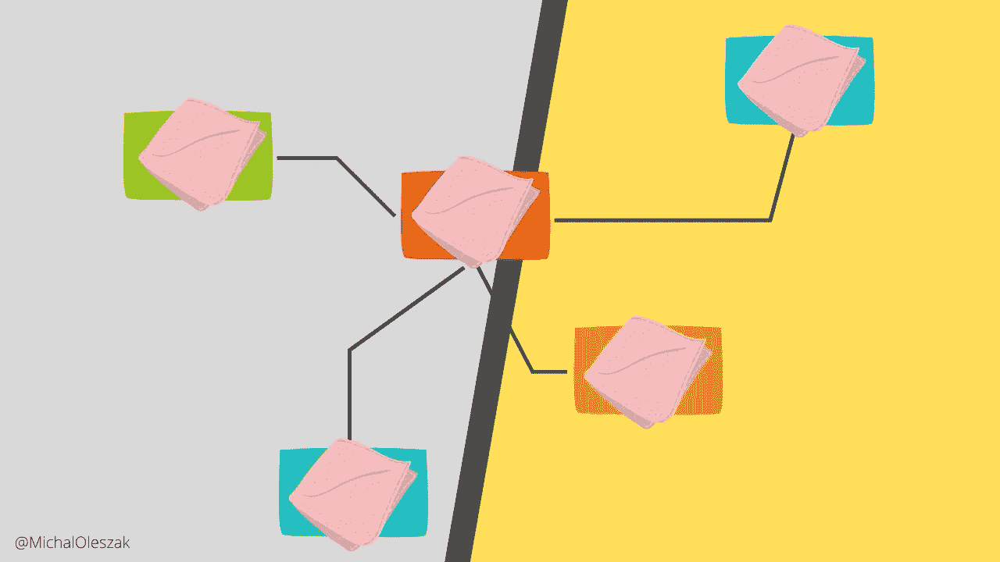

# 设计 RAG

> 原文：[`towardsdatascience.com/designing-rags-dbb9a7c1d729?source=collection_archive---------1-----------------------#2024-03-14`](https://towardsdatascience.com/designing-rags-dbb9a7c1d729?source=collection_archive---------1-----------------------#2024-03-14)

## GenAI

## 一份关于检索增强生成（Retrieval-Augmented Generation, RAG）设计选择的指南。

 [Michał Oleszak](https://michaloleszak.medium.com/?source=post_page---byline--dbb9a7c1d729--------------------------------)

·发布于 [Towards Data Science](https://towardsdatascience.com/?source=post_page---byline--dbb9a7c1d729--------------------------------) ·阅读时长 20 分钟·2024 年 3 月 14 日

--

构建检索增强生成系统，或称 RAG，是一项容易的工作。借助 LamaIndex 或 LangChain 等工具，你可以迅速让基于 RAG 的大型语言模型（LLM）投入使用。当然，需要一定的工程工作来确保系统的效率并良好扩展，但从原则上讲，*构建*RAG 是简单的部分。更为困难的是，*设计*它以达到最佳效果。

最近我亲自经历了这个过程，发现为了构建一个检索增强生成系统，必须做出许多大大小小的设计选择。每个选择都有可能影响你基于 RAG 的大型语言模型（LLM）的性能、行为和成本，有时这些影响方式并不显而易见。

不再赘述，让我呈现这一份——虽然不完全，但希望对你有所帮助——的 RAG 设计选择列表。希望它能为你的设计工作提供指导。

# RAG 组件

检索增强生成（RAG）使聊天机器人能够访问一些外部数据，从而能够根据这些数据回答用户的问题，而不是基于一般知识或其自身虚构的幻觉。

因此，RAG 系统可能会变得复杂：我们需要获取数据，将其解析成适合聊天机器人的格式，使其可用并可以搜索…
