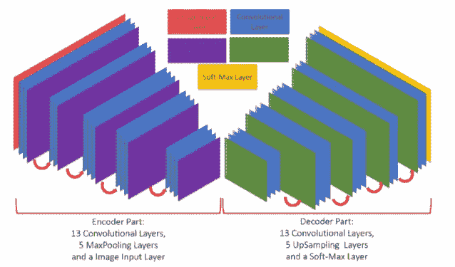

# 使用 AI 检测云朵

> 原文：[`towardsdatascience.com/detecting-clouds-with-ai-b553e6576af6?source=collection_archive---------3-----------------------#2024-07-17`](https://towardsdatascience.com/detecting-clouds-with-ai-b553e6576af6?source=collection_archive---------3-----------------------#2024-07-17)

## 从随机森林到 YOLO：比较不同的算法在卫星影像中进行云朵分割的效果。

[](https://anamabo3.medium.com/?source=post_page---byline--b553e6576af6--------------------------------)[](https://towardsdatascience.com/?source=post_page---byline--b553e6576af6--------------------------------) [Carmen Adriana Martínez Barbosa 博士](https://anamabo3.medium.com/?source=post_page---byline--b553e6576af6--------------------------------)

·发表于[Towards Data Science](https://towardsdatascience.com/?source=post_page---byline--b553e6576af6--------------------------------) ·10 分钟阅读·2024 年 7 月 17 日

--

*作者：Carmen Martínez-Barbosa 和 José Arturo Celis-Gil*


画着绿色田野和满是花朵的云朵，风格模仿梵高。图像由作者使用 DALL.E 生成。

卫星影像已经彻底改变了我们的世界。多亏了卫星影像，人类可以实时追踪水、空气、土地、植被的变化，以及我们在全球范围内所产生的足迹效应。提供此类信息的应用程序无穷无尽。例如，它们已被用于[评估土地利用对河流水质的影响](https://link.springer.com/article/10.1007/s10661-023-10989-1)。卫星影像还被用于[监测野生动物](https://cdn.techscience.cn/files/iasc/2023/TSP_IASC-37-2/TSP_IASC_39057/TSP_IASC_39057.pdf)和观察[城市人口增长](https://www.sciencedirect.com/science/article/abs/pii/S2210670723002640)等。

根据[关心科学家联盟](https://www.ucsusa.org/about/history)（UCS）的说法，大约[一千颗地球观测卫星在环绕地球](https://www.geospatialworld.net/prime/business-and-industry-trends/how-many-satellites-orbiting-earth/)。然而，最为人所知的之一是*哨兵-2*。*哨兵-2*是由欧洲航天局（ESA）开发的地球观测任务，属于[哥白尼计划](https://en.wikipedia.org/wiki/Copernicus_Programme)，能够在陆地和沿海水域上获取高空间分辨率（10 米至 60 米）的影像。*哨兵-2*获取的数据是多光谱影像，包含 13 个波段，涵盖了可见光、近红外和短波红外等电磁波谱部分。

*哨兵-2* 和其他地球观测卫星所生成的影像对于开发上述应用至关重要。然而，使用卫星图像可能会受到云层的阻碍。根据[Rutvik Chauhan 等人](https://arxiv.org/pdf/2112.15483.pdf#:~:text=In%20today%27s%20world%2C%20Satellite%20images,visibility%20of%20these%20image%20scenes.)的研究，地球表面大约有一半被不透明的云层覆盖，另外 20% 被卷云或薄云遮挡。当云层覆盖一个感兴趣区域时，情况还会变得更糟，可能持续数月。因此，云层去除对于卫星数据的预处理是必不可少的。

在这篇博客中，我们使用并比较了不同的算法来分割*哨兵-2*卫星图像中的云层。我们探索了各种方法，从经典的随机森林到最先进的计算机视觉算法 YOLO。你可以在[**这个 GitHub 仓库**](https://github.com/JoseCelis/cloud-I)中找到该项目的所有代码。

事不宜迟，开始吧！

**免责声明：** [*哨兵* 数据对广泛的区域、国家、欧洲和国际用户社区免费开放。](https://registry.opendata.aws/sentinel-2/#:~:text=License,European%20and%20International%20user%20community.)你可以通过哥白尼开放访问中心、Google Earth Engine 或 Python 包 sentinelhub 访问这些数据。在这篇博客中，我们使用最后一种方式。

# SentinelHub 简介

[*Sentinelhub*](https://github.com/sentinel-hub/sentinelhub-py)是一个 Python 包，支持许多实用工具来下载、分析和处理卫星影像数据，包括*哨兵-2*数据。该包提供了出色的文档和示例，便于使用，在开发端到端地理数据科学解决方案时，非常受欢迎。

要使用*Sentinelhub*，你必须在[Sentinel Hub 仪表板](https://services.sentinel-hub.com/auth/realms/main/protocol/openid-connect/auth?client_id=30cf1d69-af7e-4f3a-997d-0643d660a478&redirect_uri=https%3A%2F%2Fapps.sentinel-hub.com%2Fdashboard%2F&state=cd274940-99ee-4c57-8418-f82540051357&response_mode=fragment&response_type=code&scope=openid&nonce=fa1f4d93-8730-49d7-beab-dbe2fc822833&code_challenge=tP9ehp6dDZnaVjnvnJi2DhSAAn0sAkZqvMmAFo1atJ0&code_challenge_method=S256)创建一个帐户。登录后，进入仪表板的“用户设置”标签页，创建一个 OAuth 客户端。此客户端允许你通过 API 连接到 Sentinelhub。如何获取 OAuth 客户端的步骤可以在[*Sentinelhub*官方文档](https://docs.sentinel-hub.com/api/latest/api/overview/authentication/#registering-oauth-client)中找到详细说明。

一旦你拥有了凭据，**请将它们保存在一个安全的地方。** 它们将不再显示；如果丢失，你必须创建新的凭据。

你现在可以下载*Sentinel-2*图像和云概率了！

# 获取数据

在我们的[GitHub 存储库](https://github.com/JoseCelis/cloud-I)中，你可以找到脚本`src/import_image.py`，它使用你的 OAuth 凭据下载*Sentinel-2*图像和云概率。我们还包括了`settings/coordinates.yaml`文件，里面包含了一系列边界框以及它们各自的日期和坐标参考系统（CRS）。你可以自由使用这个文件来下载数据；不过，我们建议你使用自己的坐标集。

使用*Sentinelhub*下载数据的坐标示例。

我们下载所有 13 个波段的图像，采用数字数值（DN）表示。出于我们的目的，我们只使用光学（RGB）波段。

# 是否需要预处理数据？

原始图像在 RGB 波段中的 DN 分布通常是偏态的，包含异常值或噪声。因此，你必须在训练任何机器学习模型之前对这些数据进行预处理。


原始图像示例，它的 DN 分布和云概率。图像由作者制作。

我们在预处理原始图像时遵循的步骤如下：

+   使用`log1p`转换：这有助于减少 DN 分布的偏态。

+   使用`min-max`缩放转换：我们这样做是为了归一化 RGB 波段。

+   将 DN 转换为像素值：我们将归一化的 RGB 波段乘以 255，并将结果转换为 UINT8 格式。

这些步骤的实现可以通过一个 Python 函数完成：

原始 Sentinel 图像的预处理。你可以在我们的[GitHub 存储库](https://github.com/JoseCelis/cloud-I/blob/main/src/preprocess.py)中的脚本 src/preprocess.py 中查看代码。

图像已经清理完毕。现在是时候将云概率转换为掩模。

使用*Sentinelhub*的一个重要优势是，云概率以灰度图的像素值形式提供。因此，每个像素值除以 255 后代表该像素中存在云的概率。通过这种方式，我们将值从[0, 255]范围转换为[0, 1]。现在，为了创建掩模，我们需要类别而不是概率。因此，我们设置了一个 0.4 的阈值来决定一个像素是否属于云。

将云概率转换为掩模。代码位于我们[GitHub 仓库](https://github.com/JoseCelis/cloud-I/blob/main/src/preprocess.py)的脚本 src/preprocess.py 中。

上述预处理方法增强了数据集的亮度和对比度；当训练不同的模型时，它也是获得有意义结果所必需的。


预处理后的示例图像，其像素值分布以及结果云掩模。图像由作者制作。

## 一些需要考虑的警告

在某些情况下，结果掩模与对应图像中的云不匹配，如下图所示：


错误掩模示例。请注意，云以外的区域被标记为云区域。

这可能由于多种原因导致：一个原因是*Sentinelhub*中使用的云检测模型，它返回了假阳性。另一个原因可能是我们在预处理过程中使用的固定阈值。为了解决这个问题，我们提出了两种方法：一种是重新创建新的掩模，另一种是丢弃图像-掩模对。我们选择了第二种方法。[**在这个链接**](https://drive.google.com/drive/folders/1rBMHZC-CZCvAfkz1Qg0cOjWcnvHucQN8?usp=sharing)**中，我们分享了一些预处理后的图像和掩模，欢迎你在尝试本文所述算法时使用它们。**

# 在建模之前，让我们建立一个合适的度量标准来评估模型的预测性能。

用于评估实例分割模型的度量标准有多个。其中之一是交并比（IoU）。该度量标准衡量两个分割掩模之间的重叠程度。IoU 的值范围从 0 到 1。IoU=0 表示预测分割掩模与真实分割掩模之间没有重叠。IoU=1 表示完美的预测。


IoU 的定义。图像由作者制作。

**我们通过对一张测试图像测量 IoU 来评估我们的模型。** 我们对 IoU 的实现如下：

使用 TensorFlow 实现 IoU。

# 最后，图像中的云分割

我们现在准备在预处理后的卫星图像中进行云分割。我们使用了几种算法，包括经典方法，如随机森林和人工神经网络（ANNs）。我们还使用了常见的目标分割架构，如 U-NET 和 SegNet。最后，我们实验了一种最先进的计算机视觉算法：YOLO。

## 随机森林

我们希望探索经典方法在卫星图像中分割云层的效果。为此实验，我们使用了随机森林。如所周知，随机森林是由一组决策树组成，每棵树都在数据的不同随机子集上进行训练。

我们必须将图像转换为表格数据，以便训练随机森林算法。在以下代码片段中，我们展示了如何进行转换：

从图像转换为表格数据并训练随机森林模型。

**注意：** 你可以通过在终端中运行脚本 `src/model.py` 来使用预处理后的图像和掩模训练模型：

```py
> python src/model.py --model_name={model_name}
```

其中：

+   `--model_name=rf` 训练一个随机森林模型。

+   `--model_name=ann` 训练一个人工神经网络（ANN）。

+   `--model_name=unet` 训练一个 U-NET 模型。

+   `--model_name=segnet` 训练一个 SegNet 模型。

+   `--model_name=yolo` 训练 YOLO 模型。

使用随机森林对测试图像进行预测，结果如下：


使用随机森林进行云预测。图像由作者创建。

令人惊讶的是，随机森林在分割这张图像中的云层方面表现良好。然而，它的预测是基于像素的，这意味着该模型在训练过程中无法识别云层的边缘。

## ANN

人工神经网络是模拟大脑结构的强大工具，通过从数据中学习并进行预测。我们使用了一个简单的架构，只有一个隐藏的全连接层。我们的目标不是优化 ANN 的架构，而是探索全连接层在卫星图像中分割云层的能力。

Keras 中的 ANN 实现。

与随机森林一样，我们将图像转换为表格数据来训练人工神经网络（ANN）。

模型在测试图像上的预测结果如下：


使用人工神经网络（ANN）进行云预测。图像由作者创建。

尽管该模型的 IoU 比随机森林差，但人工神经网络（ANN）没有将海岸像素分类为云。这一事实可能与其架构的简单性有关。

## U-NET

它是由 Olaf Ronneberger 等人于 2015 年开发的卷积神经网络（CNN）。（请参见原文[这里](https://arxiv.org/abs/1505.04597)）。该架构是一个基于编码器-解码器的模型。编码器捕捉图像的基本特征和模式，如边缘、颜色和纹理。解码器帮助创建图像中不同物体或区域的详细地图。在 U-NET 架构中，每个卷积编码器层都与其在解码器层中的对应层连接。这被称为**跳跃连接**。


U-NET 架构。图片来源：[Olaf Ronneberger 等，2015](https://arxiv.org/abs/1505.04597)。

U-Net 通常用于需要高精度和细节的任务，如医学影像处理。

我们的 U-NET 架构实现如下代码片段：

Keras 中的 U-NET 实现。

U-NET 模型的完整实现可以在我们的[GitHub 仓库](https://github.com/JoseCelis/cloud-I/blob/main/src/model_class.py)中的脚本`src/model_class.py`中找到。训练时，我们使用批处理大小为 10，训练 100 个 epoch。U-NET 模型在测试图像上的结果如下所示：


使用 U-NET 进行的云预测。图片由作者创建。

这是获得的最佳 IoU 度量。

## SegNet

这是另一个基于编码器-解码器的模型，2017 年由[Vijay Badrinarayanan 等人](https://arxiv.org/abs/1511.00561v3)开发。SegNet 由于使用最大池化索引进行上采样，具有更高的内存效率。该架构适用于内存效率和速度至关重要的应用，如实时视频处理。



SegNet 架构。图片来源于[Shih-Yu Chen 等人（2021 年）](https://www.researchgate.net/publication/350109636_Hybrid_Deep_Learning_Models_with_Sparse_Enhancement_Technique_for_Detection_of_Newly_Grown_Tree_Leaves)

该架构与 U-NET 的不同之处在于，U-NET 使用跳跃连接来保留细节，而 SegNet 则没有。

与其他模型一样，SegNet 可以通过运行脚本`src/model.py`来进行训练。我们再次使用批处理大小为 10，训练 100 个 epoch。测试图像上的云分割结果如下所示：


使用 SegNet 进行的云预测。图片由作者创建。

没有 U-NET 好！

## YOLO

You Only Look Once (YOLO) 是一个快速高效的物体检测算法，2015 年由[Joseph Redmon 等人](https://arxiv.org/abs/1506.02640)开发。该算法的优点在于，它将物体检测视为回归问题，而不是分类任务，通过空间上分离边界框并为每个检测到的图像关联概率，使用单一的卷积神经网络（CNN）。

YOLO 的优势在于它支持多种计算机视觉任务，包括图像分割。我们通过[Ultralytics 框架](https://docs.ultralytics.com/)使用 YOLO 分割模型。训练过程非常简单，如下所示：

使用 Ultralytics 框架训练 YOLO。

您只需要设置一个包含图像和标签路径的*dataset*.*yaml*文件。有关如何运行 YOLO 模型进行分割的更多信息，请参阅[此处](https://docs.ultralytics.com/tasks/segment/#models)。

**注意：** 训练 YOLO 模型进行分割时需要使用云轮廓，而不是掩模。您可以在[此数据链接](https://drive.google.com/drive/folders/1rBMHZC-CZCvAfkz1Qg0cOjWcnvHucQN8?usp=sharing)中找到标签。

测试图像上的云分割结果如下所示：


使用 YOLO 进行的云预测。图片由作者创建。

哎呀，这是一个糟糕的结果！

尽管 YOLO 是许多分割任务的强大工具，但在图像有明显模糊的情况下，YOLO 的表现可能较差，因为模糊会降低物体与背景之间的对比度。此外，YOLO 在图像中分割多个重叠物体时可能会遇到困难。由于云层是模糊的物体，边缘不清晰且经常与其他云层重叠，因此 YOLO 并不是分割卫星图像中云层的合适模型。

**我们分享了上面解释过的训练模型** [**点击此链接查看。**](https://drive.google.com/drive/folders/1OySSazRiUWkjhokVk6_WycdvRFMy2hFa?usp=sharing) **由于文件大小（6GB！），我们没有包括随机森林。**

# 关键要点

我们探索了如何使用不同的机器学习方法在*Sentinel-2*卫星图像中进行云层分割。以下是这次实验的一些收获：

+   使用 Python 包*sentinelhub*获得的数据并不适合直接用于模型训练。你需要对这些数据进行预处理，并根据所选模型的要求可能需要调整数据格式（例如，在训练随机森林或 ANN 时将图像转换为表格数据）。

+   最佳模型是 U-NET，其次是随机森林和 SegNet。U-NET 和 SegNet 出现在这份名单上并不令人意外，因为这两种架构是专门为分割任务开发的。然而，随机森林表现得出乎意料的好。这表明，机器学习方法在图像分割中也能取得良好效果。

+   最差的模型是 ANN 和 YOLO。由于架构简单，我们预期 ANN 无法取得好的结果。至于 YOLO，尽管它是计算机视觉领域的最先进算法，但在图像中进行云层分割并不是一个合适的任务。总体而言，这个实验表明，作为数据科学家，我们必须始终寻找最适合我们数据的算法。

我们希望你喜欢这篇文章，再次感谢你的阅读！

你可以通过 LinkedIn 与我们联系：

[`www.linkedin.com/in/jose-celis-gil/`](https://www.linkedin.com/in/jose-celis-gil/)

[`www.linkedin.com/in/camartinezbarbosa/`](https://www.linkedin.com/in/camartinezbarbosa/)
