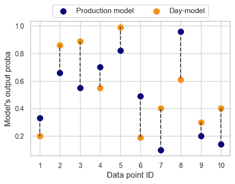

# 检测概念漂移：对机器学习性能的影响

> 原文：[`towardsdatascience.com/detecting-concept-shift-impact-on-machine-learning-performance-16923261cda8?source=collection_archive---------9-----------------------#2024-01-16`](https://towardsdatascience.com/detecting-concept-shift-impact-on-machine-learning-performance-16923261cda8?source=collection_archive---------9-----------------------#2024-01-16)

## MLOps

## 我什么时候应该重新训练我的模型？

 [Michał Oleszak](https://michaloleszak.medium.com/?source=post_page---byline--16923261cda8--------------------------------)

·发表于 [Towards Data Science](https://towardsdatascience.com/?source=post_page---byline--16923261cda8--------------------------------) ·阅读时间：14 分钟·2024 年 1 月 16 日

--

你听说过终身学习吗？你可能熟悉这样的故事：随着今天科技的快速发展，我们在学校学到的东西不能保证我们整个职业生涯都能取得成功。为了在就业市场中保持竞争力，我们需要学会如何持续学习。在这一方面，人工智能和我们人类并没有太大的不同。机器学习模型的知识也会过时，它们需要像我们一样重新学习。那么，模型何时会变得过时呢？

# 什么是概念漂移，我们能检测到它吗？

机器学习模型知识过时的现象被称为*概念漂移*。然而，在深入细节之前，我们先快速回顾一下更广泛的问题：数据漂移。

## 数据漂移概述

世界在变化。消费者行为和口味随着时间的推移而演变；随着年龄的增长，你的用户可能会改变他们的偏好；数据收集设备也可能会以意想不到的方式发生故障或损坏。无论你所在的行业是什么，或者你用机器学习解决什么问题，你可以肯定的是，在某个时刻，你的生产模型接收到的数据将会与它在训练时看到的数据不同。因此，机器学习模型在投入生产后往往会随着时间的推移而退化。

## 数据漂移的类型

世界的变化可以以不同的方式转化为数据的变化。为了更好地理解这一点，引入一些符号是非常有用的。

一般来说，机器学习模型处理两种类型的输入数据：特征，*X*，和目标，*y*。数据偏移在其最一般的形式下是描述特征和目标的联合分布变化，*P(X, Y)*。有四种可能的原因导致*P(X, Y)*的变化*。

为了列出所有四种方式，我们需要使用所谓的乘积法则，这是一个数学公式，表示 P(X, Y) = P(Y, X) = P(X|Y)P(Y) = P(Y|X)P(X)。

从那里可以得出，特征和目标的联合分布（可以等效地写作 P(X, Y) 或 P(Y, X)）可以通过两种不同但等效的方式进行分解：

1.  P(X|Y) * P(Y)

1.  P(Y|X) * P(X)

这意味着，如果上述四个元素中的任何一个发生变化，P(X, Y) 也会发生变化，从而导致数据偏移。每个元素的变化都有其自己的名称、原因和解决方案。让我们简要看一下它们。

旁注：我说过四个元素中的每一个都可能发生变化，从而导致数据偏移。但当然，并没有规则禁止四个元素中的多个同时发生变化。事实上，它们经常同时变化，导致数据偏移变成一个多面且复杂的现象。然而，在本文中，我们假设在任何给定时刻，四个元素中只有一个发生变化。

所以，回到四种数据偏移类型。

+   如果 P(X) 发生变化（且 P(Y|X) 不变），我们就谈论*协变量偏移*。一旦我们意识到协变量只是模型中的特征或自变量的另一种说法，这个名称就非常合理。协变量偏移是指模型输入的分布发生变化。

+   如果 P(Y) 发生变化（但 P(X|Y) 不变），我们就谈论*标签偏移*。这意味着输出分布发生了变化，但对于任何给定的输出，输入分布保持不变。

+   如果 P(Y|X) 发生变化（但 P(X) 不变），那就是*概念偏移*，本文的主题。我们将很快详细探讨它。

+   最后，P(X|Y) 发生变化，而 P(Y) 保持不变的情况被称为*表现偏移*。这意味着相同的目标值在输入分布中以不同的方式表现出来。我们在这里不会讨论表现偏移，将它留到另一个单独的文章中。

在四种数据偏移类型中，协变量偏移和概念偏移是讨论最多的，也是大多数公司在生产环境中使用机器学习模型进行预测时最为关注的问题。让我们讨论如何检测这两种偏移，看看概念偏移检测相比协变量偏移检测带来了哪些新的挑战。

## 检测数据偏移

协变量偏移无疑更容易理解和检测。让我们再回顾一下：这是指 P(X) 发生变化。换句话说，模型在服务时输入特征的分布与其在训练时所见的不同。

在绝大多数情况下，既有训练特征也有服务特征。只需比较它们的分布：如果它们不同，则发生了协变量漂移。

好的，这个例子有些过于简化。实际上，测量协变量漂移有两种方法。我们可以通过检查一个或多个特征的分布是否发生变化，从单变量角度进行分析，或者从多变量角度，关注所有特征的联合分布。

在单变量方法中，可以通过使用统计检验和距离度量比较训练分布和服务分布，逐个特征地进行比较。在多变量方法中，基于 PCA 的更细致方法是一个不错的选择。但无论哪种方法，任务都是比较两个观察到的量，并决定它们是否真的不同。

在概念漂移的情况下，漂移检测的挑战更加复杂。我们再来看一下：概念漂移是当 P(Y|X)发生变化时，也就是说，对于给定的特征值，目标分布发生了变化。

难点在于如何衡量和比较 P(Y|X)，通常称之为*概念*。它不是一个可以轻松计算的单一量。它是输入和输出之间的真实映射或关系。我们知道训练数据的 P(Y|X)（根据我们模型的能力），但是我们如何知道它在现实世界中何时发生了变化呢？让我们来看一下！

# 野外中的概念漂移检测

感谢你耐心阅读这段较长的引言！现在我们知道了什么是概念漂移以及为什么它很难检测，让我们通过一个实际的例子进一步讨论这个问题。

## 时间与空间中的概念漂移

概念漂移意味着对于特定的输入，输出的分布发生了变化（P(Y|X)发生了变化，记住了吗？）。这种变化可以发生在时间或空间的两个维度中的任何一个。

时间上的概念漂移意味着模型在训练期间学到的概念在现实世界中发生了变化。换句话说，模型的知识已经不再是最新的了。

让我借用 Chip Huyen 在他的精彩著作《*设计机器学习系统*》中的一个例子：假设你正在构建一个预测旧金山房价的模型。在新冠疫情爆发之前，一套三居室公寓的价格可能是 200 万美元，但由于疫情，很多人离开了城市，需求下降，导致同样的公寓现在的价格可能是 150 万美元。特征分布 P(X)没有变化：房子仍然有相同数量的卧室、相同的面积等。只是相同的一组输入现在映射到一个不同的输出。

空间上的概念漂移发生在从特定地理位置或特定用户集数据中学习到的概念不适用于其他地区或用户群体。例如，给旧金山的公寓增加 50 平方英尺的面积可能导致价格大幅上涨。然而，向怀俄明州的乡村房屋添加相同的面积，因当地住房市场竞争较少，可能不会导致同样的价格上涨。

好的，那么到目前为止，我们知道概念漂移可能是一个问题，无论是在模型部署后经过了一段时间，还是当模型开始为不同的用户或地理区域提供服务时。那么，我们该如何检测它呢？

## 检测概念漂移

想象一下：你用所有可用数据训练你的旧金山房价预测模型并投入生产。之后，你收集模型用于推理时接收的特征，并按日存储这些特征批次。

训练和服务数据集。图像由作者提供。

这里，*X-serve-0* 是部署当天的特征，*X-serve-1* 是次日的特征，依此类推，而 *y-serve-0* 表示相应的目标值。

今天是零日：模型已基于昨天的数据进行训练并投入生产。那么，今天的数据（*X-serve-0* 和 *y-serve-0*）是否发生了概念漂移呢？

让我们假设这是一个二元问题。当然，实际上，概念漂移可能是大规模的，也可能是小规模的，而且对模型性能的影响也可能很大或很小。但现在，让我们假设概念漂移在零日时已经发生或没有发生。

这里有一个思路：我们在零日数据上训练一个模型。如果没有发生概念漂移，它应该学会与生产模型相同的特征到目标的映射。如果发生了概念漂移，学习到的映射将会不同。

概念漂移检测机制。图像由作者提供。

接下来，让我们使用这个零日模型来对测试数据进行预测：我们只需输入*X-test*。如果输出结果与生产模型的测试集预测值接近，*这意味着我们的零日模型已经学会了与生产模型相同的 P(Y|X)，或者说学会了相同的概念*。因此，我们可以宣告没有概念漂移。如果输出结果不同，那么概念漂移肯定已经发生。

> 我们可以通过在服务数据上训练一个模型并与生产模型进行比较，从而检测概念漂移。

我们可以每天重复这一过程，每当收到新的数据批次时，就刷新对概念漂移是否发生的了解。

## 概念漂移：检测与对性能的影响

这一切都很好，但有一个警告，警觉的读者可能已经注意到了。*日常模型*的输出永远不会和生产模型的输出完全相同：即使没有任何漂移，抽样误差（不同的训练数据样本）也会导致稍微不同的结果。那么，实际上多大的差异才意味着概念漂移呢？或者更实际地说，什么时候我们需要重新训练模型？

确实，并不是每个差异都需要重新训练模型，因为重新训练可能是一个昂贵或复杂的过程。如上所述，差异有时可能是随机抽样的结果，这种情况下不需要重新训练。在其他情况下，差异可能确实是由概念漂移引起的，但这种漂移对模型的影响不大。在这种情况下，也不需要重新训练。

这里的关键观察是，只有当概念漂移显著影响模型性能时，才应该重新训练模型。

> 只有当概念漂移显著影响模型性能时，才应重新训练模型。

那么我们如何判断概念漂移对性能的影响有多大呢？我们换个角度来看这个问题：是否有一些情况，概念漂移发生了，但并没有影响模型的性能？

# 无害的概念漂移

想象一下，你的旧金山房价预测模型现在是一个分类模型，你正在预测一栋房子的价格是否超过 100 万美元，基于其特征。你已经按照上述步骤，发现生产模型和当前模型之间有很大的差异。

## 预测标签没有变化

这里是一个图表，显示了两个模型在一个包含 10 个数据点的子集上，预测房子价格超过 100 万美元的概率差异。

如果最终的预测结果没有变化，概念漂移是无害的。图片来自作者。

这里有三个重要的观察结果。首先，两个模型预测的概率完全不同。对于每个数据点，差异都很大，可能接近 50 个百分点。我们几乎可以确定已经发生了显著的概念漂移。

其次，两个模型的相对输出不一致。有时一个模型的概率远高于另一个模型，有时则相反。

第三，我们遇到的概念漂移对模型是完全无害的。等等，什么？没错！尽管概念漂移显著，但我们所面对的概念漂移对模型性能没有任何影响！

> 概念漂移并不总是影响模型性能。

记得我们正在处理一个二分类任务。假设使用常见的 50%的决策阈值，对于每个数据点，两个模型将得出相同的预测：数据点 2、3、4、5 和 8 对应于正预测（价格超过 100 万美元），其余的对应于负预测。像准确率、精确度、召回率或 F1 得分这样的性能指标在两个模型中是相同的（不过 ROC AUC 会受到影响，因为它使用模型分数而不仅仅是类别标签）。

我承认这个例子是人为构造的，故意设计来展示我想表达的内容：即概念漂移不一定会影响性能。但也可以理解——实际上，人们很少只使用预测标签而忽略置信度分数。让我们来看另一个可能更现实的场景，在这种情况下，概念漂移不会对你造成伤害。

## 稀疏区域的漂移

模型特征构成了一个多维空间，每个训练样本都是这个空间中的一个点。如果只有两个特征，x1 和 x2，你可以在二维平面上绘制每个样本作为一个点——特征空间。如果有三个特征，每个样本将是一个立方体中的一个点。在更常见的使用四个特征或更多特征的情况下，我们的大脑无法想象这种场景，但每个样本依然是特征空间中的一个点。

训练样本在特征空间中的分布并不均匀。特征空间中的某些区域数据点密集，而其他区域则非常稀疏。换句话说，在你的数据中，某些特征值的组合是常见的，而其他的则非常罕见。

现在，问题是：概念漂移可能发生在特征空间的任何区域。如果它发生在一个稀疏区域，对模型性能的影响将会很小。这是因为在该区域内没有多少训练数据或服务数据。因此，模型几乎不会在该区域进行预测。由于概念漂移导致的稀疏区域的误分类将是罕见事件，对模型的整体性能贡献不大。

> 由于概念漂移导致的稀疏区域的误分类将是罕见事件，对模型的整体性能贡献不大。

上面两个故事的启示是，某些概念漂移是无害的，只有对性能有实质性负面影响时才需要重新训练模型。一旦你检测到概念漂移，首先评估它对模型的影响，然后再采取不必要的行动！

# 概念漂移检测工具

我们可以将到目前为止的整个讨论总结为：不要关注漂移的存在，而要检测其对性能的影响。

然而，这并不是人们通常的做法。快速的网络搜索显示，大多数概念漂移检测方法（例如[DeepChecks 博客中的这个方法](https://deepchecks.com/how-to-detect-concept-drift-with-machine-learning-monitoring/)或[Evidently AI 中的这个方法](https://www.evidentlyai.com/ml-in-production/concept-drift#how-to-detect-concept-drift)）通常是间接的：它们通常基于检测预测漂移、标签漂移或数据漂移。

我发现的唯一一个声称能够直接检测概念漂移的幅度，并且更重要的是量化其对模型性能影响的工具是 NannyML。我联系了该团队，他们告诉我，除了可以作为独立算法在[AWS](https://aws.amazon.com/marketplace/pp/prodview-64nptz3lrs4gc)上使用（这也是我搜索时看到的），它还可以作为[Azure 托管应用](https://azuremarketplace.microsoft.com/en-us/marketplace/apps/nannyml1682590100745.nannyml-managed?tab=Overview)使用。

这种方法遵循之前讨论的工作流程。每次部署后，我们都会使用当天收集的服务数据训练一个日模型。接下来，我们查看日模型对训练数据预测的概率，并将其与生产模型的预测结果进行比较。这些差异使我们能够估计变化对性能指标（如 ROC AUC、准确率等）的影响。

我使用了免费试用来看看如何在实际中估算概念漂移对分类任务性能的影响。不，这次不会再讨论旧金山的住房问题了。

考虑航班取消问题。它们主要受天气状况或航空公司特定问题等运营因素的驱动。我们可以利用这些特征来相当可靠地预测某个航班是否会被取消。

或者至少在 2019 年底之前是这样。随着 COVID-19 大流行的爆发，旅行限制、封锁措施以及旅行需求的急剧下降导致航班取消数量显著增加，彻底改变了天气等因素与取消之间的关系。例如，良好的天气再也不能保证航班取消数量减少了。

让我们训练一个模型，预测 2018 年之前的数据的航班取消情况，并将 2019 年至 2023 年作为我们的服务数据，数据来源于[运输统计局的数据](https://www.transtats.bts.gov/homedrillchart.asp)。这是 NannyML 的概念漂移检测算法输出的结果。

NannyML 的概念漂移检测。图像来源：作者。

在部署后的第一年，即 2019 年，似乎没有发生显著的概念变化。我们设定的有意义的性能变化阈值并未突破。然而，第二年，当疫情爆发时，我们的取消分类器准确率下降了 6 个百分点！有趣的是，第三年，情况大致恢复到了疫情前的状态。

# 考虑与结论

概念漂移是特征与目标之间映射的变化，而特征本身保持不变。可以理解为：相同的输入，不同的输出。与其“邪恶双胞胎”协变量漂移相比，概念漂移更难以检测，后者是特征的分布发生变化。

检测概念漂移的一个巧妙方法是定期在传入的服务数据上训练模型，并将其学习到的概念与生产模型所学习到的概念进行比较。如果它们不同，说明概念漂移已经发生。然而，这种方法也有一些局限性。它假设服务数据的目标是可用的，而在许多应用中并非如此。

最后，并不是所有的概念漂移都是坏事。然而，在某些情况下，它可能会对你的生产模型性能产生负面影响，从而影响这些模型所带来的商业价值。通过遵循上面概述的方法，你可以量化概念漂移的影响，并确保你的机器学习模型继续提供价值。

感谢阅读！

如果你喜欢这篇文章，为什么不[**订阅电子邮件更新**](https://michaloleszak.medium.com/subscribe)获取我的新文章？通过[**成为 Medium 会员**](https://michaloleszak.medium.com/membership)，你可以支持我的写作，并且获得其他作者及我本人的所有故事的无限访问权限。需要咨询？你可以随时问我问题，或者[**在这里预约一对一咨询**](https://topmate.io/michaloleszak)。

你也可以尝试阅读[我的其他文章](https://michaloleszak.github.io/blog/)。无法选择？试试以下这些：

 ## 如何通过假设检验检测数据漂移

### 提示：忘记 p 值吧

towardsdatascience.com  ## 使用 Pants 组织机器学习单一代码库

### 简化你的机器学习工作流管理

[towardsdatascience.com  ## 计算机视觉中的自监督学习

### 如何仅通过少量标记样本训练模型

towardsdatascience.com
