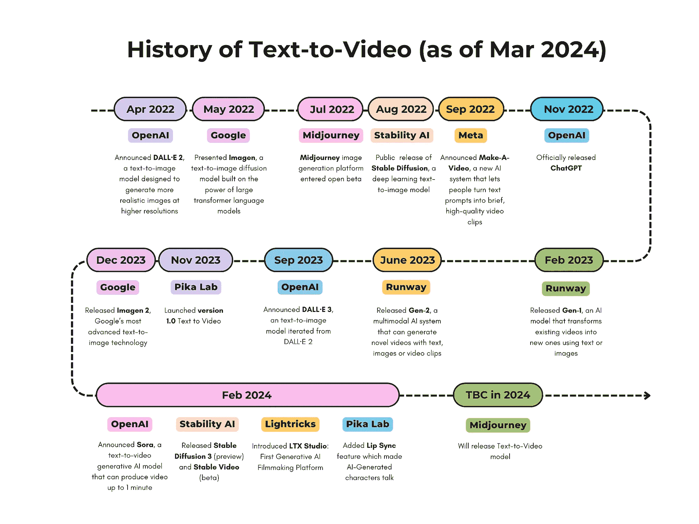

# 时间轴分享：商业文本转视频的演变

> 原文：[`towardsdatascience.com/diagram-share-the-evolution-of-commercial-text-to-video-8726dc01b270?source=collection_archive---------6-----------------------#2024-03-16`](https://towardsdatascience.com/diagram-share-the-evolution-of-commercial-text-to-video-8726dc01b270?source=collection_archive---------6-----------------------#2024-03-16)

## 文本转视频的最新三年发展

 [Selina Li](https://medium.com/@lizhuohang.selina?source=post_page---byline--8726dc01b270--------------------------------)

·发布于[Towards Data Science](https://towardsdatascience.com/?source=post_page---byline--8726dc01b270--------------------------------) ·2 分钟阅读·2024 年 3 月 16 日

--

商业文本转视频的发展历程（截至 2024 年 3 月）

近年来，我们见证了商业**文本转视频**模型和产品的出现。我想分享一张**自创的** **综合时间轴图**，它捕捉了商业文本转视频模型/产品在过去 3 年（包括 2022 年、2023 年以及 2024 年截至目前）的显著发展。

我在为团队准备关于 Sora 的演示时创作了这张图。看到这些优秀的产品随着计算机视觉（CV）研究的进展而诞生，令人兴奋，这些研究包括但不限于生成对抗网络（GANs）、变换器架构和扩散模型。

正如微软研究论文《[Sora: A Review on Background, Technology, Limitations, and Opportunities of Large Vision Models](https://arxiv.org/abs/2402.17177)》所建议的那样，我们将 Sora 视为一次飞跃，因为它不仅仅是一个工具，更有可能成为一个“世界模拟器”，模拟物理世界中所描绘场景的物理和上下文动态。

当然，这一演变不会停止，我相信我们会看到更多令人兴奋的消息。作为见证者，我很期待保持这张图的更新。

我很想听听你对这次演变的看法，以及你认为文本转视频技术未来将走向何方。让我们讨论一下这些进展的影响、潜在应用和随之而来的伦理考量。
