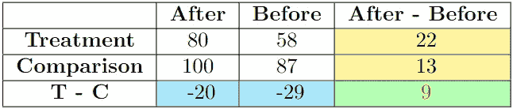

# 差分中的差分 101

> 原文：[`towardsdatascience.com/difference-in-difference-101-9424cb403f9e?source=collection_archive---------1-----------------------#2024-05-26`](https://towardsdatascience.com/difference-in-difference-101-9424cb403f9e?source=collection_archive---------1-----------------------#2024-05-26)

 [Henam Singla](https://henamsingla.medium.com/?source=post_page---byline--9424cb403f9e--------------------------------)

·发布于 [Towards Data Science](https://towardsdatascience.com/?source=post_page---byline--9424cb403f9e--------------------------------) ·7 分钟阅读·2024 年 5 月 26 日

--

什么是差分中的差分（DiD 或 DD 或 diff-in-diff）？为什么我们关心 DiD？今天我将回答所有关于这项经济计量学中最流行的政策效应研究方法的问题。

这张图片由作者使用 DALL.E 创作，旨在展示技术如平板电脑在课堂中的引入及其对成绩的影响。

DiD 是一种广泛使用的经济计量技术，通过比较治疗组和对照组在不同时间点的结果变化，估算因果关系。问题是，什么是治疗组和对照组？治疗组是指由于政策或变化影响到特定群体的政策干预；对照组是指没有受到干预的群体。因果关系指的是因果效应关系。

我们关心这种方法，因为它在评估政策变化或干预的效果时非常有用，特别是当随机实验不可行时。这意味着，有时实验会针对特定群体进行，暗示接受干预的人并非随机选取。即使没有随机化，DiD 也能帮助我们剖析干预的影响。

本文将深入探讨这一方法的概念、假设、实施及其示例。

# 什么是 DiD

**我们的研究问题是：干预 D 对结果 y 的影响是什么**？DiD 让我们可以估计如果没有发生干预，处理组将会发生什么。这种反事实情境对于理解干预的真实效果至关重要。每项工作或研究都围绕着类似的问题展开，比如干预、政策变化或治疗的效果评估。在经济学中，它评估税收减免对经济增长的影响；在公共政策中，它评估新的交通法规对事故率的影响；在市场营销中，DiD 分析广告活动对销售的影响。

由作者创建的图示

例如，在上面的图示中，我们有样本中的人口数据。我们将数据分为处理组和对照组，其中处理组接受了干预。我们可以观察到两组的处理前和处理后变量。

# 如何进行 DiD 分析

## 简单的处理/对照组差异估计量

这个方程将通过比较处理组和对照组随时间变化的结果，来计算干预效应。

我创建了一个假设示例来帮助理解这个数学原理。

使用上述公式，**DiD 系数**将是**9**。

## DiD 估计量：使用回归计算

DiD 有助于控制可能对干预效果估计产生偏差的时间不变特征。这意味着它可以消除那些在时间上保持不变的变量的影响（例如，地理位置、性别、种族、天赋等）。它之所以能做到这一点，是因为这些特征对每个组的处理前和处理后的时间段的影响是相等的。

基本的 DiD 模型的核心方程是：

其中：

+   y​是个体𝑖在组*𝑗*的时间𝑡的结果变量。

+   𝐴𝑓𝑡𝑒𝑟​是一个虚拟变量，当观察值处于处理后的时间段时，该值为 1。

+   𝑇𝑟𝑒𝑎𝑡𝑚𝑒𝑛𝑡是一个虚拟变量，当观察值属于处理组时，该值为 1。

+   𝐴𝑓𝑡𝑒𝑟 × 𝑇𝑟𝑒𝑎𝑡𝑚𝑒𝑛𝑡​是交互项，系数*β*表示 DiD 估计值。

交互项的系数是 y 中的 DiD 估计量。回归分析在研究人员中更受欢迎，因为它能够提供标准误差并控制额外的变量。

# 平行趋势假设

这是 DiD 中的一个关键假设。它基于这样一个观点：在没有干预的情况下，处理组和对照组之间的差异将随着时间的推移保持不变。换句话说，在没有干预的情况下，*β (DiD 估计值)* = 0。

正式来说，这意味着：

另一种思考方式是，假如没有政策变化，两组之间的差异在时间上会保持不变。如果在处理前两组的趋势不平行，则 DiD 估计可能存在偏差。

## 如何检查这个假设

现在下一个问题是：如何检查这一点？平行趋势假设的有效性可以通过图形分析和安慰剂检验来评估。

作者创建

假设是，在没有治疗的情况下，处理组（橙色线）和对照组（蓝色虚线）会随着时间的推移沿平行路径变化。干预（垂直线）标记了施加治疗的时刻，允许通过比较两组在干预前后趋势的差异来估计治疗效应。

## 违反平行趋势假设的例子

简单来说，我们在治疗中寻找两件事：

1.  **斜率变化**

图表：部分(a)

图表：部分(b)

在上述两个案例中，平行趋势假设没有得到满足。处理组的结果要么增长更快（部分 a），要么增长更慢（部分 b）于对照组的结果。用数学方式来说就是：

DiD = 真实效应 + 差异趋势（差异趋势应为 0）

差异趋势可以是正向的（部分 a）或负向的（部分 b）

由于我们在其中也有一个差异趋势，DiD 将无法隔离干预的影响（真实效应）。

2\. **干预后治疗线的跳跃（无论是向上还是向下）**

在上面的图像中，处理组的趋势与对照组的趋势发生了不同的变化，而对照组的趋势在没有干预的情况下应该保持一致。DiD 研究中不允许出现跳跃。

# 安慰剂检验

安慰剂检验用于验证观察到的治疗效果是否真的是由于治疗本身，而不是由于其他混杂因素。它们通过对一个没有预期治疗效果的时期或群体进行相同的分析来进行。如果在这些安慰剂检验中发现显著效果，说明原始结果可能是虚假的。

例如，2019 年曾进行过一项为高中生发放药片的干预研究。我们可以做一个安慰剂检验，也就是说，我们可以创建一个假设的干预年份，比如 2017 年，知道那时没有发生任何政策变化。如果将治疗效应分析应用于安慰剂年份（2017），且没有发现显著变化，那么这将表明 2019 年观察到的效果（如果有的话）很可能是由于实际的政策干预。

# DiD 的扩展与变体

1.  **事件研究 DiD**：估计年特定的处理效应，这对于评估处理效应的时机和检查预趋势非常有用。该模型允许处理效应随年份变化。我们可以研究在时间*t+*1, *t*+2, …, *t*+*n*时的效应。

1.  **合成控制法**（SCM）：SCM 通过加权多个未处理单位来构建一个合成控制组，创建一个在干预前能够逼近处理单位特征的组合体。这种方法在*将一个单一的处理单位与一组未处理单位进行比较*时特别有用。它通过结合多个单位的信息，提供了一个更为可信的反事实。

还有很多其他的，但我将限制在仅两个。我可能稍后会写一篇文章，详细解释其余内容。

# 结论

在这篇文章中，我分析了差异中的差异（DiD）估计量，这是一种估计平均处理效应的流行方法。DiD 被广泛应用于通过比较处理组和对照组随时间变化来研究政策效应。DiD 的主要优势是它能够控制随着时间推移保持不变的未观察到的混杂因素，从而孤立出干预的真实影响。

我们还探讨了诸如平行趋势假设、前期数据的重要性以及如何通过图形分析和安慰剂检验检查假设违反的关键概念。此外，我还讨论了 DiD 的扩展和变种，例如事件研究 DiD 和合成控制法，这些方法在不同情境下提供了更多的见解和稳健性。

# 参考文献和进一步阅读

[1] Wing, C., Simon, K., & Bello-Gomez, R. A. (2018). 设计差异中的差异研究：公共卫生政策研究的最佳实践。*公共卫生年鉴*, *39*, 453–469。

[2] Callaway, B., & Sant’Anna, P. H. (2021). 多时间期的差异中的差异。*计量经济学杂志*, *225*(2), 200–230。

[3] Donald, S. G., & Lang, K. (2007). 使用差异中的差异和其他面板数据的推断。*经济学与统计学评论*, *89*(2), 221–233。

## 谢谢阅读！

*感谢阅读！🤗 如果您喜欢这篇文章并希望看到更多，考虑* [*关注我*](https://henamsingla.medium.com/)*。您也可以在* [*LinkedIn*](https://www.linkedin.com/in/henamsingla/)*上关注我。我计划写关于因果推断和数据分析的博客，始终致力于保持内容简单。*

*一个小小的免责声明：我写作是为了学习，因此尽管我尽力了，还是可能会有错误。如果您发现任何错误，请告诉我。我也欢迎关于新话题的建议！*
