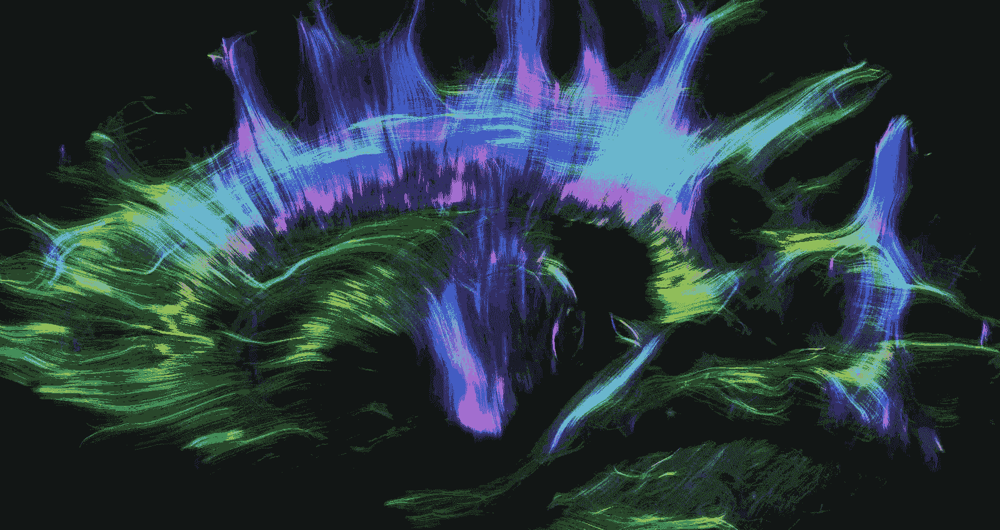
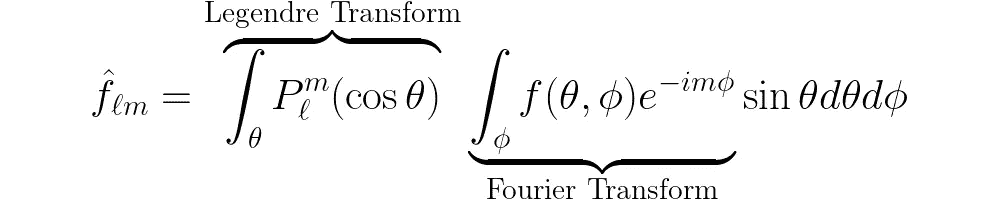

# 可微分且加速的球面调和变换

> 原文：[`towardsdatascience.com/differentiable-and-accelerated-spherical-harmonic-transforms-c269393d08f1?source=collection_archive---------12-----------------------#2024-03-14`](https://towardsdatascience.com/differentiable-and-accelerated-spherical-harmonic-transforms-c269393d08f1?source=collection_archive---------12-----------------------#2024-03-14)

## 在 JAX 和 PyTorch 中

[](https://jasonmcewen.medium.com/?source=post_page---byline--c269393d08f1--------------------------------)[](https://towardsdatascience.com/?source=post_page---byline--c269393d08f1--------------------------------) [Jason McEwen](https://jasonmcewen.medium.com/?source=post_page---byline--c269393d08f1--------------------------------)

·发表于[Towards Data Science](https://towardsdatascience.com/?source=post_page---byline--c269393d08f1--------------------------------) ·阅读时间 7 分钟·2024 年 3 月 14 日

--

*许多科学和工程领域都涉及定义在球面上的数据。对这些数据的建模和分析通常需要傅里叶变换的球面对应物——球面调和变换。我们简要概述了球面调和变换，并提出了一种新型的可微分算法，旨在加速 GPU 运算[1]。该算法已在最近发布的* [*S2FFT*](https://pypi.org/project/s2fft/) *Python 包中实现，支持 JAX 和 PyTorch。*


图片由[Szilvia Basso](https://unsplash.com/@szilviabasso?utm_source=medium&utm_medium=referral)提供，来源于[Unsplash](https://unsplash.com/?utm_source=medium&utm_medium=referral)

我们越来越多地关注分析位于球面上的数据。应用领域的多样性令人瞩目，涵盖从量子化学、生物医学成像、气候物理学和地球物理学，到更广阔的宇宙。

在物理科学中，尤其是在大气科学、地球物理建模和天体物理学中，球面数据是最常见的。


*球面数据中最广为人知的案例，如地球（左）和天文观测的艺术印象（右）。[地球图片来源于* [*维基百科*](https://en.wikipedia.org/wiki/Earth#/media/File:The_Blue_Marble_(remastered).jpg)*；天体物理学图像来源于* [*维基百科*](https://commons.wikimedia.org/wiki/File:Observable_sphere_for_3d.png)*。]*

这些问题天生具有球面性质，因为观察是在球面上的每一点进行的：地球表面用于地球物理学，天空用于天体物理学。其他例子来自于计算机图形学和视觉应用，其中 360°全景摄像头可以捕捉你周围环境的每一个方向。

在许多情况下，问题的球面性质是比较容易看出的；然而，这并非总是如此。或许令人惊讶的是，球面数据在生物学领域中经常出现，尽管球面特性往往不太显而易见！由于我们在生物学研究中通常关注局部方向，例如水在大脑中的扩散方向，因此我们会遇到球面数据。



人类大脑神经连接的扩散张量成像。每个体素中的神经元可以自由地朝任何方向移动，因此问题本质上是球面的。[动画由[Alfred Anwander](https://www.youtube.com/watch?v=jrC8iY6_aZQ)制作，CC-BY 许可。]

鉴于此类数据的普遍存在，许多球面分析技术应运而生，频率分析常常能为数据提供有价值的见解，通常有助于提供统计摘要或有效的表示形式，用于进一步的分析或建模。最近，几何深度学习技术在复杂领域的数据分析中已被证明非常有效，尤其是在分子建模和蛋白质相互作用等高度复杂的问题中（请参阅我们之前关于几何深度学习简介的文章）。

# 傅里叶遇见勒让德

因此，我们有球面数据以及多种分析球面数据的技术，但我们需要数学工具来进行分析。具体来说，我们需要知道如何高效地将球面数据分解成频率。

傅里叶变换提供了一种频率分解，常用于计算数据中的统计相关性。许多物理系统也可以在频率空间中更直接地描述，因为每个频率可能独立演变。

要将标准傅里叶变换扩展到球面，我们需要两位 17 世纪法国数学家的共同努力：约瑟夫·傅里叶和阿德里安-玛丽·勒让德。


*约瑟夫·傅里叶（左）和阿德里安-玛丽·勒让德（右）。不幸的是，勒让德的漫画是唯一已知的他的形象。[傅里叶图像来源于* [*维基百科*](https://en.wikipedia.org/wiki/Joseph_Fourier#/media/File:Fourier2_-_restoration1.jpg)*。勒让德图像来源于* [*维基百科*](https://en.wikipedia.org/wiki/Adrien-Marie_Legendre#/media/File:Legendre.jpg)*。]*

首先，让我们考虑如何将欧几里得数据分解成不同的频率。这种数据变换最初由约瑟夫·傅里叶推导出来，公式如下：


这种方法几乎无处不在，且成为本科物理课程中的基础！它通过将我们的数据 *f(x)* 投影到一组三角函数上，称为 *基函数*。在球面上也可以做到类似的事情，但基函数现在由球面调和函数 *Y*ₗₘ 给出：


*(θ, ϕ)* 是通常的球面坐标。


*球面调和基函数（实部）。[来源自* [*维基百科*](https://en.wikipedia.org/wiki/Spherical_harmonics#/media/File:Rotating_spherical_harmonics.gif)*.]*

球面调和函数（如上图所示）可以进一步分解为指数和勒让德多项式的乘积——按照阿德里安-玛丽·勒让德的方式——如



因此，球面调和变换可以写成先进行傅里叶变换，然后是伴随的勒让德变换。真正的难点在于评估变换中的勒让德部分：这取决于所选方法，它要么计算开销大，要么占用大量内存。

# 可微性的重要性

[可微编程](https://en.wikipedia.org/wiki/Differentiable_programming)的兴起开辟了许多新的分析类型。特别是，许多应用需要可微的球面变换。

球面上的机器学习模型需要可微变换，以便模型可以通过基于梯度的优化算法进行训练，*即* 通过反向传播。

新兴的物理增强型机器学习方法 [7] 针对混合数据驱动和基于模型的方法 [8] 也需要可微的物理模型，而在许多情况下，这些模型本身就需要可微的球面变换。

考虑到这一点，显然，对于现代应用，球面调和变换的高效算法是必要的，但仅有这点是不够的。可微性是关键。

# 一个名为 S2FFT 的软件包

这些都很好，但如何高效地评估球面调和变换呢？已经开发出了多种算法，并有一些出色的软件包。然而，现代应用需要一种可微的、能够在硬件加速器（如 GPU）上运行并且计算可扩展的算法。

通过从头开始重新设计核心算法（在我们相应的论文 [[1](https://arxiv.org/abs/2311.14670)] 中有详细描述），我们最近开发了一个名为 [S2FFT](https://astro-informatics.github.io/s2fft/) 的 Python 包，应该能够满足需求。

S2FFT 是用 Google 开发的可微编程语言 [JAX](https://jax.readthedocs.io/en/latest/) 实现的，并且还包括一个 [PyTorch](https://pytorch.org) 前端。


[*S2FFT*](https://github.com/astro-informatics/s2fft) *是一个实现可微分和加速的球面调和变换的 Python 包，支持 JAX 和 PyTorch 接口。[图像由作者创建。]*

S2FFT 提供了两种操作模式：预计算关联的勒让德函数，然后在运行时访问它们；或在变换过程中即时计算它们。预计算方法几乎是最快的，但存储所有勒让德函数值所需的内存与分辨率的立方成比例，这可能是一个问题！我们提供的第二种方法是递归地在变换过程中即时计算勒让德项，因此可以扩展到非常高的分辨率。

此外，S2FFT 还支持混合自动和手动微分方法，以便高效地计算梯度。

该软件包旨在支持球面上多种不同的采样方案。在发布时，支持等角度（[McEwen & Wiaux](https://arxiv.org/abs/1110.6298) [9]，[Driscoll & Healy](https://www.sciencedirect.com/science/article/pii/S0196885884710086) [10]）、高斯-勒让德和 [HEALPix](https://healpix.jpl.nasa.gov/) [11] 采样方案，未来也可以轻松添加其他方案。


*支持球面上不同采样方案的* [*S2FFT*](https://github.com/astro-informatics/s2fft)*。 [原始图由作者创建。]*

S2FFT 包可以在 [PyPi](https://pypi.org/project/s2fft/) 上找到，因此任何人都可以通过运行以下命令直接安装：

```py
pip install s2fft
```

或者通过运行以下命令来启用 PyTorch 支持：

```py
pip install "s2fft[torch]"
```

从这里开始，可以简单地调用顶级变换：

```py
import s2fft

# Compute forward spherical harmonic transform
flm = s2fft.forward_jax(f, L) 

# Compute inverse spherical harmonic transform
f = s2fft.inverse_jax(flm, L) 
```

这些功能可以直接使用并作为层集成到现有模型中，支持 JAX 和 PyTorch，完全支持前向和反向模式的微分。

# 未来展望

随着研究人员对科学应用中的可微编程越来越感兴趣，迫切需要现代软件包来实现科学通常依赖的基础数学方法，如球面调和变换。

我们希望 [S2FFT](https://github.com/astro-informatics/s2fft) 在未来几年能派上大用场，并且我们非常期待看到人们会用它做些什么！

# 参考文献

[1] Price & McEwen, *可微分和加速的球面调和和维格纳变换*，[arxiv:2311.14670](https://arxiv.org/abs/2311.14670)（2023）。

[2] Bronstein, Bruna, Cohen, Velickovic, *几何深度学习：网格、群体、图形、测地线和规范*，[arXix:2104.13478](https://arxiv.org/abs/2104.13478)（2021）。

[3] Ocampo, Price & McEwen, *通过离散-连续（DISCO）卷积实现可扩展和等变的球面卷积神经网络*， [ICLR](https://arxiv.org/abs/2209.13603)（2023）。

[4] Cobb, Wallis, Mavor-Parker, Marignier, Price, d’Avezac, McEwen, *高效的广义球面卷积神经网络*，[ICLR](https://arxiv.org/abs/2010.11661)（2021）。

[5] Cohen, Geiger, Koehler, Welling，*球面卷积神经网络（Spherical CNNs）*， [ICLR](https://arxiv.org/abs/1801.10130) (2018)。

[6] Jumper 等，*利用 AlphaFold 进行高度准确的蛋白质结构预测*， [Nature](https://www.nature.com/articles/s41586-021-03819-2) (2021)。

[7] Karniadakis 等，*物理启发的机器学习*， [Nature Reviews Physics](https://www.nature.com/articles/s42254-021-00314-5) (2021)。

[8] Campagne 等，*Jax-cosmo：一个端到端可微分的、GPU 加速的宇宙学库*， [arXiv:2302.05163](https://arxiv.org/abs/2302.05163) (2023)。

[9] McEwen & Wiaux，*球面上的一种新型采样定理*， [IEEE TSP](https://arxiv.org/abs/1110.6298) (2012)。

[10] Driscoll & Healy, *计算球面上的傅里叶变换与卷积*， [AAM](https://www.sciencedirect.com/science/article/pii/S0196885884710086) (1994)。

[11] Gorski 等，*HEALPix：一种高分辨率离散化框架，以及球面上数据的快速分析*， [ApJ](https://arxiv.org/abs/astro-ph/0409513) (2005)。
