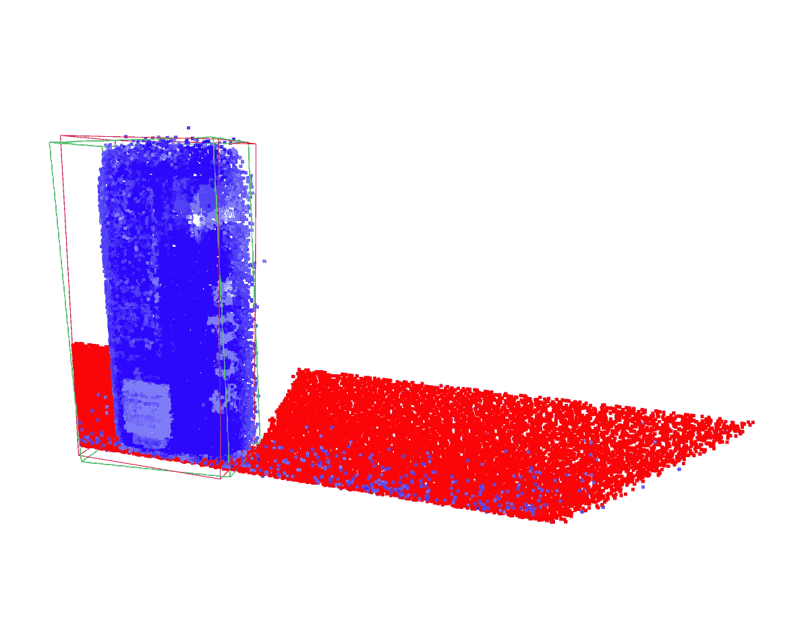

# 理解 PyTorch 中的主成分分析

> 原文：[`towardsdatascience.com/differentiable-principal-component-analysis-in-pytorch-using-power-iteration-ee93ac9fa2c4?source=collection_archive---------6-----------------------#2024-02-18`](https://towardsdatascience.com/differentiable-principal-component-analysis-in-pytorch-using-power-iteration-ee93ac9fa2c4?source=collection_archive---------6-----------------------#2024-02-18)

## 内置函数与数值方法

 [Nikolaus Correll](https://medium.com/@nikolaus.correll?source=post_page---byline--ee93ac9fa2c4--------------------------------)

·发布于 [Towards Data Science](https://towardsdatascience.com/?source=post_page---byline--ee93ac9fa2c4--------------------------------) ·8 分钟阅读·2024 年 2 月 18 日

--

*PCA 是数据科学中降维的重要工具，也用于从点云数据中计算机器人操作的抓取姿势。PCA 也可以直接在更大的机器学习框架中使用，因为它是可微分的。以机器人抓取的点云的两个主成分为例，我们将推导出 PCA 的数值实现，这有助于理解 PCA 是什么以及它的作用。*

如果你不是 Medium 的订阅者，可以免费阅读此故事 [这里](https://medium.com/towards-data-science/differentiable-principal-component-analysis-in-pytorch-using-power-iteration-ee93ac9fa2c4?sk=4a5459e6310ef9ad79a27e93a9dcaf65)。

主成分分析（PCA）广泛应用于数据分析和机器学习中，以减少数据集的维度。目标是找到一组线性不相关（正交）的变量，称为*主成分*，它们能够捕捉数据中的最大方差。第一个主成分代表最大方差的方向，第二个主成分与第一个主成分正交，代表下一个最大方差的方向，依此类推。PCA 还被用于*机器人操作*中，用于找到点云的主轴，然后可以用来定向夹爪。

桌子上的一罐汽水的点云。抓取汽水罐需要将夹爪与汽水罐的主轴对齐。图像来源：作者。

在数学上，主成分的正交性是通过寻找特征向量来实现的……
