# 医疗数据的差分隐私与联邦学习

> 原文：[`towardsdatascience.com/differential-privacy-and-federated-learning-for-medical-data-0f2437d6ece9?source=collection_archive---------7-----------------------#2024-04-23`](https://towardsdatascience.com/differential-privacy-and-federated-learning-for-medical-data-0f2437d6ece9?source=collection_archive---------7-----------------------#2024-04-23)

## 在医疗领域对差分隐私与联邦学习的实际评估。

 [Eric Boernert](https://medium.com/@eric.boernert?source=post_page---byline--0f2437d6ece9--------------------------------)

·发表于[Towards Data Science](https://towardsdatascience.com/?source=post_page---byline--0f2437d6ece9--------------------------------) ·10 分钟阅读·2024 年 4 月 23 日

--

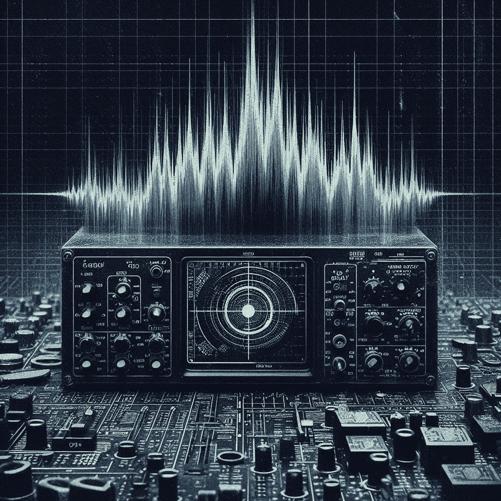

(必应 AI 生成的图像，原始，完全所有权)

# 敏感数据呼唤更多的保护

在大型语言模型从互联网上的所有内容中进行训练的时代，对数据隐私的需求似乎变得比较宽松，尽管这些模型并未考虑到[实际的知识产权](https://futurism.com/video-openai-cto-sora-training-data)，而它们各自的[公司领导也公开承认](https://www.theguardian.com/technology/2024/jan/08/ai-tools-chatgpt-copyrighted-material-openai)这一点。

但是，当谈到患者的数据、我们的健康记录时，有一个更加敏感的平行宇宙，这些数据无疑更加敏感，需要[保护](https://www.youtube.com/watch?v=4-7jSoINyq4)。

此外，全球范围内的法规正在变得更加严格，趋势一致朝着更严格的数据保护法规发展，包括人工智能。

有明显的伦理原因，我们不必解释，但从企业层面的监管和法律角度来看，药品公司、实验室和医院需要使用最先进的技术来保护患者的数据隐私。

# 联邦范式在这里提供帮助

联邦分析和学习是能够分析数据并在患者数据上训练模型而不访问任何原始数据的绝佳选择。

就联邦分析而言，这意味着，例如，我们可以在不访问任何原始数据（这些数据可能导致患者重新识别）的情况下，获得血糖与患者 BMI 之间的相关性。

以机器学习为例，假设是在诊断领域，模型通过分析患者的影像来检测其组织中的恶性变化，并识别癌症的早期阶段。这实际上是机器学习在挽救生命方面的应用。模型在医院层面使用本地的影像和由专业放射科医生标注的标签进行本地训练，然后通过聚合将所有本地模型合并成一个更加通用的模型。这个过程会重复进行数十次或数百次，以提高模型的性能。

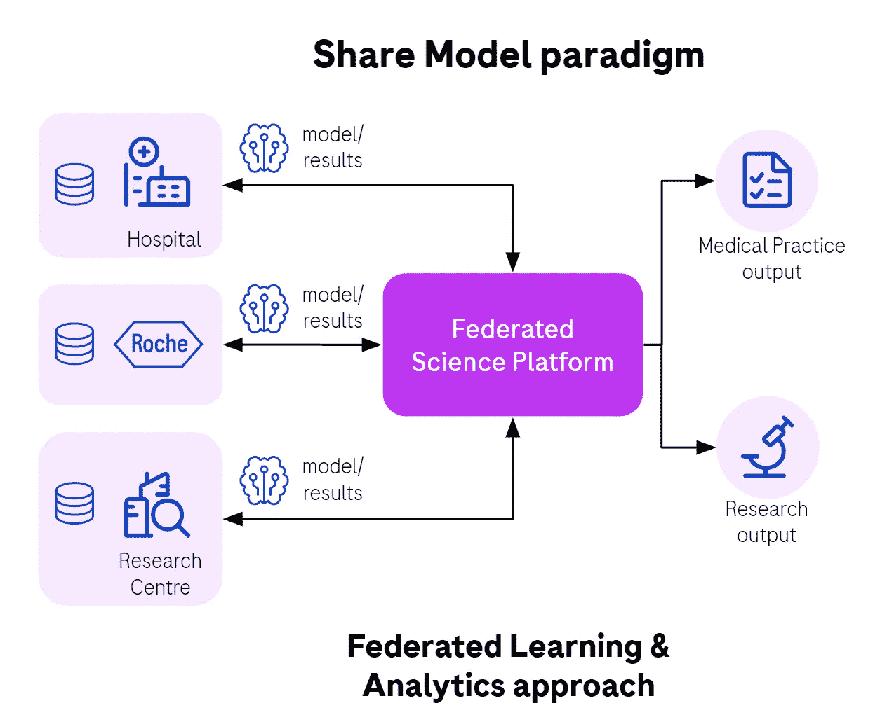

*图 1. 联邦学习在行动中，分享的是模型更新，而不是数据。*

每家医院的回报是，它们将受益于一个训练得更好的模型，能够以更高的概率在未来的患者中检测到疾病。这是一个双赢的局面，特别是对患者来说。

当然，联合网络拓扑和模型聚合策略有很多种，但为了本篇文章的目的，我们尽量聚焦于典型的例子。

# 借助技术建立信任

人们普遍认为，[大量的临床数据未被利用](https://www.ncbi.nlm.nih.gov/pmc/articles/PMC6376961/)，这是因为数据所有者（合理地）[不愿与合作伙伴共享数据](https://bmcpublichealth.biomedcentral.com/articles/10.1186/1471-2458-14-1144)。

联邦学习是建立这种由技术支撑的信任的关键策略，不仅仅依赖于合同和对组成联盟的各个组织员工及合作伙伴伦理的信任。

首先，数据保持在源头，永远不会离开医院，也不会集中到一个可能易受攻击的位置。联邦方法意味着数据不会在外部存在副本，而这些副本在研究完成后可能难以删除。

该技术通过多种遵循深度防御原则的技术手段，阻止了对原始数据的访问。每种手段都将数据暴露的风险和患者重新识别的风险降低了数十倍甚至上千倍。所有这一切都旨在使得发现或重建原始数据变得经济上不可行。

数据首先经过最小化处理，仅暴露必要的属性给本地运行的机器学习代理，个人身份信息（PII）数据被剥离，我们还使用了匿名化技术。

接着，本地节点通过仅允许本地数据拥有者接受的代码和操作对本地数据进行处理，保护本地数据免受所谓过于好奇的数据科学家威胁。例如，医院本地部署的模型训练代码作为一个包，是否被允许运行完全由本地数据拥有者决定。远程数据科学家不能随便向远程节点发送任何代码，因为这将允许他们例如返回原始数据。这需要一种新的去中心化思维方式，以采纳不同的心态和技术进行权限管理，这是另一个有趣的话题，稍后再谈。

# 模型足够隐私吗？

假设所有这些保护层都已到位，仍然存在与模型权重安全性相关的担忧。

在 AI 社区中，对于机器学习模型作为数据的超级压缩形式的关注日益增加，它不像以前认为的那样是一个黑盒子，并且比以前认为的揭示了更多关于底层数据的信息。

这意味着，只要具备足够的技能、时间、精力和强大的硬件，一个有动机的对手可以尝试重建原始数据，或者至少以高概率证明某个患者曾属于用于训练模型的群体（成员推断攻击（MIA））。其他可能的[攻击类型](https://arxiv.org/pdf/2211.14952.pdf)包括提取、重建和规避。

更糟糕的是，我们所有人都钦佩并受益的生成性 AI 的进展，带来了新的、更有效的图像重建技术（[例如，患者的肺部扫描](https://arxiv.org/abs/2202.06924)）。我们所有人都用来按需生成图像的相同理念，可以被对手用来从 MRI/CT 扫描机器重建原始图像。其他类型的数据，如[表格数据](https://arxiv.org/pdf/2208.08114.pdf)、文本、声音和视频，现在也可以通过生成 AI 重建。

# 差分隐私来拯救

差分隐私（DP）算法承诺我们通过牺牲一些模型的准确性来换取对推断攻击的更强抗性。这是另一种值得考虑的隐私-效用权衡。

[差分隐私](https://blog.openmined.org/differential-privacy-using-pydp/)在实际应用中意味着我们添加了一种非常特殊的噪声和裁剪方式，作为回报，这将导致[隐私收益与准确性损失的非常好的比率](https://privacytools.seas.harvard.edu/files/privacytools/files/nissim_et_al_-_differential_privacy_primer_for_non-technical_audiences_1.pdf)。

它可以像最不有效的高斯噪声一样简单，但如今我们拥抱了更加复杂的算法的发展，如稀疏向量技术（SVT）、Opacus 库作为差分隐私随机梯度下降（DP-SGD）的实际实现，以及基于拉普拉斯噪声的经典库（即 PyDP）。

*图 2\. 我们每时每刻都在使用的设备端差分隐私。*

顺便说一下，我们所有人都在享受这种技术的好处，却未曾意识到它的存在，而且它正在实时发生。我们来自移动设备（[Apple iOS](https://machinelearning.apple.com/research/learning-with-privacy-at-scale)，[Google Android](https://developers.googleblog.com/2021/01/how-were-helping-developers-with-differential-privacy.html?m=1)）和桌面操作系统（[Microsoft Windows](https://blogs.microsoft.com/on-the-issues/2020/06/24/differential-privacy-harvard-opendp/)）的遥测数据，正在使用差分隐私和联邦学习算法来训练模型，而无需将原始数据从我们的设备上传送。这项技术已经存在多年了。

现在，越来越多的其他用例正在被采用，包括我们最喜欢的“孤立联邦学习”案例，其中相对较少的参与者拥有大量数据，并在不同组织和公司特意建立的联盟中共享数据。

差分隐私并非专门针对联邦学习。然而，在联邦学习场景中，应用差分隐私的策略以及算法的选择是多样的。不同的算法在联邦学习环境中表现更好，适用于本地数据隐私（LDP）和集中式数据处理。

在联邦学习的背景下，我们预期在应用差分隐私后，模型的准确性会有所下降，但仍然（并且在某种程度上希望）期望模型的表现会优于没有联邦聚合的本地模型。因此，尽管加入了噪音和裁剪（DP），联邦模型仍然应该保持其优势。

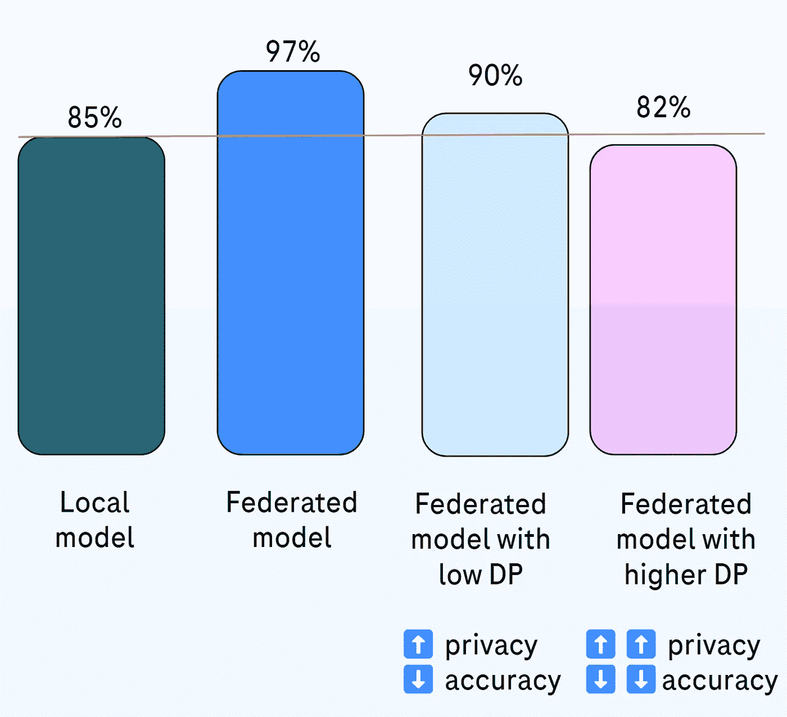

*图 3\. 基于已知文献和我们的经验，我们可以预期的结果。*

差分隐私可以最早应用于源数据（本地差分隐私（LDP））。

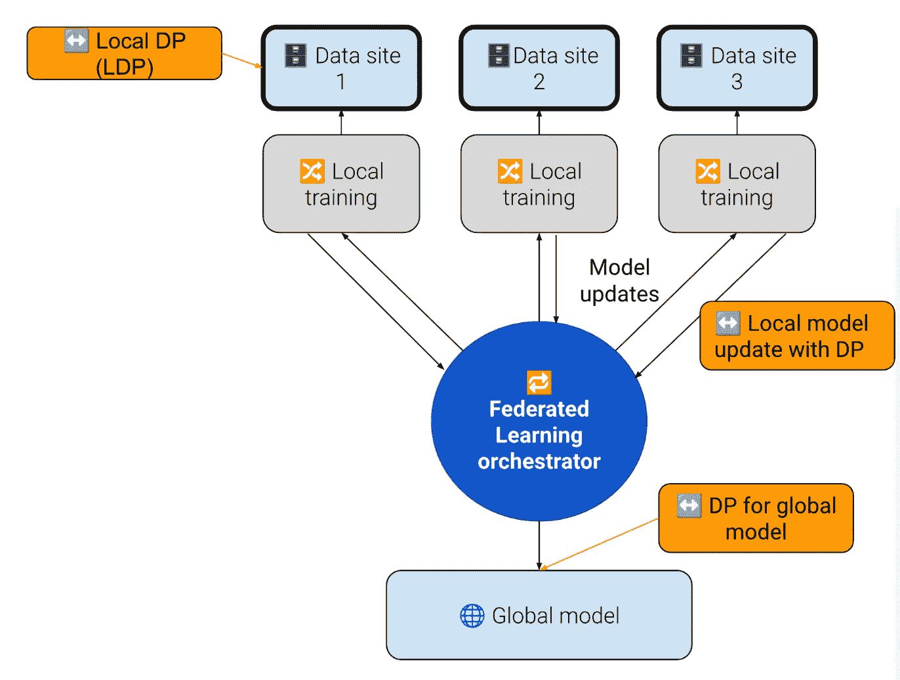

*图 4，不同地方可以应用差分隐私以提高数据保护*

也有一些联邦学习案例发生在一个合作伙伴网络中，所有合作伙伴都拥有数据访问权限，且对数据保护级别的关注较少，因此可能完全没有应用差分隐私。

另一方面，当模型要与外部共享或商业化销售时，可能将差分隐私应用于全局模型也是一个好主意。

# 实际实验结果

在罗氏的联邦开放科学团队，我们选择[英伟达 Flare](https://developer.nvidia.com/flare)作为我们的联邦学习工具，因为它是市场上最成熟的开源联邦框架。我们还与英伟达团队合作，共同推进[NVIDIA Flare 的未来开发](https://developer.nvidia.com/blog/turning-machine-learning-to-federated-learning-in-minutes-with-nvidia-flare-2-4/)，很高兴能够帮助改进这一已经很棒的联邦学习解决方案。

我们测试了三种不同的差分隐私（DP）算法：

+   [Opacus](https://github.com/pytorch/opacus)

+   [SVT](https://github.com/NVIDIA/NVFlare/blob/main/nvflare/app_common/filters/svt_privacy.py)

+   [高斯噪声](https://github.com/NVIDIA/NVFlare/blob/main/research/quantifying-data-leakage/src/nvflare_gradinv/filters/gaussian_privacy.py)

我们为模型应用了不同策略的差分隐私（DP）：

+   每一轮联邦学习

+   仅限于第一轮（联邦训练）

+   每第 N 轮（联邦训练）

对于三种不同的案例（数据集和算法）：

+   FLamby Tiny IXI 数据集

+   乳腺密度分类

+   希格斯分类

所以，我们尝试了算法、策略和数据集（案例）三个维度。

结果符合我们对模型准确度下降的预期，且在隐私预算较低时（如预期）准确率下降较大。

# FLamby Tiny IXI 数据集

(数据集来源：[`owkin.github.io/FLamby/fed_ixi.html`](https://owkin.github.io/FLamby/fed_ixi.html))

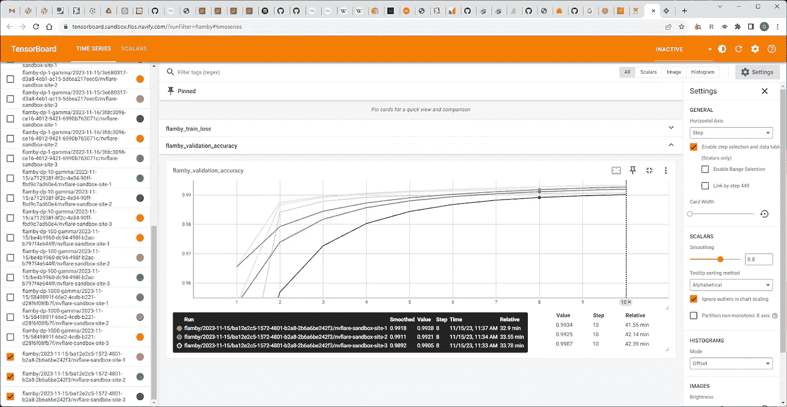

*图 5\. 无 DP 的模型表现*

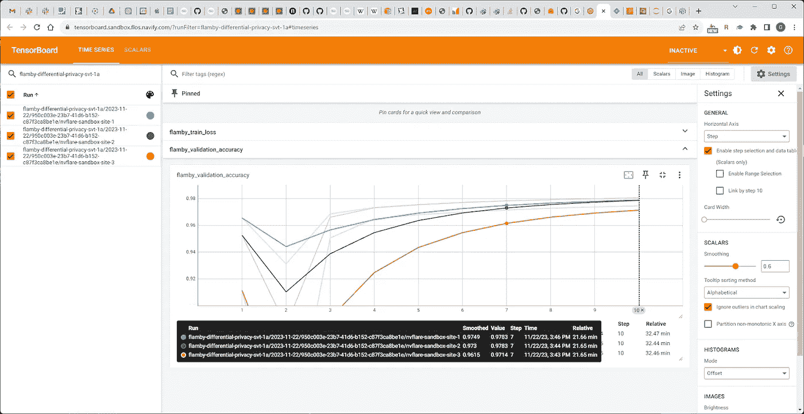

*图 6\. 第一轮应用 DP 的模型表现*

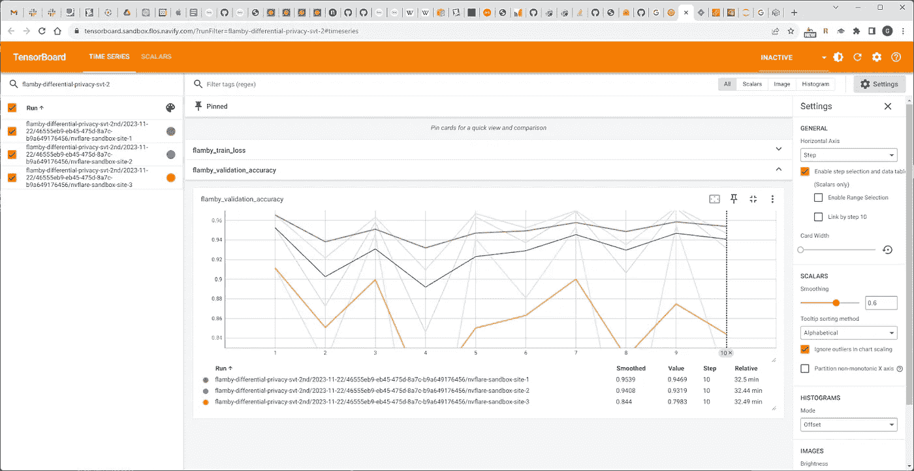

*图 7\. 每第二轮应用 SVT（带有递减阈值）*

我们观察到，与每轮应用 SVT 滤波器相比，在第一轮应用 SVT 时，准确率有了显著改善。

# 乳腺密度案例

(数据集来源 [使用 MONAI 进行乳腺密度分类 | Kaggle](https://www.kaggle.com/code/theoviel/breast-density-classification-using-monai))

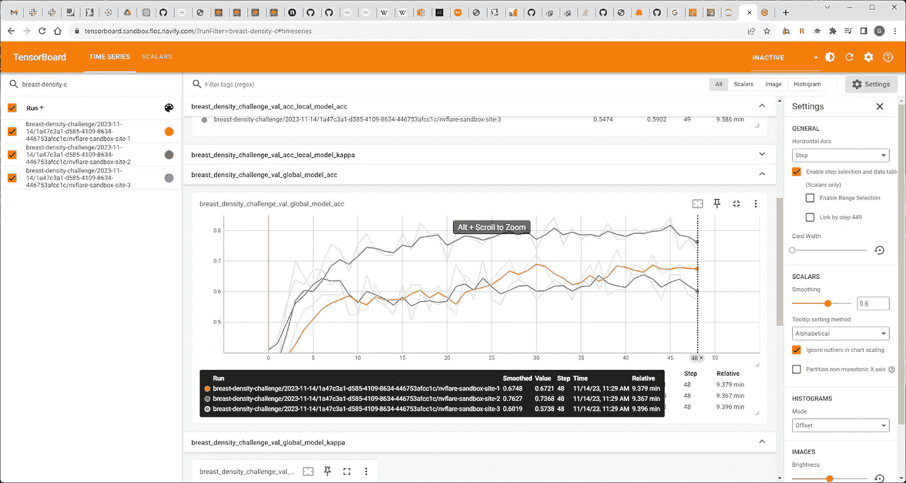

*图 8\. 无 DP 的模型表现*

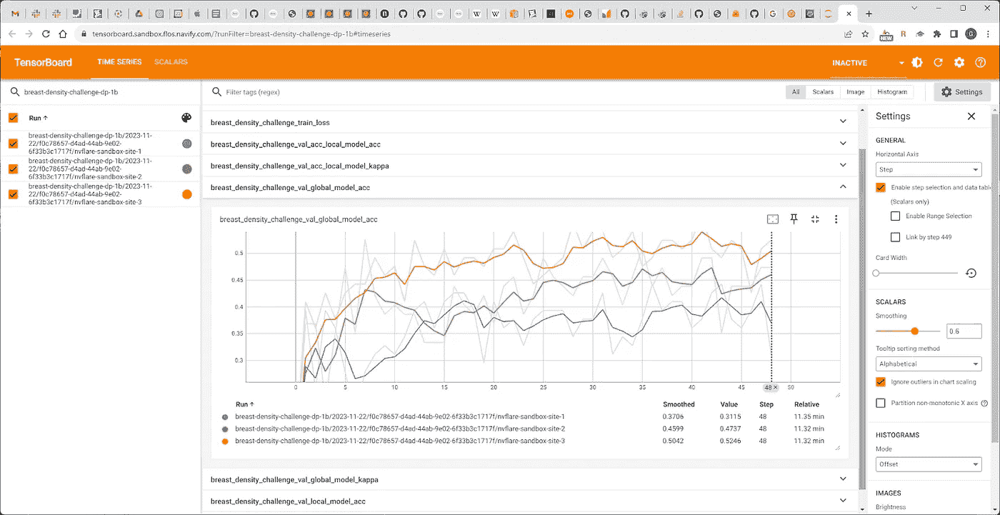

*图 9\. DP 应用于第一轮*

我们观察到，应用高斯噪声滤波器后，准确率有适度的下降。

这个数据集是最麻烦且对 DP 最敏感的（准确度大幅下降，结果不可预测）。

# 希格斯分类

(数据集来源 [HIGGS — UCI 机器学习库](https://archive.ics.uci.edu/dataset/280/higgs))

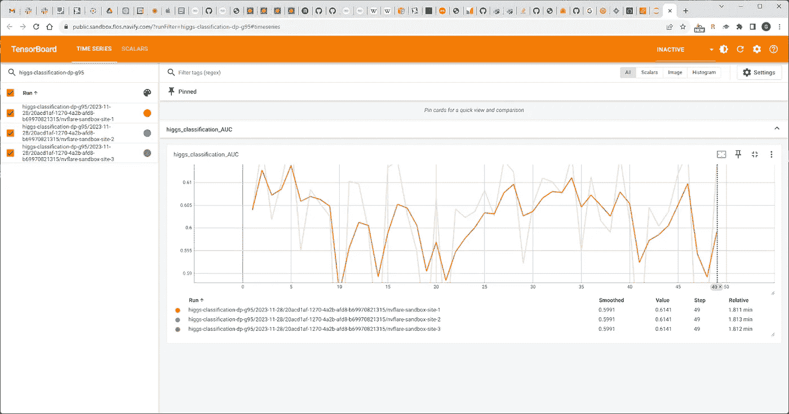

*图 10\. 百分位值 95 时的模型表现*

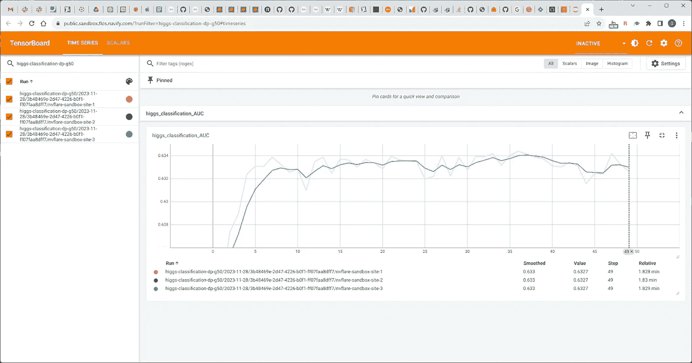

*图 11\. 百分位值 50.*

我们观察到与 DP 相关的微小且可接受的准确率损失。

# 获得的经验教训

重要的经验教训是，差分隐私的结果对给定 DP 算法的参数非常敏感，且很难调整这些参数以避免模型准确率的彻底崩溃。

此外，我们也体验到某种焦虑，基于一种印象，那就是我们并不真正知道，在付出多少代价的情况下，我们获得了多少隐私保护。我们只看到了“成本”方面（准确率下降）。

我们在很大程度上依赖已有的文献，这些文献表明并已证明，即使是少量的 DP 噪声也有助于保护数据安全。

作为工程师，我们希望看到某种自动化度量工具，能够证明我们为隐私保护获得了多少提升，同时损失了多少准确性，甚至可能有某种自动化差分隐私调优技术。这似乎离当前的技术和知识状态还很遥远。

然后我们应用了隐私度量标准，看看没有差分隐私（DP）和有差分隐私（DP）的模型之间是否存在明显差异，我们观察到曲线有变化，但很难量化我们获得了多少收益。

有些算法根本无法工作，有些则需要多次尝试才能正确调优，以提供可行的结果。关于如何为特定数据集和机器学习模型调优不同参数，缺乏明确的指导。

因此，我们目前的看法是，差分隐私（DP）在联邦学习中的应用虽然困难，但完全可行。它需要大量的迭代和试错循环，才能在相信基于算法的隐私提升具有数倍效果的前提下，获得可接受的结果。

# 未来

联邦学习是提高患者治疗效果和疗效的一个极好选择，因为它能够在保护患者数据的同时，提升机器学习模型的表现。

但数据保护从来不会是没有代价的，差分隐私在联邦学习中的应用正是这种权衡的完美例证。

很高兴看到差分隐私算法在联邦学习场景中的进展，能够在最大化模型对推断攻击的抗性时，最小化对准确性的影响。

与所有权衡一样，决策必须在模型的实际应用价值与数据泄露和重建的风险之间做平衡。

这也是我们对隐私度量标准期望不断增长的原因，我们希望能更精确地知道我们在“销售”和“购买”的是什么，它们的交换比例是多少。

这个领域是动态变化的，对于那些想更好保护数据的人和那些有动机违反这些规则并暴露敏感数据的人，都有更好的工具可用。

我们还邀请其他联邦学习领域的专家共同努力，推动并为提高患者数据隐私贡献力量。

作者感谢[Jacek Chmiel](https://www.linkedin.com/in/jacekchmiel/)对博文本身的重大影响，以及帮助发展这些思想并将其付诸实践的人员：[Jacek Chmiel](https://www.linkedin.com/in/jacekchmiel/)、[Lukasz Antczak](https://www.linkedin.com/in/%C5%82ukasz-antczak-a3475910b/)、Grzegory Gajda 和罗氏公司的联邦开放科学团队。

*本文中的所有图片均由作者创作。*
