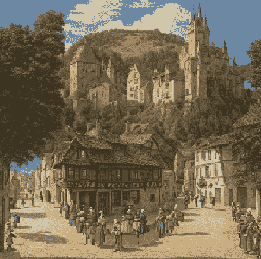
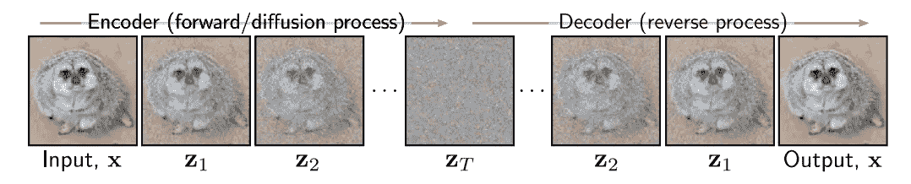
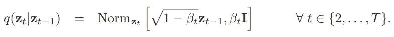
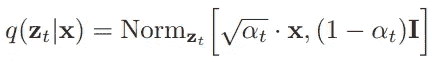
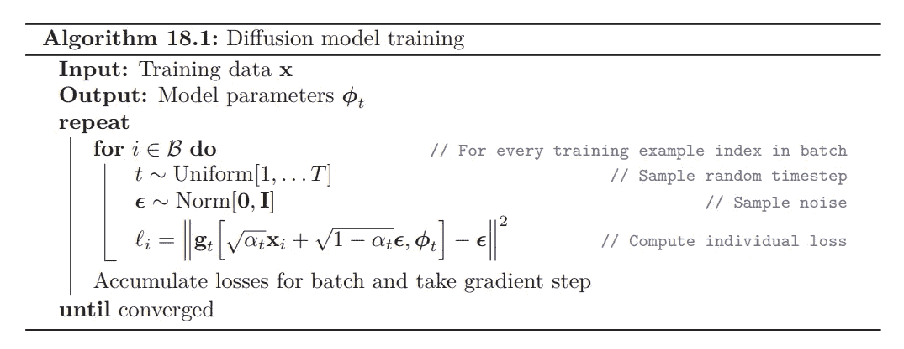
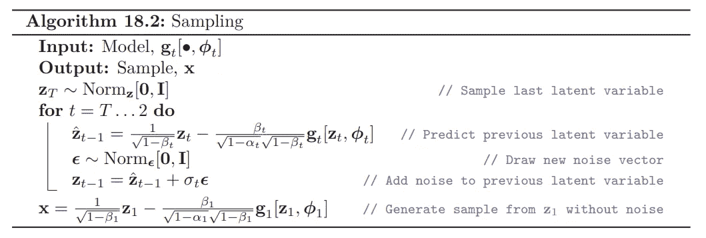
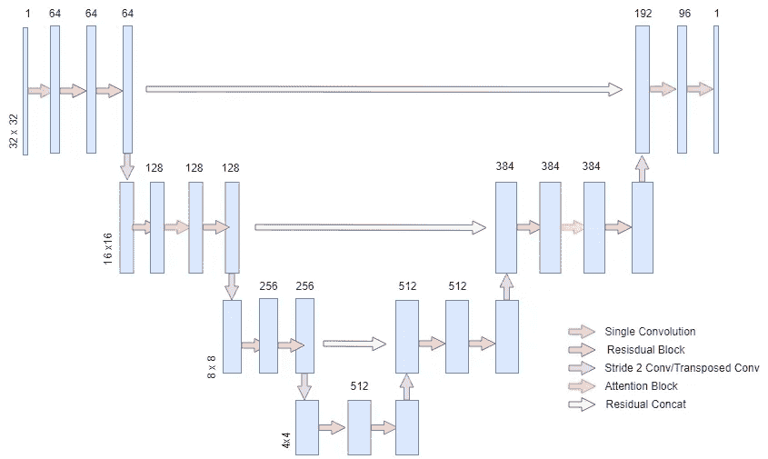
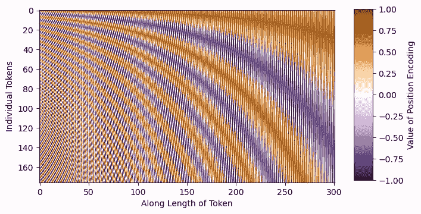
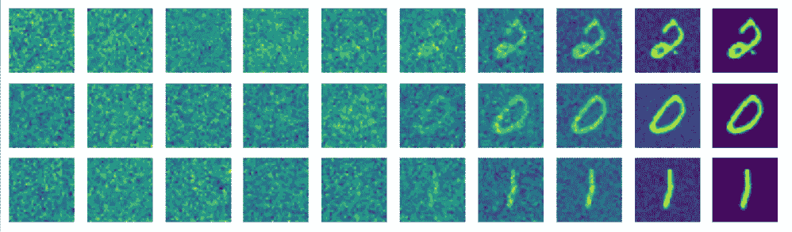

# 用 PyTorch 从零开始构建扩散模型

> 原文：[`towardsdatascience.com/diffusion-model-from-scratch-in-pytorch-ddpm-9d9760528946?source=collection_archive---------0-----------------------#2024-07-04`](https://towardsdatascience.com/diffusion-model-from-scratch-in-pytorch-ddpm-9d9760528946?source=collection_archive---------0-----------------------#2024-07-04)

## 去噪扩散概率模型（DDPM）的实现

[](https://medium.com/@nickd16718?source=post_page---byline--9d9760528946--------------------------------)[](https://towardsdatascience.com/?source=post_page---byline--9d9760528946--------------------------------) [Nicholas DiSalvo](https://medium.com/@nickd16718?source=post_page---byline--9d9760528946--------------------------------)

·发表于[Towards Data Science](https://towardsdatascience.com/?source=post_page---byline--9d9760528946--------------------------------) ·13 分钟阅读·2024 年 7 月 4 日

--


DDPM 在 MNIST 上的例子 — 图片由作者提供

## **介绍**

扩散模型一般来说是一种生成式深度学习模型，通过学习去噪过程来生成数据。扩散模型有很多变体，其中最流行的通常是基于文本条件的模型，可以根据提示生成特定的图像。一些扩散模型（如 Control-Net）甚至可以将图像与特定的艺术风格融合。下面是一个例子：



图片由作者使用微调的 MonsterLabs’ QR Monster V2 生成

如果你不知道这张图片有什么特别之处，可以试着把眼睛离屏幕远一点，或者眯着眼睛看，看看图像中隐藏的秘密。

扩散模型有许多不同的应用和类型，但在本教程中，我们将构建基础的无条件扩散模型——DDPM（去噪扩散概率模型）[1]。我们将从直观地理解算法的工作原理开始，然后从零开始用 PyTorch 构建它。此外，本教程将主要关注算法背后的直观思想和具体的实现细节。有关数学推导和背景内容，可以参考本书[2]。

最后的备注：此实现是为包含单个支持 CUDA 的 GPU 的工作流而构建的。此外，完整的代码仓库可以在这里找到[`github.com/nickd16/Diffusion-Models-from-Scratch`](https://github.com/nickd16/Diffusion-Models-from-Scratch)

## 它是如何工作的 -> 正向和反向过程



图片来自 [2] Simon J.D. Prince 的《理解深度学习》

扩散过程包括正向和反向过程。正向过程是基于噪声时间表的预定马尔可夫链。噪声时间表是一组方差 B1、B2、… BT，它们控制组成马尔可夫链的条件正态分布。



正向过程马尔可夫链 — 图片来自 [2]

这个公式是正向过程的数学表示，但直观上我们可以理解它为一个序列，我们逐渐将我们的数据示例 X 映射到纯噪声。我们正向过程的第一个项只是我们的初始数据示例。在中间时间步 t，我们有 X 的带噪声版本，在最终时间步 T，我们到达大致由标准正态分布控制的纯噪声。当我们构建扩散模型时，我们选择我们的噪声时间表。例如，在 DDPM 中，我们的噪声时间表包含 1000 个时间步，线性增加的方差从 1e-4 到 0.02。还要注意的是，我们的正向过程是静态的，这意味着我们将我们的噪声时间表作为扩散模型的超参数，并且我们不训练正向过程，因为它已经明确定义。

我们必须了解关于正向过程的最后一个关键细节是，因为分布是正态的，我们可以数学推导出一个称为“扩散核”的分布，它是给定我们初始数据点的正向过程中任何中间值的分布。这使我们能够绕过在正向过程中迭代地添加 t-1 个噪声级别的所有中间步骤，以获得具有 t 噪声的图像的分布，这在我们训练模型时会很有用。这在数学上表示为：



扩散核 — 图片来自 [2]

在时间 t 时的 alpha 被定义为从我们的初始时间步到当前时间步的累积乘积 (1-B)。

反向过程是扩散模型的关键。反向过程本质上是逐渐从纯噪声图像中去除噪声量以生成新图像的正向过程的撤销。我们通过从纯噪声数据开始，对于每个时间步 t，我们减去在该时间步上正向过程理论上会添加的噪声量。我们不断去除噪声，直到最终得到类似于我们原始数据分布的东西。我们的大部分工作是训练一个模型来精确逼近正向过程，以估计能够生成新样本的反向过程。

## 算法和训练目标

要训练这样一个模型来估计反向扩散过程，我们可以按照下面定义的图像中的算法进行操作：

1.  从我们的训练数据集中随机选择一个数据点

1.  从我们的噪声（方差）调度中选择一个随机的时间步

1.  将该时间步的噪声添加到我们的数据中，通过“扩散核”模拟前向扩散过程

1.  将去噪后的图像传入我们的模型，预测我们添加的噪声

1.  计算预测噪声与实际噪声之间的均方误差，并通过该目标函数优化我们模型的参数

1.  然后重复！



DDPM 训练算法 — 图片来自[2]

在数学上，算法中的精确公式乍一看可能有些奇怪，尤其是没有看到完整的推导过程，但直观上它是基于我们噪声调度的 alpha 值对扩散核的重参数化，本质上是预测的噪声与我们实际添加到图像中的噪声的平方差。

如果我们的模型能够成功预测基于前向过程特定时间步的噪声量，我们可以从时间步 T 的噪声开始，逐步去除噪声，基于每个时间步，直到我们恢复出类似于原始数据分布的生成样本。

采样算法总结如下：

1.  从标准正态分布生成随机噪声

对于每个时间步，从我们最后的时间步开始，向后推进：

2\. 通过估计反向过程分布来更新 Z，均值由前一步的 Z 参数化，方差由模型在该时间步估计的噪声参数化

3\. 为了稳定性，添加少量噪声（以下解释）

4\. 重复此过程，直到我们到达时间步 0，即恢复的图像！



DDPM 采样算法 — 图片来自[2]

然后用于采样和生成图像的算法可能在数学上看起来复杂，但直观上它归结为一个迭代过程，我们从纯噪声开始，估计在时间步 t 时理论上添加的噪声，并将其减去。我们一直执行这个过程，直到得到生成的样本。唯一需要注意的小细节是，在减去估计的噪声后，我们会加回一小部分噪声，以保持过程的稳定性。例如，在迭代过程开始时一次性估计并减去所有噪声会导致非常不连贯的样本，因此，实际上将噪声稍微加回，并在每个时间步上进行迭代，已被实验证明能生成更好的样本。

## UNET

DDPM 论文的作者使用了最初为医学图像分割设计的 UNET 架构，构建了一个模型来预测扩散逆过程的噪声。我们在本教程中将使用的模型是为 32x32 图像设计的，适合 MNIST 等数据集，但该模型也可以扩展以处理更高分辨率的数据。UNET 有许多变体，但我们将构建的模型架构概览如下图所示。



用于扩散的 UNET — 作者提供的图片

用于 DDPM 的 UNET 类似于经典的 UNET，因为它包含了一个下采样流和一个上采样流，减轻了网络的计算负担，同时在两个流之间有跳跃连接，将模型的浅层和深层特征的信息合并起来。

DDPM UNET 和经典 UNET 之间的主要区别在于 DDPM UNET 在 16x16 维度层中具有注意力机制，并且在每个残差块中具有正弦变压器嵌入。正弦嵌入背后的含义是告诉模型我们正在尝试预测噪声的时间步长。这有助于模型通过在噪声时间表上注入位置信息来预测每个时间步长的噪声。例如，如果我们有一个在某些时间步长上有很多噪声的噪声时间表，模型理解它必须预测的时间步长可以帮助模型对相应时间步长的噪声进行预测。关于注意力和嵌入的更一般信息可以在这里找到[3]，供那些还不熟悉它们的人从变压器架构中了解。

在我们的模型实现中，我们将从定义我们的导入开始（可能的 pip 安装命令已经注释以供参考），并编写我们的正弦时间步嵌入。直观地说，正弦嵌入是不同的 sin 和 cos 频率，可以直接添加到我们的输入中，为模型提供额外的位置/顺序理解。从下面的图片中可以看到，每个正弦波是独一无二的，这将使模型意识到它在我们的噪声时间表中的位置。



正弦嵌入 — 来自[3]的图片

```py
# Imports
import torch
import torch.nn as nn
import torch.nn.functional as F
from einops import rearrange #pip install einops
from typing import List
import random
import math
from torchvision import datasets, transforms
from torch.utils.data import DataLoader 
from timm.utils import ModelEmaV3 #pip install timm 
from tqdm import tqdm #pip install tqdm
import matplotlib.pyplot as plt #pip install matplotlib
import torch.optim as optim
import numpy as np

class SinusoidalEmbeddings(nn.Module):
    def __init__(self, time_steps:int, embed_dim: int):
        super().__init__()
        position = torch.arange(time_steps).unsqueeze(1).float()
        div = torch.exp(torch.arange(0, embed_dim, 2).float() * -(math.log(10000.0) / embed_dim))
        embeddings = torch.zeros(time_steps, embed_dim, requires_grad=False)
        embeddings[:, 0::2] = torch.sin(position * div)
        embeddings[:, 1::2] = torch.cos(position * div)
        self.embeddings = embeddings

    def forward(self, x, t):
        embeds = self.embeddings[t].to(x.device)
        return embeds[:, :, None, None]
```

UNET 中每个层中的残差块将等同于原始 DDPM 论文中使用的残差块。每个残差块将包含一系列的 group-norm、ReLU 激活、3x3“same”卷积、dropout 和一个跳跃连接。

```py
# Residual Blocks
class ResBlock(nn.Module):
    def __init__(self, C: int, num_groups: int, dropout_prob: float):
        super().__init__()
        self.relu = nn.ReLU(inplace=True)
        self.gnorm1 = nn.GroupNorm(num_groups=num_groups, num_channels=C)
        self.gnorm2 = nn.GroupNorm(num_groups=num_groups, num_channels=C)
        self.conv1 = nn.Conv2d(C, C, kernel_size=3, padding=1)
        self.conv2 = nn.Conv2d(C, C, kernel_size=3, padding=1)
        self.dropout = nn.Dropout(p=dropout_prob, inplace=True)

    def forward(self, x, embeddings):
        x = x + embeddings[:, :x.shape[1], :, :]
        r = self.conv1(self.relu(self.gnorm1(x)))
        r = self.dropout(r)
        r = self.conv2(self.relu(self.gnorm2(r)))
        return r + x
```

在 DDPM 中，作者在每个 UNET 的层（分辨率尺度）中使用了 2 个残差块，对于 16x16 维度的层，我们在两个残差块之间包含了经典的变压器注意力机制。我们现在将为 UNET 实现注意力机制：

```py
class Attention(nn.Module):
    def __init__(self, C: int, num_heads:int , dropout_prob: float):
        super().__init__()
        self.proj1 = nn.Linear(C, C*3)
        self.proj2 = nn.Linear(C, C)
        self.num_heads = num_heads
        self.dropout_prob = dropout_prob

    def forward(self, x):
        h, w = x.shape[2:]
        x = rearrange(x, 'b c h w -> b (h w) c')
        x = self.proj1(x)
        x = rearrange(x, 'b L (C H K) -> K b H L C', K=3, H=self.num_heads)
        q,k,v = x[0], x[1], x[2]
        x = F.scaled_dot_product_attention(q,k,v, is_causal=False, dropout_p=self.dropout_prob)
        x = rearrange(x, 'b H (h w) C -> b h w (C H)', h=h, w=w)
        x = self.proj2(x)
        return rearrange(x, 'b h w C -> b C h w')
```

注意力机制的实现很直接。我们重新塑造我们的数据，使得 h*w 维度合并成一个“序列”维度，就像传统的变压器模型的输入一样，通道维度变成了嵌入特征维度。在这个实现中，我们利用 torch.nn.functional.scaled_dot_product_attention，因为这个实现包含了 flash attention，这是一个经过优化的注意力版本，仍然在数学上等同于经典的变压器注意力。关于 flash attention 的更多信息，您可以参考这些论文：[4]，[5]。

最终，在这一阶段，我们可以定义 UNET 的完整层：

```py
class UnetLayer(nn.Module):
    def __init__(self, 
            upscale: bool, 
            attention: bool, 
            num_groups: int, 
            dropout_prob: float,
            num_heads: int,
            C: int):
        super().__init__()
        self.ResBlock1 = ResBlock(C=C, num_groups=num_groups, dropout_prob=dropout_prob)
        self.ResBlock2 = ResBlock(C=C, num_groups=num_groups, dropout_prob=dropout_prob)
        if upscale:
            self.conv = nn.ConvTranspose2d(C, C//2, kernel_size=4, stride=2, padding=1)
        else:
            self.conv = nn.Conv2d(C, C*2, kernel_size=3, stride=2, padding=1)
        if attention:
            self.attention_layer = Attention(C, num_heads=num_heads, dropout_prob=dropout_prob)

    def forward(self, x, embeddings):
        x = self.ResBlock1(x, embeddings)
        if hasattr(self, 'attention_layer'):
            x = self.attention_layer(x)
        x = self.ResBlock2(x, embeddings)
        return self.conv(x), x
```

如前所述，DDPM 中的每一层都有 2 个残差块，并可能包含一个注意力机制，我们还将嵌入向量传递到每个残差块中。此外，我们返回下采样或上采样的值，以及之前的值，我们会存储并用于残差拼接跳跃连接。

最后，我们可以完成 UNET 类：

```py
class UNET(nn.Module):
    def __init__(self,
            Channels: List = [64, 128, 256, 512, 512, 384],
            Attentions: List = [False, True, False, False, False, True],
            Upscales: List = [False, False, False, True, True, True],
            num_groups: int = 32,
            dropout_prob: float = 0.1,
            num_heads: int = 8,
            input_channels: int = 1,
            output_channels: int = 1,
            time_steps: int = 1000):
        super().__init__()
        self.num_layers = len(Channels)
        self.shallow_conv = nn.Conv2d(input_channels, Channels[0], kernel_size=3, padding=1)
        out_channels = (Channels[-1]//2)+Channels[0]
        self.late_conv = nn.Conv2d(out_channels, out_channels//2, kernel_size=3, padding=1)
        self.output_conv = nn.Conv2d(out_channels//2, output_channels, kernel_size=1)
        self.relu = nn.ReLU(inplace=True)
        self.embeddings = SinusoidalEmbeddings(time_steps=time_steps, embed_dim=max(Channels))
        for i in range(self.num_layers):
            layer = UnetLayer(
                upscale=Upscales[i],
                attention=Attentions[i],
                num_groups=num_groups,
                dropout_prob=dropout_prob,
                C=Channels[i],
                num_heads=num_heads
            )
            setattr(self, f'Layer{i+1}', layer)

    def forward(self, x, t):
        x = self.shallow_conv(x)
        residuals = []
        for i in range(self.num_layers//2):
            layer = getattr(self, f'Layer{i+1}')
            embeddings = self.embeddings(x, t)
            x, r = layer(x, embeddings)
            residuals.append(r)
        for i in range(self.num_layers//2, self.num_layers):
            layer = getattr(self, f'Layer{i+1}')
            x = torch.concat((layer(x, embeddings)[0], residuals[self.num_layers-i-1]), dim=1)
        return self.output_conv(self.relu(self.late_conv(x)))
```

基于我们已经创建的类，实施过程是直接的。此实现的唯一区别在于我们上游的通道略大于典型的 UNET 通道。我发现这种架构在 16GB VRAM 的单个 GPU 上训练效率更高。

## 调度器

为 DDPM 编写噪声/方差调度器也是非常简单的。在 DDPM 中，正如之前提到的，我们的调度器将从 1e-4 开始，到 0.02 结束，并线性增加。

```py
class DDPM_Scheduler(nn.Module):
    def __init__(self, num_time_steps: int=1000):
        super().__init__()
        self.beta = torch.linspace(1e-4, 0.02, num_time_steps, requires_grad=False)
        alpha = 1 - self.beta
        self.alpha = torch.cumprod(alpha, dim=0).requires_grad_(False)

    def forward(self, t):
        return self.beta[t], self.alpha[t]
```

我们返回 beta（方差）值和 alpha 值，因为我们在训练和采样的公式中都会使用这两个值，基于它们的数学推导。

```py
def set_seed(seed: int = 42):
    torch.manual_seed(seed)
    torch.cuda.manual_seed_all(seed)
    torch.backends.cudnn.deterministic = True
    torch.backends.cudnn.benchmark = False
    np.random.seed(seed)
    random.seed(seed)
```

另外（不是必须的），此功能定义了一个训练种子。这意味着，如果你想重现特定的训练实例，可以使用一个设置的种子，这样每次使用相同的种子时，随机权重和优化器的初始化将保持一致。

## 训练

对于我们的实现，我们将创建一个模型来生成 MNIST 数据（手写数字）。由于这些图像在 pytorch 中默认是 28x28，我们将图像填充到 32x32 以符合原始论文中基于 32x32 图像训练的设置。

对于优化，我们使用 Adam 优化器，初始学习率为 2e-5。我们还使用 EMA（指数加权移动平均）来提高生成质量。EMA 是模型参数的加权平均值，在推理时可以生成更平滑、噪声更少的样本。对于这一实现，我使用了 timm 库中的 EMAV3 默认实现，权重为 0.9999，正如 DDPM 论文中所使用的。

总结我们的训练过程，我们只需按照上述伪代码执行。我们为每个批次随机选择时间步，根据这些时间步和调度器为批次中的数据添加噪声，并将带噪声的图像批次输入到 UNET 中，同时提供时间步信息以引导正弦嵌入。我们根据伪代码中的“扩散核”公式为图像添加噪声。然后，我们将模型预测的噪声量与实际添加的噪声进行比较，并优化噪声的均方误差。我们还实现了基本的检查点功能，以便在不同的训练周期暂停和恢复训练。

```py
def train(batch_size: int=64,
          num_time_steps: int=1000,
          num_epochs: int=15,
          seed: int=-1,
          ema_decay: float=0.9999,  
          lr=2e-5,
          checkpoint_path: str=None):
    set_seed(random.randint(0, 2**32-1)) if seed == -1 else set_seed(seed)

    train_dataset = datasets.MNIST(root='./data', train=True, download=False,transform=transforms.ToTensor())
    train_loader = DataLoader(train_dataset, batch_size=batch_size, shuffle=True, drop_last=True, num_workers=4)

    scheduler = DDPM_Scheduler(num_time_steps=num_time_steps)
    model = UNET().cuda()
    optimizer = optim.Adam(model.parameters(), lr=lr)
    ema = ModelEmaV3(model, decay=ema_decay)
    if checkpoint_path is not None:
        checkpoint = torch.load(checkpoint_path)
        model.load_state_dict(checkpoint['weights'])
        ema.load_state_dict(checkpoint['ema'])
        optimizer.load_state_dict(checkpoint['optimizer'])
    criterion = nn.MSELoss(reduction='mean')

    for i in range(num_epochs):
        total_loss = 0
        for bidx, (x,_) in enumerate(tqdm(train_loader, desc=f"Epoch {i+1}/{num_epochs}")):
            x = x.cuda()
            x = F.pad(x, (2,2,2,2))
            t = torch.randint(0,num_time_steps,(batch_size,))
            e = torch.randn_like(x, requires_grad=False)
            a = scheduler.alpha[t].view(batch_size,1,1,1).cuda()
            x = (torch.sqrt(a)*x) + (torch.sqrt(1-a)*e)
            output = model(x, t)
            optimizer.zero_grad()
            loss = criterion(output, e)
            total_loss += loss.item()
            loss.backward()
            optimizer.step()
            ema.update(model)
        print(f'Epoch {i+1} | Loss {total_loss / (60000/batch_size):.5f}')

    checkpoint = {
        'weights': model.state_dict(),
        'optimizer': optimizer.state_dict(),
        'ema': ema.state_dict()
    }
    torch.save(checkpoint, 'checkpoints/ddpm_checkpoint')
```

对于推理，我们再次完全遵循伪代码的另一部分。直观地说，我们只是反转了前向过程。我们从纯噪声开始，现在训练好的模型可以预测每个时间步的估计噪声，然后可以逐步生成全新的样本。每个不同的噪声起点，我们都可以生成一个与原始数据分布相似但独特的不同样本。推理的公式在本文中并未推导，但开头提到的参考文献可以帮助读者深入理解。

另外，请注意，我包括了一个辅助函数来查看扩散图像，这样你可以直观地看到模型学习反向过程的效果如何。

```py
def display_reverse(images: List):
    fig, axes = plt.subplots(1, 10, figsize=(10,1))
    for i, ax in enumerate(axes.flat):
        x = images[i].squeeze(0)
        x = rearrange(x, 'c h w -> h w c')
        x = x.numpy()
        ax.imshow(x)
        ax.axis('off')
    plt.show()

def inference(checkpoint_path: str=None,
              num_time_steps: int=1000,
              ema_decay: float=0.9999, ):
    checkpoint = torch.load(checkpoint_path)
    model = UNET().cuda()
    model.load_state_dict(checkpoint['weights'])
    ema = ModelEmaV3(model, decay=ema_decay)
    ema.load_state_dict(checkpoint['ema'])
    scheduler = DDPM_Scheduler(num_time_steps=num_time_steps)
    times = [0,15,50,100,200,300,400,550,700,999]
    images = []

    with torch.no_grad():
        model = ema.module.eval()
        for i in range(10):
            z = torch.randn(1, 1, 32, 32)
            for t in reversed(range(1, num_time_steps)):
                t = [t]
                temp = (scheduler.beta[t]/( (torch.sqrt(1-scheduler.alpha[t]))*(torch.sqrt(1-scheduler.beta[t])) ))
                z = (1/(torch.sqrt(1-scheduler.beta[t])))*z - (temp*model(z.cuda(),t).cpu())
                if t[0] in times:
                    images.append(z)
                e = torch.randn(1, 1, 32, 32)
                z = z + (e*torch.sqrt(scheduler.beta[t]))
            temp = scheduler.beta[0]/( (torch.sqrt(1-scheduler.alpha[0]))*(torch.sqrt(1-scheduler.beta[0])) )
            x = (1/(torch.sqrt(1-scheduler.beta[0])))*z - (temp*model(z.cuda(),[0]).cpu())

            images.append(x)
            x = rearrange(x.squeeze(0), 'c h w -> h w c').detach()
            x = x.numpy()
            plt.imshow(x)
            plt.show()
            display_reverse(images)
            images = []
```

```py
def main():
    train(checkpoint_path='checkpoints/ddpm_checkpoint', lr=2e-5, num_epochs=75)
    inference('checkpoints/ddpm_checkpoint')

if __name__ == '__main__':
    main()
```

在上述实验细节下训练 75 个 epoch 后，我们得到以下结果：



作者提供的图像

到目前为止，我们已经用 PyTorch 从零开始编码了 DDPM！

感谢阅读！

## 参考文献

[1] [DDPM](https://arxiv.org/abs/2006.11239)

[2] [理解深度学习](https://udlbook.github.io/udlbook/)

[3] [Attention is All You Need](https://arxiv.org/abs/1706.03762)

[4] [Flash Attention](https://arxiv.org/abs/2205.14135)

[5] [Flash Attention 2](https://arxiv.org/abs/2307.08691)
