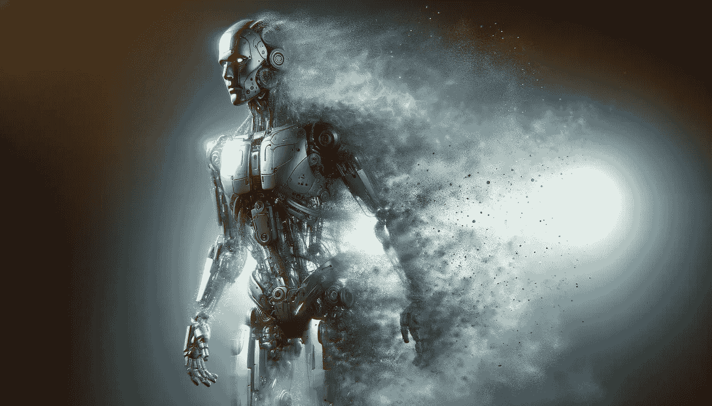

# 扩散 Transformer 解析

> 原文：[`towardsdatascience.com/diffusion-transformer-explained-e603c4770f7e?source=collection_archive---------2-----------------------#2024-02-28`](https://towardsdatascience.com/diffusion-transformer-explained-e603c4770f7e?source=collection_archive---------2-----------------------#2024-02-28)

## 探索将 Transformer 引入图像生成领域的架构

 [马里奥·拉尔切尔](https://mnslarcher.medium.com/?source=post_page---byline--e603c4770f7e--------------------------------)

·发表于 [Towards Data Science](https://towardsdatascience.com/?source=post_page---byline--e603c4770f7e--------------------------------) ·12 分钟阅读·2024 年 2 月 28 日

--

使用 DALL·E 生成的图像。

# 介绍

在震撼了 NLP 并通过视觉 Transformer（ViT）及其后续模型进入计算机视觉领域后，Transformer 现在正在进入图像生成领域。它们逐渐成为 U-Net 的替代方案，而 U-Net 是所有早期扩散模型的基础卷积架构。本文将探讨 **扩散 Transformer**（**DiT**），由 William Peebles 和 Saining Xie 在他们的论文“**使用 Transformer 的可扩展扩散模型**”中介绍。

 [## 使用 Transformer 的可扩展扩散模型

### 我们探索了一类基于 Transformer 架构的新型扩散模型。我们训练了潜在扩散模型的…

arxiv.org](https://arxiv.org/abs/2212.09748?source=post_page-----e603c4770f7e--------------------------------)

DiT 影响了其他基于 Transformer 的扩散模型的发展，例如 [PIXART-α](https://pixart-alpha.github.io/)、[Sora](https://openai.com/sora)（OpenAI 惊人的文本到视频模型），以及在我写这篇文章时的 [Stable Diffusion 3](https://stability.ai/news/stable-diffusion-3)。让我们开始探索这些新兴的架构，它们正在推动扩散模型的进化。

# 前言

鉴于这是一个高级话题，我必须假设读者对…
