# 在 QGIS 和 Python 中溶解地图边界

> 原文：[`towardsdatascience.com/dissolving-map-boundaries-in-qgis-and-python-1ccf224e293b?source=collection_archive---------3-----------------------#2024-05-04`](https://towardsdatascience.com/dissolving-map-boundaries-in-qgis-and-python-1ccf224e293b?source=collection_archive---------3-----------------------#2024-05-04)

## 本文描述了一些有趣的过程，通过使用 QGIS 和 Python 中的 geopandas 库来转换矢量数据集中的地图边界。

[](https://medium.com/@himalaya.birshrestha?source=post_page---byline--1ccf224e293b--------------------------------)[](https://towardsdatascience.com/?source=post_page---byline--1ccf224e293b--------------------------------) [Himalaya Bir Shrestha](https://medium.com/@himalaya.birshrestha?source=post_page---byline--1ccf224e293b--------------------------------)

·发表于 [Towards Data Science](https://towardsdatascience.com/?source=post_page---byline--1ccf224e293b--------------------------------) ·阅读时长 6 分钟·2024 年 5 月 4 日

--

最近，在我的一个项目中，我需要定义一个地区中各个国家的构成，使该地区与其他地区区分开，并在该大陆的地图上突出显示。以亚洲的南亚地区为例。南亚地区包括八个国家：阿富汗、孟加拉国、不丹、印度、马尔代夫、尼泊尔、巴基斯坦和斯里兰卡。从亚洲地图中，我想裁剪出南亚地区，并在该大陆地图上突出显示出来。此外，我还想进一步操作，溶解该地区内各个国家的边界，使该地区可以作为一个单一单元进行展示。

我通过使用量子 GIS（QGIS）和 Python 中的 geopandas 包成功实现了这一目标。在这个过程中，我利用了我已经熟悉的裁剪功能，同时我也学习了“溶解”功能，这个功能让我感到非常着迷。在这篇文章中，我将分享我对这些功能的学习，以及我是如何实现我的目标的。让我们开始吧。

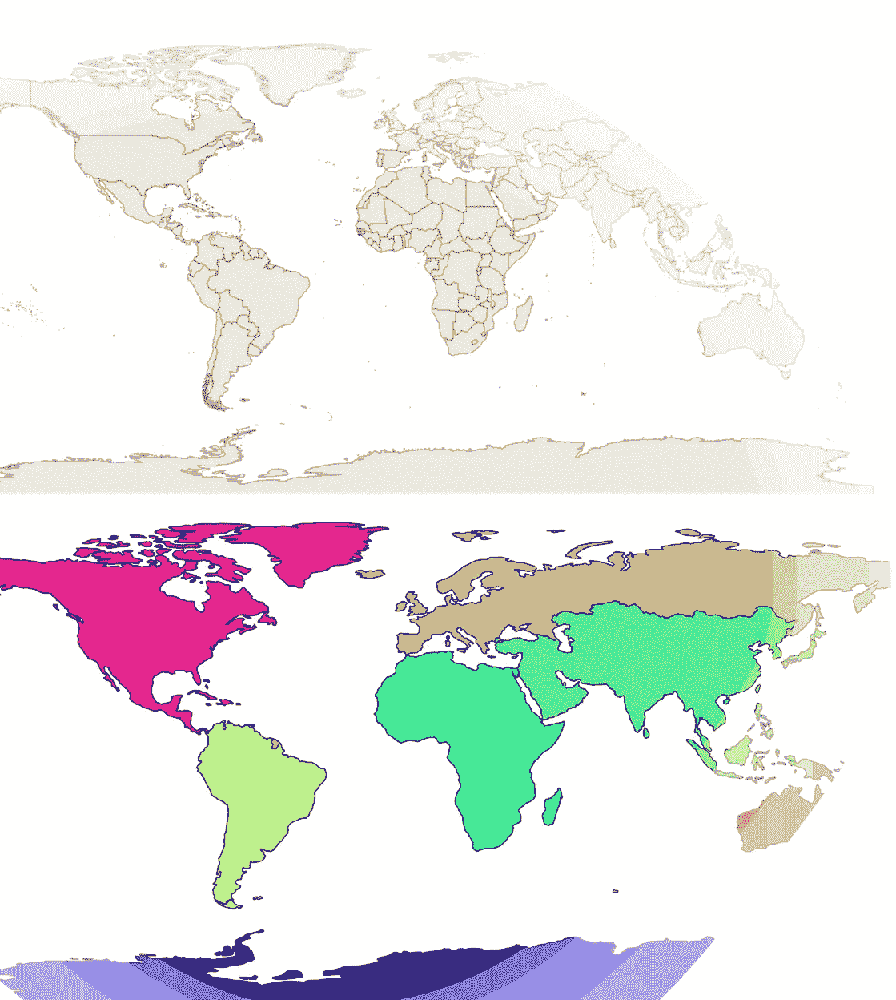

图片来源：作者。

# 1\. QGIS

在一个空的 QGIS 项目中，通过在页面底部的坐标空间中输入`world`，我可以调用一个内置的世界地图，显示所有国家的行政边界，如下所示。

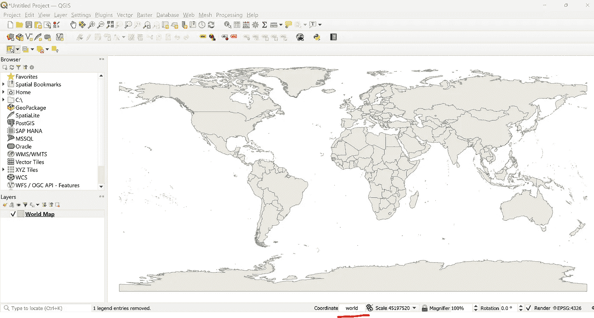

在 QGIS 中获取世界地图。图片来源：作者。

接下来，通过使用选择功能，我选择了南亚的 8 个国家，如下图所示。QGIS 提供了手动选择、通过多边形、通过半径以及通过鼠标点击单独选择或取消选择国家的选项。

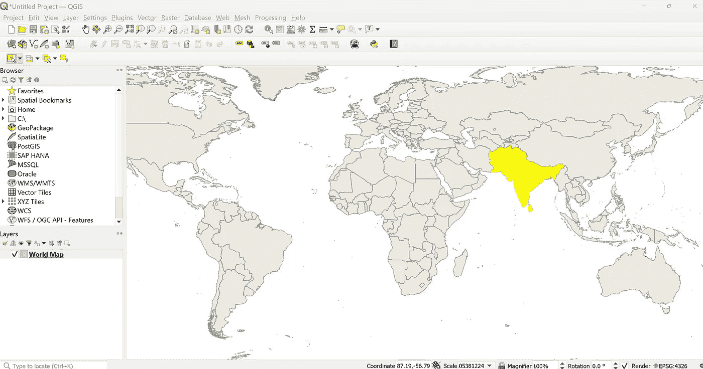

从世界地图中选择国家。图片由作者提供。

## **在 QGIS 中剪切**

在 QGIS 中从世界地图中剪切这些国家非常简单。只需进入菜单中的“矢量”->选择地理处理工具->选择剪切。在选项中，我勾选了“仅选择输入图层中的选定特征”并运行了该过程。

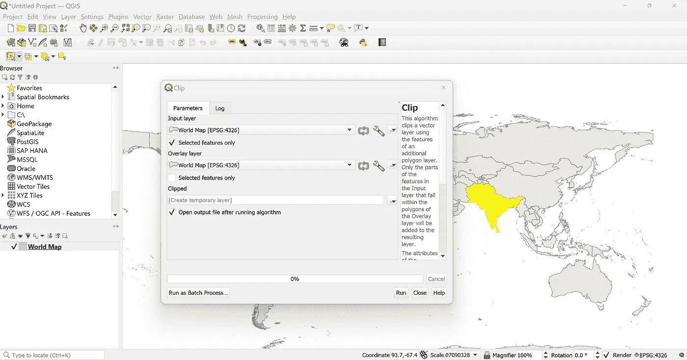

运行剪切算法。图片由作者提供。

剪切操作仅用时 7.24 秒，我得到了一个名为“Clipped”的新图层。下图中用棕色表示。通过进入图层的属性，在 QGIS 的符号学选项中可以使用不同的着色选项。

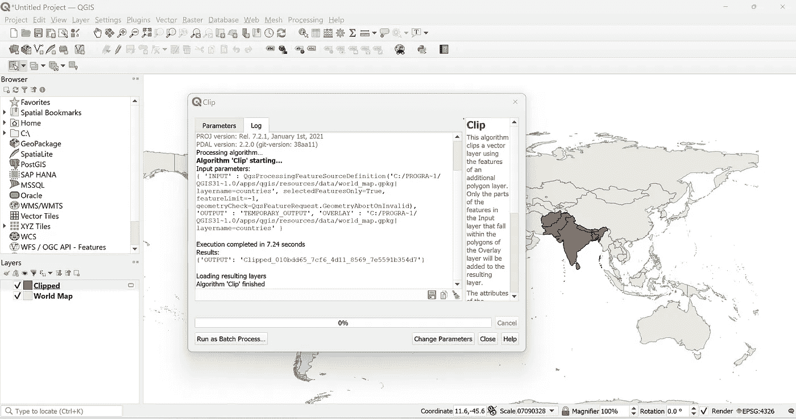

新的剪切图层已创建。图片由作者提供。

## 在 QGIS 中溶解边界

接下来，我想要溶解南亚各国之间的边界。为此，我选择了南亚的所有国家。我进入矢量菜单->选择地理处理工具->溶解。与上一步类似，我选择了“仅选择输入图层中的选定特征”并运行了该算法，仅用了 0.08 秒。创建了一个新的名为“Dissolved”的图层，在其中各国的行政边界被溶解，呈现为一个单独的单位，如下所示：

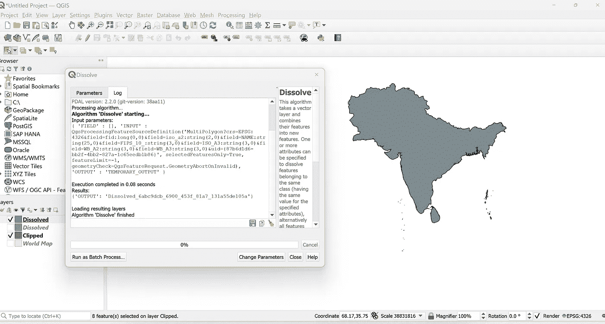

新的溶解图层已创建。图片由作者提供。

同时可视化世界图层和溶解图层，效果如下所示：

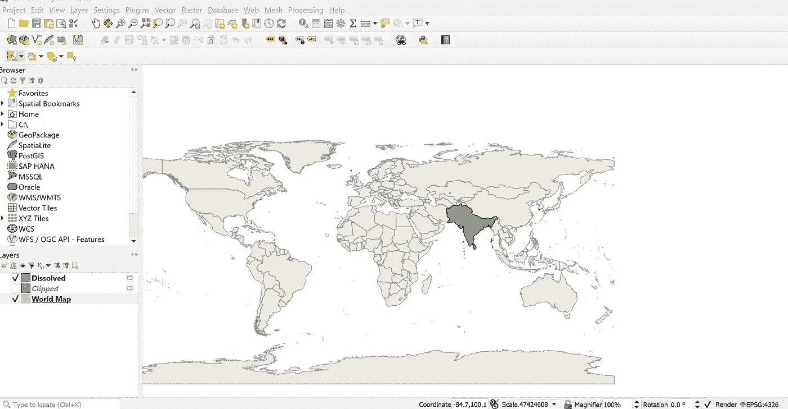

溶解图层和世界图层。图片由作者提供。

# **2. Geopandas**

在本节中，我将展示如何在 Python 中使用 geopandas 包实现相同的目标。

在第一步中，我读取了 geopandas 包内建的世界地图数据集。它包含了全世界的矢量数据以及所有国家的行政边界。这些数据来自于[Natural Earth](https://medium.com/r?url=https%3A%2F%2Fwww.naturalearthdata.com%2Fdownloads%2F110m-cultural-vectors%2F)数据集，且可以免费使用。

```py
import pandas as pd
import geopandas as gpd
import matplotlib.pyplot as plt
import numpy as np

world = gpd.read_file(gpd.datasets.get_path('naturalearth_lowres'))
world.plot(color = "lightgrey")
```

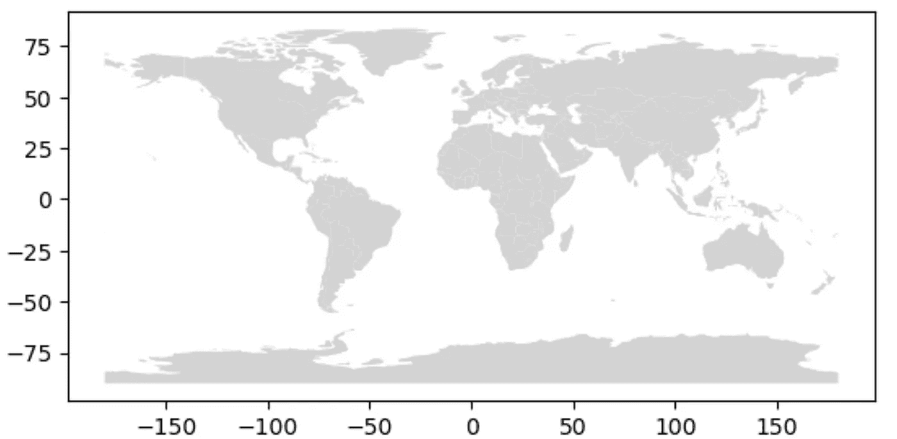

在 geopandas 中绘制世界地图。图片由作者提供。

## 使用 geopandas 进行剪切

在我之前的[文章](https://medium.com/towards-data-science/geoplotting-emissions-intensity-of-electricity-generation-in-europe-90c22b378858)中，我展示了如何从原始的 geopandas 数据框或图层中剪切出自定义的多边形几何形状作为掩模。然而，为了简便起见，我只是使用了过滤选项来获取亚洲和南亚所需的图层。

```py
asia = world[world.continent == "Asia"]
asia.plot(color = "lightgrey")
```

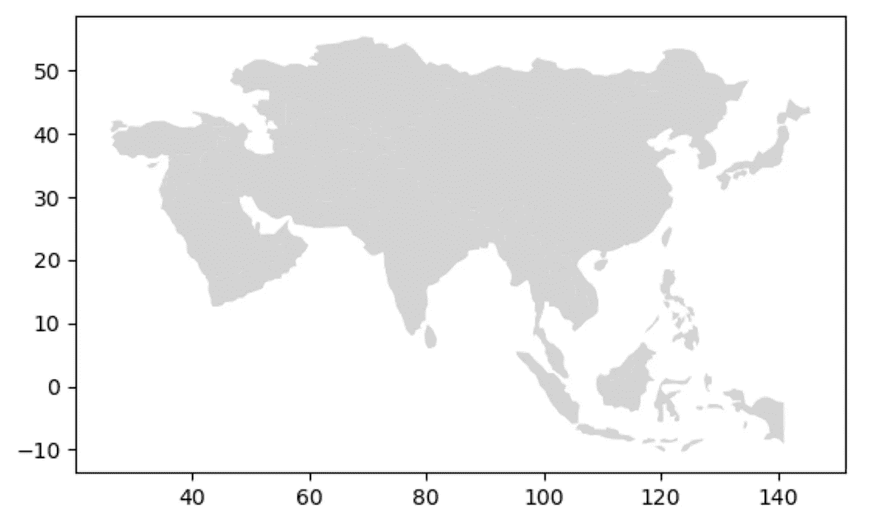

从世界地图中过滤出亚洲大陆。作者提供的图片。

为了过滤出南亚地区，我使用了一个包含每个国家名称的列表作为参考。

```py
south_asia_countries = ["Afghanistan", "Bangladesh", "Bhutan", "India",
                       "Maldives", "Nepal", "Pakistan", "Sri Lanka"]

south_asia = asia[asia.name.isin(south_asia_countries)]

south_asia.plot()
```

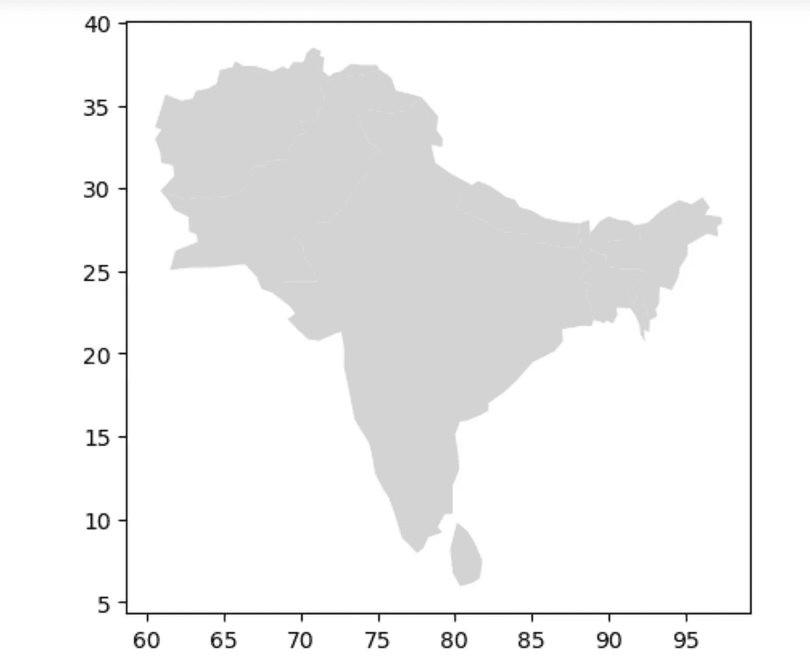

从亚洲中过滤出南亚地区。作者提供的图片。

## **使用 geopandas 在南亚国家之间溶解边界**

为了溶解南亚国家之间的边界，我使用了 geopandas 中的`dissolve`功能。我将 None 作为参数传递，并指定了应用某些聚合函数的参数，其中在结果溶解的数据框中，人口和 GDP 将汇总南亚所有国家的人口和 GDP。我还需要弄清楚如何在 QGIS 中应用聚合函数。

```py
south_asia_dissolved = south_asia.dissolve(by = None,
                                          aggfunc = {"pop_est":"sum",
                                                    "gdp_md_est":"sum"})
south_asia_dissolved.plot(color = "lightgrey"
```

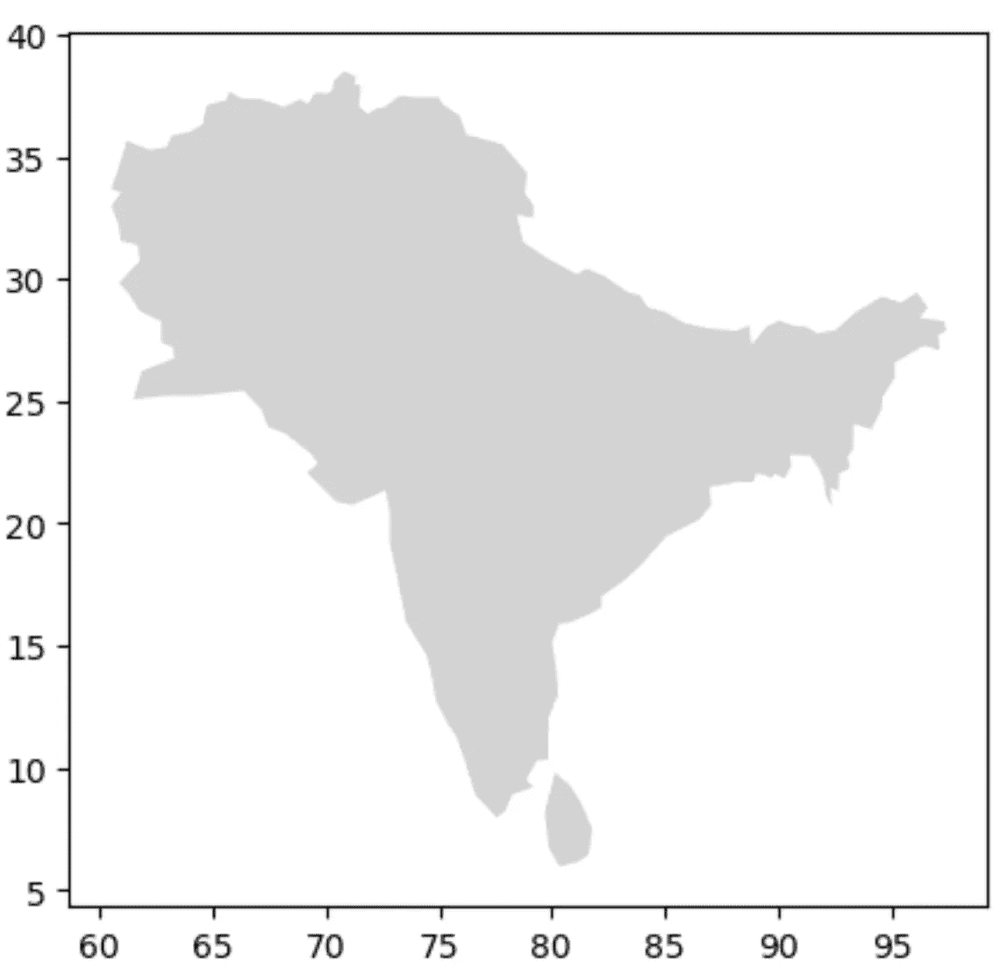

南亚国家之间的行政边界被溶解。作者提供的图片。

**溶解世界各大陆内国家之间的边界**

使用与上述相同的过程，我想要溶解大陆内国家之间的边界，并在世界地图上根据每个大陆中国家的数量展示不同的大陆。

为此，首先我在`world`地理数据框中添加了一个名为`num_countries`的新列，其值为 1。然后我使用`continent`列作为参考溶解了世界地图。

```py
world["num_countries"] = 1

continents_dissolved = world.dissolve(by = "continent", 
                      aggfunc = {"pop_est":"sum",
                                 "gdp_md_est":"sum",
                               "num_countries":"count"}).reset_index()

continents_dissolved
```

我使用聚合函数汇总了大陆中所有国家的人口和 GDP，并计算了每个大陆中的国家数量。结果的地理数据框`continents_dissolved`如下所示：

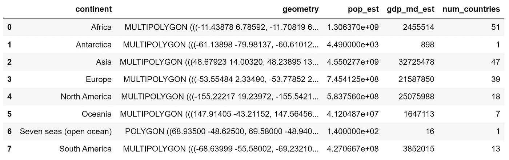

最终的大陆溶解地理数据框。

我们看到亚洲拥有所有大陆中最多的人口和 GDP。同样，我们看到非洲拥有最多国家（51 个），其次是亚洲（47 个）、欧洲（39 个）、北美洲（18 个）、南美洲（13 个）和大洋洲（7 个）。在这个数据集中，南极洲和七海（开放海洋）也被视为大陆。

最后，我想绘制世界地图，突出显示每个大陆中国家的数量，借助颜色地图。我使用了以下代码实现：

```py
map = continents_dissolved.plot(column = "num_countries",
                         cmap = "Greens")

# Get the current axes
ax = plt.gca()

# Add a horizontal colorbar
cbar = plt.colorbar(map.get_children()[0],
                    ax=ax, 
                    orientation='horizontal',
                   aspect = 30   #control the width of color bar. higher value= lower width.
                   )

# Set a label for the colorbar
cbar.set_label('Number of Countries')

plt.title("Continents of the world based on number of countries")

plt.savefig("Continents dissolved.jpeg",
            bbox_inches = "tight",
           dpi = 300)

# Show the plot
plt.show()
```

结果地图如下所示：

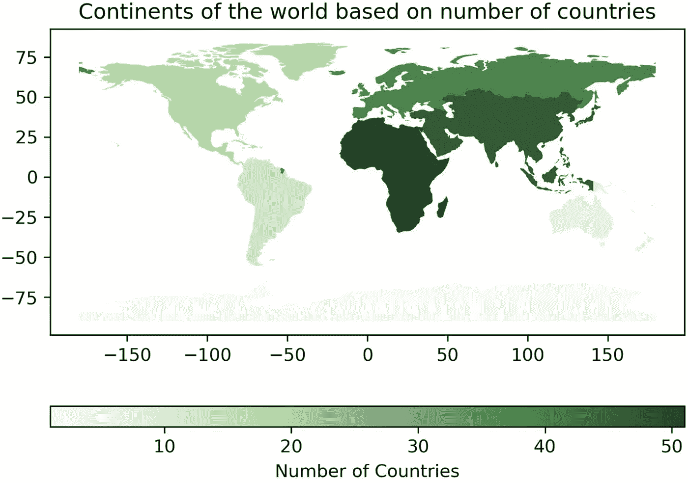

世界地图，颜色反映了每个大陆中国家的数量。作者提供的图片。

## 结论

在这篇文章中，我描述了如何使用 QGIS 和 Python 中的 geopandas 溶解地图边界的方法。在这个过程中，我还解释了裁剪过程以及在 geopandas 中溶解地图边界时使用聚合函数的可能性。这些过程对于操纵、处理和转换地理地图数据集的形式非常有用。本文的代码和 QGIS 项目文件可在此 GitHub [存储库](https://github.com/hbshrestha/Geospatial-Analysis)中找到。谢谢您的阅读！
