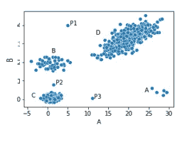
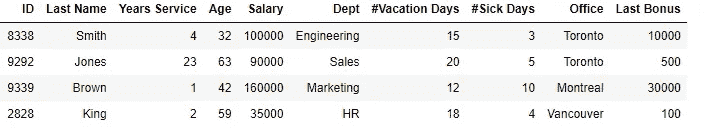
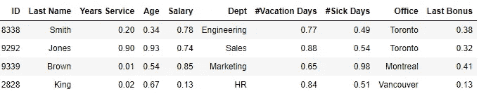
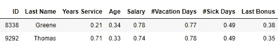
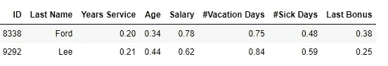
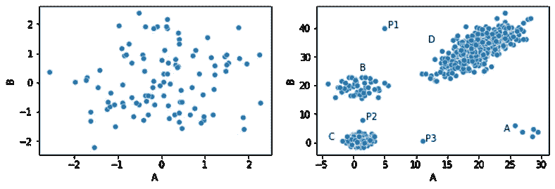
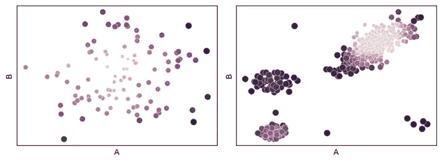

# 距离度量学习用于异常值检测

> 原文：[`towardsdatascience.com/distance-metric-learning-for-outlier-detection-5b4840d01246?source=collection_archive---------1-----------------------#2024-08-20`](https://towardsdatascience.com/distance-metric-learning-for-outlier-detection-5b4840d01246?source=collection_archive---------1-----------------------#2024-08-20)

## 一种异常值检测方法，旨在确定记录之间的相关距离度量

[](https://medium.com/@wkennedy934?source=post_page---byline--5b4840d01246--------------------------------)[](https://towardsdatascience.com/?source=post_page---byline--5b4840d01246--------------------------------) [W Brett Kennedy](https://medium.com/@wkennedy934?source=post_page---byline--5b4840d01246--------------------------------)

·发表于 [Towards Data Science](https://towardsdatascience.com/?source=post_page---byline--5b4840d01246--------------------------------) ·阅读时间：18 分钟·2024 年 8 月 20 日

--

异常值通常被定义为在数据集中与大多数其他项非常不同的项。也就是说，任何与其他所有记录（或几乎所有记录）显著不同，并且与其他记录的差异超过正常范围的记录，都可以合理地被视为异常值。



在这里展示的数据集中，我们有四个簇（A、B、C 和 D）和三个位于这些簇之外的点：P1、P2 和 P3。这些点很可能被视为异常值，因为它们每个都与其他所有点的距离较远——也就是说，它们与大多数其他点显著不同。

同样，A 类簇仅有五个点。尽管这些点相互之间距离较近，但它们与其他所有点的距离较远，因此也有可能被认为是异常值——再次强调，是基于这些点与其他大多数点之间的距离。

另一方面，内点（位于较大簇中的点）与许多其他点非常接近。例如，C 类簇中间的任何点都非常接近许多其他点（即与许多其他点非常相似），因此不会被视为异常值。

我们可以从多个角度来看待异常值，实际上也有许多方法用于异常值检测——例如基于频繁项集的异常值检测方法（[Frequent Item Sets](https://medium.com/towards-data-science/interpretable-outlier-detection-frequent-patterns-outlier-factor-fpof-0d9cbf51b17a)）、关联规则、压缩、马尔科夫模型等等。但识别与其他记录相似且与它们最相似的记录有相对不同之处的记录是非常常见的。实际上，这是许多最常见的异常值检测算法的基本思想，包括 kNN、LOF（局部异常因子）、半径算法以及许多其他算法。

然而，使用这种方法会留下一个问题，即如何量化一条记录与其他记录的差异。有多种技术可以实现这一点。在异常值检测中，一些最常见的包括欧几里得距离、曼哈顿距离和高尔距离，以及一些类似的度量方法。

我们将在下面简要介绍这些方法。但在本文中，我们将特别关注一种非常通用且可能使用较少的计算方法，用于计算表格数据中两条记录之间的差异，这对异常值检测非常有用，这就是*距离度量学习*——以及如何将此方法专门应用于异常值检测。

本文是关于异常值检测系列的继续，之前的文章包括计数异常值检测器、频繁模式异常值因子以及调节和测试检测器（使用一种称为*doping*的方法）。它还包括我书籍[《Python 中的异常值检测》](https://www.manning.com/books/outlier-detection-in-python)的另一个摘录。

# 距离度量

为了判断一条记录是否 1) 与大多数其他记录的距离异常远；以及 2) 与相对较少的记录接近，我们通常首先计算每对记录之间的距离：即数据集中每一对记录之间的距离。在实际应用中，我们可能采用更优化的方法（例如，只计算那些已知在任何情况下都相距很远的记录之间的近似距离），但至少在原则上，计算每对行之间的距离在异常值检测中是常见的做法。

这意味着，我们需要一种方法来计算任意两条记录之间的距离。

如果我们有一组数据，比如下面这样的大型员工记录表（这里显示的是四行的随机子集），我们如何最好地判断任意两行之间的相似度呢？



## 欧几里得距离

一种非常常见的方法是使用欧几里得距离。

在进一步查看员工数据之前，请再次考虑上面的散点图。我们在这里看到一个使用欧几里得距离显得很自然的情况。由于该数据集仅包含两个特征，且这两个特征都是数值型的，因此将数据如图所示绘制为散点图是相当直观的。一旦以这种方式绘制，我们自然就能想象出基于毕达哥拉斯公式计算出的点与点之间的欧几里得距离。

然而，在具有许多特征的情况下，尤其是这些特征中有很多是分类的，并且各列之间存在关联时，行与行之间的欧几里得距离，尽管仍然有效并且经常有用，但可能显得不那么自然。

使用欧几里得距离的一个问题是，它们实际上是为数值数据设计的，尽管大多数现实世界的数据，如员工记录，是混合型的：同时包含数值和分类特征。分类值可以通过数值编码（例如，使用独热编码、序数编码或其他编码方法）进行编码，从而可以计算欧几里得距离（以及其他数值距离度量）。但这并不总是理想的。每种数值编码方法对计算出的距离都有其特定的影响。不过，这种做法是完全可行的，也非常常见。

考虑到上面的员工表，我们可能会将 ID 和姓氏排除在离群值检测过程之外，仅使用其余的列。鉴于此，我们仍然会将部门和办公室特征视为分类特征。假设我们使用独热编码来对其进行编码。

为了计算行之间的欧几里得距离，我们还必须对数值特征进行缩放，将所有特征放置在相同的尺度上。这可以通过多种方式完成，包括标准化（将数值转换为其 z 值，基于该列均值与数值的标准差距离），或最小-最大缩放。

一旦数据被数值化并缩放，我们就可以计算每一对行之间的欧几里得距离。

## 高尔距离

或者，考虑到我们有一些分类特征，我们可以使用为混合数据设计的方法，例如高尔距离。该方法在比较任何两行时，逐列计算差异并将这些差异相加。当数据严格为数值时，它等同于曼哈顿距离。

对于分类列，在使用高尔距离时，通常使用序数编码，因为我们只关心是否存在精确匹配。分类列中两个值之间的差异要么是 0.0，要么是 1.0。在上面的员工表中，史密斯和琼斯在部门上有 1.0 的距离（不同值：‘工程’和‘销售’，此时总是使用 1.0），在办公室上有 0.0 的距离（相同值：‘多伦多’，此时总是使用 0.0）。

为了比较数值字段，就像欧几里得距离和大多数距离度量一样，我们需要先对它们进行缩放，以便所有数值字段可以被平等对待。如上所述，有多种方式可以实现这一点，但我们假设这里使用最小-最大缩放方法，将所有值映射到 0.0 到 1.0 的范围内。我们可能会得到一个如下表格：



使用高尔距离计算的史密斯和琼斯之间的差异将是：abs(0.90 — 0.20) + abs(0.93 — 0.34) + abs(0.74 — 0.78) + 1.0 + abs(0.88 — 0.77) + abs(0.54 — 0.49) + 0.0 + abs(0.32 — 0.38)。

也就是说，跳过 ID 和姓氏，我们计算每个数值字段的绝对差异，并为每个类别字段取 0.0 或 1.0。

这种方法可能是合理的，但也存在一些问题。最主要的问题可能在于类别字段比数值字段有更大的权重：类别字段通常会有 1.0 的差异，而数值字段则往往只有较小的差异。例如，史密斯和琼斯的年龄差距非常大，但它们的差异仅为 abs(0.93–0.34)，即 0.59（尽管差异仍然显著，但小于部门字段对行之间总差异的 1.0 影响）。正如在[Python 中的异常值检测](https://www.manning.com/books/outlier-detection-in-python)中所提到的，一热编码和其他编码方式在使用其他距离度量时也存在处理混合数据的类似问题。

此外，所有类别特征在相互之间同等重要；所有数值特征在相互之间也同等重要，即便其中一些特征，如高度相关的特征，可能应当有更大或更小的权重。

一般来说，像欧几里得距离或高尔距离（以及其他距离度量如曼哈顿距离、堪培拉距离等）在许多情况下可能是合适的距离度量，且通常是异常值检测的优选方法。但与此同时，它们并不总是适用于所有项目。

## 欧几里得距离视为高维空间中的物理距离

再次查看欧几里得距离，这些基本上将记录视为高维空间中的点，并计算这些点之间的距离。曼哈顿距离和高尔距离略有不同，但原理非常相似。

作为一个比完整的员工表更简单的例子，考虑这个表格，但目前只包含数值特征：服务年限、年龄、薪水、年假天数、病假天数和最后一次奖金。这是六个特征，因此每一行可以视为 6 维空间中的一个点，点与点之间的距离使用毕达哥拉斯公式来计算。

这是合理的，但显然并不是唯一的看待距离的方式。而且，所使用的距离度量会对异常值评分产生实质性的影响。例如，欧几里得距离可能比曼哈顿距离更强调一些具有非常不同值的特征。

## 欧几里得和曼哈顿距离的例子

我们在这里考虑这组 6 维数据的两种不同情况（同时展示 ID 和姓氏列以供参考）。

首先，举个例子是对于两位员工 Greene 和 Thomas，其中大多数值相似，但服务年限却有很大差异：



其次，另一个例子是对于两位其他员工，Ford 和 Lee，他们的大多数值都适中地不同，但没有非常不同的值：



哪一对行最相似？使用曼哈顿距离时，Greene 和 Thomas 最相似（它们的距离是 0.59，相比之下 0.60）。使用欧几里得距离时，Ford 和 Lee 最相似（它们的距离是 0.27，相比之下是 0.50）。

在何时使用曼哈顿距离或欧几里得距离更合适，或者何时使用其他度量（例如 Canberra、Minkowski（例如使用立方距离）、Mahalanobis 等）更合适，通常并不明确。这不一定是一个问题，但它确实突显了我们可以用许多不同的方式来看待行与行之间的距离。

欧几里得距离特别意味着我们将数据视为高维空间中的点，并计算它们之间的物理距离。这确实有一定的价值，但并非总是完全自然的。仅仅查看如上所示的员工数据表，我们会将这些行（在这个例子中）看作是员工记录，而不是空间中的点。

此外，使用欧几里得距离需要取年龄的平方、工资的平方等等——这缺乏直观的吸引力。像年龄的平方这样的东西实际上是什么意思并不明确。它可以很好地工作，但数据的几何解释仅仅是我们可以想象数据的众多方式之一。

此外，它是一种通用方法，不考虑数据本身。

# 距离度量学习

距离度量学习提供了另一种思考如何判断两个记录相似度的问题的方式。它不是首先定义一个距离度量然后应用于当前数据，而是尝试从数据本身学习记录之间的相似度。

它还解决了欧几里得、曼哈顿和大多数其他距离度量的局限性：所有特征都被平等对待，无论这是否最为合适。

这里的想法是：一些特征比其他特征更为重要，且一些特征之间是相互关联的（在某些情况下，特征集合甚至可能是冗余的，或者几乎是冗余的）。简单地将每个特征视为相同并不一定是识别数据集中最异常记录的最佳方法。

距离度量学习本身是一个重要的领域，但在这里我将介绍一种它如何应用于异常值检测的方法。具体来说，我们将在这里讨论基于创建随机森林的异常值检测的距离度量学习应用。

暂时假设：

1.  我们有一个预测某个目标的随机森林

1.  我们有一张数据表，可以通过随机森林进行处理（例如，员工数据，但任何表格数据都可以）。

1.  我们想要计算每一对行之间的距离。

我们将在这里使用这些成对的距离进行异常值检测，但原则上可以用于任何目的。

我们很快会描述如何为此创建一个随机森林，但暂时假设我们已经有一个随机森林，并且它的质量很好，经过良好的训练，且非常稳健。

我们可以用来估计行与行之间相似度的一种方法是查看随机森林所做的预测。假设随机森林被训练成一个二分类器，那么它可以为数据中的每一条记录生成预测的正类概率。

通过随机森林的两个记录可能有非常相似的概率，比如 0.615 和 0.619。这两个值非常接近，因此我们可以怀疑这两个记录彼此相似。但并不一定如此。它们实际上可能通过随机森林中的多个决策树走上完全不同的决策路径，恰好平均得出相似的预测。也就是说，它们可能因不同的原因得出相似的预测，实际上可能一点也不相似。

最相关的是记录通过决策树所走的决策路径。如果两条记录在大多数决策树中走的是相同的路径（因此最终落在相同的叶子节点），那么我们可以说它们是相似的（至少在这一方面）。如果它们大多数情况下落在不同的叶子节点，那么我们可以说它们是不同的。

那么，这就提供了一个强大的工具，以一种合理的方式确定任意两条记录的相似度。

# 创建随机森林

这显然是一个有用的想法，但它确实需要一个随机森林，并且需要一个对这个目的有意义的随机森林——即能够很好地捕捉到可用数据的特征的随机森林。

创建这样一个随机森林的一种方法是构建一个能够学习区分这些数据与类似但虚假的数据的随机森林。也就是说，数据是通过合成生成的，虽然与这些数据相似，但不完全相同（以便可以区分开来）。

因此，如果我们能够创建这样一组虚拟数据，我们就可以训练一个随机森林分类器来区分这两种数据类型。

创建用于此处的合成数据有多种方法，其中一些方法在[Python 中的离群值检测](https://www.manning.com/books/outlier-detection-in-python)一书中有详细介绍。例如，其中一种方法是加料（该方法也在这篇[Medium 文章](https://medium.com/towards-data-science/doping-a-technique-to-test-outlier-detectors-3f6b847ab8d4)中有讨论）。不过，我们将在这里介绍另一种效果较好的方法。这种方法可能过于简单，并不总是像更复杂的技术那样有效，但它确实为这一概念提供了一个简单、直观的介绍。

在这里，我们生成与真实记录数量相等的合成记录。实际上，精确平衡的集合并不是必须的，在某些情况下，稍有不平衡可能反而效果更好，但出于简便考虑，本例使用了平衡的数据集。

我们逐行生成合成数据，并且每一行的生成过程都是逐个特征进行的。为了生成一个值，如果特征是类别型的，我们从真实数据中按其在真实数据中的分布概率选择一个值。例如，如果真实数据中有一列“颜色”，其中包含 450 行红色、650 行蓝色、110 行绿色和 385 行黄色，那么按比例计算，这些颜色的比例为：红色：0.28，蓝色：0.41，绿色：0.07，黄色：0.24。因此，合成数据中的这一列将按类似的比例生成新的值。

如果特征是数值型的，我们计算该特征在真实数据中的均值和标准差，并从具有这些参数的正态分布中随机选择一组值。还有许多其他方法可以考虑，但同样，这只是一个简单的入门介绍。

通过这种方式，我们生成了合成数据，其中每一行完全由现实的值组成（每一行可能包含类别列中的稀有值，以及数值列中的稀有或极端值——但它们都是合理且现实的值）。

但是，特征之间的正常关系并未得到遵守。也就是说，由于每个列值是独立生成的，因此生成的值的组合可能不现实。例如，如果创建合成数据以模拟上面的员工表，我们可能会生成假记录，其年龄为 23 岁，服务年限为 38 年。单独来看，这两个值是现实的，但它们的组合是没有意义的，因此，在真实数据中应该不会出现这种组合——因此可以与真实数据区分开来。

数值字段的合成数据可以使用如下的代码（Python）生成：

```py
real_df['Real'] = True
synth_df = pd.DataFrame() 
for col_name in real_df.columns:
    mean = real_df[col_name].mean()
    stddev = real_df[col_name].std()
    synth_df[col_name] = np.random.normal(
       loc=mean, scale=stddev, size=len(real_df))
synth_df['Real'] = False
train_df = pd.concat([real_df, synth_df])
```

在这里，我们假设数据框`real_df`包含真实数据。然后我们创建一个名为`synth_df`的第二个数据框，接着将两个数据框合并为`train_df`，该数据框可以用于训练随机森林以区分两者。

类别数据可以类似地生成：

```py
for col_name in real_df.columns:    
    vc = real_df[col_name].value_counts(normalize=True)
    synth_df[col_name] = np.random.choice(a=vc.keys().tolist(), 
                                          size=len(real_df),
                                          replace=True, 
                                          p=vc.values.tolist())
```

如前所述，这只是生成数据的一种方式，调整这个过程可能会有用，允许更多不寻常的单个值，或限制特征之间不太常见的关系。

一旦这些数据被创建，我们可以训练一个随机森林来学习区分真实数据和假数据。

一旦完成这个过程，我们实际上还可以执行另一种形式的异常值检测。任何通过随机森林的真实记录，如果它被预测为假记录，可能被认为是异常的——它们与合成数据比与真实数据更相似。这部分内容在[Python 中的异常值检测](https://www.manning.com/books/outlier-detection-in-python)中有详细讲解，但在本文中，我们将重点关注距离度量学习，因此我们将关注随机森林中的决策路径（而不是最终的预测）。

# 使用随机森林衡量异常度

如上所述，如果两个记录趋向于最终落在几乎完全不同的叶节点上，它们可以在某种意义上被认为是不同的。

对于每一对记录，我们可以统计它们在随机森林中落在相同叶节点和不同叶节点的树木数量。但我们也可以使用一种更简单的方法。对于每个通过随机森林的记录，对于每棵树，我们可以看到它最终的（叶）节点是什么。我们还可以看到训练数据中有多少记录落在该节点上。训练记录越少，这条路径就越不寻常。

如果在大多数树中，一个记录最终落在与其他很少的记录相同的叶节点上，它可以被认为是异常的。

主要的思路是：如果随机森林准确，它能够很好地区分真实记录和假记录。因此，当一个真实记录通过随机森林时，它很可能会落在与真实数据相关的叶节点上。如果它是一个正常的真实记录，它将沿着一个常见的路径前进，这是许多其他真实记录所使用的路径。在路径的每一步，决策树中的节点会基于一个特征进行分裂——这是一个在区分真实数据和合成数据时有效的特征及其分裂点。一个典型的记录将具有与常见真实数据相关的值，因此会在每个分裂点沿着与真实数据相关的路径前进。

如果一个随机森林只包含少量的树，则每个记录最终落在的叶节点的大小可能会非常随意。但是，随机森林可以设置为包含数百棵或数千棵树。当记录始终落在其树木中不常见的叶节点时，该记录可以合理地被认为是异常的。

即使使用大型随机森林，过程仍然可能存在一定的变异性。为了解决这个问题，可以使用多个距离度量学习异常检测器，并将它们组合成一个集成方法，而不是仅使用一个单独的检测器。这个方法超出了本文的范围，但其基本思路是创建多个合成数据集，并为每个数据集创建多个不同超参数的随机森林，然后将结果进行平均。

# 示例

为了演示这个思路，我们将创建一个简单的距离度量学习检测器。

但首先，我们将创建几个测试数据集。这些数据集都是具有两个特征的数值型数据集。如所示，这比具有多个特征的数据集和包含多个分类特征的数据集更不具备现实性，但它对于演示目的很有用——它易于绘制和理解。

第一个测试集是一个单一的数据集群：

```py
import numpy as np
import pandas as pd

def create_simple_testdata():
    np.random.seed(0)
    a_data = np.random.normal(size=100)
    b_data = np.random.normal(size=100)
    df = pd.DataFrame({"A": a_data, "B": b_data})
    return df
```

第二个数据集实际上创建了文章开始时显示的数据集，包含四个集群和三个位于这些集群外的点。

```py
def create_four_clusters_test_data():
    np.random.seed(0)

    a_data = np.random.normal(loc=25.0, scale=2.0, size=5) 
    b_data = np.random.normal(loc=4.0, scale=2.0, size=5)
    df0 = pd.DataFrame({"A": a_data, "B": b_data})

    a_data = np.random.normal(loc=1.0, scale=2.0, size=50) 
    b_data = np.random.normal(loc=19.0, scale=2.0, size=50)
    df1 = pd.DataFrame({"A": a_data, "B": b_data})

    a_data = np.random.normal(loc=1.0, scale=1.0, size=200) 
    b_data = np.random.normal(loc=1.0, scale=1.0, size=200)
    df2 = pd.DataFrame({"A": a_data, "B": b_data})

    a_data = np.random.normal(loc=20.0, scale=3.0, size=500) 
    b_data = np.random.normal(loc=13.0, scale=3.0, size=500) + a_data
    df3 = pd.DataFrame({"A": a_data, "B": b_data})

    outliers = [[5.0, 40], 
                [1.5, 8.0],
                [11.0, 0.5]]
    df4 = pd.DataFrame(outliers, columns=['A', 'B'])

    df = pd.concat([df0, df1, df2, df3, df4])
    df = df.reset_index(drop=True)
    return df
```

这里显示了两个数据集：



接下来，我们展示了一个基于距离度量学习的简单异常检测器。该检测器的 `fit_predict()` 方法接受一个数据框（在其中我们识别任何异常值）。`fit_predict()` 方法生成一个合成数据集，训练一个随机森林，将每条记录传递给随机森林，确定每条记录最终进入哪个节点，并确定这些节点的常见程度。

```py
from sklearn.ensemble import RandomForestClassifier
from collections import Counter
from sklearn.preprocessing import RobustScaler

class DMLOutlierDetection:
    def __init__(self):
        pass

    def fit_predict(self, df):
        real_df = df.copy()
        real_df['Real'] = True

        # Generate synthetic data that is similar to the real data
        # For simplicity, this covers just the numeric case.  
        synth_df = pd.DataFrame() 
        for col_name in df.columns:
            mean = df[col_name].mean()
            stddev = df[col_name].std()
            synth_df[col_name] = np.random.normal(loc=mean, 
               scale=stddev, size=len(df))
        synth_df['Real'] = False

        train_df = pd.concat([real_df, synth_df])

        clf = RandomForestClassifier(max_depth=5)
        clf.fit(train_df.drop(columns=['Real']), train_df['Real'])

        # Get the leaf node each record ends in 
        r = clf.apply(df) 

        # Initialize the score for all records to 0
        scores = [0]*len(df) 

        # Loop through each tree in the Random Forest
        for tree_idx in range(len(r[0])): 
            # Get the count of each leaf node
            c = Counter(r[:, tree_idx]) 

            # Loop through each record and update its score based 
            # on the frequency of the node it ends in
            for record_idx in range(len(df)): 
                node_idx = r[record_idx, tree_idx]
                node_count = c[node_idx]
                scores[record_idx] += len(df) - node_count

        return scores

df = create_four_clusters_test_data()
df = pd.DataFrame(RobustScaler().fit_transform(df), columns=df.columns)
clf = DMLOutlierDetection()
df['Scores'] = clf.fit_predict(df)
```

这个代码示例仅在 `create_four_clusters_test_data()` 创建的数据上运行，但也可以使用 `create_simple_testdata()` 中的数据。

结果可以通过如下代码进行可视化：

```py
import matplotlib.pyplot as plt
import seaborn as sns

sns.scatterplot(x=df["A"], y=df['B'], hue=df['Scores'])
plt.show()
```

两个测试数据集的结果如下所示，绘制了原始数据，但根据其异常分数（由上面代码中的“Scores”列放置）设置了色调。



在左侧的数据集（单一集群）中，最外围的点获得了最高的得分，这是预期的结果。在右侧的数据集（包含四个集群）中，最高的异常分数分配给了三个位于集群外的点，较小的集群，以及位于最大集群边缘的点。这是相当合理的，尽管其他检测器可能会对这些点进行不同的评分，而且同样是合理的。

如上所述，使用欧几里得距离对于这些数据集来说是自然的，尽管对于具有许多特征、分类特征、特征之间关联以及其他数据细节的数据集可能不那么适用。但即使在这些欧几里得距离表现良好的简单情况中，距离度量学习也能发挥良好的效果，并提供一种自然的异常检测方法。对于更复杂的数据，这种情况可能会更加明显。

# 结论

距离度量学习可以用于离群点检测以外的许多用途，甚至在离群点检测中，也可以以多种方式使用。例如，可以像上面一样使用随机森林计算数据集中的成对距离，并将这些距离传递给另一个算法。例如，DBSCAN 提供了一个“预计算”选项，可以传递预先计算好的成对距离矩阵；然后，可以使用 DBSCAN（或类似的聚类方法，如 HDBSCAN）作为几种可能的基于聚类的离群点检测算法之一。

并且，距离度量学习也可以像本文中所示的那样以更直接的方式使用，这本身就是一种出色的离群点检测方法。在许多情况下，它比基于欧几里得距离、曼哈顿距离、Gower 距离或其他类似距离度量的方法更有利于检测离群点。它还可以为检测器的集成提供多样性，即使这些方法也能很好地工作。

没有任何一种离群点检测方法是绝对的，通常需要在任何给定项目中使用多种离群点检测方法（包括通常情况下，使用相同方法多次，但使用不同的参数），将它们的结果结合起来，以实现强大的整体离群点检测。

因此，距离度量学习并不适用于每个项目，但在适用的情况下，它可能（与任何检测器一样）在与其他检测器结合时表现最好。但这是一种有价值的工具；距离度量学习可以是一个非常有效的离群点检测技术，尽管它比其他方法获得的关注要少。

这确实需要一些调优，包括合成数据的生成方式和随机森林使用的超参数，但一旦调优完成，它提供了一种强大且直观的离群点检测方法。

所有图片均由作者提供
