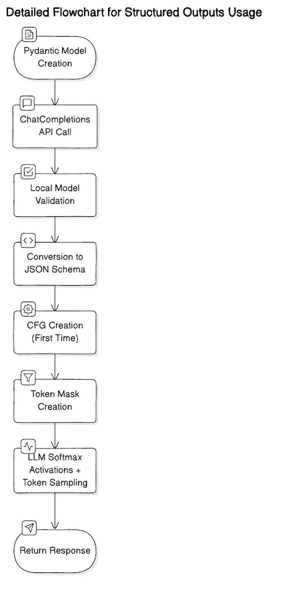

# 深入探索结构化输出

> 原文：[`towardsdatascience.com/diving-deeper-with-structured-outputs-b4a5d280c208?source=collection_archive---------1-----------------------#2024-09-03`](https://towardsdatascience.com/diving-deeper-with-structured-outputs-b4a5d280c208?source=collection_archive---------1-----------------------#2024-09-03)

## 帮助增强您对结构化输出和 LLM 的理解与最佳使用

[](https://medium.com/@armin.catovic?source=post_page---byline--b4a5d280c208--------------------------------)[](https://towardsdatascience.com/?source=post_page---byline--b4a5d280c208--------------------------------) [Armin Catovic](https://medium.com/@armin.catovic?source=post_page---byline--b4a5d280c208--------------------------------)

·发布于[数据科学前沿](https://towardsdatascience.com/?source=post_page---byline--b4a5d280c208--------------------------------) ·阅读时长 8 分钟·2024 年 9 月 3 日

--



图 1 — 从用户的角度，在应用结构化输出时，显式和隐式执行的步骤；图片来自作者

在[上一篇文章](https://medium.com/towards-data-science/structured-outputs-and-how-to-use-them-40bd86881d39)中，我们介绍了如何使用 OpenAI 的**结构化输出**。自从 ChatCompletions API（[v1.40.0](https://github.com/openai/openai-python/releases/tag/v1.40.0)）的正式发布以来，结构化输出已被应用于数十种使用场景，并在[OpenAI 论坛](https://community.openai.com/)中引发了大量讨论。

在本文中，我们的目标是为您提供更深入的理解，消除一些误解，并为您提供一些关于如何在不同场景中以最优化的方式应用它们的建议。

# 结构化输出概述

结构化输出是一种强制 LLM 输出遵循预定义模式的方式——通常是 JSON 模式。这是通过将模式转换为[上下文无关文法 (CFG)](https://en.wikipedia.org/wiki/Context-free_grammar)，在标记采样步骤中与之前生成的标记一起使用，以确定哪些后续标记是有效的。可以将其理解为为标记生成创建一个[正则表达式](https://en.wikipedia.org/wiki/Regular_expression)。

OpenAI API 实现实际上仅跟踪 JSON schema 特性的一个有限子集。对于更一般的结构化输出解决方案，比如 [Outlines](https://github.com/outlines-dev/outlines)，可以使用稍大一些的 JSON schema 子集，甚至可以定义完全自定义的非 JSON schema —— 只要你能访问到开放权重模型。本文将假设使用 OpenAI API 实现。

# JSON Schema 和 Pydantic

根据 [JSON Schema 核心规范](https://json-schema.org/draft/2020-12/json-schema-core)，*“JSON Schema 确定了一个 JSON 文档必须是什么样子，如何从中提取信息，以及如何与之互动”*。JSON schema 定义了六种原始类型 —— null、boolean、object、array、number 和 string。它还定义了一些关键字、注解和特定的行为。例如，我们可以在 schema 中指定我们期望的是一个 `array`，并添加一个注解，要求 `minItems` 为 `5`。

Pydantic 是一个实现 JSON schema 规范的 Python 库。我们使用 Pydantic 在 Python 中构建稳健且可维护的软件。由于 Python 是一种动态类型语言，数据科学家通常不会以 **变量类型** 为中心思考 —— 这些通常是 **隐含** 在他们的代码中的。例如，一个水果可能会被指定为：

```py
fruit = dict(
  name="apple",
  color="red",
  weight=4.2
)
```

…而一个返回“水果”的函数声明，通常会被指定为：

```py
def extract_fruit(s):
  ...
  return fruit
```

另一方面，Pydantic 允许我们生成一个符合 JSON schema 规范的类，具有正确注解的变量和 **类型提示**，使得我们的代码更具可读性/可维护性，并且通常更加稳健，即：

```py
class Fruit(BaseModel):
    name: str
    color: Literal['red', 'green']
    weight: Annotated[float, Gt(0)]

def extract_fruit(s: str) -> Fruit:
  ...
  return fruit
```

OpenAI 实际上 [强烈推荐](https://platform.openai.com/docs/guides/structured-outputs/avoid-json-schema-divergence) 使用 Pydantic 来指定 schema，而不是直接指定“原始” JSON schema。这样做有几个原因。首先，Pydantic 保证遵循 JSON schema 规范，因此它可以为你省去额外的预验证步骤。其次，对于较大的 schema，它更加简洁，让你可以写出更清晰、更快速的代码。最后，`openai` Python 包实际上会做一些“家务工作”，比如帮你将 `additionalProperties` 设置为 `False`，而当你使用 JSON 手动定义 schema 时，你需要为 schema 中的每个对象 [手动设置这些](https://platform.openai.com/docs/guides/structured-outputs/additionalproperties-false-must-always-be-set-in-objects)，如果不设置，将会导致相当烦人的 API 错误。

# 限制

正如我们之前提到的，ChatCompletions API 提供了一个有限的完整 JSON 模式规范子集。有许多[当前不支持的关键字](https://platform.openai.com/docs/guides/structured-outputs/some-type-specific-keywords-are-not-yet-supported)，例如用于数字的`minimum`和`maximum`，以及用于数组的`minItems`和`maxItems`——这些注解本来会在减少幻觉或限制输出大小时非常有用。

某些格式化特性也不可用。例如，以下 Pydantic 模式在传递给 ChatCompletions 中的`response_format`时会导致 API 错误：

```py
class NewsArticle(BaseModel):
  headline: str
  subheading: str
  authors: List[str]
  date_published: datetime = Field(None, description="Date when article was published. Use ISO 8601 date format.")
```

它会失败，因为`openai`包没有处理`datetime`格式的功能，因此你需要将`date_published`设置为`str`类型，并在后期进行格式验证（例如，ISO 8601 合规性）。

其他关键限制包括：

+   **仍然可能出现幻觉**——例如，在提取产品 ID 时，你需要在响应模式中定义以下内容：`product_ids: List[str]`；虽然输出保证会生成一个字符串列表（产品 ID），但这些字符串本身可能是幻觉，因此在这种使用场景下，你可能需要将输出与一些预定义的产品 ID 集合进行验证。

+   **输出有上限**，最多为 16,384 个令牌（**注意：**感谢 Peter Edmonds 的纠正！），或者你在`max_tokens`参数中设置的较小值——因此，尽管模式会被精确遵循，但如果输出过大，它将被截断并产生无效的 JSON——在非常大的[批量 API](https://platform.openai.com/docs/guides/batch)任务中尤其令人烦恼！

+   **深度嵌套的模式及其多个对象属性**可能会导致 API 错误——你的模式有[深度和宽度的限制](https://platform.openai.com/docs/guides/structured-outputs/objects-have-limitations-on-nesting-depth-and-size)，但通常最好坚持使用扁平和简单的结构——不仅是为了避免 API 错误，还为了从 LLM 中尽可能地提取更多性能（通常 LLM 难以处理深度嵌套的结构）。

+   **高度动态或任意模式不可行**——尽管[支持递归](https://platform.openai.com/docs/guides/structured-outputs/recursive-schemas-are-supported)，但无法创建一个高度动态的模式，例如一组任意的键值对对象列表，即`[{"key1": "val1"}, {"key2": "val2"}, ..., {"keyN": "valN"}]`，因为在这种情况下，“键”**必须**是预定义的；在这种场景下，最佳选择是根本不使用结构化输出，而是选择标准的 JSON 模式，并在系统提示中提供输出结构的说明。

# 技巧和窍门

考虑到这一切，我们现在可以通过几个使用案例来探讨如何在使用结构化输出时提升性能的技巧和窍门。

## 使用可选参数创建灵活性

假设我们正在构建一个网页抓取应用程序，目标是从网页中收集特定组件。对于每个网页，我们在用户提示中提供原始 HTML，在系统提示中给出具体的抓取指令，并定义以下 Pydantic 模型：

```py
class Webpage(BaseModel):
    title: str
    paragraphs: Optional[List[str]] = Field(None, description="Text contents enclosed within <p></p> tags.")
    links: Optional[List[str]] = Field(None, description="URLs specified by `href` field within <a></a> tags.")
    images: Optional[List[str]] = Field(None, description="URLs specified by the `src` field within the </img> tags.")
```

然后我们会按如下方式调用 API……

```py
response = client.beta.chat.completions.parse(
    model="gpt-4o-2024-08-06",
    messages=[
        {
            "role": "system",
            "content": "You are to parse HTML and return the parsed page components."
        },
        {
            "role": "user",
            "content": """
            <html>
            <title>Structured Outputs Demo</title>
            <body>
            </image>
            <p>Hello world!</p>
            </body>
            </html>
            """
        }
    ],
    response_format=Webpage
)
```

…以及以下响应：

```py
{
  'images': ['test.gif'],
  'links': None,
  'paragraphs': ['Hello world!'],
  'title': 'Structured Outputs Demo'
}
```

提供给 API 的响应架构使用结构化输出时，**必须**返回所有指定的字段。然而，我们可以通过使用`Optional`类型注解来“模拟”可选字段，并增加更多的灵活性。我们实际上还可以使用`Union[List[str], None]`——它们在语法上是完全相同的。在这两种情况下，按照 JSON 架构规范，我们都会得到转换为`anyOf`关键字。在上面的示例中，由于网页上没有`<a></a>`标签，API 仍然返回了`links`字段，但它被设置为`None`。

## 使用枚举和两阶段方法减少虚构内容

我们之前提到过，即使 LLM 被保证遵循提供的响应架构，它仍然可能会虚构实际的值。对此，最近的一篇[论文](https://arxiv.org/pdf/2408.02442v1)发现，强制对输出施加固定架构，实际上会导致 LLM 出现虚构内容或在推理能力方面退化（有趣的是，分类性能却有所提高 🤔）。

克服这些限制的一种方法是尽可能多地利用枚举类型（enums）。枚举将输出限制为非常特定的一组标记，对其他任何东西的概率设为零。例如，假设你正在尝试对一个**目标产品**（包含`description`和唯一的`product_id`）与通过某种向量相似性搜索（例如使用余弦距离度量）获得的**前五名产品**之间的产品相似度进行重新排序。每一个前五名产品也包含相应的文本描述和唯一的 ID。在你的响应中，你只希望获取重新排序后的 1-5 列表（例如`[1, 4, 3, 5, 2]`），而不是获取可能是虚构或无效的重新排序的产品 ID 字符串。我们将我们的 Pydantic 模型设置如下……

```py
class Rank(IntEnum):
    RANK_1 = 1
    RANK_2 = 2
    RANK_3 = 3
    RANK_4 = 4
    RANK_5 = 5

class RerankingResult(BaseModel):
    ordered_ranking: List[Rank] = Field(description="Provides ordered ranking 1-5.")
```

…并像这样运行 API：

```py
response = client.beta.chat.completions.parse(
    model="gpt-4o-2024-08-06",
    messages=[
        {
            "role": "system",
            "content": """
            You are to rank the similarity of the candidate products against the target product.
            Ranking should be orderly, from the most similar, to the least similar.
            """
        },
        {
            "role": "user",
            "content": """
            ## Target Product
            Product ID: X56HHGHH
            Product Description: 80" Samsung LED TV

            ## Candidate Products
            Product ID: 125GHJJJGH
            Product Description: NVIDIA RTX 4060 GPU

            Product ID: 76876876GHJ
            Product Description: Sony Walkman

            Product ID: 433FGHHGG
            Product Description: Sony LED TV 56"

            Product ID: 777888887888
            Product Description: Blueray Sony Player

            Product ID: JGHHJGJ56
            Product Description: BenQ PC Monitor 37" 4K UHD
            """
        }
    ],
    response_format=RerankingResult
)
```

最终结果就是：

```py
{'ordered_ranking': [3, 5, 1, 4, 2]}
```

所以 LLM 排名了 Sony LED TV（即列表中的第“3”项）和 BenQ PC 显示器（即列表中的第“5”项），作为最相似的两个产品候选，即`ordered_ranking`列表中的前两个元素！

理论上，枚举应该完全消除这些特定字段中的虚构内容，因为只有枚举集中的标记会通过标记掩码，即所有其他标记的概率为零。然而，用户也[报告过即使在枚举中也会看到虚构内容](https://community.openai.com/t/structured-outputs-deep-dive/930169/18)，特别是在“迷你”模型中。

另一种方法是**两阶段方法**，这与[前述论文](https://arxiv.org/pdf/2408.02442v1)的研究结果一致：

1.  向迷你模型发送推理/提取任务**不**强制执行结构，即响应将是一个简单的字符串。

1.  创建第二个请求发送给迷你模型，这次发送上一步的输出以及响应模式

通过这种方法，我们将任务分为推理步骤和结构化步骤。

# 结论

在本文中，我们深入探讨了结构化输出。我们介绍了 JSON 模式和 Pydantic 模型，并将它们与 OpenAI 的 ChatCompletions API 连接。我们通过多个示例展示了如何使用结构化输出解决这些问题。总结一些关键要点：

+   OpenAI API 及其他第三方框架所支持的结构化输出，仅实现**JSON 模式规范的子集**——了解其特性和局限性将帮助你做出正确的设计决策。

+   强烈推荐使用**Pydantic**或类似的框架，这些框架能够忠实地跟踪 JSON 模式规范，因为它们使你能够创建有效且更清晰的代码。

+   尽管仍然会出现幻觉问题，但有多种方法可以缓解这些问题，方法之一是选择响应模式设计；例如，在适当的地方**使用枚举类型**；或者采用**两阶段方法**，即我们发送两个 API 请求——一个用于推理，第二个仅用于输出重构。

## 关于作者

[**Armin Catovic**](https://medium.com/@armin.catovic)是[斯德哥尔摩 AI](https://www.stockholm.ai/)的董事会秘书，同时也是[EQT 集团](https://eqtgroup.com/)的副总裁和高级 ML/AI 工程师，拥有 18 年的工程经验，工作遍及澳大利亚、东南亚、欧洲和美国，并拥有多项专利和顶级同行评审的 AI 出版物。
