# 欧洲的 M&M 巧克力真的比美国的 M&M 巧克力更好吃吗？

> 原文：[`towardsdatascience.com/do-european-m-ms-actually-taste-better-than-american-m-ms-248e747a4c44?source=collection_archive---------5-----------------------#2024-01-23`](https://towardsdatascience.com/do-european-m-ms-actually-taste-better-than-american-m-ms-248e747a4c44?source=collection_archive---------5-----------------------#2024-01-23)

## 一次过度热情地应用科学和数据可视化来解答我们所有人都曾问过的问题

 [Erin Wilson](https://erinhwilson.medium.com/?source=post_page---byline--248e747a4c44--------------------------------)

·发表于[Towards Data Science](https://towardsdatascience.com/?source=post_page---byline--248e747a4c44--------------------------------) ·16 分钟阅读·2024 年 1 月 23 日

--

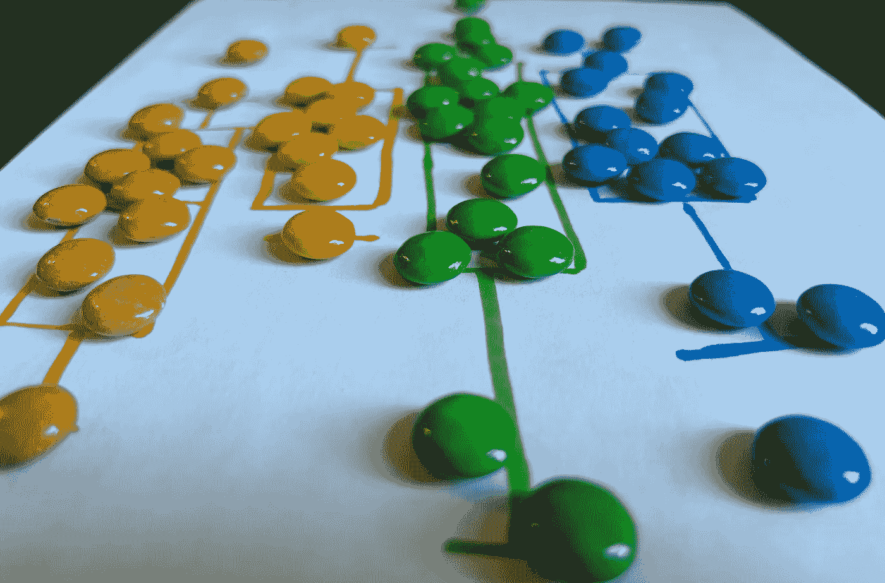

一张特别甜美的箱型图。图像来源：作者。

*(哦，只有我在问这个问题吗…？嗯。如果你有一分钟时间，请享受这篇探索性的数据分析——涵盖实验设计、统计学和互动可视化——虽然有点过于认真，但仍然应用于解决一场国际争论。)*

# 1\. 引言

## 1.1 背景与动机

巧克力在世界各地都受到喜爱。从古代在亚马逊盆地采摘有机可可的传统，到瑞士山脉中的巧克力工匠雕刻食用艺术，再到美国宾夕法尼亚州赫尔希市的巨大工厂每天生产 7000 万个巧克力“亲吻”，巧克力的多样化形式和风味已经融入了许多文化和习俗中。尽管巧克力产品的质量差异很大，但一种广为人知、常见且易于分享的巧克力形式便是 M&M 巧克力。它们常出现在便利店的收银台和酒店的自动售货机中，五颜六色的小圆粒是大家喜爱的零食，其包装设计几乎能适应任何美国商业节日的需求。

2022 年，我在丹麦生活时听到一个令人担忧的说法：欧洲生产的 M&M 口味与美国生产的 M&M 不同，甚至可以说是“更好”。虽然我承认欧洲的精美巧克力确实非常美味，并且通常优于美国巧克力，但我不确定这个说法是否同样适用于 M&M。我得知许多欧洲人认为美国巧克力有一种“不愉快”或“酸味”的味道，这主要归因于[丁酸](https://www.chemistryworld.com/podcasts/butyric-acid/1017662.article)，这种化合物是由于牛奶在加入牛奶巧克力之前的处理方式不同所产生的。

但说实话，这种差异对 M&M 来说能有多大影响呢？*M&M!*？我想象中，不论在哪里生产，M&M 都会保留相对加工/大规模生产/廉价糖果的味道。作为唯一一位访问一个由国际科学家组成的多元化实验室，进行前沿生物可持续性研究的美国人，我决定拿出我的数据科学工具箱，调查这个 M&M 口味现象。

## 1.2 以往的研究

引用一位欧洲女性的话，她在纽约旅行时品尝了一颗美国的 M&M 后说道：

> “它们尝起来真恶心，像呕吐一样。我不明白人们怎么能吃这个。我把袋子里的剩下部分都扔掉了。”

呕吐？真的吗？根据我的经验，在美国长大的孩子们吃 M&M 时完全没有任何顾虑。小时候，我家里总会在高流量区域放置装满 M&M 的碗，以便随时提供糖分。显然，美国的 M&M 是可以吃的。那么，它们真的与欧洲版的 M&M 有显著不同，或者说更差吗？

为了回应那位匿名欧洲女性的尖锐评论，我和另外两位在丹麦的美国游客一起品尝了在 Lyngby Storcenter Føtex 购买的 M&M。我们希望能体验到隐藏在我们童年中的 M&M 口味的巨大改善。但奇怪的是，我们没有察觉到明显的口味改善。

不幸的是，之前的两项研究都未能进行严格控制和随机抽样的 M&M 口味对比试验。因此，我们转向了科学。

## 1.3 研究目标

本研究旨在弥补以往研究的不足，并探讨以下问题：

1.  是否存在**全球共识**认为欧洲的 M&M 确实比美国的 M&M 更好？

1.  **欧洲人是否真的能察觉**在不知道自己吃的是哪种 M&M 的情况下，来自美国和欧洲的 M&M 之间的区别？还是这是欧洲人之间的一个**大规模协调的谎言**，目的是让美国人感到尴尬？

1.  **美国人真的对美国和欧洲 M&M 的口味感到“盲目”吗**？或者他们能品尝出区别，但只是不把这种区别描述为“口味的改善”？

1.  这些所谓的口味差异**是否能被其他大陆的公民察觉**？如果能，他们是否认为某种口味明显更好？

# 2. 方法

## 2.1 实验设计与数据收集

参与者通过诱导——呃，*邀请*他们参加一个社交聚会（并承诺提供免费食物），这个聚会恰好与测试地点位于同一地点。参与者同意暂停社交并加入研究后，会被安排到测试站，由一位受过训练的实验员引导他们完成以下步骤：

+   参与者坐在桌前，面前有两个杯子：一个空的，另一个装满了水。每只手一个杯子，参与者被要求闭上眼睛，并在实验期间保持闭眼状态。

+   实验员随机用勺子取出一颗 M&M，将其送到参与者的空杯中，参与者被要求吃下这颗 M&M（眼睛仍然闭着）。

+   在每次吃下 M&M 后，实验员通过询问参与者是否觉得 M&M 的味道是：特别好，特别差，还是正常，来收集味觉反应。

+   每位参与者总共接受了 10 颗 M&M（5 颗欧洲的，5 颗美国的），每次一颗，顺序由 random.org 随机确定。

+   在吃每颗 M&M 之间，参与者被要求喝一口水以帮助“清洁味蕾”。

+   **收集的数据**：对于每位参与者，实验员记录了参与者的**原始洲**（如果不明确，参与者被要求列出他们童年时最有记忆的吃糖果的洲）。对于每颗 M&M，实验员记录了**M&M 的来源**（“丹麦”或“美国”）、**M&M 的颜色**和参与者的**味觉反应**。实验员还被鼓励记录参与者在测试过程中说出的有趣句子，这些记录被归类为**备注**（数据可通过[此处](https://github.com/erinhwilson/mnm-taste-test/tree/main/data)获取）。

## 2.2 材料采购与参与者招募

本研究购买了两袋 M&M 巧克力。美国来源的 M&M（“美国 M&M”）是在旧金山国际机场购买的，并由作者的父母带到丹麦探访她时带来。欧洲来源的 M&M（“丹麦 M&M”）则是在位于哥本哈根北部的 Lyngby 市的一家 Føtex 超市购买的。

实验在两个主要时间点进行。前 14 位参与者是在 2022 年 8 月在丹麦的 Lyngby 市进行测试的。测试对象主要是作者在丹麦技术大学（DTU）诺和诺德基金会生物可持续性中心遇到的朋友和室友，他们参加了一个“告别派对”，而实验程序被巧妙地融入其中。在旅行期间，一些其他的朋友和家人也在丹麦进行测试（例如，在火车上）。

剩下的 37 名参与者于 2022 年 10 月在美国华盛顿州西雅图进行测试，主要是在华盛顿大学计算机科学博士项目的研究生举办的“TGIF 欢乐时光”期间。这批参与者大多是来自保罗·G·艾伦计算机科学与工程学院（UW CSE）的学生和工作人员，他们响应了每周五的召集，来到艾伦中心的中庭领取免费的零食和饮料。

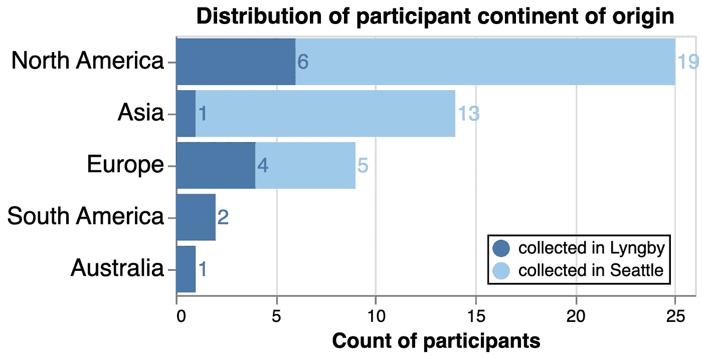

图 1\. 参与者分布图。在首次抽样事件中，Lyngby 的参与者主要来自北美和欧洲，少数来自亚洲、南美或澳大利亚。我们在西雅图的第二次抽样事件大大增加了参与者数量，主要来自北美和亚洲，欧洲的参与者也有所增加。这两个事件都没有招募到来自非洲的参与者。图表由 Altair 制作。

尽管本研究旨在分析全球趋势，但不幸的是，数据仅从 51 名参与者中收集，作者能够将他们吸引到研究地点，而这些数据并不均衡，也不能代表地球六大有人居住的大陆（图 1）。我们希望在未来的工作中改进招募策略。目前，我们使用此数据集的分析能力仅限于来自北美、欧洲和亚洲的个体的反应趋势，这些数据高度偏向于作者在 2022 年末接触到的子社区。

## 2.3 风险

尽管我们未获得正式的人体实验批准，但此实验仍存在一些小的风险：参与者被告知，由于参与本研究，他们可能会摄入较高的糖分，并可能会经历“令人不悦的味道”。没有预见到其他风险。

然而，在实验后，我们不幸地观察到，当参与者得知他们的味觉反应偏向他们未曾预期的 M&M 类型时，常常会感到自豪感受挫。尤其是欧洲参与者，当他们得知自己或未婚夫/妻的偏好倾向于美国 M&M 时，这种自豪感的受挫似乎最为严重，尽管这并未通过定量测量，且只能通过轶事证据确认。

# 3\. 结果与讨论

## 3.1 “美国 M&M”与“丹麦 M&M”总体反应

**3.1.1 分类反应分析 — 整体数据集**

在我们的第一次分析中，我们统计了“差”、“普通”和“好”口味反应的总数，并报告了每种反应在每种 M&M 类型中所占的百分比。来自丹麦的 M&M 比美国的 M&M 更频繁地获得“好”反应，但也更频繁地获得“差”反应。来自美国的 M&M 最常被报告为“普通”味道（图 2）。这可能是因为参与者中来自北美的人数较多，而美国 M&M 是默认的，因此更多被认为是“普通”，而丹麦 M&M 则更常被认为比基准更好或更差。

图 2\. 整个数据集的定性味觉反应分布。计算每种 M&M 类型的“差”、“普通”或“好”反应的百分比。图表使用 Altair 制作。

现在让我们来分析一些统计数据，比如进行*卡方*（X2）检验，比较我们观察到的分类味觉反应分布。使用 scipy.stats [chi2_contingency](https://docs.scipy.org/doc/scipy/reference/generated/scipy.stats.chi2_contingency.html)函数，我们构建了每种 M&M 类型的“好”、“普通”和“差”反应的观察计数列联表。利用 X2 检验来评估原假设，即两种 M&M 之间没有差异，我们得到了检验统计量的*p*-值为 0.0185，这在常见的*p*-值截断标准 0.05 下是显著的，但在 0.01 下则不显著。所以这只是一个坚实的“也许”，具体取决于你是否希望这个结果显著。

**3.1.2 定量反应分析 — 整个数据集**

X2 检验有助于评估分类反应是否存在差异，但接下来，我们希望确定两种 M&M 类型之间的相对味觉*排名*。为此，我们将味觉反应转换为定量分布，并计算了**味觉评分**。简而言之，“差”=1，“普通”=2，“好”=3。对于每个参与者，我们对他们品尝的每种类型的 5 颗 M&M 的味觉评分进行了平均，保持每种 M&M 类型的独立味觉评分。

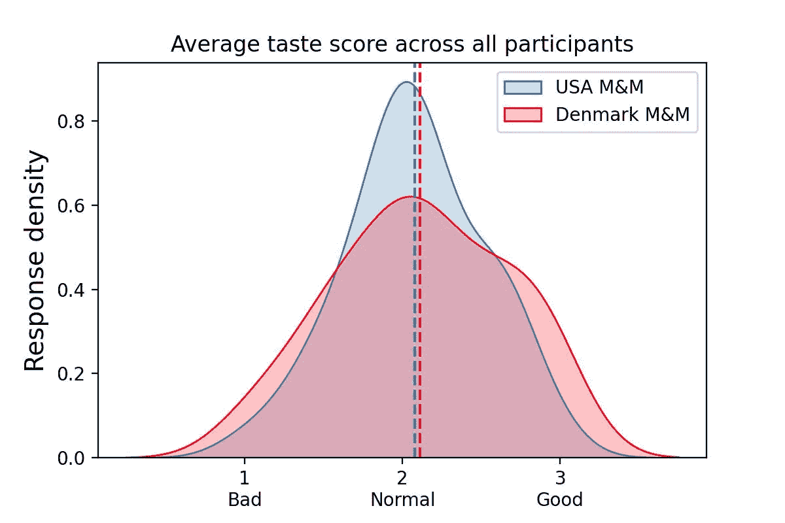

图 3\. 整个数据集的定量味觉评分分布。计算每个参与者对每种 M&M 类型的平均味觉评分的核密度估计。图表使用 Seaborn 制作。

拿到每种 M&M 类型的平均味觉评分后，我们使用 scipy.stats [ttest_ind](https://docs.scipy.org/doc/scipy/reference/generated/scipy.stats.ttest_ind.html)（“T 检验”）来评估美国和丹麦 M&M 的味觉评分均值是否不同（原假设为均值相同）。如果均值有显著差异，那么这将证明某种 M&M 被认为比另一种更美味。

我们发现美国 M&M 和丹麦 M&M 的平均味觉评分非常接近（见图 3），且没有显著差异（T 检验：*p* = 0.721）。因此，在所有参与者中，我们没有观察到两种 M&M 类型在感知味觉上的差异（或者，如果你喜欢解析三重否定：“我们*不能***拒绝**原假设，即两者之间*没有*差异”）。

但如果我们按照参与者的出生大陆来区分，这个结果会有所不同吗？

## 3.2 “美国 M&M”和“丹麦 M&M”在各大洲的反应

我们在将参与者按其大陆来源分组后重复了上述 X2 和 T 检验分析。由于澳大利亚和南美组的样本量较小，我们将其合并为一个组，以尽量保护数据隐私。由于即使是合并后的澳大利亚/南美组（*n*=3）样本量仍然较小，我们将避免对该组趋势进行分析，但为了完整性和参与者的享受，我们将该组的数据包含在几个图表中。

**3.2.1 类别反应分析 — 按大陆**

在图 4 中，我们展示了每个大陆组的口味反应计数（上面面板，*注意交互式图例*）和反应百分比（下面面板）。北美和亚洲的趋势与整个数据集类似：参与者报告丹麦 M&M 时，“好”的比例高于美国 M&M，但也报告丹麦 M&M 时，“不好”的比例更高。美国 M&M 最常被报告为“正常”（图 4）。

相反，欧洲参与者报告美国 M&M 时，“不好”的比例接近 50%，而“好”的比例仅为 18%，这是最负面和最不积极的反应模式（排除了样本量较少的澳大利亚/南美组）。

图 4\. 按大陆的定性口味反应分布。上面面板：口味反应的计数 — 点击图例进行交互式筛选！下面面板：每种 M&M 类型的口味反应百分比。图形由 Altair 制作。

这在条形图中表现得很突出，然而，只有北美在评估每个大陆的两种 M&M 类型之间的口味反应差异时，具有显著的 X2 *p*-值（***p* = 0.0058**）。欧洲的 *p*-值或许在某些圈子中被认为是“接近显著”，但我们即将进行更多的假设检验，并且应当注意多重假设检验（表 1）。在这里出现假阳性结果将是灾难性的。

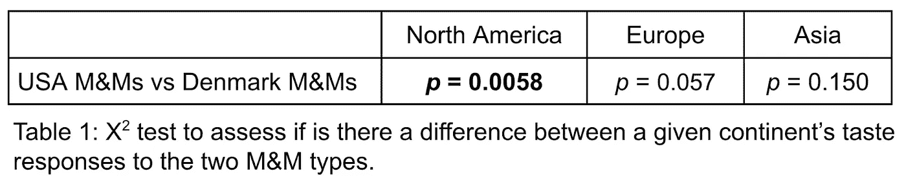

在比较两大洲之间相同 M&M 类型的口味反应模式时，有几点有趣的发现。首先，我们发现，在评估丹麦 M&M 时，不同大陆之间的口味差异并不显著——全球对来自欧洲的 M&M 的感觉普遍一致（右栏 X2 *p*-值，表 2）。为了更容易地可视化这一比较，我们在图 4 中重新组织了条形图，将其按 M&M 类型分组（图 5）。

图 5\. 按 M&M 类型的定性口味反应分布，结果以百分比形式报告。（与图 4 相同的数据，但重新排列）。图形由 Altair 制作。

然而，当比较各大洲对美国 M&M 的反应时，我们发现了更大的差异。我们发现一个配对的差异是显著的：欧洲和北美的参与者对美国 M&M 的评价截然不同（***p* = 0.000007**）（表 2）。看起来这种差异不太可能是随机产生的（表 2 左列）。

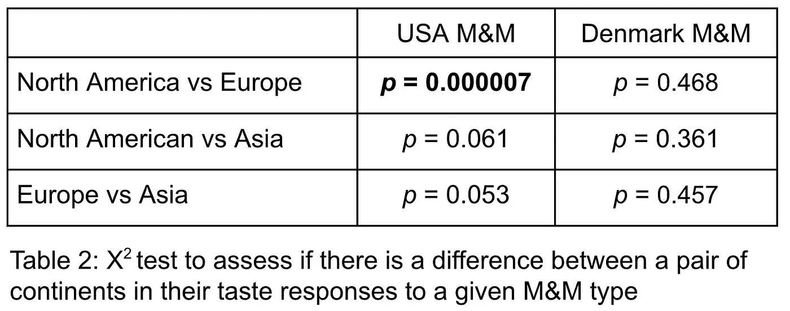

**3.2.2 定量反应分析 — 按大洲划分**

我们再次将分类特征转化为定量分布，以评估各大洲对 M&M 类型的相对偏好。对于北美，我们看到两种 M&M 类型的口味评分均值其实相当接近，但美国 M&M 的“正常”评分周围密度较高（图 6A）。欧洲的分布在均值上保持了一定的分离（尽管这种差异不算显著），美国 M&M 的评分较低（图 6B）。亚洲参与者的口味评分分布最为相似（图 6C）。

在重新调整以比较各大洲对相同 M&M 类型的口味评分的定量方法时，只有北美和欧洲参与者对美国 M&M 的评分在 T 检验基础上有显著差异（***p* = 0.001**）（图 6D），尽管我们现在*真的*面临多重假设检验的风险！如果你打算认真对待这个分析，请保持谨慎。

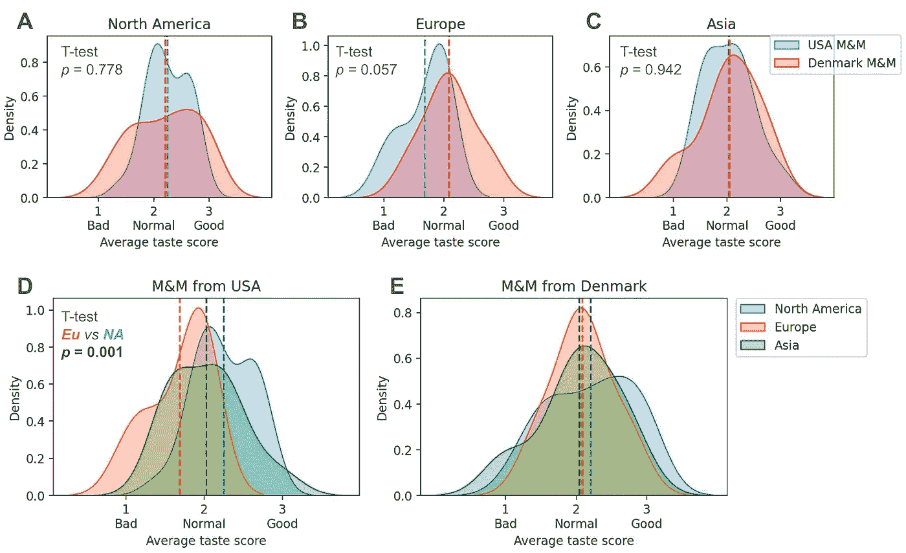

图 6\. 按大洲分的定量口味评分分布。每种 M&M 类型的平均口味评分的核密度估计。**A.** 北美对每种 M&M 的反应比较。**B.** 欧洲对每种 M&M 的反应比较。**C.** 亚洲对每种 M&M 的反应比较。**D.** 各大洲对美国 M&M 的比较。**E.** 各大洲对丹麦 M&M 的比较。图由 Seaborn 绘制。

此时，我开始觉得或许欧洲人并不是在胡说八道。我并不是说他们所说的那么夸张，但也许确实存在某种差异……在某种程度上，北美参与者也感知到了这种差异，但他们对欧洲来源的 M&M 的评价并不总是正面或负面一致。

## 3.3 M&M 口味对齐图

在我们迄今为止的分析中，我们没有考虑到参与者在 M&M 欣赏度上的基线差异。例如，假设人物 1 将所有丹麦 M&M 评分为“好”，所有美国 M&M 评分为“正常”，而人物 2 则将所有丹麦 M&M 评分为“正常”，所有美国 M&M 评分为“差”。他们对丹麦 M&M 和美国 M&M 的相对偏好是相同的，但人物 2 可能并不像人物 1 那样喜欢 M&M，且原始评分的平均化使得相对偏好信号变得模糊。

受桌面角色扮演游戏（如《龙与地下城©™》）中使用的合法/混乱与善良/邪恶对齐图的启发，在图 7 中，我们建立了一个 M&M 对齐图，帮助确定参与者在 M&M 享受类别中的分布。

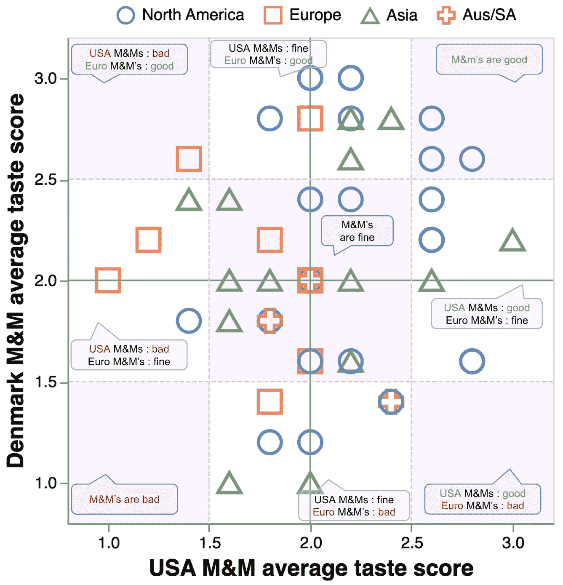

图 7. M&M 享受对齐图。x 轴表示参与者对美国 M&M 巧克力的平均口味得分；y 轴表示参与者对丹麦 M&M 巧克力的平均口味得分。图表由 Altair 制作。

值得注意的是，右上象限，即两种 M&M 巧克力均被视为“好”到“正常”的区域，主要由北美参与者和少数亚洲参与者占据。所有欧洲参与者都位于图表的左半部分，其中美国 M&M 巧克力被视为“正常”到“差”，但欧洲人对于丹麦 M&M 巧克力的感知有些分裂，分布在上下半部分，其中对丹麦 M&M 巧克力的感知从“好”到“差”不等。

图 7 的交互版本已提供，供读者探索不同 M&M 对齐区域的参与者计数。

图 7（交互版）：点击并用鼠标刷过散点图，查看不同 M&M 享受区域中各大洲的计数。图表由 Altair 制作。

## 3.4 参与者口味反应比率

接下来，为了去除 M&M 享受的基线影响，并专注于参与者之间对两种 M&M 巧克力类型的相对偏好，我们取了每个参与者的**美国 M&M 口味得分平均值**与其**丹麦 M&M 口味得分平均值**的对数比值。

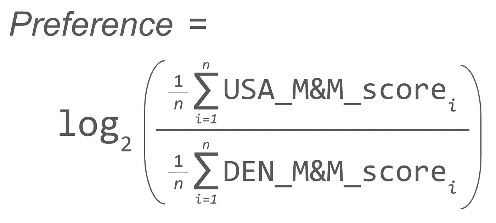

方程式 1：计算每个参与者总体 M&M 巧克力偏好比率的方程。

因此，正分数表示偏好美国 M&M 巧克力，而负分数表示偏好丹麦 M&M 巧克力。

平均而言，欧洲参与者对丹麦 M&M 巧克力的偏好最强，亚洲人也表现出对丹麦 M&M 巧克力的轻微偏好（图 8）。对于那两位在得知自己对美国 M&M 巧克力有轻微偏好时感到自豪感下降的欧洲人，别担心：你们并不是认为美国 M&M 巧克力是“好”的，而是将其评为比丹麦 M&M 巧克力稍微“不那么差”（参见交互版图 7 中的参与者 ID 4 和 17）。如果你坚持认为 M&M 是一个不值得复制的糟糕美国发明，转而回归食用手工制作的欧洲巧克力，你的荣誉可能会恢复。

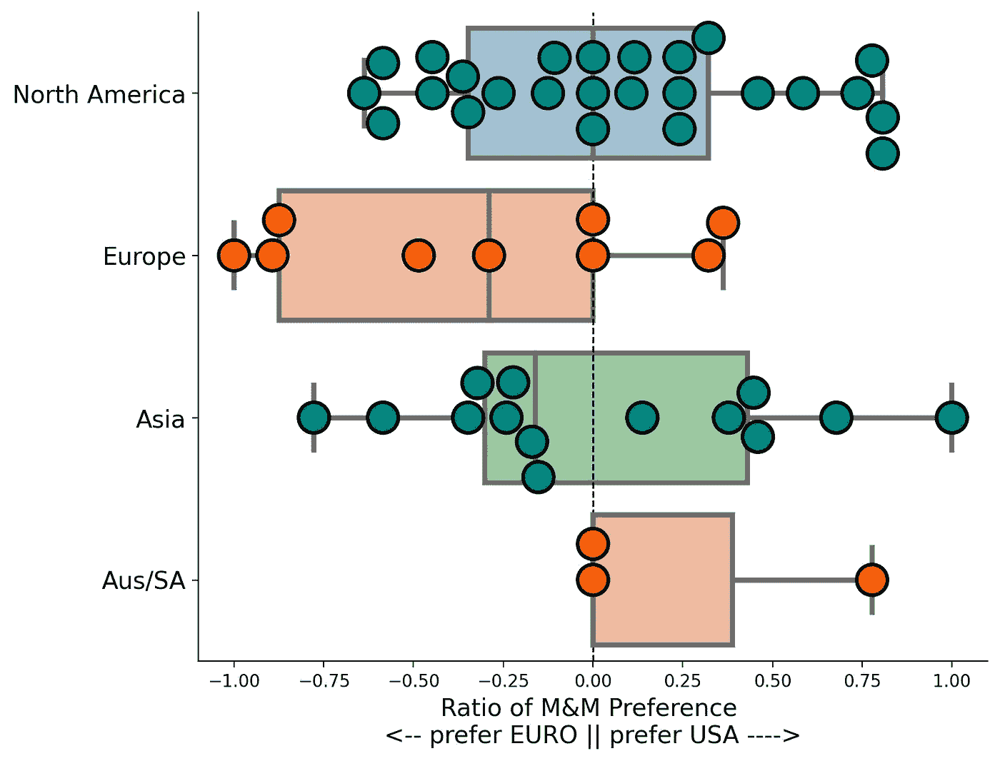

图 8. 按大陆分布的参与者 M&M 偏好比率。偏好比率按方程 1 计算。正数表示相对偏好美国 M&M 巧克力，负数表示相对偏好丹麦 M&M 巧克力。图表由 Seaborn 制作。

北美参与者在偏好比率上差异较大：有些人偏好中立，接近 0，有些人则强烈偏好熟悉的美国 M&M，而少数人则中等程度地偏好丹麦 M&M。据 anecdotal 经验，北美人中那些偏好欧洲 M&M 的人，似乎表现出某种夸大的自豪感，仿佛他们的结果象征着一种高雅的品味。

总体而言，通过 T 检验比较 M&M 偏好比率的分布，显示出欧洲和北美参与者之间可能存在显著的均值差异（***p* = 0.049**），但拜托，这是我报告的第 20 个 p 值——这个可能太接近了，难以确定。

## 3.5 味觉不一致性与“完美分类者”

对每位参与者，我们通过计算他们对每种 M&M 类型的反应标准差的平均值来评估他们的味觉评分一致性，并将其与他们的偏好比率进行对比绘图（见图 9）。

图 9. 参与者的味觉一致性与偏好比率。横轴表示参与者相对的 M&M 偏好比率。纵轴表示他们对美国 M&M 和丹麦 M&M 评分的标准差的平均值。纵轴上的 0 值表示反应的一致性完美，而更高的值表示反应不一致。图表由 Altair 制作。

大多数参与者的评分在一定程度上存在不一致，针对同一类型的 M&M 在 5 个样本中的评分不同。如果欧洲产和美国产的 M&M 味觉差异并不十分明显，那么这种不一致是可以预期的。最不一致的是那些对同一类型的 M&M 给出“好”、“正常”和*“坏”*不同评分的参与者（例如，纵轴上的高点，味觉评分的标准差较大），这表明他们的味觉感知能力较差。

有趣的是，四位参与者——每个大洲组的一位——表现得完全一致：他们对每种 M&M 类型的 5 颗 M&M 的味觉反应相同，导致平均标准差为 0.0（见图 9 底部）。排除掉其中一位仅将所有 10 颗 M&M 评为“正常”的参与者，其余三位看起来是“完美分类者”——他们要么将一种类型的所有 M&M 评为“好”，另一种类型评为“正常”，要么将一种类型的所有 M&M 评为“正常”，另一种类型评为“坏”。也许这些人是“超级味觉者”。

## 3.6 M&M 颜色

另一种可能的解释是个体味觉反应的不一致性，可能是由于 M&M 颜色所带来的可感知的味觉差异。从视觉上看，美国生产的 M&M 明显比丹麦生产的 M&M 更加光滑和鲜艳，而丹麦 M&M 则显得有些“斑驳”（见图 10A）。在实验过程中记录了 M&M 的颜色，尽管平衡取样并未正式纳入实验设计，但颜色似乎大致均匀取样，唯一的例外是蓝色美国 M&M，其样本量过大（见图 10B）。

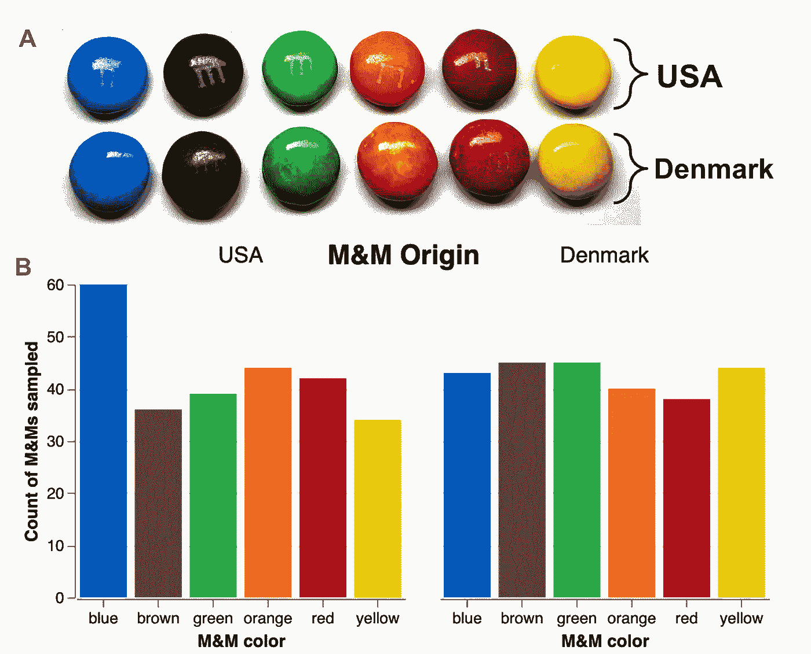

图 10\. M&M 颜色。**A.** 每种类型的 M&M 颜色照片。也许在我那没有专业灯光的照片中很难看出，但肉眼观察，美国的 M&M 似乎更亮且颜色更均匀，而丹麦的 M&M 则呈现出较暗且带有斑驳色彩。是我一个人感觉这样，还是你们也能听到欧洲人说“它们更亮是因为你们在食物中加了那些我们在这里禁用的额外化学物质！”**B.** 在实验过程中每种颜色的 M&M 分布。蓝色的美国 M&M 并不是故意被过度抽样的——它们一定特别亮眼，令实验者难以抗拒。图表由 Altair 制作。

我们简要地根据颜色可视化了可能的口味反应差异（见图 11），然而我们认为数据不足以支持明确的结论。毕竟，平均来说，每个参与者可能只会品尝到 6 种 M&M 中的 5 种颜色一次，而 1 种颜色则根本没有品尝到。我们将进一步的 M&M 颜色研究留待未来的工作。

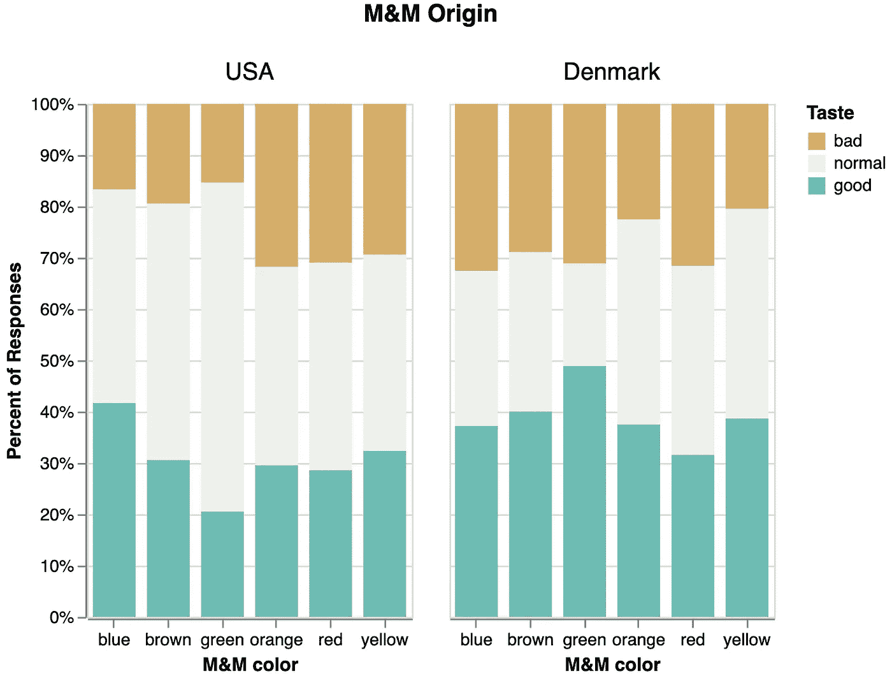

图 11\. 各种颜色和类型的 M&M 口味反应概况。反应结果以“差”、“正常”和“好”回应的百分比表示，尽管并不是所有的 M&M 都是平均抽样的。图表由 Altair 制作。

## 3.7 多彩的评论

我们向每位参与者保证，在本实验中没有“正确的答案”，所有感受都是有效的。尽管有些参与者非常认真，有时会花超过一分钟时间细细品味每颗 M&M 并像品酒师一样评价它，许多参与者似乎将实验视为一场竞争（这有时会导致骄傲的情绪膨胀或萎缩）。实验者在记录 M&M 反应的同时也做了笔记和摘录，其中有些内容有些“生动”。我们提供了一个匆忙制作的每种 M&M 类型的词云，供娱乐之用（见图 12），但我们提醒大家，不要在没有认真情感分析的情况下过度解读它们。

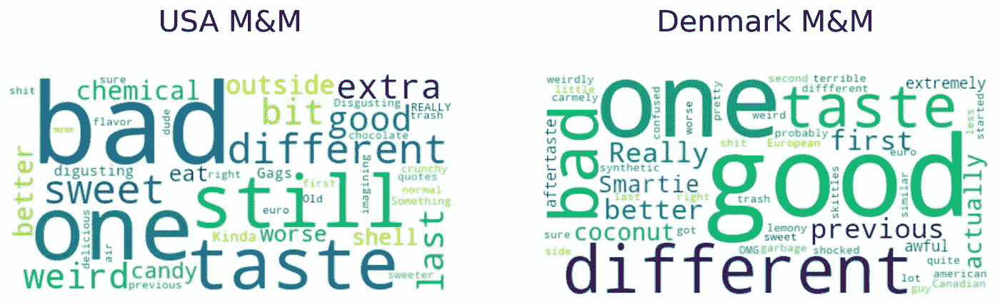

图 11\. 从每种 M&M 类型的笔记栏中生成的简单词云。提醒一下——这些词云还没有经过情感分析，并且记录了一些不太恰当的语言。图表由 WordCloud 制作。

# 4\. 结论

总体来看，并没有出现“全球共识”认为欧洲的 M&M 比美国的 M&M 更好。然而，欧洲参与者似乎更强烈地对美国的 M&M 表达负面反应，而北美的参与者似乎对是否更喜欢来自美国还是欧洲的 M&M 观点较为分歧。亚洲参与者的偏好趋势通常介于北美和欧洲之间。

因此，我承认，欧洲人并没有在关于 M&M 的事情上进行大规模的联合欺骗。大多数欧洲参与者偏向丹麦 M&M 这一结果令人信服，尤其是考虑到我是亲自收集大部分味觉反应数据的实验者。如果他们找到了欺骗的方式，做得足够巧妙，超出了我的被动察觉，以至于我没有注意到。然而，基于这项研究，似乎强烈的“呕吐味”并不是普遍被感知的，而且在同时品尝两种 M&M 类型时，不会出现在非欧洲人中。

我们希望这项研究能带来启发！我们期待在未来扩展这项工作，改进参与者抽样，增加来自其他大洲的不同类型 M&M，并深入探讨颜色可能带来的味觉差异。

感谢所有参与并为了科学而吃 M&M 的人！

图表和分析可以在 github 上找到：[`github.com/erinhwilson/mnm-taste-test`](https://github.com/erinhwilson/mnm-taste-test)

*本文由 Erin H. Wilson 博士[1,2,3]撰写，她决定在答辩和开始下一份工作之间的这段时间，最好用来进行这项非常有价值的分析。希望大家能看出这篇文章是幽默的——我并没有对不喜欢美式 M&M 的欧洲人怀有任何负面情绪，只是很享受这个机会，带着点调侃的心态，玩笑式地讽刺我们在充满热情的数据分析中所展开的激烈辩论。*

*感谢 Matt、Galen、Ameya 和 Gian-Marco 在数据收集方面的帮助！*

*[1] 曾在华盛顿大学保罗·G·艾伦计算机科学与工程学院担任博士生*

*[2] 曾在丹麦技术大学诺和诺德基金会生物可持续发展中心担任访问博士生*

*[3] LanzaTech 的未来数据科学家*
