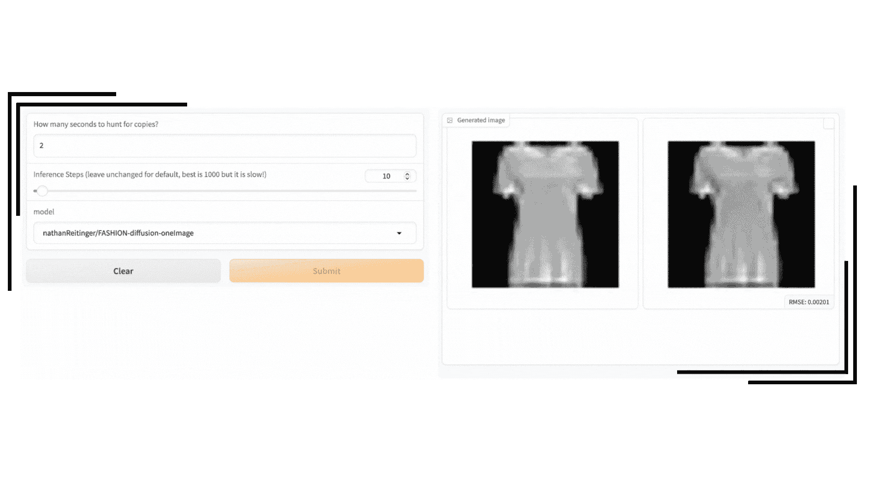
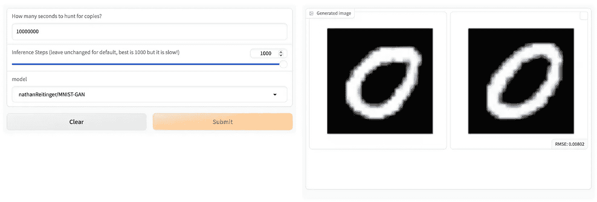
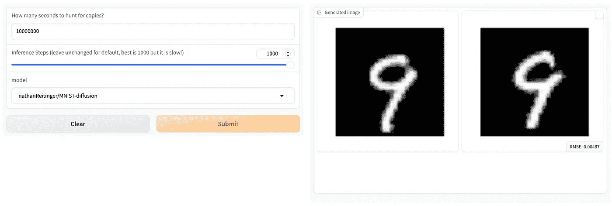

# 机器学习模型是否存储受保护的内容？

> 原文：[`towardsdatascience.com/do-machine-learning-models-store-protected-content-abec357c6b70?source=collection_archive---------6-----------------------#2024-05-06`](https://towardsdatascience.com/do-machine-learning-models-store-protected-content-abec357c6b70?source=collection_archive---------6-----------------------#2024-05-06)

## ~概念验证~

[](https://medium.com/@nathanReitinger?source=post_page---byline--abec357c6b70--------------------------------)[](https://towardsdatascience.com/?source=post_page---byline--abec357c6b70--------------------------------) [Nathan Reitinger](https://medium.com/@nathanReitinger?source=post_page---byline--abec357c6b70--------------------------------)

·发表于[Towards Data Science](https://towardsdatascience.com/?source=post_page---byline--abec357c6b70--------------------------------) ·5 分钟阅读·2024 年 5 月 6 日

--


从 chatGPT 到 Stable Diffusion，人工智能（AI）正经历一个类似于[1970 年代](https://clivethompson.medium.com/the-risk-of-a-new-ai-winter-332ffb4767f0)的夏天，AI 的盛况可与那个时代的辉煌相提并论。然而，这一欢庆并非没有遭遇反对。从[好莱坞](https://www.newscientist.com/article/2402251-hollywood-strike-ends-but-actors-battle-against-ai-may-not-be-over/#:~:text=The%20use%20of%20AI%20to,companies%20use%20performers'%20digital%20twins.)到[卢浮宫](https://nftevening.com/claire-silver-brings-artificial-intelligence-nft-art-to-the-louvre/)，人工智能似乎唤醒了一个沉睡的巨人——一个渴望保护曾经看似专属于人类的世界：创造力。

对于那些渴望保护创造力的人来说，人工智能似乎有一个致命弱点：训练数据。事实上，所有[最佳模型](https://arxiv.org/pdf/2310.19909)都需要一个高质量、涵盖全球的数据源——但这意味着什么呢？

*首先*，高质量意味着人为创造的。尽管[非人工创造的](https://law.stanford.edu/wp-content/uploads/2019/01/Bellovin_20190129.pdf)数据自从计算机自我对弈的概念被[战争游戏](https://www.youtube.com/watch?v=YIh41wZEd5c)推广以来取得了许多进展，计算机科学文献却表明，如果完全去除人的因素（即模型腐化或[模型崩塌](https://ui.adsabs.harvard.edu/link_gateway/2024arXiv240207712D/doi:10.48550/arXiv.2402.07712)），模型质量随着时间的推移会下降。简单来说：人类数据是这些模型的命脉。

*第二*，全球性意味着全球性。如果你把它放到网上，你应该假设模型已经在训练中使用了它：那个你原本希望只有你和 Tom 记得的 Myspace 帖子（已被吸收），那个你高兴地忘记的[图片封存记忆](https://www.cnn.com/2022/05/24/tech/cher-scarlett-facial-recognition-trauma/index.html)，直到 PimEyes 迫使你重新记起它（已被吸收），以及那些你希望只是梦境的深夜 Reddit 争论（已被吸收）。

像 LLaMa、BERT、Stable Diffusion、Claude 和 chatGPT 这样的模型都是在大量由人类创作的数据上进行训练的。而一些、许多或大多数人类创作的表达方式——尤其是那些恰好固定在计算机可以访问并学习的有形介质上的表达——具有版权保护的资格。


Anderson v. Stability AI；Concord Music Group, Inc. v. Anthropic PBC；Doe v. GitHub, Inc.；Getty Images v. Stability AI；{Tremblay, Silverman, Chabon} v. OpenAI；纽约时报诉微软

虽然可能是偶然的，这些模型无法生存的数据正是大多数受到版权保护的数据。这也催生了我们今天看到的巨大的版权斗争。

在这些诉讼中产生的许多问题中，最紧迫的一个问题是模型本身是否存储受保护的内容。这个问题似乎相当明显，因为我们怎么能说模型——仅仅是由数字（即权重）和架构组成的集合——“存储”了什么？正如 Murray 教授所说：

> 当前关于视觉生成型 AI 系统的辩论中的许多参与者抓住了这样一个观点：生成型 AI 系统已在包含实际版权保护的图像文件（如.jpg、.gif、.png 等）数据集和基础模型上进行训练，这些文件是从互联网上抓取的，数据集或基础模型一定已经制作并存储了这些作品的副本，并且生成型 AI 系统以某种方式进一步选择并复制了这些数据集中的个别图像，并以某种方式将这些图像的重大可版权部分复制并纳入到最终生成的图像中，供最终用户使用。这是一种魔法般的思维。
> 
> Michael D. Murray, 26 SMU 科技与法律评论 259, 281 (2023)

然而，模型本身似乎在某些情况下，[确实会记住训练数据](https://arxiv.org/pdf/2301.13188)。

以下示例来自[HuggingFace 上的 Gradio Space](https://huggingface.co/spaces/nathanReitinger/modelProblems)，该平台允许用户选择一个模型，查看输出，并从该模型的训练数据中检查生成的图像与其训练数据中任何图像的相似度。由于 MNIST 数字易于机器解析、易于人类从相似性角度理解，并且具有易于分类的优点——这使得相似性搜索只考虑相同数字的图像（提高效率），因此使用了 MNIST 数字。

> 让我们看看它是如何工作的！

以下图像的相似度得分为 0.00039。RMSE 代表均方根误差，是评估两张图像相似度的一种方式。事实上，还有许多其他相似性评估方法，但 RMSE 能很好地判断一张图像是否为副本（即，我们这里并不是在寻找法律定义的相似性）。举个例子，RMSE 值小于 0.006 时，图像已接近“复制”范围，而 RMSE 值小于 0.0009 时，则进入完美复制的领域（肉眼无法分辨）。



[🤗](https://huggingface.co/spaces/nathanReitinger/modelProblems) 一个生成几乎完全相同训练数据副本的模型（RMSE 为 0.0003）[🤗](https://huggingface.co/spaces/nathanReitinger/modelProblems)

要使用[Gradio 空间](https://huggingface.co/spaces/nathanReitinger/modelProblems)，请按照以下三个步骤操作（如果空间处于休眠状态，可以选择构建该空间）：

+   **步骤 1**：选择要使用的预训练模型类型

+   **步骤 2**：点击“提交”按钮，模型将为您生成一张图像（28x28 的灰度图像）

+   **步骤 3**：Gradio 应用程序会在该模型的训练数据中搜索，识别与生成图像最相似的图像（从 60K 个示例中筛选）

如上所示，左侧生成的图像（AI 创作）几乎与右侧的训练数据完全相同，当使用“FASHION-diffusion-oneImage”模型时，结果正是如此。这是有道理的。该模型仅对[FASHION 数据集](https://www.tensorflow.org/datasets/catalog/fashion_mnist)中的一张图像进行了训练。同样的情况也适用于“MNIST-diffusion-oneImage”模型。

尽管如此，即使是训练了更多图像（例如 300 张、3000 张或 60000 张图像）的模型，也能产生非常相似的输出。这个示例来自一个生成对抗网络（GAN），它在完整的 60K 图像数据集（仅限训练）上进行了训练，数据集包括[MNIST 手写数字](https://etzold.medium.com/mnist-dataset-of-handwritten-digits-f8cf28edafe)。作为背景，生成对抗网络（GAN）通常生成的图像[比扩散模型](https://arxiv.org/abs/2301.13188)记忆性差：



RMSE 为 0.008

这是另一个使用*扩散模型*，并在 60K MNIST 数据集上训练的图像（即，支持稳定扩散的模型类型）：



RMSE 为 0.004

随时可以自己尝试使用[Gradio 空间](https://huggingface.co/spaces/nathanReitinger/modelProblems)，探索模型，或者如果有问题可以联系我！

**总结：** 这个小型示例的重点是，机器学习模型没有什么神秘或绝对的版权豁免。机器学习模型确实可以并且会生成与其训练数据相同的图像——换句话说，模型确实会*存储*受保护的内容，因此可能会遇到版权问题。当然，也有许多反驳的论点（我正在进行的工作！）；这个演示应该仅作为存储的轶事性证据，可能是开发者在这一领域工作的“金丝雀”。

输入到模型中的内容和从模型中得到的结果同样重要，尤其对于某些执行特定任务的模型来说更是如此。我们需要小心并关注我们的“黑箱”，因为这个类比往往并不成立。你无法自己解读模型所持有的权重集合，并不意味着你可以摆脱所有形式的责任或审查。

*—* [*@nathanReitinge*](https://nathanreitinger.umiacs.io)*r，敬请关注该领域的进一步工作！*

```py
Unless otherwise noted, all images are by the author
```
