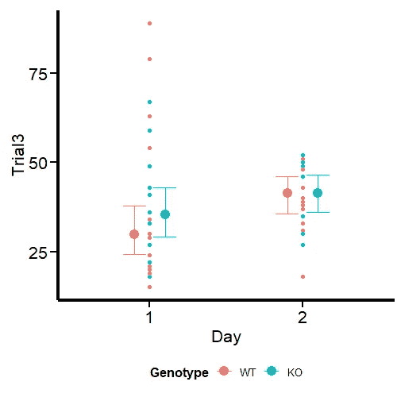

# 不要过度思考“离群值”，改用学生 t 分布

> 原文：[`towardsdatascience.com/do-not-over-think-about-outliers-use-a-student-t-distribution-instead-b6c584b91d5c?source=collection_archive---------0-----------------------#2024-03-30`](https://towardsdatascience.com/do-not-over-think-about-outliers-use-a-student-t-distribution-instead-b6c584b91d5c?source=collection_archive---------0-----------------------#2024-03-30)

## 使用 R 和 Brms 的贝叶斯方法

[](https://medium.com/@damanrique?source=post_page---byline--b6c584b91d5c--------------------------------)[](https://towardsdatascience.com/?source=post_page---byline--b6c584b91d5c--------------------------------) [Daniel Manrique-Castano](https://medium.com/@damanrique?source=post_page---byline--b6c584b91d5c--------------------------------)

·发表于[Towards Data Science](https://towardsdatascience.com/?source=post_page---byline--b6c584b91d5c--------------------------------) ·15 分钟阅读·2024 年 3 月 30 日

--

对许多研究人员而言，离群值是可以极大改变分析过程的“异类波”，或者“混淆”一些预期效果。我更倾向于使用“极端观测值”这一术语，并将离群值留给那些并非研究群体真正一部分的观测值。例如，在我的研究领域（脑缺血研究），离群值指的是没有缺血的动物（尽管应该有），而极端观测值则是那些小范围或大范围缺血，且与其他动物有显著差异的个体。

传统的（频率学派）统计模型是建立在高斯分布的坚实基础上的。这存在一个显著的局限性：一个固有的假设，认为所有数据点会围绕一个中央均值按照可预测的模式聚集（基于中心极限定理）。在柏拉图的理念世界中，这或许是正确的，但我们这些生物医学领域的科学家深知，考虑到有限的样本（动物数量），我们很难依赖这一假设来进行观察。

高斯分布对极端观测值非常敏感，其使用使得科学家们认为，去除极端观测值是获得“更清晰”或“更干净”结果的最佳方式（无论这是什么意思）。正如我曾在一篇文章中作为审稿人 2 所评论的，“问题不在于那些可能‘隐藏’你效果的极端观测值，而在于你使用了一个（我认为）不适合你目的的统计模型”。

> 应该注意的是，没有哪种统计模型是“正确”或“合适”的，但我们可以估计，在给定数据的情况下，有些统计模型比其他模型更有可能生成观察到的数据（生成模型）。

幸运的是，没人强迫我们受限于高斯模型的假设，对吧？我们还有其他选择，比如**学生 t 分布**（*1*）。我认为它是一个更具适应性的工具，用来在真实世界的生物医学数据的动荡海洋中航行。学生 t 分布提供了一种强大的替代方案，承认我们的数据可能包含极端观测值，而这些值是正常的生物学反应，任何情境下都可以预见到。可能会有一些患者或动物对治疗没有反应或反应过度，而我们的建模方法能够识别这些反应作为数据的一部分，这非常重要。因此，本教程将通过`**brms**`包在 R 语言中的应用（*2*）来探讨使用学生 t 分布的建模策略——这是贝叶斯建模的强大助手。

# 学生 t 分布背后是什么？

[学生 t 分布](https://mathworld.wolfram.com/Studentst-Distribution.html)不过是具有更重尾部的高斯分布。换句话说，我们可以说高斯分布是学生 t 分布的一个特例。高斯分布由均值（μ）和标准差（σ）定义。而学生 t 分布则增加了一个额外的参数，即自由度（df），它控制分布的“厚度”。这个参数赋予远离均值的事件更高的概率。这一特性对于小样本量，尤其是生物医学领域尤其有用，因为在这些领域，正态分布的假设是值得怀疑的。注意，当自由度增大时，学生 t 分布趋近于高斯分布。我们可以使用密度图来可视化这一点：

```py
# Load necessary libraries
library(ggplot2)

# Set seed for reproducibility
set.seed(123)

# Define the distributions
x <- seq(-4, 4, length.out = 200)
y_gaussian <- dnorm(x)
y_t3 <- dt(x, df = 3)
y_t10 <- dt(x, df = 10)
y_t30 <- dt(x, df = 30)

# Create a data frame for plotting
df <- data.frame(x, y_gaussian, y_t3, y_t10, y_t30)

# Plot the distributions
ggplot(df, aes(x)) +
  geom_line(aes(y = y_gaussian, color = "Gaussian")) +
  geom_line(aes(y = y_t3, color = "t, df=3")) +
  geom_line(aes(y = y_t10, color = "t, df=10")) +
  geom_line(aes(y = y_t30, color = "t, df=30")) +
  labs(title = "Comparison of Gaussian and Student t-Distributions",
       x = "Value",
       y = "Density") +
  scale_color_manual(values = c("Gaussian" = "blue", "t, df=3" = "red", "t, df=10" = "green", "t, df=30" = "purple")) +
  theme_classic()
```


图 1：具有不同自由度的高斯分布和学生 t 分布的比较。

请注意在图 1 中，随着自由度的降低，均值周围的山峰变得越来越小，因为概率质量转移到尾部，而尾部则更厚。这个特性使得学生 t 分布对离群值的敏感度降低。关于这一点的更多细节，你可以查看[这个](https://online.stat.psu.edu/stat414/lesson/26/26.4)博客。

# 加载所需的包

我们加载所需的库：

```py
library(ggplot2)
library(brms)
library(ggdist)
library(easystats)
library(dplyr)
library(tibble)
library(ghibli)
```

# 探索性数据可视化

所以，让我们跳过数据模拟，直接进入正题。我将使用我从进行转棒测试的小鼠中获得的真实数据。

首先，我们将数据集加载到环境中，并设置相应的因素水平。数据集包含动物的 ID、一个分组变量（基因型）、两个不同测试日的指示符（天数），以及同一天的不同实验。对于本文，我们仅建模其中一个实验（实验 3）。其他实验将保留在未来的关于建模变异性的文章中。

如数据处理所示，我们的建模策略将基于基因型和天数作为`Trial3`分布的分类预测变量。

> 在生物医学科学中，分类预测变量或分组因素比连续预测变量更为常见。该领域的科学家喜欢将样本分为不同的组或条件，并应用不同的处理方法。

```py
data <- read.csv("Data/Rotarod.csv")
data$Day <- factor(data$Day, levels = c("1", "2"))
data$Genotype <- factor(data$Genotype, levels = c("WT", "KO"))
head(data)
```


数据框

让我们使用**Raincloud 图**来初步查看数据，正如[吉列尔梅·A·弗朗奇博士](https://medium.com/u/3cca5ff4ed5d?source=post_page---user_mention--b6c584b91d5c--------------------------------)在[这篇](https://medium.com/@amorimfranchi/raincloud-plots-for-clear-precise-and-efficient-data-communication-4c71d0a37c23#:~:text=Raincloud%20plots%20for%20clear%2C%20precise%20and%20efficient%20data%20communication,-Guilherme%20A.&text=Raw%20data%20visualization%20involves%20presenting,quality%20assessment%20of%20your%20data.)精彩的博客文章中所展示的。

```py
edv <- ggplot(data, aes(x = Day, y = Trial3, fill=Genotype)) +
  scale_fill_ghibli_d("SpiritedMedium", direction = -1) +
  geom_boxplot(width = 0.1,
               outlier.color = "red") +
  xlab('Day') +
  ylab('Time (s)') +
  ggtitle("Rorarod performance") +
  theme_classic(base_size=18, base_family="serif")+
  theme(text = element_text(size=18),
        axis.text.x = element_text(angle=0, hjust=.1, vjust = 0.5, color = "black"),
        axis.text.y = element_text(color = "black"),
        plot.title = element_text(hjust = 0.5),
        plot.subtitle = element_text(hjust = 0.5),
        legend.position="bottom")+
  scale_y_continuous(breaks = seq(0, 100, by=20), 
                     limits=c(0,100)) +
# Line below adds dot plots from {ggdist} package 
  stat_dots(side = "left", 
            justification = 1.12,
            binwidth = 1.9) +
# Line below adds half-violin from {ggdist} package
  stat_halfeye(adjust = .5, 
               width = .6, 
               justification = -.2, 
               .width = 0, 
               point_colour = NA)
edv
```


图 2：探索性数据可视化。

图 2 与[吉列尔梅·A·弗朗奇博士](https://medium.com/u/3cca5ff4ed5d?source=post_page---user_mention--b6c584b91d5c--------------------------------)原始图形有所不同，因为我们绘制了两个因素而不是一个。然而，图形的性质是相同的。请注意红点，这些点可以被视为极端观察值，它们会将集中趋势的测量（尤其是均值）拉向一个方向。我们还观察到方差不同，因此对`sigma`的建模也能提供更好的估计。我们现在的任务是使用`brms`包来建模输出。

# 使用 brms 拟合统计模型

在这里，我们使用`Day`和`Genotype`作为相互作用的分类预测变量，来拟合`Trial 3`的分布。让我们首先拟合一个典型的高斯模型，它类似于频率学派框架中的普通最小二乘法（OLS）模型，因为我们使用的是默认的平坦`brms` [先验](https://paul-buerkner.github.io/brms/reference/set_prior.html)。先验超出了本文的讨论范围，但我保证我们将在未来的博客中讨论它们。

一旦我们获得了高斯模型的结果，我们可以将它们与学生 t 模型的大量结果进行比较。然后，我们将`sigma`添加到方程中，以考虑数据方差的差异。

## 在高斯分布下拟合一个“典型的”（频率学派）模型

我们的高斯模型是在典型（且常常不正确）的同方差假设下构建的（*3*）。换句话说，我们假设所有组的方差相同（或非常相似）。作为研究人员，我不记得曾看到过这种假设。

```py
Gaussian_Fit1 <- brm(Trial3 ~ Day * Genotype, 
           data = data, 
           family = gaussian(),
           # seed for reproducibility purposes
           seed = 8807,
           control = list(adapt_delta = 0.99),
           # this is to save the model in my laptop
           file    = "Models/20240222_OutliersStudent-t/Gaussian_Fit1.rds",
           file_refit = "never")

# Add loo for model comparison
Gaussian_Fit1 <- 
  add_criterion(Gaussian_Fit1, c("loo", "waic", "bayes_R2"))
```

## 模型诊断

在继续之前，进行一些简单的模型诊断是个好主意，以便将实际观察与我们模型的预测进行比较。我们可以通过几种方式做到这一点，但最常见的方法是绘制完整的密度图。我们可以使用`brms`中的`pp_check`函数来实现这一点。

```py
set.seed(8807)

pp_check(Gaussian_Fit1, ndraws = 100) +
  labs(title = "Gaussian model") +
  theme_classic()
```


图 3：高斯模型的诊断

图 3 表明我们的观察值（深蓝色）与模型预测没有显著差异。下面，我为您提供了额外的代码，以检查其他`pp_check`的替代方案及其各自的图表。

```py
set.seed(88071)

pp_check(Gaussian_Fit1, group = "Genotype", type = "dens_overlay_grouped", ndraws = 100) +
  labs(title = "Density by Genotype") +
    theme_classic()

pp_check(Gaussian_Fit1, type = "stat_grouped", group = "Genotype", stat = "var", binwidth = 3) +
  coord_cartesian(xlim = c(0, 300)) +
  ggtitle("Grouped variance") +
  theme_classic()

pp_check(Gaussian_Fit1, type = "stat", stat = "var", binwidth = 3) +
  coord_cartesian(xlim = c(0, 600)) +
  ggtitle("How well we captured the variace") +
  theme_classic()

pp_check(Gaussian_Fit1, type = "stat", stat = "mean", binwidth = 2) +
  coord_cartesian(xlim = c(0, 50)) +
  ggtitle("How well we captured the mean") +
  theme_classic()
```

## 检查高斯分布的结果

现在，我们使用`bayestestR`包中的`describe_posterior`函数（*4*）来查看结果：

```py
describe_posterior(Gaussian_Fit1,
                   centrality = "mean",
                   dispersion = TRUE,
                   ci_method = "HDI",
                   test = "rope",
                   )
```


这里我们专注于“截距”，即 1 DPI 时 WT 的值，以及“GenotypeKO”，即同一时间点 KO 动物的估计差异。我们看到 WT 动物在转棒上的时间约为 37 秒，而它们的 KO 同类则少于一秒（0.54）更多。作为该领域的研究人员，我可以说，这个差异是没有意义的，基因型对转棒表现没有影响。即使是“天数”的效应，2.9，在这个模型下对我来说似乎也没有意义。我们可以使用`brms`中的神奇函数`conditional_effects`轻松地可视化这些估计。

```py
# We create the graph for convex hull
Gaussian_CondEffects <- 
  conditional_effects(Gaussian_Fit1)

Gaussian_CondEffects <- plot(Gaussian_CondEffects, 
       plot = FALSE)[[3]]

Gaussian_CondEffects + 
  geom_point(data=data, aes(x = Day, y = Trial3, color = Genotype), inherit.aes=FALSE) +
  Plot_theme +
  theme(legend.position = "bottom", legend.direction = "horizontal")
```


图 8：高斯模型的条件效应

在图 8 中，我们可以看到交互项的估计值和不确定性。我已经自定义了这个图，并添加了一些 ggplot 元素，您可以在原始的[Quarto Notebook](https://github.com/daniel-manrique/MediumBlog/blob/main/20240222_OutliersStudent-t.qmd)中查看。请注意，尽管第一天的离散度比第二天大，但两个时间点的不确定性是相似的。我们将在文章结尾的一个小片段中解决这一点。

现在让我们看看，当我们使用学生-t 分布对相同的数据建模时，我们的理解发生了多大的变化。

# 拟合我们的假设：使用学生 t 分布的模型

现在是时候在我们的`brms`模型中使用学生 t 分布了。

```py
Student_Fit <- brm(Trial3 ~ Day * Genotype, 
           data = data, 
           family = student,
           # seed for reproducibility purposes
           seed = 8807,
           control = list(adapt_delta = 0.99),
           # this is to save the model in my laptop
           file    = "Models/20240222_OutliersStudent-t/Student_Fit.rds",
           file_refit = "never")

# Add loo for model comparison
Student_Fit <- 
  add_criterion(Student_Fit, c("loo", "waic", "bayes_R2"))
```

## 模型诊断

我们像之前一样绘制模型诊断：


图 9：学生 t 分布的模型诊断

图 9 显示了观察值和预测值的平均形状及峰值相匹配。需要注意的是，我们的模型似乎预测出了低于 0 的值。这是一个重要的研究问题，我们暂时跳过。不过，这确实暗示了使用信息性先验或设定下界为 0 的分布族，如 `log_normal`、`hurdle_lognormal` 或 `zero_inflated_poisson`，具体取决于情况。Andrew Heiss (*5*) 在这方面提供了一个 [很好的例子](https://www.andrewheiss.com/blog/2021/11/08/beta-regression-guide/)。

## 检查学生 t 分布的结果

让我们来看看后验分布：

```py
describe_posterior(Student_Fit,
                   centrality = "mean",
                   dispersion = TRUE,
                   ci_method = "HDI",
                   test = "rope",
                   )
```


在这个模型下，我们可以看到我们的估计值有所变化，我会说变化是适度的。我们的截距估计（1 天时的 WT）减少了 7 秒。那为什么会这样呢？因为我们在开始时发现的极端值对数据的集中趋势度量影响较小。因此，这是对第 1 天“典型”WT 动物的更准确度量。我们还观察到天数效应的显著增加，比我们最初的高斯估计多了将近 10 秒。重要的是，我们的 KO 基因型效应似乎更加显著，从我们高斯模型中的 0.52 增加到我们学生 t 模型中的 5.5，约增加了 10 倍。从我的角度来看，鉴于这些数据的背景，两个模型之间的差异是显著的。

让我们使用 `conditional_effects` 以图形方式查看：

```py
Student_CondEffects <- 
  conditional_effects(Student_Fit)

Student_CondEffects <- plot(Student_CondEffects, 
       plot = FALSE)[[3]]

Student_CondEffects + 
  geom_point(data=data, aes(x = Day, y = Trial3, color = Genotype), inherit.aes=FALSE) +
  Plot_theme +
  theme(legend.position = "bottom", legend.direction = "horizontal")
```



图 10：学生 t 模型的条件效应

我们能得到更好的估计吗？对于这个具体的例子，我认为我们可以。从一开始就很容易注意到数据的方差差异，尤其是在我们比较第一天和第二天的图形时。我们通过使用学生 t 分布改善了估计，进一步的改进可以通过开发一个异方差性模型来预测 sigma（残差方差）。

> 这样，模型并不假设你的残差方差在分组变量间是相等的，而是将其作为可以由预测变量建模的响应。

这是我们留到最后的小点。

# 使用学生 t 分布预测 sigma

我们使用 `brms` 中的 `bf` 函数将 sigma 作为响应变量。在这种情况下，我们将使用相同的预测变量 `Day` 和 `Genotype` 来建模这个参数。

```py
Student_Mdl2 <- bf (Trial3 ~ Day * Genotype,
                     sigma ~ Day * Genotype)

Student_Fit2 <- brm(
           formula = Student_Mdl2,
           data = data, 
           family = student,
           # seed for reproducibility purposes
           seed = 8807,
           control = list(adapt_delta = 0.99),
           # this is to save the model in my laptop
           file    = "Models/20240222_OutliersStudent-t/Student_Fit2.rds",
           file_refit = "never")

# Add loo for model comparison
Student_Fit2 <- 
  add_criterion(Student_Fit2, c("loo", "waic", "bayes_R2"))
```

## 模型诊断


图 11：带有 sigma 的学生 t 分布模型诊断

图 11 看起来很好，除了 0 以下的不舒服预测值。对于这个情况，我判断这不会强烈偏倚估计及其不确定性。然而，这是我在进行实际研究时会考虑的一个方面。

## 检查带有预测 sigma 的学生 t 分布的结果

现在，让我们来看看后验分布。


与另外两个拟合模型相比，我们看到更多的参数，因为现在模型中将 sigma 的反应作为一个主效应包含在内。在这种方案下，我们看到截距更接近高斯模型的截距，并且基因型（`GenotypeKO`）的效应减少了一半。

然而，有一点需要注意。在我们的第一个 Student-t 模型中，截距的不确定性为 24.1–37.4。另一方面，在最后一个模型中，不确定性增加到 24.3–46.1。这意味着当我们考虑不同的方差时，我们对这个（和其他）参数的信心减少了。例如，天数的情况也是如此，从 1.2–18.9 变化为-5.6–18.1。此时，我们对第二天与转棒上花费时间增加之间的关系的信心减弱了。

> 不用担心，统计建模的目的是提供对测量中不确定性的最佳量化，这正是我们现在所做的。当然，当样本中有极端值并且这些极端值也属于我们的总体时，我们的不确定性会增加。

在这个例子中，我们看到，考虑数据中不同的方差给了我们一个完全不同的结果理解。

最后，我们可以看到，绘制在对数尺度上的 sigma 在不同天数和基因型之间有显著变化：

```py
Student_CondEffects2 <- 
  conditional_effects(Student_Fit2)

Student_CondEffects2 <- plot(Student_CondEffects2, 
       plot = FALSE)[[3]]

Student_CondEffects2 + 
  geom_point(data=data, aes(x = Day, y = Trial3, color = Genotype), inherit.aes=FALSE) +
  Plot_theme +
  theme(legend.position = "bottom", legend.direction = "horizontal")

Student_CondEffects3 <- 
  conditional_effects(Student_Fit2, dpar = "sigma")

Student_CondEffects3 <- plot(Student_CondEffects3, 
       plot = FALSE)[[3]]

Student_CondEffects3 + 
  Plot_theme +
  theme(legend.position = "bottom", legend.direction = "horizontal")
```


图 12：带有 sigma 的 Student-t 模型的条件效应


图 13：sigma 的条件效应

我们在第二个图中看到的是 sigma，它有效地解释了这个参数在不同天数和基因型之间的方差。我们看到在第一天不确定性较高，特别是对于野生型小鼠，而在第二天这个参数是类似的。

我们可以通过比较三个模型的样本外预测来总结本文。

# 模型比较

我们使用 WAIC 标准进行模型比较（*6*），用于估计样本外预测误差。通过同时考虑观察数据的对数似然和有效参数数量，它在模型拟合和复杂性之间提供了平衡。与其他一些标准不同，WAIC 本质上考虑了参数的后验分布，而不是依赖于点估计，因此特别适合贝叶斯分析。

给定一个数据集和一个贝叶斯模型，WAIC 的计算公式为：

WAIC=−2×(LLPD−*p*WAIC​)

其中：LLPD 是对数逐点预测密度，计算为每个观察数据点在后验样本中的对数似然的平均值。WAIC 是有效参数数量，通过对数似然的平均值和后验样本中的平均对数似然值之间的差异来计算。

我们使用 `performance` 包中的 `compare_performance` 函数，该包是 `easystats` 环境的一部分（*4*，*7*，*8*）。

```py
Fit_Comp <- 
  compare_performance(
    Gaussian_Fit1, 
    Student_Fit, 
    Student_Fit2, 
    metrics = "all")

Fit_Comp
```

输出结果显示，我们预测 sigma 的学生 t 模型在样本外预测中受到的惩罚最小（WAIC = 497）。请注意，该模型中没有 sigma 的估计值，因为它作为响应变量包含在内。此表还显示，学生 t 模型的残差方差（sigma）比高斯模型小，这意味着方差被预测变量更好地解释。我们可以将相同的结果可视化为图表：

```py
Fit_Comp_W <- 
loo_compare(
 Gaussian_Fit1, 
    Student_Fit, 
    Student_Fit2,  
  criterion = "waic")

# Generate WAIC graph
Fit_Comp_WAIC <- 
  Fit_Comp_W[, 7:8] %>% 
  data.frame() %>% 
  rownames_to_column(var = "model_name") %>% 

ggplot(
  aes(x    = model_name, 
      y    = waic, 
      ymin = waic - se_waic, 
      ymax = waic + se_waic)
  ) +
  geom_pointrange(shape = 21) +
  scale_x_discrete(
    breaks=c("Gaussian_Fit1", 
             "Student_Fit", 
             "Student_Fit2"), 

    labels=c("Gaussian_Fit1", 
             "Student_Fit", 
             "Student_Fit2") 

    ) +
  coord_flip() +
  labs(x = "", 
       y = "WAIC (score)",
       title = "") +
  Plot_theme

Fit_Comp_WAIC
```


图 14：通过 WAIC 进行的模型比较

图 14 显示，我们的最后一个模型在样本外预测中受到的惩罚最小。

你可以在我的 [GitHub 网站](https://github.com/daniel-manrique/MediumBlog/blob/main/20240222_OutliersStudent-t.qmd) 找到此帖的更新版本。如果这段经历对你有帮助，或者你有任何建设性的意见，请告诉我。

*除非另有说明，所有图像均由作者使用 R 代码生成。*

# 参考文献

1.M. Ahsanullah, B. M. G. Kibria, M. Shakil, *正态分布与学生 t 分布及其应用*（Atlantis Press，2014；[`dx.doi.org/10.2991/978-94-6239-061-4`](http://dx.doi.org/10.2991/978-94-6239-061-4)）。

2\. P.-C. Bürkner, Brms: 一款用于贝叶斯多层次模型的 R 包，使用 Stan。**80** (2017)，doi：[10.18637/jss.v080.i01](https://doi.org/10.18637/jss.v080.i01)。

3\. K. Yang, J. Tu, T. Chen, [同方差性：线性回归中的一个被忽视的关键假设](https://doi.org/10.1136/gpsych-2019-100148)。*General Psychiatry*。**32**，e100148 (2019)。

4\. D. Makowski, M. S. Ben-Shachar, D. Lüdecke, [bayestestR：描述贝叶斯框架中效应及其不确定性、存在性和显著性](https://doi.org/10.21105/joss.01541)。**4**，1541 (2019)。

5\. A. Heiss, 使用贝叶斯 Beta 回归和零膨胀 Beta 回归模型建模比例的指南 (2021)，(可在 [`dx.doi.org/10.59350/7p1a4-0tw75`](http://dx.doi.org/10.59350/7p1a4-0tw75) 获得)。

6\. A. Gelman, J. Hwang, A. Vehtari, [理解贝叶斯模型的预测信息标准](https://doi.org/10.1007/s11222-013-9416-2)。*Statistics and Computing*。**24**，997–1016 (2013)。

7\. D. Lüdecke, M. S. Ben-Shachar, I. Patil, P. Waggoner, D. Makowski, [Performance: 用于评估、比较和测试统计模型的 R 包](https://doi.org/10.21105/joss.03139)。**6**，3139 (2021)。

8\. D. Makowski, M. Ben-Shachar, D. Lüdecke, [bayestestR：描述贝叶斯框架中效应及其不确定性、存在性和显著性](https://doi.org/10.21105/joss.01541)。*Journal of Open Source Software*。**4**，1541 (2019)。
