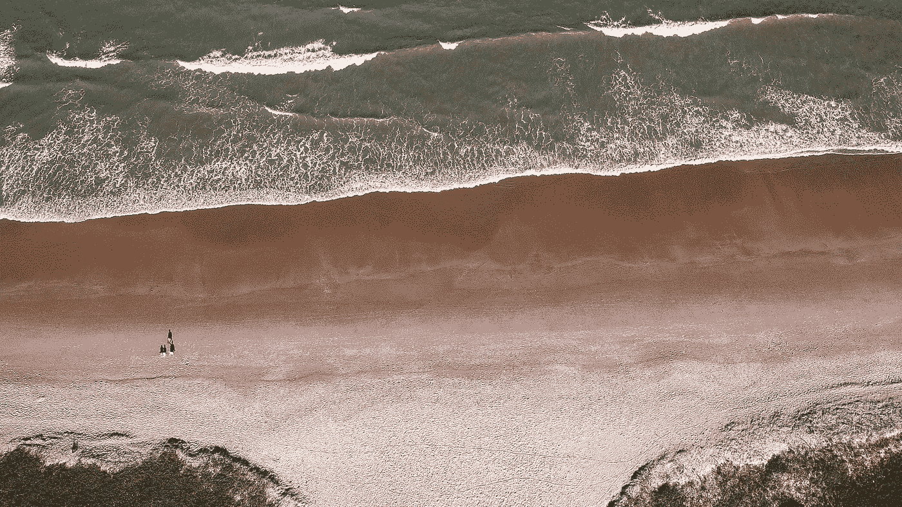

# 我们真的需要深度学习来进行海岸监测吗？

> 原文：[`towardsdatascience.com/do-we-really-need-deep-learning-for-coastal-monitoring-f706b1cdd47d?source=collection_archive---------9-----------------------#2024-09-10`](https://towardsdatascience.com/do-we-really-need-deep-learning-for-coastal-monitoring-f706b1cdd47d?source=collection_archive---------9-----------------------#2024-09-10)

## 深入探讨机器学习与传统海岸侵蚀监测方法的比较

 [Conor O'Sullivan](https://conorosullyds.medium.com/?source=post_page---byline--f706b1cdd47d--------------------------------)

·发表于 [Towards Data Science](https://towardsdatascience.com/?source=post_page---byline--f706b1cdd47d--------------------------------) ·14 分钟阅读·2024 年 9 月 10 日

--

照片由 [thiago japyassu](https://unsplash.com/@thiagojapyassu?utm_source=medium&utm_medium=referral) 提供，来自 [Unsplash](https://unsplash.com/?utm_source=medium&utm_medium=referral)

深度学习（DL）是解决这个问题的唯一途径。这是我阅读的许多研究中隐含的假设。我总是倾向于同意这种看法。但，可能是因为如果没有它，我的博士研究将毫无意义。

幸运的是，我越是阅读，越能意识到遥感充满了机器学习可以提供帮助的问题。这些问题包括监测空气质量、估算土壤湿度、评估作物健康状况和追踪自然灾害。我的研究领域——海岸侵蚀监测，也是如此。

海岸线很长！这意味着我们需要自动化某些任务，才能有效地监测整个海岸线。同时，由于土地开发、云层覆盖以及海上风浪等因素引起的噪音，使得传统的确定性方法可能会失败。正是在处理这些变化时，机器学习才能发挥其优势。

> 深度学习，作为机器学习的一个子领域，已成为遥感中的一项宝贵工具，为前所未有的挑战提供了解决方案，并在遥感应用中创造了新的机会，
> 
> — [B. Janga 等人](https://www.mdpi.com/2072-4292/15/16/4112)
