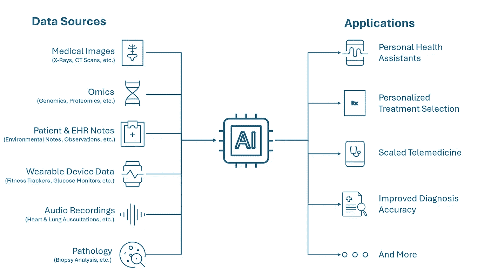
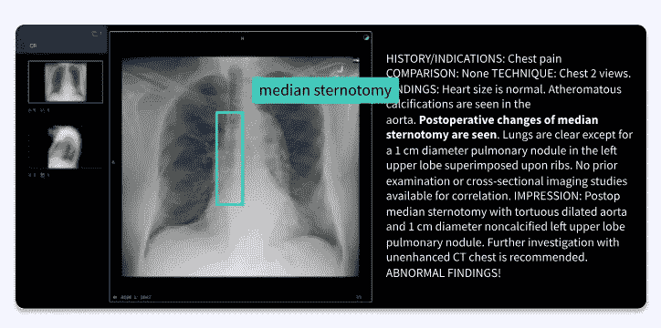
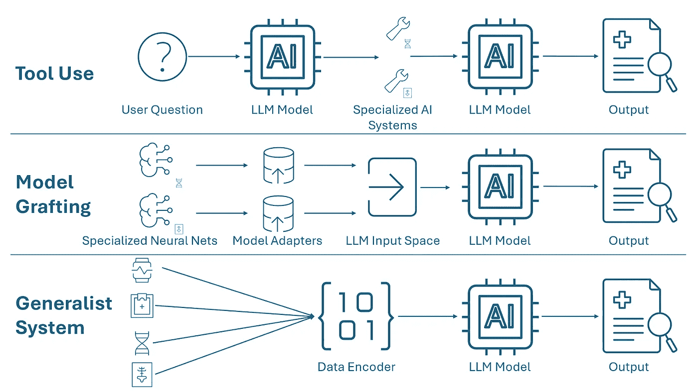

# 医生利用多模态数据；医疗 AI 也应该如此

> 原文：[`towardsdatascience.com/doctors-leverage-multimodal-data-medical-ai-should-too-6475c247b243?source=collection_archive---------6-----------------------#2024-09-25`](https://towardsdatascience.com/doctors-leverage-multimodal-data-medical-ai-should-too-6475c247b243?source=collection_archive---------6-----------------------#2024-09-25)

## 整合多模态数据使新一代医疗 AI 系统能够更好地捕捉医生的思维和决策过程

 [Fima Furman](https://medium.com/@fimafurman?source=post_page---byline--6475c247b243--------------------------------)

·发布于 [Towards Data Science](https://towardsdatascience.com/?source=post_page---byline--6475c247b243--------------------------------) ·阅读时间 9 分钟·2024 年 9 月 25 日

--

*多模态医疗 AI 的数据类型和应用示意图。图片由作者提供。*

多模态 AI 模型利用来自各种格式的数据，如文本、图像和音频，为用户提供更全面的医疗情况理解。这些模型由于能够处理和整合多种数据类型，能够呈现出比任何单一数据类型更为全面的健康图景，因此正在迅速发展。随着变换器架构和大型语言模型（LLMs）的崛起，这些模型广泛适用于多种数据模式，开发人员获得了新的工具来综合这些数据格式。谷歌的[Gemini 多模态 AI](https://blog.google/technology/ai/google-gemini-ai/)及其他前沿的生成型 AI 模型能够无缝理解并综合文本、视频、图像、音频和代码（遗传或计算）等数据格式。尽管在过去几年中，医疗 AI 取得了令人振奋的进展，但其应用进展缓慢，现有应用程序通常只针对非常具体和狭窄的使用案例。医疗 AI 的未来在于多模态应用，因为它们反映了医生的临床过程，医生在做出评估时必须考虑许多因素和数据来源。能够在这个充满巨大潜力的领域执行的开发者和公司，将在 AI 辅助医疗的未来中占据重要角色。

# 利用多模态数据的好处

医学数据本质上是多模态的，AI 系统应当反映这一现实。在评估患者时，医生会利用多种数据来源，如病历记录、医学影像、音频录音和基因序列。传统上，AI 应用程序被设计来处理这些单一数据类型中的特定、狭义的任务。例如，某个 AI 系统可能擅长识别 CT 扫描中的肺结节，但它无法将这些数据与患者的报告症状、家族史和基因信息结合起来，帮助医生诊断肺癌。相比之下，[多模态 AI 应用可以整合多种数据类型，将 LLMs 的灵活性与专业 AI 系统的专长相结合](https://www.nature.com/articles/s41591-022-01981-2)。研究表明，这些系统在传统 AI 任务中的表现也优于单模态 AI 系统，[准确度提升了 6–33%](https://www.ncbi.nlm.nih.gov/pmc/articles/PMC9489871/)。

多模态 AI 模型还致力于打破医学专业之间的壁垒。由于医学领域的专业化不断增加，研究和数据的不断扩展，医学已经发展成一个碎片化的格局，放射学、内科和肿瘤学等不同领域可能会独立运作。处理复杂疾病的患者通常需要跨多个专家团队的协作，然而，由于沟通不畅，关键的见解可能会丧失。多模态 AI 模型通过跨专业领域获取知识，弥合这些鸿沟，确保患者能够从所有相关领域的最新医学进展中受益。

# 不同医学数据模态概述

医学数据占全球所有数据的 30%以上，且有多种形式。以下是其中一些最突出的数据形式（非详尽列表）：

**医学影像**

医学影像在医疗诊断和治疗规划中扮演着至关重要的角色，以至于它已经成为一个独立的专业（放射学）。CT 扫描和 X 光通常用于可视化骨骼结构并检测骨折或肿瘤，而超声波在监测胎儿发育和检查软组织方面至关重要。医生使用病理切片图像分析组织样本，以检测癌症等疾病。像卷积神经网络（CNN）这样的 AI 算法，通过处理大量带标签的图像，学习识别这些图像中的模式和异常。这些工具帮助放射科医生和其他医生更快速、更准确地解读图像。

**组学**

近年来，由于测序成本的下降，组学数据，包括基因组学、转录组学和蛋白质组学，迅速增长。它通过提供对疾病分子机制的洞察，彻底改变了个性化医学。在一个多模态医学 AI 系统中，组学数据可以帮助更好地理解患者对某些疾病的易感性以及对治疗选项的潜在反应。例如，BRCA 基因中的特定突变表明，患者更有可能发展为某些类型的癌症。

**患者与电子健康记录（EHR）笔记**

传统上，由于缺乏结构，患者笔记（临床观察、治疗计划等）一直是分析的难点。然而，大型语言模型（LLMs）可以利用这些笔记提取见解、识别模式，并支持大规模数据分析，这在过去是无法实现的。例如，LLMs 可以阅读临床试验中潜在患者的笔记，并识别符合资格要求的患者——这是以前需要大量人工操作的任务。

**可穿戴设备数据**

健康监测传感器，如可穿戴健身追踪器，可以实时测量心率、血压、睡眠模式和血糖水平等生命体征。人工智能应用可以分析这些时间序列数据，发现趋势并预测健康事件。此类应用可以通过提供个性化的健康建议，帮助患者，并帮助医生在医院之外监控患者的健康状况。

**音频记录**

音频记录，如心脏和肺部听诊，通常用于诊断某些形式的疾病。医生通过心脏听诊来标记心脏杂音的范围和强度，而肺部听诊可以帮助识别肺炎等疾病。人工智能系统可以分析这些音频记录，检测异常，并协助更快且成本更低的诊断。

**病理学**

病理数据来源于组织样本和显微图像，在诊断癌症等疾病中起着关键作用。人工智能算法可以分析这些数据源，识别异常的细胞结构、分类组织类型，并检测出提示疾病的模式。通过处理大量病理数据，人工智能可以帮助病理学家做出更准确的诊断，标出潜在的关注区域，甚至预测疾病进展。事实上，哈佛医学院和麻省理工学院的研究人员最近推出了一个[多模态生成式 AI 助手用于人体病理学](https://www.nature.com/articles/s41586-024-07618-3)，帮助病理学家处理常见的医疗任务。

*集成标注图像与文本数据的示例。图像由作者提供。*

# 多模态人工智能模型的应用

多模态算法有潜力开启人工智能驱动医疗应用的新范式。多模态人工智能的一个有前景的应用是个性化医学，在这种应用中，系统通过整合患者的病情、病史、生活方式和基因组等数据，预测最有效的治疗方案。例如，考虑一个旨在为肺癌患者识别最有效治疗方案的应用程序。该应用可以考虑患者的基因组特征、病理（组织样本）图像和记录、放射学图像（肺部 CT 扫描）和记录，以及病史临床记录（收集吸烟史和环境影响等因素）。通过整合所有这些数据源，应用程序可以推荐最适合患者独特体质的治疗方案。这种方法已经在[黄等人研究](https://www.nature.com/articles/s41598-018-34753-5)中显示出有前景的结果，研究人员能够根据患者的基因表达谱预测他们对常规化疗药物的反应，准确率超过 80%。这种方法将有助于最大化治疗效果，并减少通常与寻找合适药物或干预措施相关的试错过程。

另一个关键的应用场景是提高诊断和预后速度与准确性。通过整合医学影像、实验室结果和病历记录等数据源，多模态医学人工智能系统可以帮助医生获得全面的洞察。例如，[Tempus Next](https://www.tempus.com/cardiology/) 利用超声心动图和心电图的波形数据、电子健康记录文本数据以及腹部放射影像（CT 扫描、超声波检查）来帮助心脏病专家诊断和预测患者的心脏问题风险，如腹主动脉瘤和房颤。[Optellum 的虚拟结节诊所](https://optellum.com/products-and-solutions/lung-cancer-prediction-ai/)采用类似的方法，通过使用 CT 扫描和临床记录帮助诊断肺癌。这类应用不仅提高了诊断的准确性，还节省了医生的时间，从而帮助解决持续的医生短缺问题，并降低了医疗成本。

多模态 AI 还将通过集成来自可穿戴设备、家庭监测系统和患者自我报告的记录的数据，推动远程患者监测和远程医疗的重大进展，为患者健康状态提供持续的实时洞察。这一能力对慢性病管理尤其重要，因为持续的监测可以检测到恶化的早期迹象，并及时采取干预措施。例如，一个 AI 系统可以监测来自[Eight Sleep Pod](https://www.eightsleep.com/)的患者睡眠数据以及来自[Levels](https://www.levelshealth.com/#how-it-works)（连续血糖监测）的血糖数据，以识别糖尿病前期患者的恶化情况。医生可以利用这一早期预警提出积极建议，帮助患者避免进一步的健康下降。这项技术有助于减少医院再入院率，改善慢性病的整体管理，使医疗服务更具可及性，并减轻整个医疗系统的负担。

# 构建多模态 AI 模型的方法

*构建多模态系统的不同方法的示意图。图片由作者提供。*

研究人员目前正在尝试不同的方法来构建多模态医疗 AI 系统，研究仍处于初步阶段。谷歌团队正在探索的三种[主要系统开发方法是](https://research.google/blog/multimodal-medical-ai/)：

+   **工具使用** — 在这种方法中，一个主控 LLM 将不同数据源的分析任务外包给专门的软件子系统，这些子系统是针对特定数据形式训练的。例如，LLM 可能会将胸部 X 光片转交给放射学 AI 系统，心电图分析交给专门的波形分析系统，然后将这些响应与患者记录整合，以评估心脏健康。这种方法允许子系统之间具有灵活性和独立性，使得每个特定任务都能使用最佳的工具。

+   **模型嫁接** — 这种方法涉及将每个相关领域的专门神经网络进行调整，并直接集成到 LLM 中。例如，一个经过训练用于解读医学图像的神经网络可以通过将其输出直接映射到 LLM 的输入空间，将其嫁接到 LLM 中。这种方法利用了现有的优化模型，允许模块化开发，尽管它需要为每个特定的模型和领域创建适配器。

+   **通用系统** — 最具雄心的方法是构建一个能够本地处理所有数据模态的单一集成系统。这种方法使用统一模型，例如[Med-PaLM M](https://arxiv.org/abs/2307.14334)，它将语言模型与视觉编码器结合，处理多种数据类型。尽管这种方法最大化了灵活性和信息传递，但也伴随着更高的计算成本，并可能在领域专门化和系统调试性方面面临挑战。

# 实现多模态 AI 模型的挑战

尽管构建多模态人工智能模型充满了巨大潜力，但在实现可行系统时仍面临诸多挑战。以下是一些挑战：

+   **数据标注 —** 为了启用监督学习，机器学习算法需要由专家人工标注数据，并正确识别特征。跨领域识别专家以标注不同类型的数据模态可能具有挑战性。模型构建者应考虑与具有跨模态专业知识的数据标注服务提供商合作，例如[Centaur Labs](https://hubs.li/Q02Qjm9S0)。

+   **避免偏见 —** 部署 AI 系统在医疗环境中的最大风险之一是它们可能加剧现有的偏见和医疗不平等。多模态系统可能进一步加深这种偏见，因为代表性不足的群体在系统为其构建的一个或多个模态中更可能缺失数据。为了避免偏见，模型构建者应考虑减少 AI 应用中偏见的技术。

+   **监管 —** 数据隐私法规如 HIPAA 对患者数据的共享和使用施加了严格的控制，这使得开发人员在整合和关联跨不同模态的数据时面临挑战。这需要额外的开发工作以确保合规性。

+   **采纳与信任 —** 许多传统的 AI 系统发现影响最大的障碍是推动医疗用户社区的采纳和信任。医生们担心 AI 输出的准确性和一致性，不希望在使用这些系统来为患者护理提供决策前，因过度信任而危及患者健康。多模态 AI 模型将面临类似的采纳障碍。开发人员必须与此类系统的最终用户密切合作，建立信任，确保系统能够融入现有的临床工作流程。

+   **数据格式共享标准缺乏 —** 对于许多数据格式（例如，组织图像），不同提供者之间没有标准化的数据共享协议。这种互操作性的缺失可能会阻碍整合开发强大 AI 模型所需的数据源。为了加快在（目前）尚未标准化的医疗数据领域中运行 AI 系统的开发和应用，研究与开发社区应制定通用的数据共享标准/框架，并确保各机构遵守这些标准。

# 结论

多模态 AI 代表了医疗应用的未来，通过整合和全面利用数据，提供了革命化医疗保健的潜力，提升应用的灵活性、准确性和能力。如果这些应用能够有效开发和部署，它们有望降低医疗成本，扩大可及性，并提供更高质量的患者护理和结果。

知识和技术的最重大进展通常来自于跨领域的见解融合。以[列奥纳多·达·芬奇为例，他将自己在绘画和流体力学方面的知识应用于心脏和生理学的研究](https://www.ncbi.nlm.nih.gov/pmc/articles/PMC3361109/)。医疗人工智能也不例外。通过将计算机科学的发现融入医学，开发者开启了一波初步的突破。现在，融合多种数据模态的前景将带来第二波创新，这一波创新将由日益智能化的人工智能系统推动。
