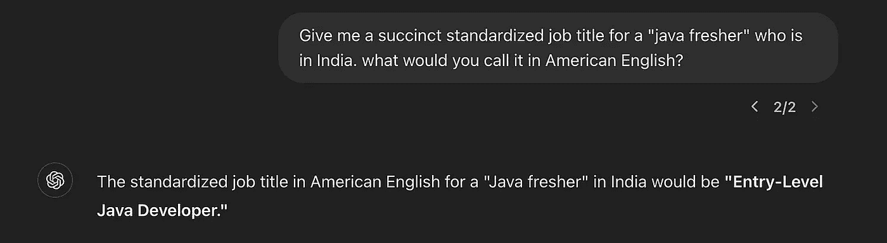
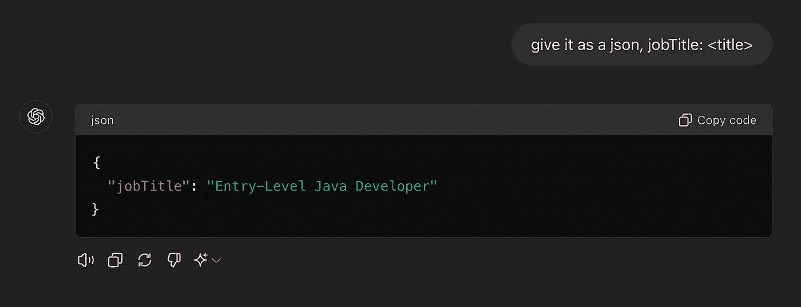
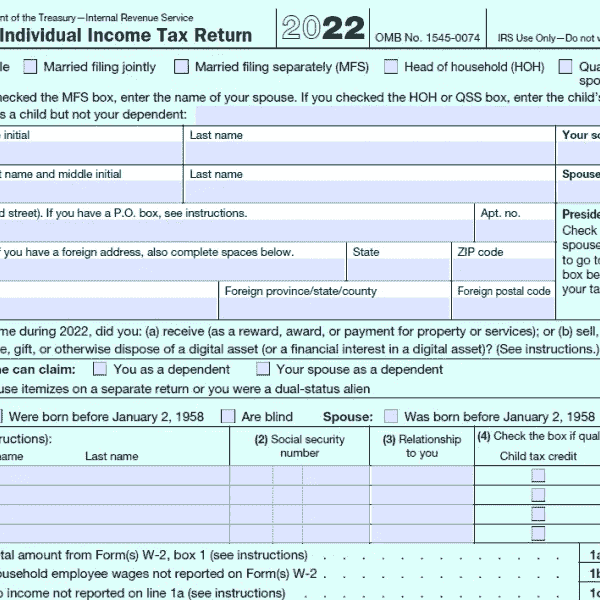
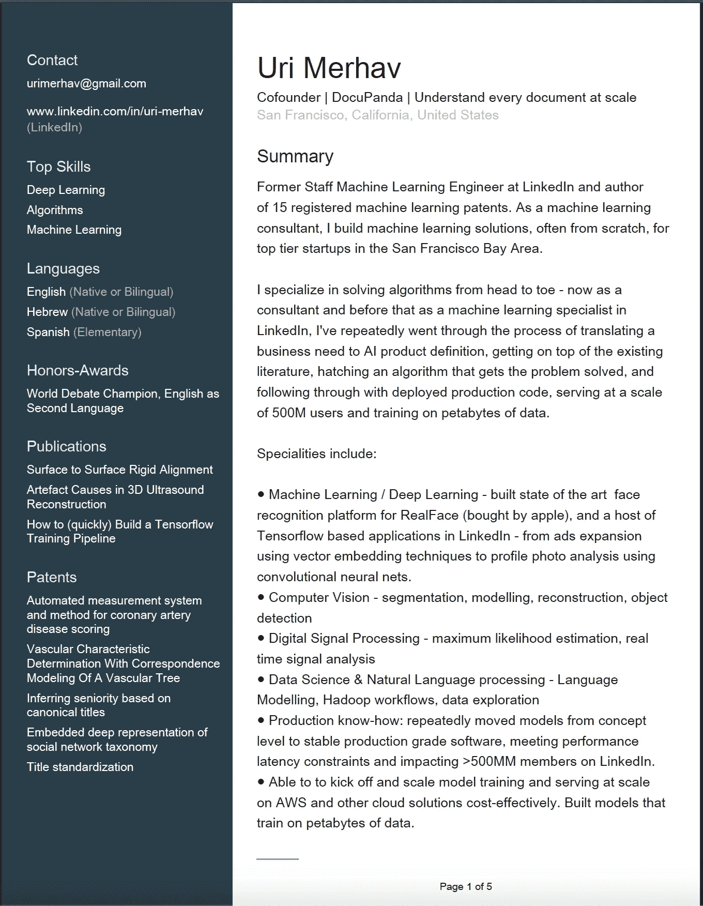
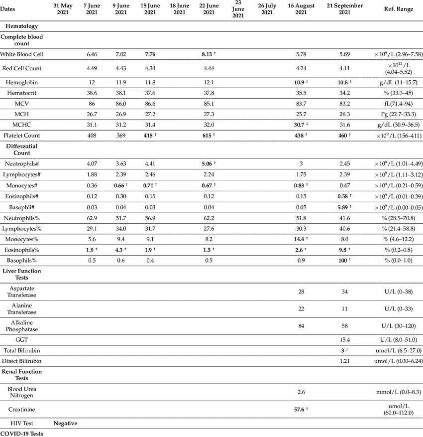
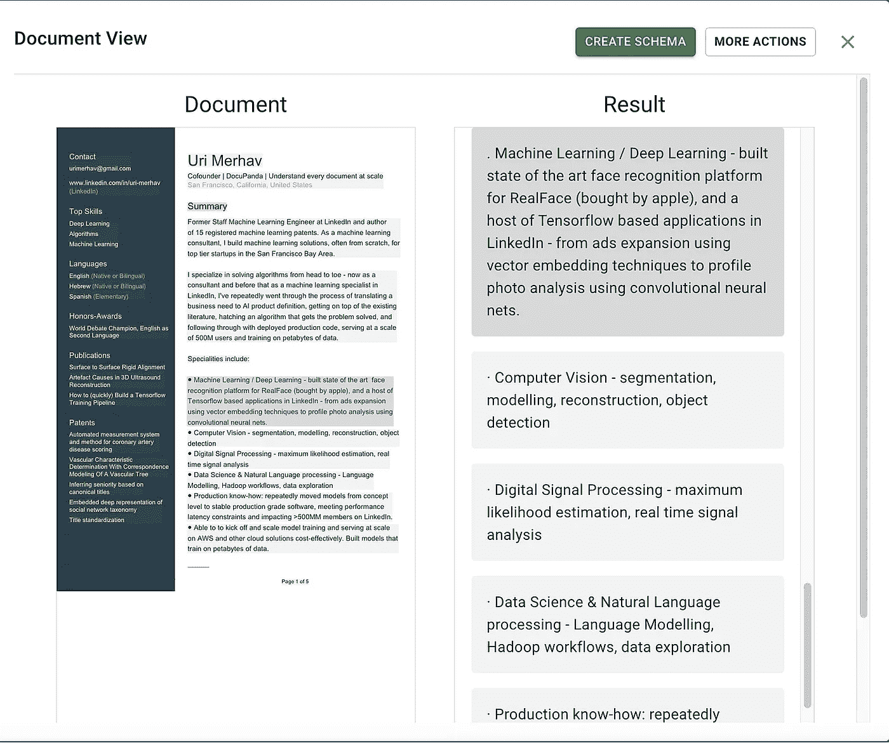
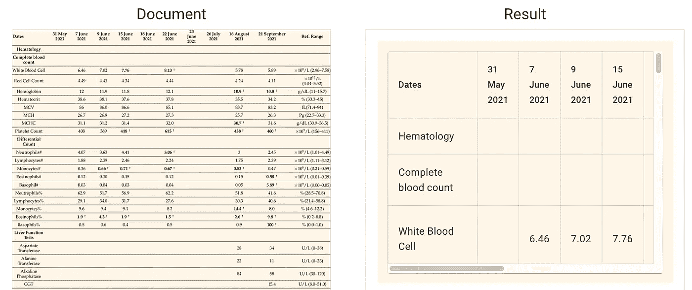
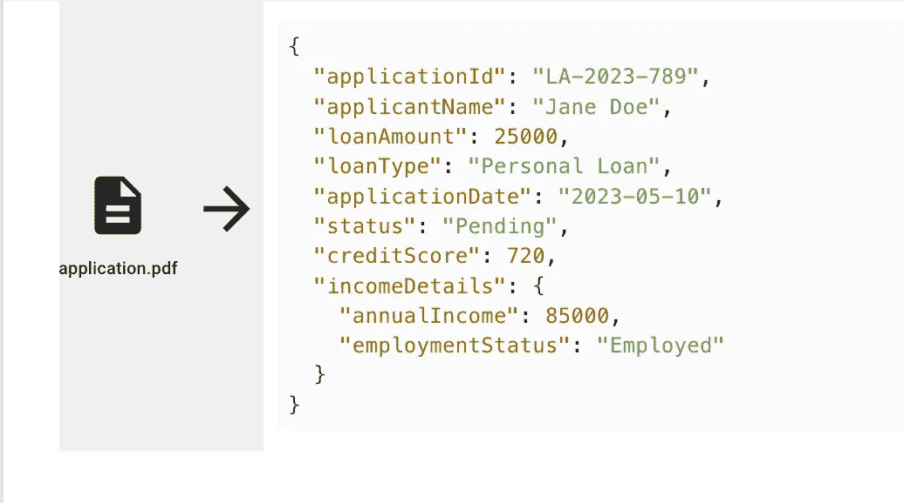

# 文档提取是 GenAI 的杀手级应用

> 原文：[`towardsdatascience.com/document-extraction-is-genais-killer-app-9e9c816e6caf?source=collection_archive---------0-----------------------#2024-08-13`](https://towardsdatascience.com/document-extraction-is-genais-killer-app-9e9c816e6caf?source=collection_archive---------0-----------------------#2024-08-13)

## 未来已经到来，你不会看到致命的机器人。你会看到用于繁琐办公室工作的优秀自动化。

 [Uri Merhav](https://urimerhav.medium.com/?source=post_page---byline--9e9c816e6caf--------------------------------)

·发表于[Towards Data Science](https://towardsdatascience.com/?source=post_page---byline--9e9c816e6caf--------------------------------) ·阅读时间 9 分钟·2024 年 8 月 13 日

--

几乎十年前，我在 LinkedIn 的著名数据标准化团队担任机器学习工程师。从我加入的那一天到离开的那一天，我们仍然无法自动读取一个人的个人资料，并可靠地理解某人在所有语言和地区中的职级和职位。

乍一看，这看起来很简单。“软件工程师”已经足够明确了，对吧？那如果有人只写“助理”呢？如果他在沃尔玛，那可能是一个低级零售工人；如果他在律师事务所，那可能是一个高级律师。但你大概已经知道了——你知道什么是[Java Fresher](https://www.indeed.com/q-java-fresher-jobs.html)吗？什么是[*Freiwilliges Soziales Jahr*](https://en.wikipedia.org/wiki/Voluntary_social_year)？这不仅仅是了解德语——它翻译为“志愿社会年”。但是，什么是代表这一角色的标准职称呢？如果你有一大堆已知的职位名称，你会把它映射到哪里？

我加入了 LinkedIn，我离开了 LinkedIn。我们取得了一些进展，但即使是最简单的常规文本——一个人的简历，依然难以理解。

# 非常困难变得简单

你可能不会感到惊讶地发现，这个问题对于像 GPT-4 这样的 LLM 来说是微不足道的

对 GPT 来说轻松简单（来源：我和 GPT）

等等，我们是公司，不是一个聊天终端上的人，我们需要结构化的输出。

（来源：GPT）

啊，这样好多了。你可以对那些最复杂且具有文化特定性的提问进行重复练习。更棒的是，当你得到一个完整的个人资料时，你可以重复这个练习，这样你就能获得更多的背景信息；使用代码时，你可以在商业环境中稳定地使用这些结果，而不仅仅是进行一次性的聊天。通过更多的工作，你可以将结果强制转换为一个标准的可接受职位标题分类法，这样它就能被索引。毫不夸张地说，如果你复制并粘贴某个人的全部简历并正确提示 GPT，你将超越十年前一些相当聪明的人的最佳成果，这些人花了多年时间在这方面工作。

# 高价值办公室工作 == 理解文档

标准化简历的具体例子很有趣，但它仍然局限于技术一直在努力的领域——一个自然应用人工智能工具的技术网站。我认为这里有更深层的机会。全球 GDP 的大部分来自办公室工作，这些工作归结为将专家级人类智能应用于从文档中反复提取洞见，且需要考虑背景信息。以下是一些复杂度逐渐增加的例子：

1.  费用管理就是读取发票并将其转化为标准化视图，显示支付了什么、何时支付、使用了哪种货币以及属于哪个费用类别。可能这个决策是基于关于业务、报销人等背景信息做出的。

1.  医疗保险理赔裁定过程就是阅读一堆杂乱的发票和临床记录，并判断：“好吧，总共有一次胸部 X 光检查，包含了一些重复项目，总费用为 800 美元，且它对应健康保险政策中的 1-C 类别”。

1.  贷款核准员可能会查看一堆申请人的银行账单并回答一系列问题。同样，这之所以复杂，仅仅因为输入信息杂乱无章。实际的决策过程像是：“现金的平均流入和流出是多少，多少用于贷款偿还，其中有多少是一时性的支出，多少是实际的经常性收入”。

# 关于文本推理是 LLM 的强项。

到现在为止，大型语言模型（LLMs）因易发生幻觉（即胡乱编造）而臭名昭著。现实情况更为复杂：幻觉实际上在某些情境下是**可预测的结果**，而在其他情况下则几乎**可以保证不会发生**。

产生幻觉的地方是当你让它回答事实性问题，并期望模型仅凭其对世界的固有知识“知道”答案时。大语言模型（LLM）在自我反思自己对世界的知识方面表现得很差——它们能做到这一点更多是一个非常偶然的结果。它们并没有专门为此任务进行训练。它们的训练目标是生成可预测的文本序列补全。当 LLM 被绑定到输入文本并需要回答关于该文本内容的问题时，**它不会产生幻觉**。如果你将这篇博客文章复制并粘贴到 chatGPT 中，问它是否教你做美国苹果派，你会 100%得到正确答案。对于 LLM 来说，这是一个非常可预测的任务，它看到一段文本，并尝试预测一个有能力的数据分析师如何用预定义的字段和预定义的结果来填写，这些结果之一是`{"is cooking discussed": false}`。

以前作为 AI 顾问，我们多次解决涉及从文档中提取信息的项目。事实证明，在保险、金融等领域这方面有很多用途。客户之间对 LLM 的恐惧（“LLM 会产生幻觉”）与实际上摧毁我们的原因（我们没有正确提取表格，所有错误都源于此）之间存在很大的差距。LLM 确实失败了——当我们没有以清晰且不含歧义的方式呈现输入文本时，它们会失败。构建能够推理文档的自动化管道需要两个必要的成分：

1.  **完美的文本提取**，将输入文档转换为干净、易懂的纯文本。这意味着需要处理表格、勾选框、手写注释、可变文档布局等。现实世界表单的复杂性需要转化为 LLM 能够理解的清晰纯文本。

1.  **健壮的架构**，明确规定你希望从给定文档类型中获得哪些输出，如何处理边缘案例，使用什么数据格式等等。

# 文本提取比看起来要复杂得多

这就是导致 LLM 崩溃和产生荒谬输出的原因：

1.  输入中有复杂的格式，例如双列布局，你从例如 PDF 中从左到右复制并粘贴文本，完全把句子从上下文中剥离开来。

1.  输入中有复选框、勾选标记、手写注释，而你在转换为文本时完全忽略了这些

1.  更糟糕的是：你认为可以绕过转换为文本的步骤，指望只是粘贴一张文档的图片，让 GPT 自行推理。这会让你进入幻觉之城。只需让 GPT 转录一张带有空白单元格的表格图片，你就会看到它高兴地胡乱发挥，乱编一些东西。

时常记住现实世界文档的混乱程度是很有帮助的。这里有一份随意的税表：

当然，真实的税表上这些字段通常是填写完整的，且常常是手写的

或者这是我的简历

来源：我的简历

或者一个公开的示例实验报告（这是 Google 的首页结果）

来源：[research gate](https://www.researchgate.net/figure/The-table-below-is-a-summary-of-laboratory-results-for-blood-Full-blood-count-FBC_tbl1_370627188)，公共领域图像

顺便说一句，最糟糕的事情就是让 GPT 的多模态能力来转录一个表格。如果你敢试试——一开始看起来没问题，但它会为某些表格单元格随意编造内容，完全脱离上下文等。

# 如果这个世界有问题，那就建立一个 SaaS 公司来解决它。

当我们需要理解这些类型的文档时，我和我的联合创始人[Nitai Dean](https://medium.com/u/47700d6c6e7b?source=post_page---user_mention--9e9c816e6caf--------------------------------)感到困惑，因为没有现成的解决方案可以帮助我们理解这些文本。

有些人声称能够解决这个问题，比如 AWS Textract。但在我们测试的任何复杂文档中，它们都会犯很多错误。接着就是那些必须处理的小细节，比如识别勾选框、单选按钮、删除线文本、表单上的手写涂鸦等。

所以，我们建立了[Docupanda.io](https://www.docupanda.io/)——它首先生成任何你输入的页面的清晰文本表示。左边是原始文档，右边是文本输出。

来源：docupanda.io

表格也类似地处理。在背后，我们只是将表格转换为人类和 LLM 可读的 Markdown 格式：

来源：docupanda.io

使用 LLM 来理解数据的最后一块拼图是生成并遵循严格的输出格式。虽然我们可以让 AI 将输出格式化为 json，但为了对数据应用规则、推理、查询等——我们需要让它以规律的方式运作。数据需要符合预定义的插槽集，我们将用内容填充这些插槽。在数据领域，我们称之为**模式**。

# 构建模式是一个试错过程……这是一个 LLM 可以做的事情。

我们需要模式的原因是，数据没有规律性是毫无意义的。如果我们在处理患者记录，并且它们映射到“male”、“Male”、“m”和“M”——那我们做得很糟糕。

那么，如何构建一个模式呢？在教科书中，你可能通过长时间地坐在那里，盯着墙壁，来定义你想要提取的内容。你坐在那里，思考你的医疗数据操作，并说“我想提取患者姓名、日期、性别和他们的医生姓名。哦，性别必须是 M/F/Other。”

在现实中，为了定义从文档中提取什么内容，你得盯着文档看……很多。你一开始可能像上面那样，但是当你看文档时，你会发现其中一个文档列出了多个医生的名单，而不是一个。还有些文档也列出了医生的地址。一些地址包含单元号和楼栋号，所以你可能需要为此预留一个字段。事情就是这么一件接一件地发生。

我们意识到，能够准确定义你想要提取的所有内容，是既不简单、又困难，但使用 AI 是完全可以解决的。

这是 DocuPanda 的关键部分。我们不是仅仅要求一个 LLM 为每个文档即兴生成输出，而是建立了一个机制，让你可以：

1.  使用自由语言指定你需要从文档中提取的内容。

1.  让我们的 AI 映射 *多个* 文档，并找出一个能回答所有问题、并适应实际文档中观察到的漏洞和不规则之处的模式。

1.  根据反馈调整模式，以适应你的业务需求。

最终你得到的是一个强大的 JSON 模式 —— 一个模板，明确指出你想从每个文档中提取的内容，并且能够处理数十万份文档，从中提取所有答案，同时遵循像始终以相同格式提取日期、尊重一组预定义类别等规则。

来源：docupanda.io

# 还有更多！

就像任何兔子洞一样，总是有比最初看到的更多的东西。随着时间的推移，我们发现需要更多的东西：

+   组织经常需要处理大量匿名文档，因此我们会自动对它们进行分类，并决定应用哪种模式。

+   文档有时是多个文档的拼接，你需要一个智能的解决方案将一篇非常长的文档拆分成其原子化的独立组件。

+   使用生成的结果查询正确的文档非常有用。

如果从这篇文章中能得到一个启示，那就是你应该研究如何利用 LLM 来以规范的方式理解文档。如果有两个启示，那就是你也应该试试 [Docupanda.io](https://www.docupanda.io/)。我之所以构建它，是因为我相信它。也许这就足够成为尝试它的理由？

未来的办公室工作人员（来源：unsplash.com）
