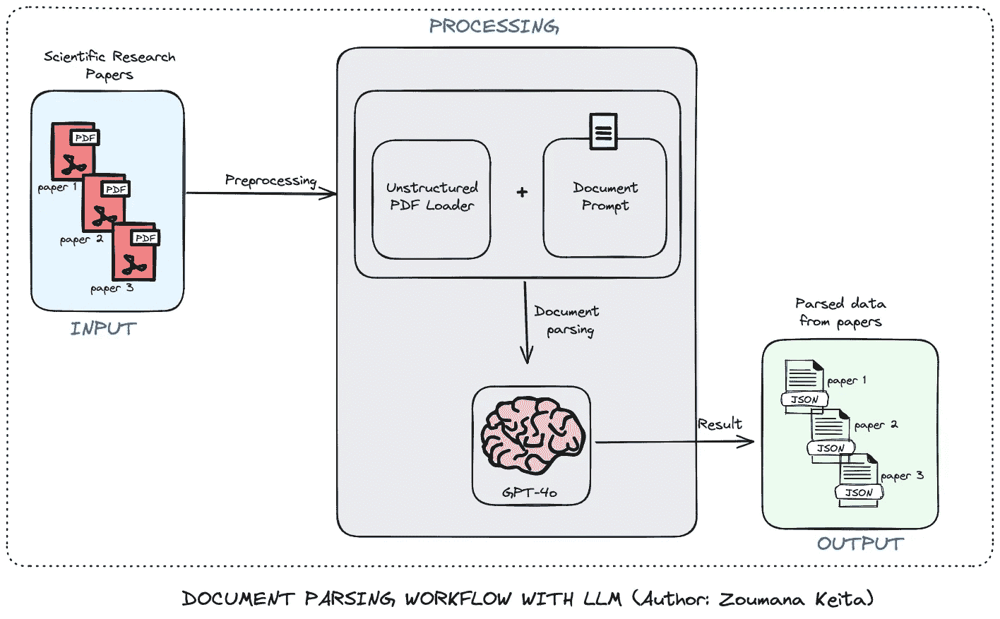

# 使用大语言模型进行文档解析——附带代码

> 原文：[`towardsdatascience.com/document-parsing-using-large-language-models-with-code-9229fda09cdf?source=collection_archive---------0-----------------------#2024-07-25`](https://towardsdatascience.com/document-parsing-using-large-language-models-with-code-9229fda09cdf?source=collection_archive---------0-----------------------#2024-07-25)

## 你将不再考虑使用正则表达式

 [Zoumana Keita](https://zoumanakeita.medium.com/?source=post_page---byline--9229fda09cdf--------------------------------)

·发布于[Towards Data Science](https://towardsdatascience.com/?source=post_page---byline--9229fda09cdf--------------------------------) ·14 分钟阅读·2024 年 7 月 25 日

--

# 动机

多年来，正则表达式一直是我解析文档的首选工具，我相信对于许多其他技术人员和行业来说也是如此。

尽管正则表达式在某些情况下非常强大且成功，但它们在面对现实世界文档的复杂性和多变性时常常显得力不从心。

另一方面，大语言模型提供了一种更强大且灵活的方法来处理多种类型的文档结构和内容类型。

# 系统的一般工作流程

理解正在构建的系统的主要组件总是很重要的。为了简单起见，我们聚焦于一个科研论文处理的场景。

使用 LLM 进行文档解析工作流程（作者：Zoumana Keita）

+   工作流程总体上包括三个主要组件：输入、处理和输出。

+   首先，文档（在此案例中为 PDF 格式的科研论文）提交进行处理。

+   处理组件的第一个模块从每个 PDF 中提取原始数据，并将其与包含大语言模型指令的提示结合起来……
