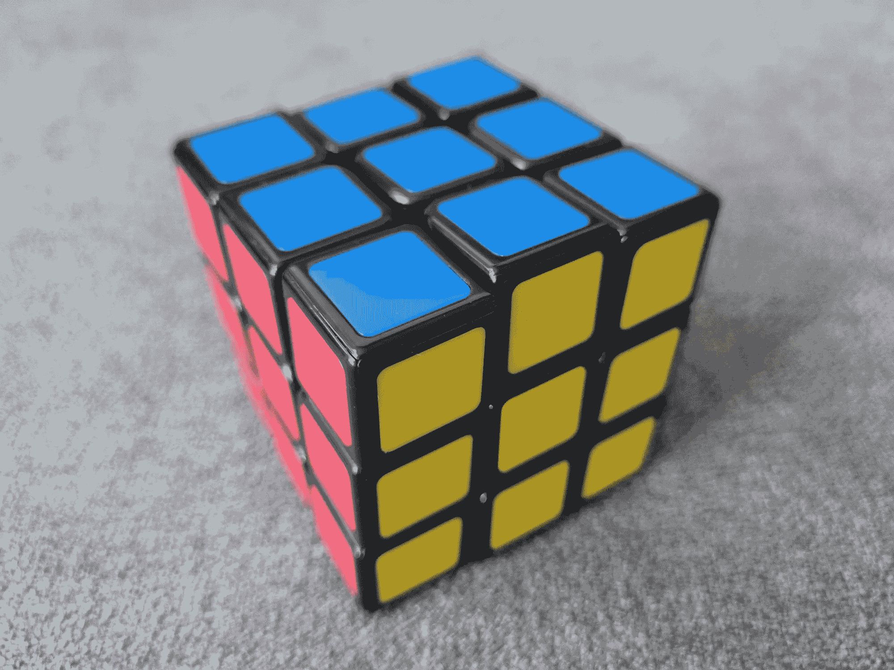

# 数据驱动的故事讲述是否需要客观？

> 原文：[`towardsdatascience.com/does-data-driven-storytelling-need-to-be-objective-7053a29f3d47?source=collection_archive---------10-----------------------#2024-07-29`](https://towardsdatascience.com/does-data-driven-storytelling-need-to-be-objective-7053a29f3d47?source=collection_archive---------10-----------------------#2024-07-29)

## 在数据驱动故事中找到效率与吸引力之间的平衡

 [Michal Szudejko](https://medium.com/@michalszudejko?source=post_page---byline--7053a29f3d47--------------------------------)

·发表于[Towards Data Science](https://towardsdatascience.com/?source=post_page---byline--7053a29f3d47--------------------------------) ·阅读时长：11 分钟·2024 年 7 月 29 日

--

来源：图片由作者提供。

**我一直想学会解魔方。** 我在 10 到 12 岁的时候有一个魔方。我从未成功过。即使成功了，那也只是通过“调整”方块之间的贴纸。所以，那并不算真正的成功。

问题是什么？我曾以为解魔方是一种智力和逻辑的练习。我错了。多亏了 YouTube 上的一些教程，30 年后，我终于学会了如何解魔方。事实证明，你可以通过遵循一系列算法来解决它。没有魔法——只是记住一些规则和步骤（幸运的是，至少对我来说，还是需要一些脑力努力）。

# 数据驱动故事的魔力

我曾经也遇到过类似的数据驱动故事讲述问题。让我们把它放在一个更具体的情境中，就像我 10 岁时试图解决魔方一样。你可能认为数据驱动的故事讲述是用来向观众讲述一个关于数据和分析的客观故事——结论、假设、优点和缺点。观众应该知道所有的事实，才能做出充分知情的决策。这也可能包括分享那些证明是错误的分析场景。最终，观众应该…
