# 狗狗排便指南针

> 原文：[`towardsdatascience.com/dog-poop-compass-bayesian-analysis-of-canine-business-f95a4b9f2bf9?source=collection_archive---------3-----------------------#2024-11-25`](https://towardsdatascience.com/dog-poop-compass-bayesian-analysis-of-canine-business-f95a4b9f2bf9?source=collection_archive---------3-----------------------#2024-11-25)

## 狗狗行为的贝叶斯分析

[](https://datawondering.com/?source=post_page---byline--f95a4b9f2bf9--------------------------------)[](https://towardsdatascience.com/?source=post_page---byline--f95a4b9f2bf9--------------------------------) [Dima Sergeev](https://datawondering.com/?source=post_page---byline--f95a4b9f2bf9--------------------------------)

·发表于[Towards Data Science](https://towardsdatascience.com/?source=post_page---byline--f95a4b9f2bf9--------------------------------) ·阅读时间：22 分钟·2024 年 11 月 25 日

--

# tl;dr

狗狗是朝北和朝南排便吗？结果证明它们确实是！想学会如何使用指南针应用程序、贝叶斯统计和一只狗（狗狗不包括在内）在家里测量这个现象吗？那就跟我一起看看吧！

# 引言

这是我的狗。它的名字叫 Auri，是一只 5 岁的凯文犬（Cavalier King Charles Spaniel）。

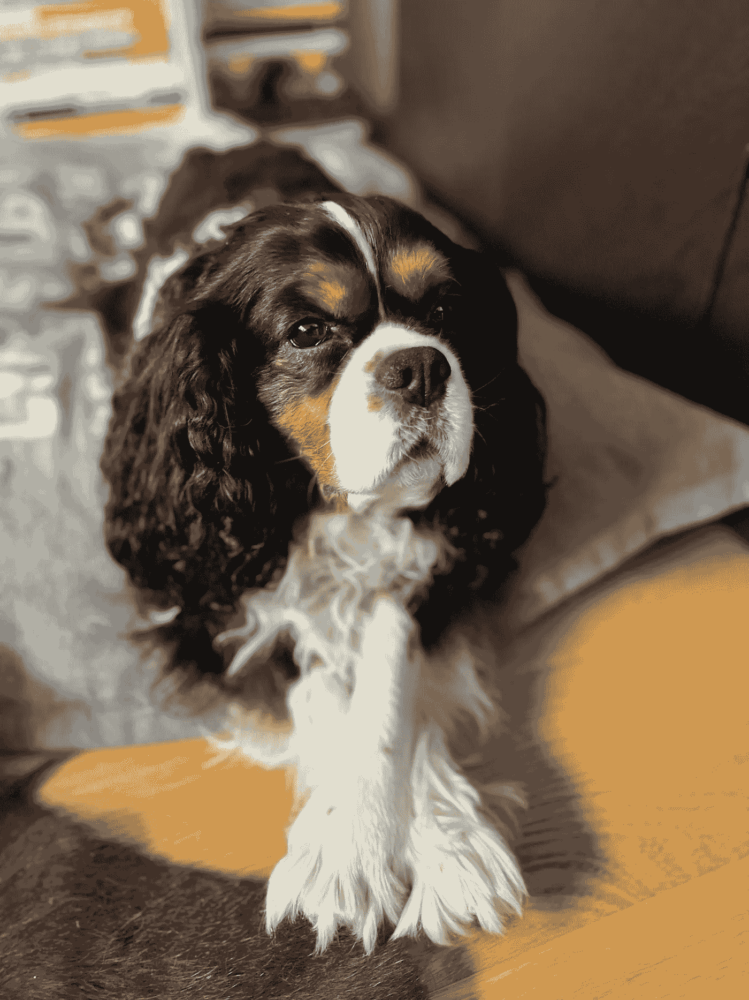

Auri（图由作者提供）

和许多其他狗主人一样，在我们散步时，我注意到 Auri 在需要去厕所时有一个非常独特的仪式。当他找到一个合适的地点时，他会开始围绕某个东西转圈，就像一个指南针。

起初，我只是觉得这种行为很有趣。毕竟，谁知道狗狗在想些什么呢？但过了一段时间，我记得曾读过一篇 2013 年的研究论文，标题是[“Dogs are sensitive to small variations of the Earth’s magnetic field”](https://frontiersinzoology.biomedcentral.com/counter/pdf/10.1186/1742-9994-10-80.pdf)。这项研究在相对较大的狗狗样本中进行，证实了“狗狗倾向于在北南轴对齐的情况下排便”。

*这似乎是个有趣的研究课题！* 我心想。多么幸运，我正好有一个完美的实验对象——我自己心爱的狗狗。我决定复现这些发现，并通过 Auri 这个 N=1 的意外研究参与者来验证（或推翻！）这个假设。

就这样，我开始了长达几个月的数据收集之旅，记录了超过 150 次的“对齐”行为，如果你明白我的意思的话。

# 数据收集

对于我的研究，我需要记录每次 Auri 排便时的指南针数据。得益于现代科技的进步，我们不仅有[iPad 的计算器应用](https://www.theverge.com/2024/6/10/24175487/ipad-calculator-app-ipados18-pencil-apple-wwdc2024)，还可以在手机上使用[相当精确的](https://www.simplymac.com/apps/how-accurate-is-the-iphone-compass)指南针。于是我决定使用这个。

方法非常简单。每次我的狗安静下来准备享受私人时光时，我就打开指南针应用程序，把手机与 Auri 的身体对齐，并截图。在原始论文中，作者优雅地将这种对齐称为*胸椎（肩胛骨之间）朝向头部的指南针方向*。非常科学。其实就是意味着指南针的箭头应指向与狗头相同的方向。

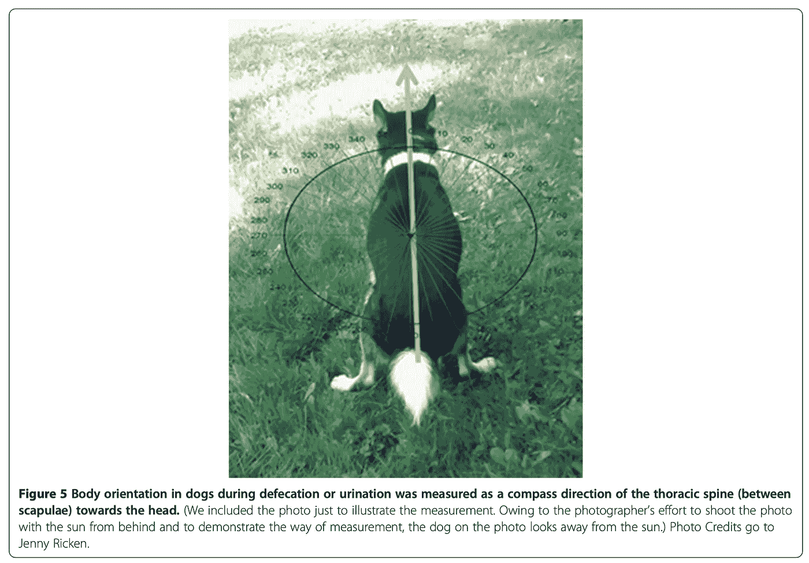

[狗对地球磁场微小变化非常敏感，Vlastimil Hart 等人](https://frontiersinzoology.biomedcentral.com/counter/pdf/10.1186/1742-9994-10-80.pdf)

总之，这就是我在几个月的时间里总共做了大约 150 次的事情。每当我似乎在拍摄我家狗狗的排泄行为时，我几乎能感觉到路人们混合着困惑和好奇的目光。但这值得吗？让我们来看看吧！

# 分析

我将在这里简要讨论数据提取和预处理，然后直接进入圆形分布和假设检验的部分。

和往常一样，所有代码都可以在我的 GitHub 上找到：[Data Wondering](https://github.com/DmitrySerg/data-wondering/tree/main/bayesian-dog-poop)。

## 如何处理应用截图？

数据收集后，我得到了若干张指南针应用截图：

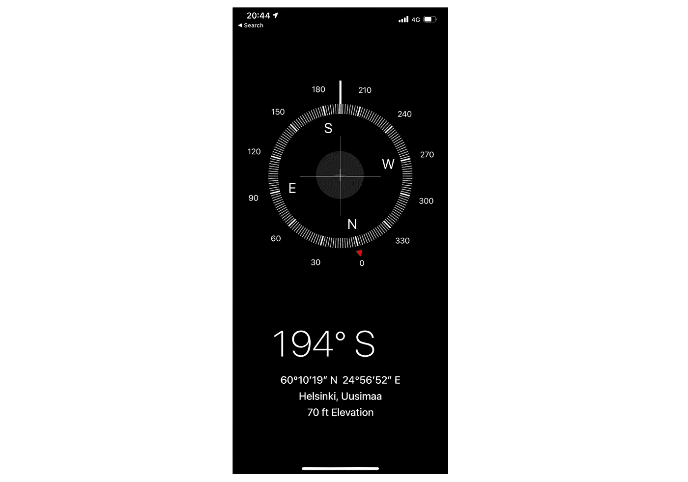

指南针应用截图（作者提供的图片）

因为我懒得一张张图片地查看并耐心地写下指南针的度数，所以我决定将所有这些图片发送到我的笔记本，并自动化这个过程。

任务很简单——我只需要从这些图片中获取屏幕底部的大数字。幸运的是，有很多小型的预训练网络可以做基本的[光学字符识别（OCR）](https://en.wikipedia.org/wiki/Optical_character_recognition)。我选择了一个名为`[easyocr](https://github.com/JaidedAI/EasyOCR)`的包，虽然它稍慢一点，但免费且容易使用。

我将为你展示一个简单的例子，演示如何使用`easyocr`与`[opencv](https://opencv.org/)`结合，从单张截图中提取数字。

首先，我们加载图像并显示它：

```py
import cv2
import os

image_dir = '../data/raw/'
img = cv2.imread(image_dir + 'IMG_6828.png')

plt.imshow(img)
plt.show()
```

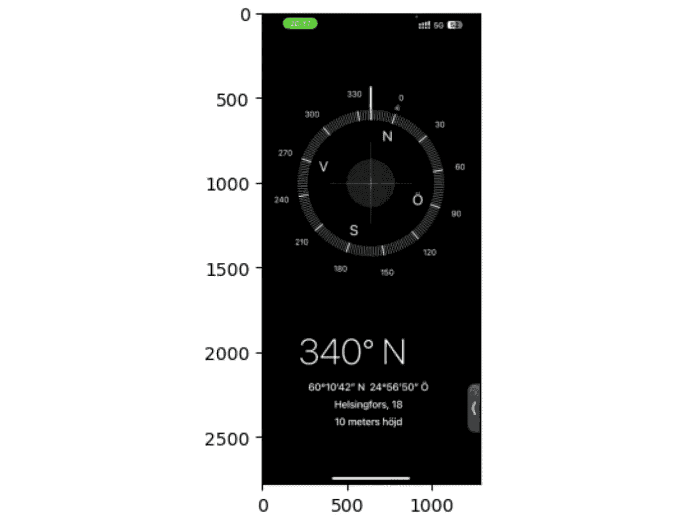

图片由作者提供

接下来，我将图像转换为灰度，以去除任何颜色信息并减少噪声：

```py
gray = cv2.cvtColor(img, cv2.COLOR_BGR2GRAY)
plt.imshow(gray, cmap='gray')
plt.show()
```

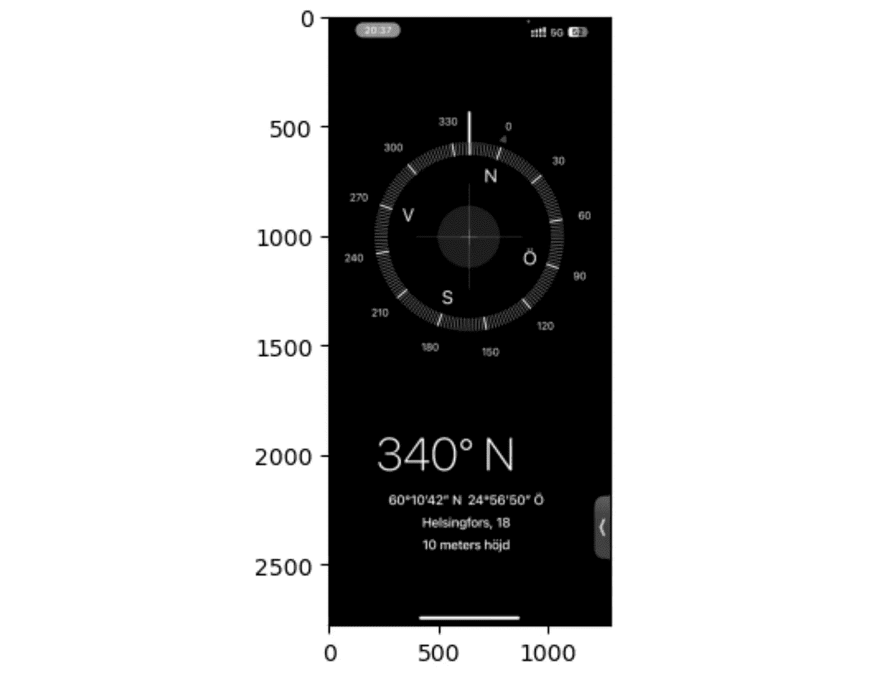

图片由作者提供

接着，我将放大感兴趣的区域：

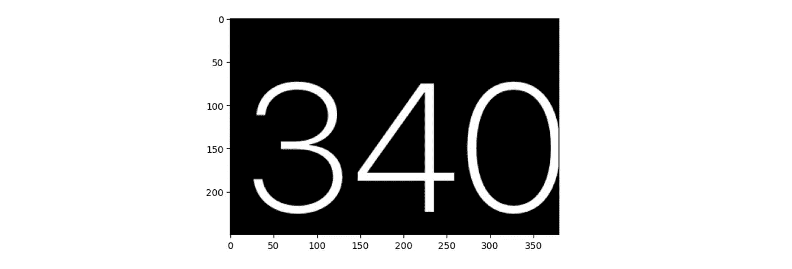

图片来源：作者

最后，我使用*easyocr*从图片中提取数字。它提取了数字和置信度评分，但我只对数字感兴趣。

```py
import easyocr

reader = easyocr.Reader(['en'])
result = reader.readtext(gray[1850:2100, 200:580])
for bbox, text, prob in result:
    print(f"Detected text: {text} with confidence {prob}")
```

```py
>> Detected text: 340 with confidence 0.999995182215476
```

就是这样！我写了一个简单的 for 循环来遍历所有截图，并将结果保存到 CSV 文件中。

这是完整预处理笔记本的链接：[数据预处理](https://github.com/DmitrySerg/data-wondering/blob/main/bayesian-dog-poop/notebooks/0-data-preprocessing.ipynb)。

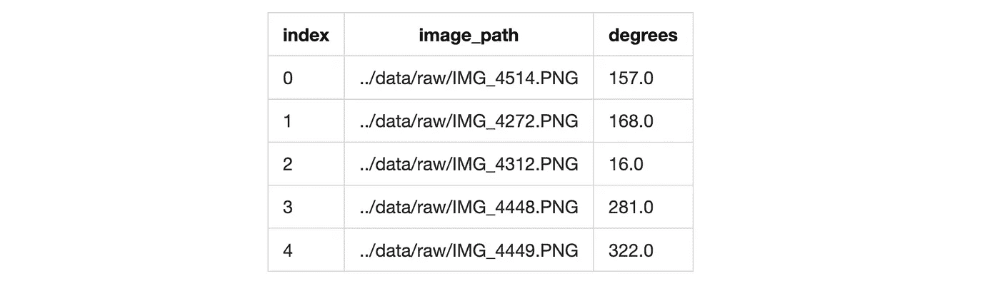

图片来源：作者

# 转动轮盘：圆形分布

我通常不处理圆形分布，因此我必须做一些阅读。与我们常见的常规数据不同，圆形数据有一个特殊的属性：分布的“端点”是连接的。

例如，如果你考虑一天中的小时分布，你会发现 23:00 到 00:00 之间的距离与 00:00 到 01:00 之间的距离是相同的。或者，在指南针角度的情况下，359°和 0°之间的距离与 0°和 1°之间的距离是相同的。

即使计算样本均值也不是直截了当的。360°和 0°之间的标准算术均值将是 180°，尽管 360°和 0°指向完全相同的方向。

在我的情况下，计算算术均值和正确的均值时，我得到了几乎完全相反的估算。我使用这个不错的库中的辅助函数将角度转换为弧度：[pingouin](https://pingouin-stats.org/build/html/generated/pingouin.convert_angles.html#pingouin.convert_angles)，并使用`circ_mean`函数计算均值。

```py
from pingouin import circ_mean

arithmetic_mean = data['radians'].mean()
circular_mean = circ_mean(data['radians'])

print(f"Arithmetic mean: {arithmetic_mean:.3f}; Circular mean: {circular_mean:.3f}")
```

```py
>> Arithmetic mean: 0.082; Circular mean: 2.989
```

接下来，我想可视化指南针分布。我使用[冯·米塞斯分布](https://docs.scipy.org/doc/scipy/reference/generated/scipy.stats.vonmises.html)来建模圆形数据，并使用[matplotlib](https://matplotlib.org/stable/gallery/pie_and_polar_charts/polar_demo.html)绘制极坐标图。

> **冯·米塞斯**分布是圆形分布的正态分布类比。它由两个参数定义：均值位置μ和集中度κ。集中度参数控制分布的扩展，类似于方差的倒数。当κ为 0 时，分布是均匀的，随着κ的增加，分布会围绕均值收缩。

让我们导入必要的库并定义辅助函数：

```py
import pandas as pd
import numpy as np
import matplotlib.pyplot as plt
import seaborn as sns

from scipy.stats import vonmises
from pingouin import convert_angles
from typing import Tuple, List

def vonmises_kde(series: np.ndarray, kappa: float, n_bins: int = 100) -> Tuple[np.ndarray, np.ndarray]:
    """
    Estimate a von Mises kernel density estimate (KDE) over circular data using scipy.

    Parameters:
    series: np.ndarray 
        The input data in radians, expected to be a 1D array.
    kappa: float
        The concentration parameter for the von Mises distribution.
    n_bins: int
        The number of bins for the KDE estimate (default is 100).

    Returns:
    bins: np.ndarray
        The bin edges (x-values) used for the KDE.
    kde: np.ndarray
        The estimated density values (y-values) for each bin.
    """
    bins = np.linspace(-np.pi, np.pi, n_bins)
    kde = np.zeros(n_bins)

    for angle in series:
        kde += vonmises.pdf(bins, kappa, loc=angle)

    kde = kde / len(series)
    return bins, kde

def plot_circular_distribution(
    data: pd.DataFrame,
    plot_type: str = 'kde',
    bins: int = 30,
    figsize: tuple = (4, 4),
    **kwargs
) -> None:
    """
    Plot a compass rose with either KDE or histogram for circular data.

    Parameters:
    -----------
    data: pd.DataFrame
        DataFrame containing 'degrees'and 'radians' columns with circular data
    plot_type: str
        Type of plot to create: 'kde' or 'histogram'
    bins: int
        Number of bins for histogram or smoothing parameter for KDE
    figsize: tuple
        Figure size as (width, height)
    **kwargs: dict
        Additional styling arguments for histogram (color, edgecolor, etc.)
    """
    plt.figure(figsize=figsize)
    ax = plt.subplot(111, projection='polar')

    ax.set_theta_zero_location('N')
    ax.set_theta_direction(-1)

    # add cardinal directions
    directions = ['N', 'E', 'S', 'W']
    angles = [0, np.pi / 2, np.pi, 3 * np.pi / 2]
    for direction, angle in zip(directions, angles):
        ax.text(
            angle, 0.45, direction,
            horizontalalignment='center',
            verticalalignment='center',
            fontsize=12,
            weight='bold'
        )

    if plot_type.lower() == 'kde':
        x, kde = vonmises_kde(data['radians'].values, bins)
        ax.plot(x, kde, color=kwargs.get('color', 'red'), lw=2)

    elif plot_type.lower() == 'histogram':
        hist_kwargs = {
            'color': 'teal',
            'edgecolor': 'black',
            'alpha': 0.7
        }
        hist_kwargs.update(kwargs) 

        angles_rad = np.deg2rad(data['degrees'].values)
        counts, bin_edges = np.histogram(
            angles_rad, 
            bins=bins, 
            range=(0, 2*np.pi), 
            density=True
        )
        widths = np.diff(bin_edges)
        ax.bar(
            bin_edges[:-1],
            counts,
            width=widths,
            align='edge',
            **hist_kwargs
        )

    else:
        raise ValueError("plot_type must be either 'kde' or 'histogram'")

    ax.xaxis.grid(True, linestyle='--', alpha=0.5)
    ax.yaxis.grid(True, linestyle='--', alpha=0.5)
    ax.set_yticklabels([]) 
    plt.show()
```

现在，让我们加载数据并绘制图表：

```py
data = pd.read_csv('../data/processed/compass_degrees.csv', index_col=0)
data['radians'] = convert_angles(data['degrees'], low=0, high=360)

plot_circular_distribution(data, plot_type='histogram', figsize=(6, 6))
plot_circular_distribution(data, plot_type='kde', figsize=(5, 5))
```

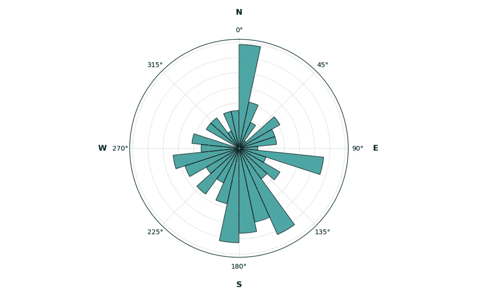

狗狗排便的圆形直方图（图片来源：作者）

从直方图中可以明显看出，Auri 在选择缓解方向时有自己的偏好。北方方向有明显的峰值，南方方向则有一个低谷。很棒！

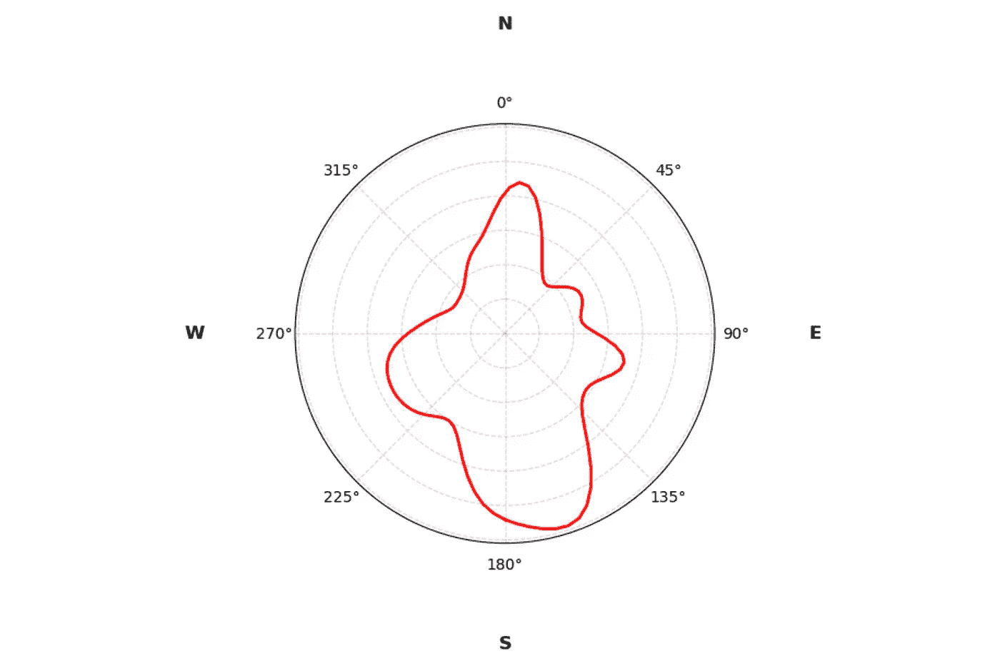

狗狗排便的圆形 KDE（图片来源：作者）

通过 KDE 图，我们可以获得分布的更平滑表示。好消息是，它离均匀圆形非常远。

该是进行统计验证的时候了！

# 统计学显著的排便

就像圆形数据需要特别的可视化和分布处理一样，它也需要特别的统计检验。

我将使用之前提到的 [pingouin](https://pingouin-stats.org/) 库中的几个测试。我将使用的第一个测试是 [Rayleigh 检验](https://en.wikipedia.org/wiki/Rayleigh_test)，它是一个用于检验圆形数据均匀性的测试。原假设认为数据在圆周上均匀分布，备择假设认为数据不均匀。

```py
from pingouin import circ_rayleigh

z, pval = circ_rayleigh(data['radians'])
print(f"Z-statistics: {z:.3f}; p-value: {pval:.6f}")
```

```py
>> Z-statistics: 3.893; p-value: 0.020128
```

好消息，大家！p 值小于 0.05，我们拒绝原假设。Auri 的战略性排便位置并非随机的！

唯一的缺点是该测试[假设](https://pingouin-stats.org/build/html/generated/pingouin.circ_rayleigh.html#:~:text=The%20assumptions%20for%20the%20Rayleigh%20test%20are%20that%20(1)%20the%20distribution%20has%20only%20one%20mode%20and%20(2)%20the%20data%20is%20sampled%20from%20a%20von%20Mises%20distribution.)分布只有一个模态，并且数据是从冯·米塞斯分布中采样的。唉，那我们换个方法试试吧。Auri 的数据显然有多个模态。

接下来是 [V 检验](https://pingouin-stats.org/build/html/generated/pingouin.circ_vtest.html)。该测试检查数据是否具有特定的均值方向且非均匀。从文档中我们得知：

> V 检验比雷 leigh 检验有更高的效能，并且如果有理由相信某个特定的均值方向，推荐使用 V 检验。

完美！让我们试试。

从分布来看，很明显 Auri 更喜欢南方方向。我将均值方向设置为 *π* 弧度（南方），并运行测试。

```py
from pingouin import circ_vtest

v, pval = circ_vtest(data['radians'], dir=np.pi)
print(f"V-statistics: {v:.3f}; p-value: {pval:.6f}")
```

```py
>> V-statistics: 24.127; p-value: 0.002904
```

现在我们开始有进展了！p 值接近零，我们拒绝原假设。Auri 是一个统计学上显著的南向排便者！

# 贝叶斯排便：数学部分

现在换个完全不同的方式。让我们尝试一种贝叶斯方法。

一开始，我决定查看均值方向的估计值如何随着样本量的增加而变化。这个想法很简单：我会从一个圆形均匀的先验分布开始，并随着每一个新的数据点更新它。

我们需要定义一些概念，所以让我们开始进入数学部分。如果你不喜欢方程式，可以跳到下一部分，那里有很酷的可视化！

## 1\. 冯·米塞斯分布

冯·米塞斯分布 *p*(*θ*∣*μ*,*κ*) 的概率密度函数为：


其中：

+   *μ* 是均值方向

+   *κ* 是集中参数（类似于正态分布中方差的倒数）

+   *I*₀(*κ*) 是第一类修正贝塞尔函数，确保分布是标准化的。

## 2\. 先验和似然性

假设我们有：

+   **先验** 分布：


+   **似然性** 对于一个新的观察值 *θₙ*​：


我们想使用贝叶斯定理更新我们的先验：


其中


## 3\. 在 von Mises 形式中乘以先验和似然

两个 von Mises 分布，参数分别为 (*μ*1​, *κ*1​) 和 (*μ*2​, *κ*2​)，它们的乘积会得到另一个 von Mises 分布，具有更新后的参数。我们一步步来看：

给定：


并且


后验与乘积成正比：


使用余弦和公式的三角恒等式：


这变为：


## 4\. 转换为极坐标形式以获得后验

最后阶段！上面的表达式是一个伪装的 von Mises 分布。我们可以将其重新写成极坐标形式，从而估计更新后的平均方向和集中度参数。

令：

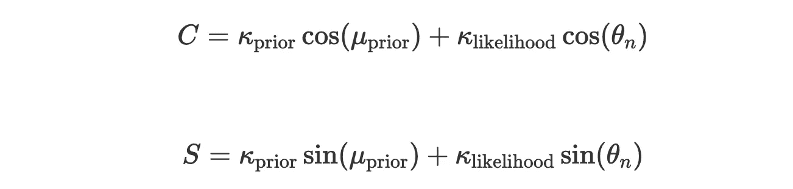

现在后验表达式简化为：


让我们暂停一下，仔细看看这个简化的表达式。

1.  请注意，*C cos⁡(θ)+S sin⁡(θ)* 是两个向量 *(C,S)* 和 *(cos⁡(θ),sin⁡(θ))* 的点积，我们可以将其表示为：


其中 *ϕ* 是向量 *(C,S)* 和 *(cos⁡(θ),sin⁡(θ))* 之间的角度。

2\. 向量的大小是：


3\. 向量 *(cos⁡(θ),sin⁡(θ))* 和正 x 轴之间的角度就是 *θ*，而 (*C*,*S*) 和正 x 轴之间的角度，由定义为：


4\. 那么两个向量之间的角度是：


将我们的发现代入简化后的后验表达式：


或者


其中

+   *kappa_post*​ 是后验的集中度参数：


+   *mu_post* 是后验的平均方向


哇，我们做到了！后验也是一个 von Mises 分布，具有更新后的参数 (*mu_post*, *kappa_post*)。现在，我们可以通过每个新的观测值更新先验，并观察平均方向的变化。

# 贝叶斯小插曲：有趣的部分

欢迎回到那些跳过数学部分的朋友们，恭喜那些完成了的朋友！现在让我们编写贝叶斯更新代码，并可视化结果。

首先，让我们定义一些辅助函数，用于可视化后验分布。稍后我们将用它来创建一个漂亮的动画。

```py
import imageio
from io import BytesIO

def get_posterior_distribution_image_array(
    mu_grid: np.ndarray, 
    posterior_pdf: np.ndarray, 
    current_samples: List[float], 
    idx: int, 
    fig_size: Tuple[int, int], 
    dpi: int, 
    r_max_posterior: float
) -> np.ndarray:
    """
    Creates the posterior distribution and observed samples histogram on a polar plot, 
    converts it to an image array, and returns it for GIF processing.

    Parameters:
    -----------

    mu_grid (np.ndarray): 
        Grid of mean direction values for plotting the posterior PDF.
    posterior_pdf (np.ndarray): 
        Posterior probability density function values for the given `mu_grid`.
    current_samples (List[float]): 
        List of observed angle samples in radians.
    idx (int): 
        The current step index, used for labeling the plot.
    fig_size (Tuple[int, int]): 
        Size of the plot figure (width, height).
    dpi (int): 
        Dots per inch (resolution) for the plot.
    r_max_posterior (float): 
        Maximum radius for the posterior PDF plot, used to set plot limits.

    Returns:
        np.ndarray: Image array of the plot in RGB format, suitable for GIF processing.
    """
    fig = plt.figure(figsize=fig_size, dpi=dpi)
    ax = plt.subplot(1, 1, 1, projection='polar')
    ax.set_theta_zero_location('N')  
    ax.set_theta_direction(-1)  
    ax.plot(mu_grid, posterior_pdf, color='red', linewidth=2, label='Posterior PDF')

    # observed samples histogram
    n_bins = 48
    hist_bins = np.linspace(-np.pi, np.pi, n_bins + 1)
    hist_counts, _ = np.histogram(current_samples, bins=hist_bins)

    # normalize the histogram counts
    if np.max(hist_counts) > 0:
        hist_counts_normalized = hist_counts / np.max(hist_counts)
    else:
        hist_counts_normalized = hist_counts

    bin_centers = (hist_bins[:-1] + hist_bins[1:]) / 2
    bin_width = hist_bins[1] - hist_bins[0]

    # set the maximum radius to accommodate both the posterior pdf and histogram bars
    r_histogram_height = r_max_posterior * 0.9 
    r_max = r_max_posterior + r_histogram_height
    ax.set_ylim(0, r_max)

    # plot the histogram bars outside the circle
    for i in range(len(hist_counts_normalized)):
        theta = bin_centers[i]
        width = bin_width
        hist_height = hist_counts_normalized[i] * r_histogram_height
        if hist_counts_normalized[i] > 0:
            ax.bar(
                theta, hist_height, width=width, bottom=r_max_posterior, 
                color='teal', edgecolor='black', alpha=0.5
            )

    ax.text(
        0.5, 1.1, f'Posterior Distribution (Step {idx + 1})', 
        transform=ax.transAxes, ha='center', va='bottom', fontsize=18
    )
    ax.set_yticklabels([])
    ax.grid(linestyle='--')
    ax.yaxis.set_visible(False)
    ax.spines['polar'].set_visible(False)
    plt.subplots_adjust(top=0.85, bottom=0.05, left=0.05, right=0.95)

    # saving to buffer for gif processing
    buf = BytesIO()
    plt.savefig(buf, format='png', bbox_inches=None, pad_inches=0)
    buf.seek(0)
    img_array = plt.imread(buf)
    img_array = (img_array * 255).astype(np.uint8)
    plt.close(fig)
    return img_array
```

现在我们准备写更新循环了。记住我们需要设置先验分布。我将从一个圆形均匀分布开始，它等价于一个冯·米塞斯分布，集中度参数为 0。对于 *kappa_likelihood*，我设置了一个固定的中等集中度参数 2。这将使得后验更新更加明显。

```py
# initial prior parameters
mu_prior = 0.0  # initial mean direction (any value, since kappa_prior = 0)
kappa_prior = 0.0  # uniform prior over the circle

# fixed concentration parameter for the likelihood
kappa_likelihood = 2.0

posterior_mus = []
posterior_kappas = []

mu_grid = np.linspace(-np.pi, np.pi, 200)

# vizualisation parameters
fig_size = (10, 10)
dpi = 100

current_samples = []
frames = []

for idx, theta_n in enumerate(data['radians']):

    # compute posterior parameters
    C = kappa_prior * np.cos(mu_prior) + kappa_likelihood * np.cos(theta_n)
    S = kappa_prior * np.sin(mu_prior) + kappa_likelihood * np.sin(theta_n)
    kappa_post = np.sqrt(C**2 + S**2)
    mu_post = np.arctan2(S, C)

    # posterior distribution
    posterior_pdf = np.exp(kappa_post * np.cos(mu_grid - mu_post)) / (2 * np.pi * i0(kappa_post))

    # store posterior parameters and observed samples
    posterior_mus.append(mu_post)
    posterior_kappas.append(kappa_post)
    current_samples.append(theta_n)

    # plot posterior distribution
    r_max_posterior = max(posterior_pdf) * 1.1
    img_array = get_posterior_distribution_image_array(
        mu_grid, 
        posterior_pdf, 
        current_samples, 
        idx, 
        fig_size, 
        dpi, 
        r_max_posterior
        )
    frames.append(img_array)

    # updating priors for next iteration
    mu_prior = mu_post
    kappa_prior = kappa_post

# Create GIF
fps = 10
frames.extend([img_array]*fps*3) # repeat last frame a few times to make a "pause" at the end of the GIF
imageio.mimsave('../images/posterior_updates.gif', frames, fps=fps)
```

就是这样！该代码将生成一个 GIF，展示每次新观测后，后验分布的更新。这里是辉煌的结果：

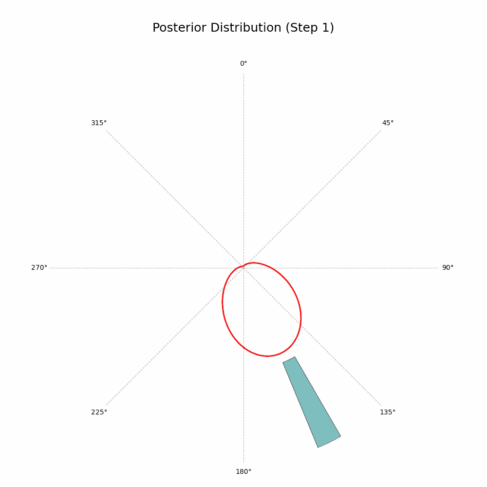

后验分布更新（图像由作者提供）

随着每次新的观测，后验分布变得越来越集中于真实的均值方向。如果我能用 Auri 的轮廓替代红线，那就完美了！

我们可以进一步可视化后验均值方向和集中度参数的历史。让我们绘制它们：

```py
# Convert posterior_mus to degrees
posterior_mus_deg = np.rad2deg(posterior_mus) % 360
n_samples = data.shape[0]
true_mu = data['degrees'].mean()
# Plot evolution of posterior mean direction
fig, ax1 = plt.subplots(figsize=(12, 6))

color = 'tab:blue'
ax1.set_xlabel('Number of Observations')
ax1.set_ylabel('Posterior Mean Direction (Degrees)', color=color)
ax1.plot(range(1, n_samples + 1), posterior_mus_deg, marker='o', color=color)
ax1.tick_params(axis='y', labelcolor=color)
ax1.axhline(true_mu, color='red', linestyle='--', label='Sample Distribution Mean Direction')
ax1.legend(loc='upper left')
ax1.grid(True)

ax2 = ax1.twinx()  # instantiate a second axes that shares the same x-axis
color = 'tab:orange'
ax2.set_ylabel('Posterior Concentration Parameter (kappa)', color=color)  # we already handled the x-label with ax1
ax2.plot(range(1, n_samples + 1), posterior_kappas, marker='o', color=color)
ax2.tick_params(axis='y', labelcolor=color)

fig.tight_layout()  # otherwise the right y-label is slightly clipped
sns.despine()
plt.title('Evolution of Posterior Mean Direction and Concentration Over Time')
plt.show()
```

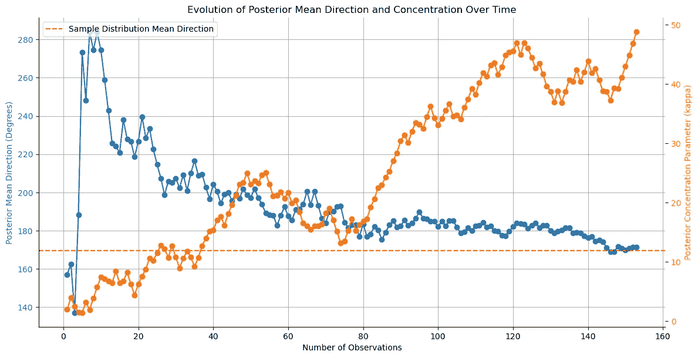

后验均值、kappa 演变（图像由作者提供）

图表展示了后验均值方向和集中度参数随着每次新观测如何变化。均值方向最终收敛到样本值，而集中度参数随着估计的确定性增加而上升。

# 贝叶斯因子：PyMC 用于狗狗指南针

我最后想尝试的是使用[贝叶斯因子](https://en.wikipedia.org/wiki/Bayes_factor#:~:text=7%20External%20links-,Definition,The%20key%20data%2Ddependent%20term)方法进行假设检验。贝叶斯因子背后的思想非常简单：它是**两个竞争假设/模型的边际似然比**。

通常，贝叶斯因子定义为：


其中：

+   *p*(*D*∣*Mi*​) 和 *p*(*D*∣*Mj*​) 是在 *i* 和 *j* 假设下的数据边际似然

+   *p*(*Mi*​∣*D*) 和 *p*(*Mj*​∣*D*) 是给定数据后的模型后验概率

+   *p*(*Mi*​) 和 *p*(*Mj*​) 是模型的先验概率

结果是一个数值，告诉我们一个假设比另一个假设更有可能。解释贝叶斯因子的方式有很多种，其中一种常见的方法是使用[哈罗德·杰弗里斯](https://en.wikipedia.org/wiki/Harold_Jeffreys)的杰弗里斯尺度：

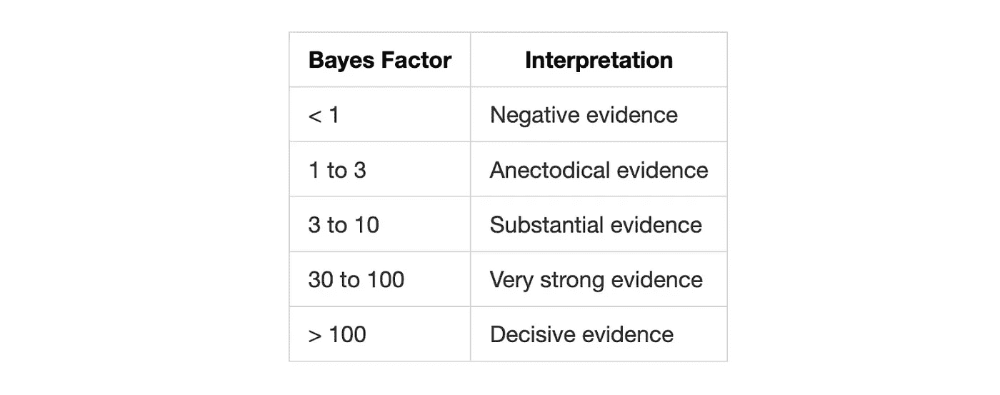

你可能会问，模型是什么？很简单！它们是具有不同参数的分布。我将使用 PyMC 来定义模型，并从中采样后验分布。

首先，我们重新引入零假设。我仍然假设它是一个圆形均匀的冯·米塞斯分布，且*kappa*=0，但这次我们需要计算在此假设下数据的似然性。为了简化后续的计算，我们将计算对数似然。

```py
# Calculate log likelihood for H0
log_likelihood_h0 = vonmises.logpdf(data['radians'], kappa=0, loc=0).sum()
```

接下来，是时候构建备择模型了。首先从一个简单的场景开始：**单峰南方**方向，在这个场景下，我假设分布集中在 180°或π弧度处。

# 单峰南方

让我们在 PyMC 中定义模型。我们将使用冯·米塞斯分布，并设置固定位置参数*μ*=*π*，同时为非负浓度参数*κ*设置半正态先验。这使得模型能够从数据中学习浓度参数，并检查南方方向是否更受偏好。

```py
import pymc as pm
import arviz as az
import arviz.data.inference_data as InferenceData
from scipy.stats import halfnorm, gaussian_kde

with pm.Model() as model_uni:
    # Prior for kappa 
    kappa = pm.HalfNormal('kappa', sigma=10)
    # Likelihood
    likelihood_h1 = pm.VonMises('angles', mu=np.pi, kappa=kappa, observed=data['radians'])
    # Sample from posterior 
    trace_uni = pm.sample(
        10000, tune=3000, chains=4, 
        return_inferencedata=True, 
        idata_kwargs={'log_likelihood': True})
```

这给我们提供了一个简单的模型，我们也可以将其可视化：

```py
# Model graph
pm.model_to_graphviz(model_uni)
```

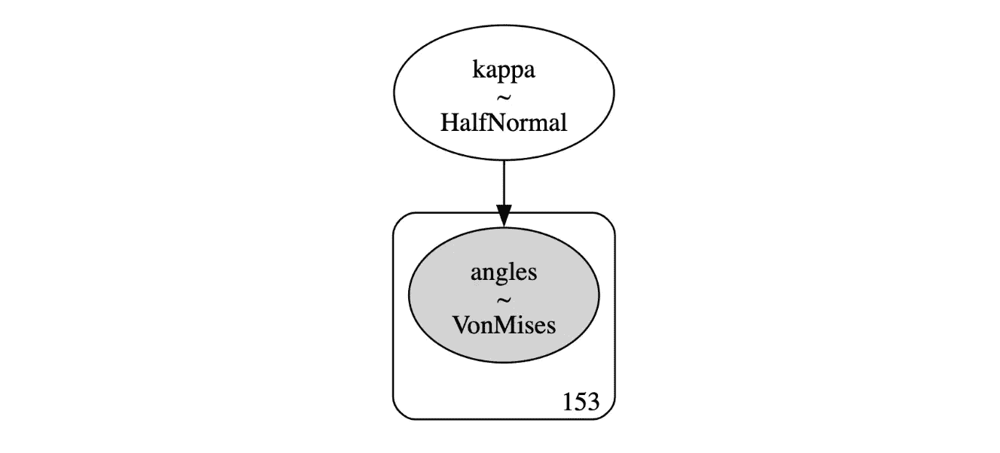

PyMC 模型图（作者提供的图片）

这是浓度参数*κ*的后验分布：

```py
az.plot_posterior(trace_uni, var_names=['kappa'])
plt.show()
```

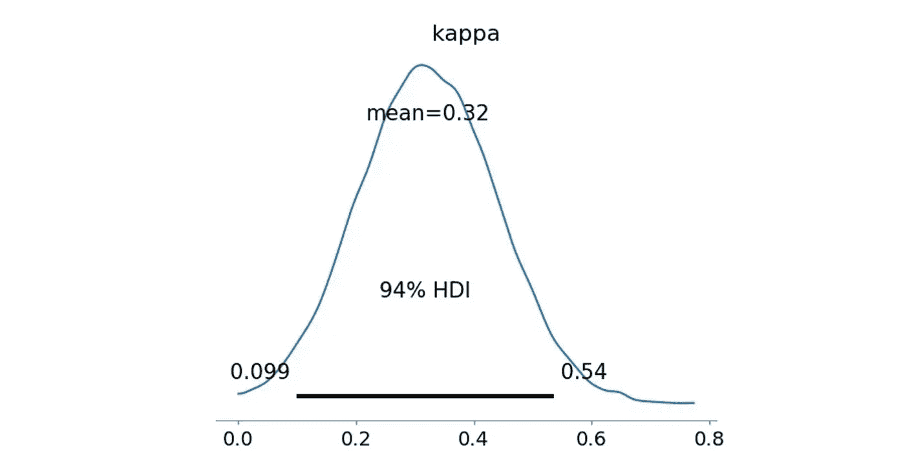

后验 kappa 分布（作者提供的图片）

剩下的就是计算备择模型的对数似然值和贝叶斯因子。

```py
# Posterior samples for kappa
kappa_samples = trace_uni.posterior.kappa.values.flatten()
# Log likelihood for each sample
log_likes = []
for k in kappa_samples:
    # Von Mises log likelihood
    log_like = vonmises.logpdf(data['radians'], k, loc=np.pi).sum()
    log_likes.append(log_like)
# Log-mean-exp trick for numerical stability
log_likelihood_h1 = np.max(log_likes) +\
       np.log(np.mean(np.exp(log_likes - np.max(log_likes))))
BF = np.exp(log_likelihood_h1 - log_likelihood_h0)
print(f"Bayes Factor: {BF:.4f}")
print(f"Probability kappa > 0.5: {np.mean(kappa_samples > 0.5):.4f}")
```

```py
>> Bayes Factor: 32.4645
>> Probability kappa > 0.5: 0.0649
```

因为我们是将备择模型的似然除以原假设模型的似然，所以贝叶斯因子表明数据在备择假设下的可能性增加了多少。在这种情况下，我们得到了 32.46，这是非常强的证据，表明数据**不是均匀分布**在圆周上，而是**偏向南方方向**。

然而，我们还计算了浓度参数*kappa*大于 0.5 的概率。这是一种简单的方法，用来检查分布是否显著不同于均匀分布。在单峰南方模型下，这个概率只有 0.0649，意味着分布仍然相当分散。

让我们尝试另一个模型：**双峰南北混合模型**。

# 双峰南北混合模型

这次我假设分布是双峰的，峰值分别位于 0°和 180°，正如我们在罗盘玫瑰图上看到的那样。

为了实现这一点，我需要使用两个具有不同固定均值方向和共享浓度参数的冯·米塞斯分布的混合。

首先，让我们定义一些辅助函数：

```py
# Type aliases
ArrayLike = Union[np.ndarray, pd.Series]
ResultDict = Dict[str, Union[float, InferenceData.InferenceData]]

def compute_mixture_vonmises_logpdf(
    series: ArrayLike,
    kappa: float,
    weights: npt.NDArray[np.float64],
    mus: List[float]
) -> float:
    """
    Compute log PDF for a mixture of von Mises distributions

    Parameters:
    -----------
    series: ArrayLike 
        Array of observed angles in radians
    kappa: float
        Concentration parameter
    weights: npt.NDArray[np.float64],
        Array of mixture weights
    mus: List[float] 
        Array of means for each component

    Returns:
    --------
    float: Sum of log probabilities for all data points
    """
    mixture_pdf = np.zeros_like(series)

    for w, mu in zip(weights, mus):
        mixture_pdf += w * vonmises.pdf(series, kappa, loc=mu)

    return np.log(np.maximum(mixture_pdf, 1e-300)).sum()

def compute_log_likelihoods(
    trace: az.InferenceData, 
    series: ArrayLike,
    mus: List[float]
    ) -> np.ndarray:
    """
    Compute log likelihoods for each sample in the trace

    Parameters:
    -----------
    trace: az.InferenceData
        The trace from the PyMC3 model sampling.

    series: ArrayLike
        Array of observed angles in radians

    """

    kappa_samples = trace.posterior.kappa.values.flatten()
    weights_samples = trace.posterior.weights.values.reshape(-1, 2)
    # Calculate log likelihood for each posterior sample
    log_likes = []
    for k, w in zip(kappa_samples, weights_samples):
        log_like = compute_mixture_vonmises_logpdf(
            series, 
            kappa=k, 
            weights=w, 
            mus=mus
        )
        log_likes.append(log_like)

    # Calculate marginal likelihood using log-sum-exp trick
    log_likelihood_h1 = np.max(log_likes) + np.log(np.mean(np.exp(log_likes - np.max(log_likes))))
    return log_likelihood_h1

def posterior_report(
    log_likelihood_h0: float, 
    log_likelihood_h1: float, 
    kappa_samples: ArrayLike,
    kappa_threshold: float = 0.5
    ) -> str:

    """
    Generate a report with Bayes Factor and probability kappa > threshold

    Parameters:
    -----------
    log_likelihood_h0: float
        Log likelihood for the null hypothesis
    log_likelihood_h1: float
        Log likelihood for the alternative hypothesis
    kappa_samples: ArrayLike
        Flattened posterior samples of the concentration parameter
    kappa_threshold: float
        Threshold for computing the probability that kappa > threshold

    Returns:
    --------
    summary: str
        A formatted string containing the summary statistics.
    """
    BF = np.exp(log_likelihood_h1 - log_likelihood_h0)

    summary = (
        f"Bayes Factor: {BF:.4f}\n"
        f"Probability kappa > {kappa_threshold}: {np.mean(kappa_samples > kappa_threshold):.4f}"
    )

    return summary
```

现在回到模型：

```py
mu1 = 0            # 0 degrees
mu2 = np.pi        # 180 degrees

with pm.Model() as model_mixture_bimodal_NS:
    # Priors for concentration parameters
    kappa = pm.HalfNormal('kappa', sigma=10) 
    # Priors for component weights
    weights = pm.Dirichlet('weights', a=np.ones(2))

    # Define the von Mises components
    vm1 = pm.VonMises.dist(mu=mu1, kappa=kappa)
    vm2 = pm.VonMises.dist(mu=mu2, kappa=kappa)

    # Mixture distribution
    likelihood = pm.Mixture(
        'angles',
        w=weights,
        comp_dists=[vm1, vm2],
        observed=data['radians']
    )

    # Sample from the posterior
    trace_mixture_bimodal_NS = pm.sample(
        10000, tune=3000, chains=4, return_inferencedata=True, idata_kwargs={'log_likelihood': True})

    # Get kappa samples
    kappa_samples = trace_mixture_bimodal_NS.posterior.kappa.values.flatten()
```

再次，让我们可视化模型图和浓度参数*κ*的后验分布：

```py
# Model graph
pm.model_to_graphviz(model_mixture_bimodal_NS)
```

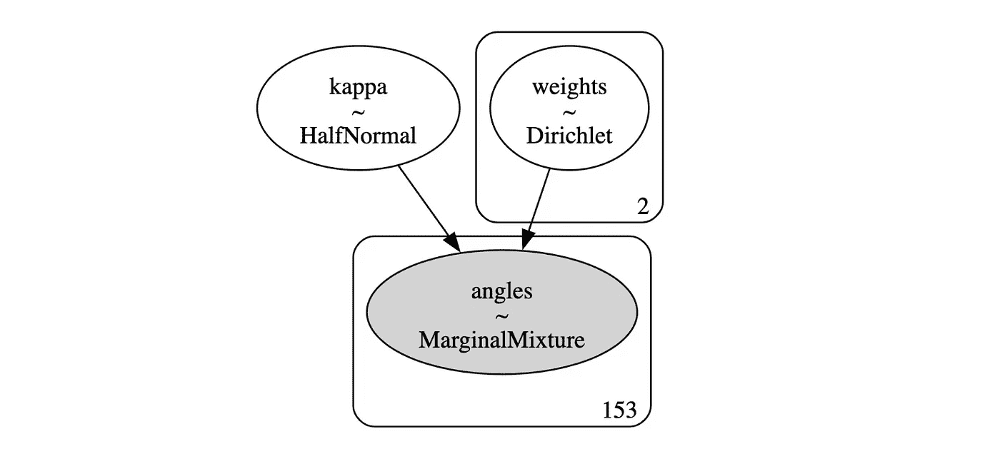

PyMC 模型图（作者提供的图片）

```py
# Posterior Analysis
az.plot_posterior(trace_mixture_bimodal_NS, var_names=['kappa'])
plt.show()
```

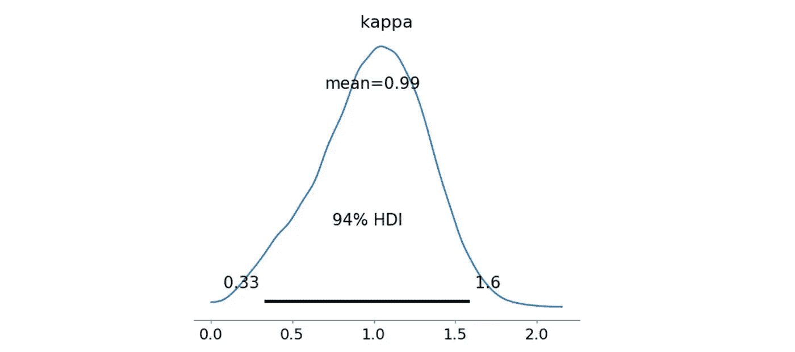

后验 kappa 分布（作者提供的图片）

最后，让我们计算贝叶斯因子和浓度参数*κ*大于 0.5 的概率：

```py
log_likelihood_h1 = compute_log_likelihoods(trace_mixture_bimodal_NS, data['radians'], [mu1, mu2])
print(posterior_report(log_likelihood_h0, log_likelihood_h1, kappa_samples))
```

```py
>> Bayes Factor: 214.2333
>> Probability kappa > 0.5: 0.9110
```

**太棒了！** 我们的两个指标都表明这个模型更适合数据。贝叶斯因子表明**有决定性证据**，并且大多数后验*κ*样本大于 0.5，均值为 0.99，正如我们在分布图上看到的那样。

在结束之前，让我们再试试其他几个模型。

# 双峰西南混合模型

这个模型再次假设一个双峰分布，但这次峰值位于 270°和 180°，这些方向在罗盘玫瑰图中较为常见。

```py
mu1 = np.pi          # 180 degrees
mu2 = 3 * np.pi / 2  # 270 degrees

with pm.Model() as model_mixture_bimodal_WS:
    # Priors for concentration parameters
    kappa = pm.HalfNormal('kappa', sigma=10)

    # Priors for component weights
    weights = pm.Dirichlet('weights', a=np.ones(2))

    # Define the four von Mises components
    vm1 = pm.VonMises.dist(mu=mu1, kappa=kappa)
    vm2 = pm.VonMises.dist(mu=mu2, kappa=kappa)

    # Mixture distribution
    likelihood = pm.Mixture(
        'angles',
        w=weights,
        comp_dists=[vm1, vm2],
        observed=data['radians']
    )

    # Sample from the posterior
    trace_mixture_bimodal_WS = pm.sample(
        10000, tune=3000, chains=4, return_inferencedata=True, idata_kwargs={'log_likelihood': True})

    # Get kappa samples
    kappa_samples = trace_mixture_bimodal_WS.posterior.kappa.values.flatten()

# Posterior Analysis
az.plot_posterior(trace_mixture_bimodal_WS, var_names=['kappa'])
plt.show()

log_likelihood_h1 = compute_log_likelihoods(trace_mixture_bimodal_WS, data['radians'], [mu1, mu2])
print(posterior_report(log_likelihood_h0, log_likelihood_h1, kappa_samples))
```

```py
>> Bayes Factor: 20.2361
>> Probability kappa > 0.5: 0.1329
```

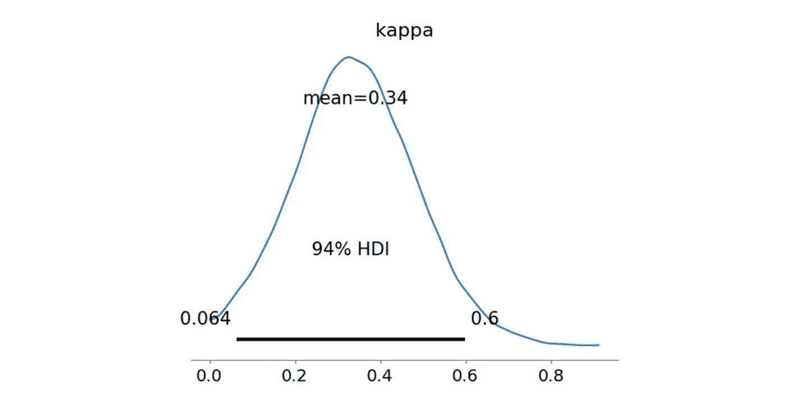

后验 kappa 分布（作者提供的图片）

不，明显不如之前的模型好。下一个！

# 四态混合模型

最后一轮。也许我的狗确实喜欢与基准方向对齐？让我们尝试一个四态分布，峰值分别位于 0°、90°、180°和 270°。

```py
mu1 = 0            # 0 degrees
mu2 = np.pi / 2    # 90 degrees
mu3 = np.pi        # 180 degrees
mu4 = 3 * np.pi / 2  # 270 degrees

with pm.Model() as model_mixture_quad:
    # Priors for concentration parameters
    kappa = pm.HalfNormal('kappa', sigma=10)

    # Priors for component weights
    weights = pm.Dirichlet('weights', a=np.ones(4))

    # Define the four von Mises components
    vm1 = pm.VonMises.dist(mu=mu1, kappa=kappa)
    vm2 = pm.VonMises.dist(mu=mu2, kappa=kappa)
    vm3 = pm.VonMises.dist(mu=mu3, kappa=kappa)
    vm4 = pm.VonMises.dist(mu=mu4, kappa=kappa)

    # Mixture distribution
    likelihood = pm.Mixture(
        'angles',
        w=weights,
        comp_dists=[vm1, vm2, vm3, vm4],
        observed=data['radians']
    )

    # Sample from the posterior
    trace_mixture_quad = pm.sample(
        10000, tune=3000, chains=4, return_inferencedata=True, idata_kwargs={'log_likelihood': True}
    )
    # Get kappa samples
    kappa_samples = trace_mixture_quad.posterior.kappa.values.flatten()
# Posterior Analysis
az.plot_posterior(trace_mixture_quad, var_names=['kappa'])
plt.show()
log_likelihood_h1 = compute_log_likelihoods(trace_mixture_quad, data['radians'], [mu1, mu2, mu3, mu4])
print(posterior_report(log_likelihood_h0, log_likelihood_h1, kappa_samples))
```

```py
>> Bayes Factor: 0.0000
>> Probability kappa > 0.5: 0.9644
```

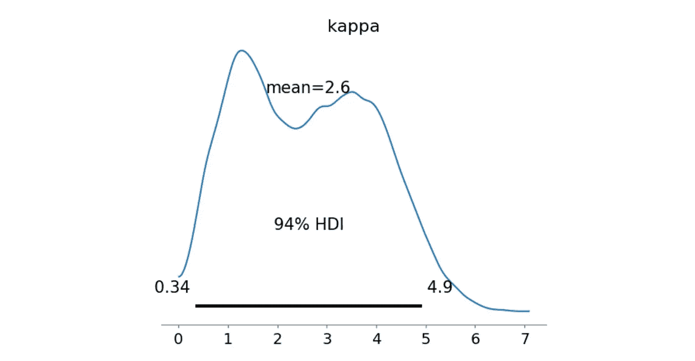

后验 kappa 分布（作者提供的图片）

嗯… 其实并不是。尽管集中参数κ*κ*大于 0.5 的概率相当高，但贝叶斯因子却是 0.0。

贝叶斯因子的优点在于它有效地惩罚过度复杂的模型，有效防止过拟合。

# 模型比较

让我们用信息准则总结所有模型的结果。我们将使用[Widely Applicable Information Criterion](https://en.wikipedia.org/wiki/Watanabe%E2%80%93Akaike_information_criterion#:~:text=In%20statistics%2C%20the%20Widely%20Applicable,it%20wasn't%20trained%20on.)（WAIC）和 Leave-One-Out Cross-Validation（LOO）来比较这些模型。

```py
# Compute WAIC for each model
wail_uni = az.waic(trace_uni)
waic_quad = az.waic(trace_mixture_quad)
waic_bimodal_NS = az.waic(trace_mixture_bimodal_NS)
waic_bimodal_WS = az.waic(trace_mixture_bimodal_WS)

model_dict = {
    'Quadrimodal Model': trace_mixture_quad,
    'Bimodal Model (NS)': trace_mixture_bimodal_NS,
    'Bimodal Model (WS)': trace_mixture_bimodal_WS,
    'Unimodal Model': trace_uni 
}
# Compare models using WAIC
waic_comparison = az.compare(model_dict, ic='waic')
waic_comparison
```

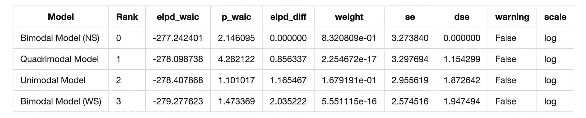

```py
# Compare models using LOO
loo_comparison = az.compare(model_dict, ic='loo')
loo_comparison
```

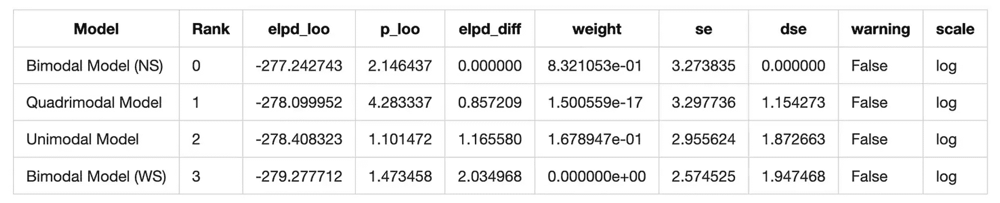

```py
# Visualize the comparison
az.plot_compare(waic_comparison)
plt.show()
```

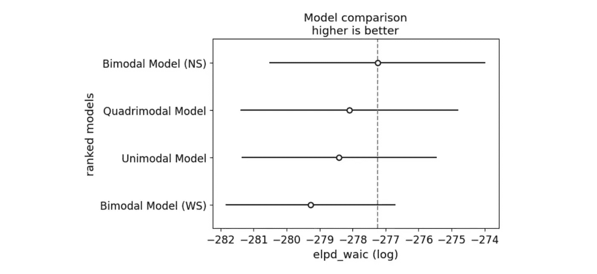

WAIC 比较（作者提供的图片）

我们找到了优胜者！根据 WAIC 和 LOO，**双模态南北模型**是数据的最佳拟合模型。

# 结论


Christmas Auri（作者提供的图片）

何等的旅程！几个月前仅仅是对我狗拉屎习惯的简单观察，现在却变成了全面的贝叶斯分析。

在本文中，我展示了如何建模圆形数据，估计平均方向和集中参数，并通过新观察更新后验分布。我们还看到如何使用贝叶斯因子进行假设检验，并使用信息准则比较模型。

结果非常有趣！Auri 确实有自己的喜好，并且在南北轴上能够对齐。如果我和我的狗迷失在树林中，我知道该往哪个方向走了。只需足够大的样本量来确认！

希望您像我一样享受这段旅程。如果您有任何问题或建议，请随时联系。如果您想支持我的工作，请考虑给我买杯咖啡 ❤️


我的社交媒体账号：

+   [数据漫游博客 [英语]](https://substack.com/@datawondering)

+   [数据漫游博客 [俄语]](https://t.me/data_wondering)

参考文献：

+   狗对地球磁场的微小变化很敏感，Vlastimil Hart 等人，[[链接]](https://frontiersinzoology.biomedcentral.com/counter/pdf/10.1186/1742-9994-10-80.pdf)

+   生物统计分析，第五版，Jerrold H. Zar，[[链接]](https://bayesmath.com/wp-content/uploads/2021/05/Jerrold-H.-Zar-Biostatistical-Analysis-5th-Edition-Prentice-Hall-2009.pdf)

+   PyMC，Python 中的概率编程，[[link]](https://www.pymc.io/welcome.html)
