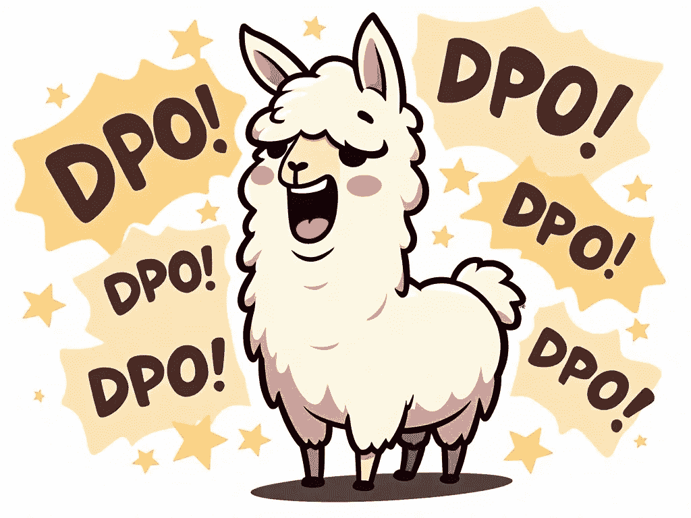

# DPO 全量训练与 LoRA：LoRA 对 DPO 训练的效果如何？

> 原文：[`towardsdatascience.com/dpo-full-training-vs-lora-how-good-is-lora-for-dpo-training-a1dd8e088d9d?source=collection_archive---------8-----------------------#2024-11-20`](https://towardsdatascience.com/dpo-full-training-vs-lora-how-good-is-lora-for-dpo-training-a1dd8e088d9d?source=collection_archive---------8-----------------------#2024-11-20)

## 一种模型，两个适配器

 [Benjamin Marie](https://medium.com/@bnjmn_marie?source=post_page---byline--a1dd8e088d9d--------------------------------)

·发表于[Towards Data Science](https://towardsdatascience.com/?source=post_page---byline--a1dd8e088d9d--------------------------------) ·8 分钟阅读·2024 年 11 月 20 日

--

使用 Grok 生成

有多种方法可以使大型语言模型（LLM）与人类偏好对齐。除了人类反馈强化学习（RLHF），它通常被认为对于新调整过的模型应用过于资源密集，直接偏好优化（DPO）是 LLM 对齐中最受欢迎的替代方案之一。

尽管 DPO 比 RLHF 显著更具成本效益，但它仍然需要一个参考模型，除了“策略”模型（即正在积极训练的模型）。这意味着两个模型必须同时加载到 GPU 内存中，这对于单 GPU 配置来说可能具有挑战性，尤其是在大模型的情况下。

一种更节省内存的方式是使用 LoRA 进行 DPO 训练。我们冻结模型的参数并训练一个小的适配器，而不是训练整个模型。如果策略模型和参考模型共享相同的基础模型，那么这种方法会更加高效；在这种情况下，我们只需要加载一次基础模型，然后加载冻结的参考模型适配器和可训练的策略模型适配器，从而显著减少内存需求。

然而，个人认为 LoRA 对 DPO 性能的影响仍然没有得到充分研究。尽管 LoRA 可以较为接近全量训练，但它的表现…
