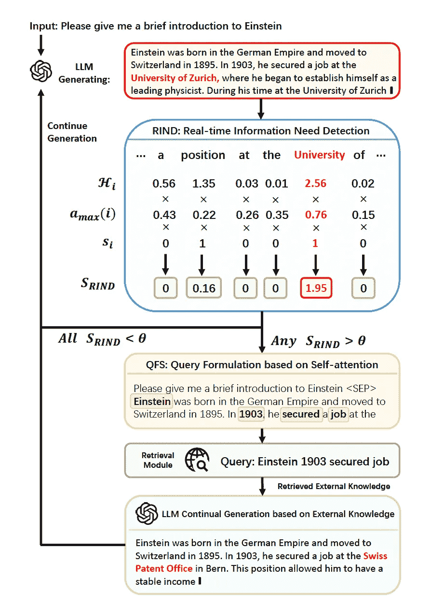
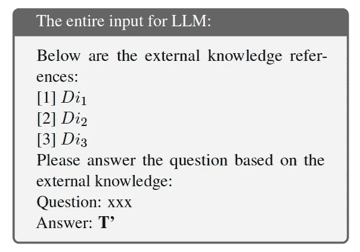

# DRAGIN: 基于大型语言模型信息需求的动态检索增强生成

> 原文：[`towardsdatascience.com/dragin-dynamic-retrieval-augmented-generation-based-on-the-information-needs-of-large-language-dbdb9aabc1ef?source=collection_archive---------2-----------------------#2024-12-05`](https://towardsdatascience.com/dragin-dynamic-retrieval-augmented-generation-based-on-the-information-needs-of-large-language-dbdb9aabc1ef?source=collection_archive---------2-----------------------#2024-12-05)

## *传统 RAG 与动态 RAG*

 [Atisha Rajpurohit](https://medium.com/@atisharajpurohit?source=post_page---byline--dbdb9aabc1ef--------------------------------)

·发表于 [Towards Data Science](https://towardsdatascience.com/?source=post_page---byline--dbdb9aabc1ef--------------------------------) ·阅读时间 9 分钟·2024 年 12 月 5 日

--

*在本文中，我探讨了研究论文《****DRAGIN：基于大型语言模型信息需求的动态检索增强生成****》中解释的基本概念，作者是*** *Weihang Su、Yichen Tang、Qingyao Ai、Zhijing Wu 和 Yiqun Liu。这篇论文可以在* [*这里*](https://arxiv.org/abs/2403.10081)* 访问。*

**引言 — 让我们来看一个短故事！**

> *假设你正在解决一个问题。刚开始时，你* ***只有一次机会*** *向你的教授请教。这意味着在开始时理解问题的整体范围非常重要。如果是一个简单的问题，可能没问题——你提问、获得清晰的答案，然后继续前进。*
> 
> *现在，假设这个问题* ***变得更加复杂***。你越深入探讨，*就会有* ***更多问题*** *！不幸的是，你不能再回去问你的教授，因为所有问题都必须在一开始就提出来。这使得问题的解决变得更加困难。*
> 
> *但如果，假设，* ***你被允许*** *每当发现一个扩展问题范围的新问题时都可以回去请教教授呢？这种方法允许你在问题发展时迭代地导航复杂性，每当问题有新发展时都可以请求指导。* ***这就是 DRAGIN（动态 RAG）与传统 RAG 的本质区别。***
> 
> *考虑到我们的任务、问题和世界变得如此复杂且多维，* ***这种动态方法的需求比以往任何时候都更为迫切！***

图片来自[Unsplash](https://unsplash.com/)

大型语言模型改变了我们获取信息的方式。我们正处于一个阶段，在这个阶段，我们搜索信息的方式已经永远改变。现在，我们不需要再寻找多个链接并处理信息来回答问题，我们可以直接向 LLM 提问！

然而，仍然存在一些问题：

1.  幻觉：生成虚假信息

1.  过时/陈旧：无法获取最新的信息

1.  专有信息：无法访问专门知识

为了解决上述问题，**检索增强生成（RAG）**作为一种有前景的解决方案应运而生。它的工作原理是通过访问并结合 LLM 生成准确回答所需的相关外部信息。

然而，传统的 RAG 方法依赖于单轮检索，这意味着信息生成开始时只进行一次外部信息检索。这对于简单的任务来说效果很好，但我们对 LLM 的需求和要求正变得越来越复杂、多步骤，并且需要更长的回答。

在这些情况下，单轮检索效果不好，需要进行多轮检索。当我们谈到多次检索时，接下来的两个问题是：

***何时*** *进行检索，* ***检索什么*** *？为了解决这些问题，已经设计了多种 RAG 方法：*

## **固定检索方法：**

**IRCoT（固定句子 RAG）** **[1]**：为每个生成的查询进行检索，最新的句子用作查询。

**RETRO [2] 和 IC-RALM [3]** **（固定长度 RAG）**：定义一个滑动窗口，每生成*n*个 token 就触发一次检索模块。

> *但我们不是在检索* ***太频繁*** *了吗？这会导致检索到可能不必要的信息吗？这会引入噪声，并可能危及 LLM 输出的质量，违背了提高准确性的初衷。这些规则仍然是* ***静态*** *的，我们需要思考* ***动态*** *的检索方式。*

## **动态检索方法：**

**FLARE [4]** **（低置信度 RAG）**：当 LLM 对下一个 token 的置信度（生成概率）低于某个阈值时，会动态进行检索。所以，FLARE 是基于**不确定性**触发检索的。

为了确定检索什么，LLM 通常会限制自己基于最近生成的几个 token 或句子来形成查询。这些查询生成方法在任务变得更加复杂且 LLM 的信息需求涵盖整个上下文时可能无法奏效！

*最后，让我们来看看本次的明星：DRAGIN！*

## **DRAGIN（基于信息需求的动态检索增强生成）：**

这种方法专门用于决定何时以及检索什么信息，以满足 LLM 的信息需求。因此，它通过两个框架优化了信息检索的过程。正如作者在论文中所解释的，DRAGIN 有两个关键框架：

***I. RIND（实时信息需求检测）：什么时候检索？***

它会考虑 LLM 对自身内容的**不确定性**、每个标记的**影响**以及每个标记的**语义**。

***II. QFS（基于自注意力的查询构建）：要检索什么？***

查询构建利用了 LLM 在整个上下文中的**自注意力**，而不仅仅是最后几个标记或句子。

## **DRAGIN 框架的示意图**

为了说明上述框架，论文使用了一个关于‘**爱因斯坦简要介绍**’的查询示例。

图 1：DRAGIN 框架的示意图，摘自[研究论文](https://arxiv.org/abs/2403.10081)

***解释：***

***提供输入：*** *系统被查询提供一些关于爱因斯坦的介绍。*

***处理开始：*** *系统根据它已知的信息开始生成响应。它使用 RIND 模块来决定是否有足够的信息，或者是否需要查找更多信息。*

***检查所需信息（RIND）：*** *系统将查询分解成更小的部分（标记），例如“职位”、“在”、“大学”等。它检查哪些部分（标记）需要更多信息。例如，“大学”可能需要额外的数据，因为它不够具体。*

***触发检索：*** *如果像“大学”这样的标记被认为重要且不明确，系统会触发检索以收集关于它的外部信息。在这种情况下，它会查找有关爱因斯坦和大学的相关数据。*

***制定查询（QFS）：*** *系统使用自注意力机制来确定哪些词语在形成精确查询时最为相关。例如，它可能会选择“爱因斯坦”、“1903”和“找到工作”作为关键部分。*

*这些关键词用于构建查询，例如“爱因斯坦 1903 找到一份工作”，该查询将发送给外部源获取信息。*

***获取和添加信息：*** *外部源提供所需的详细信息。例如，它可能返回：“在 1903 年，爱因斯坦在瑞士专利局找到了一份工作。”系统将这些新信息融入到回答中。*

***继续生成：*** *根据新信息，系统继续生成更完整、更准确的回答。例如，它现在可能会说：“在 1903 年，爱因斯坦在瑞士专利局找到了一份工作。这使他能够有稳定的收入。”*

***重复过程:*** *如果识别到更多需求，过程将重复：* ***检查、检索和整合信息*** *直到响应完整且准确。这个过程确保系统能够动态地填补知识空白，并通过结合已知信息和检索到的外部信息，提供详细且准确的答案。*

## RAG 的详细方法

文中提到的框架有：

**A. 实时信息需求检测** **(RIND)** : 检索是基于令牌的不确定性、对其他令牌的影响以及每个令牌的语义重要性来触发的。

i. 定量化每个 LLM 生成的令牌的**不确定性**。通过计算令牌在词汇表中的概率分布的**熵**来实现这一点。考虑输出序列 *T = {t1,t2,…tn}*，其中每个 *ti* 表示位置 *i* 的一个单独令牌。对于任何令牌 *ti*，熵的计算公式如下：

其中 *pi(v)* 表示生成令牌 *v* 在词汇表中所有令牌中的概率。

ii. 通过利用自注意力分数来计算每个令牌对后续令牌的**影响**。对于令牌 t，识别最大注意力值

iii. 每个令牌 *ti* 的**语义贡献**，采用二进制指示器。这会过滤掉停用词。

结合**不确定性、重要性和语义**，RIND 计算一个分数，如果这个分数大于预定义的阈值，则触发检索。

**B**. **基于自注意力的查询制定（QFS）**

一旦触发检索，下一步是从外部数据库中制定高效的查询，以继续生成 LLM。在现有的动态 RAG 框架中，查询是使用 LLM 生成的最后一句话或最后一个令牌来制定的。这种狭窄的范围没有捕捉到实时信息需求的必要性。它检查的是完整的上下文。

假设 RIND 识别到位置 *i* 的令牌 *ti*，需要外部知识并触发检索。

> 由于令牌 *ti* 是基于所有前置令牌的知识生成的，因此从现在起查看已生成的完整内容来制定查询是有意义的。它使用以下步骤：

**步骤 1**：提取最后一个 Transformer 层中每个令牌 *ti* 的注意力分数。

**步骤 2**：按降序排列注意力分数，以识别前***n***个分数。*(这基本上是识别最重要的令牌)。*

**步骤 3**：从词汇表中找到这些令牌对应的词，并按照原始顺序排列。*(这通过注意力分数和令牌恢复了语言结构)。*

**第 4 步**：使用与这些顶部***n***个标记相关的词构造查询*Qi*。

**C. 检索后继续生成**

一旦 RIND 识别出需要外部知识的位置*i*，并且 QFS 生成查询 Qi 以使用现成的检索模型（例如，BM25）提取信息。

它从文档*Di1*、*Di2*和*Di3*中找到了相关信息。通过截断 LLM 的输出，它整合了位置*i*上的相关信息。然后，使用以下设计的提示模板整合这些检索到的知识。

用于整合外部检索信息的设计提示模板。

## **局限性**

正如本文所述，本文的主要局限性在于它依赖自注意力机制来处理实时信息需求检测（RIND）和基于自注意力的查询生成（QFS）。虽然所有源 LLM 都可以获得自注意力分数，但对于某些不提供自注意力分数的 API，这种方法不可行。

*值得考虑的一点是对推理时间延迟和成本的影响：在论文中，作者指出这些影响仅仅是微乎其微，因为不完美的标记子序列会迅速被检测到，进一步的生成会被中断，直到进行修正。*

## 结论

DRAGIN 框架使我们能够比传统的 RAG 框架走得更远。它允许我们根据生成的信息需求执行多次检索。它是一个优化的多次检索框架！

我们对 LLM 的需求和要求变得越来越大且复杂，在我们希望准确检索信息且仅需适量检索的情况下，DRAGIN 框架提供了解决方案。

> 总结，DRAGIN：
> 
> 为检索的数量找到了完美的平衡。
> 
> 生成高度上下文感知的检索查询。
> 
> 生成来自 LLM 的内容，准确度更高！

*非常感谢您的阅读，若想更详细了解本研究论文，请观看我的视频！*

**参考文献：**

*[1] Harsh Trivedi, Niranjan Balasubramanian, Tushar Khot, and Ashish Sabharwal. 2022\. Interleaving retrieval with chain-of-thought reasoning for knowledge-intensive multi-step questions. arXiv preprint arXiv:2212.10509.*

*[2] Sebastian Borgeaud, Arthur Mensch, Jordan Hoffmann, Trevor Cai, Eliza Rutherford, Katie Millican, George Bm Van Den Driessche, Jean-Baptiste Lespiau, Bogdan Damoc, Aidan Clark, et al. 2022.*

*[3] Ori Ram, Yoav Levine, Itay Dalmedigos, Dor Muhlgay, Amnon Shashua, Kevin Leyton-Brown, and Yoav Shoham. 2023\. In-context retrieval-augmented language models. arXiv preprint arXiv:2302.00083.*

*[4] Zhengbao Jiang, Frank F Xu, Luyu Gao, Zhiqing Sun, Qian Liu, Jane Dwivedi-Yu, Yiming Yang, Jamie Callan, and Graham Neubig. 2023\. Active retrieval augmented generation. arXiv preprint arXiv:2305.06983.*
