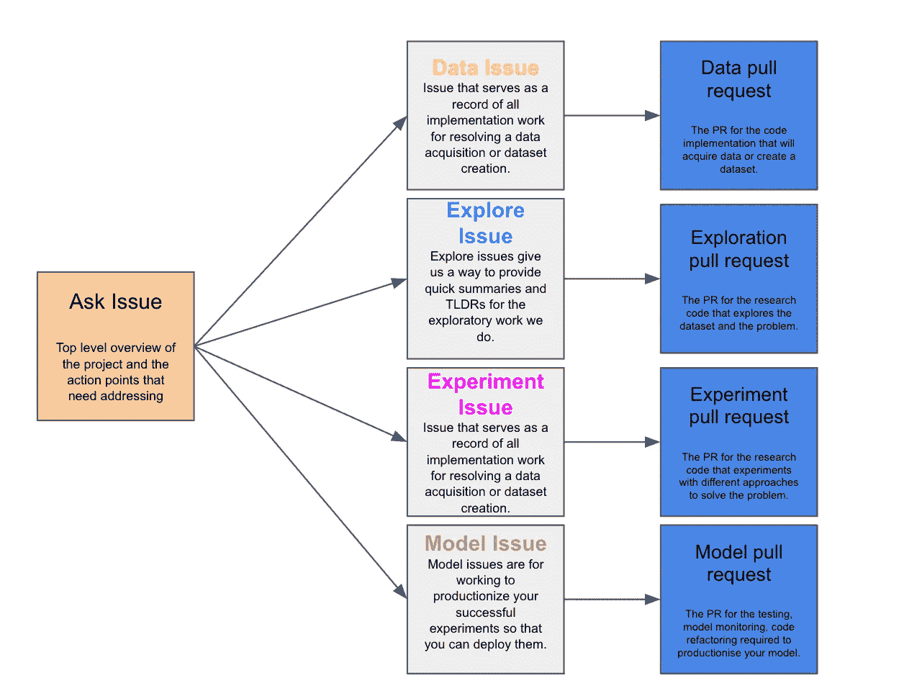

# DSLP——改变我团队的数据显示科学项目管理框架

> 原文：[`towardsdatascience.com/dslp-the-data-science-project-management-framework-that-transformed-my-team-1b6727d009aa?source=collection_archive---------1-----------------------#2024-08-28`](https://towardsdatascience.com/dslp-the-data-science-project-management-framework-that-transformed-my-team-1b6727d009aa?source=collection_archive---------1-----------------------#2024-08-28)

## 这是目前为止最适合数据科学的框架。无论是为你的团队还是仅仅为自己使用，它都非常有效。以下是我如何使用它的。

 [Benjamin Lee](https://medium.com/@bl3e967?source=post_page---byline--1b6727d009aa--------------------------------)

·发表于[数据科学前沿](https://towardsdatascience.com/?source=post_page---byline--1b6727d009aa--------------------------------)·阅读时间 16 分钟·2024 年 8 月 28 日

--

> 虽然软件工程实践要求创建问题以适应变化的客户需求，但我们需要能够适应由我们自己研究所推动的变化需求的实践。

# 目录

+   **你可能已经尝试过敏捷方法……**

+   **为什么敏捷方法不适用于数据科学……**

+   **数据科学生命周期过程（DSLP）**

+   **DSL 的五个步骤**

+   **示例项目：检测信用卡欺诈**

+   **新项目——创建一个问题请求**

+   **探索数据——数据问题**

+   **这种布局导致了传统的敏捷项目**

+   **适合数据科学的看板**

+   **结论**

# 你可能已经尝试过敏捷方法……
