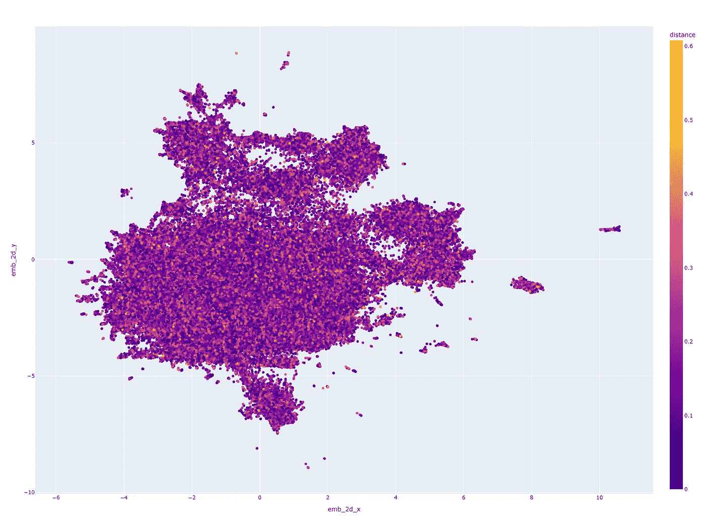

# 使用 GenAI 进行重复检测

> 原文：[`towardsdatascience.com/duplicate-detection-with-genai-ba2b4f7845e7?source=collection_archive---------1-----------------------#2024-07-01`](https://towardsdatascience.com/duplicate-detection-with-genai-ba2b4f7845e7?source=collection_archive---------1-----------------------#2024-07-01)

## 如何利用 LLM 和 GenAI 技术改进去重

 [Ian Ormesher](https://medium.com/@ianormy?source=post_page---byline--ba2b4f7845e7--------------------------------)

·发布于 [Towards Data Science](https://towardsdatascience.com/?source=post_page---byline--ba2b4f7845e7--------------------------------) ·阅读时间 5 分钟·2024 年 7 月 1 日

--

2D UMAP Musicbrainz 200K 最近邻图

客户数据通常作为记录存储在客户关系管理系统（CRM）中。数据由一个或多个用户随着时间的推移手动输入到这些系统中，导致数据复制、部分重复或模糊重复。这意味着对于客户、联系人、账户等，已经不再有一个单一的真实数据来源。没有唯一的 CRM 记录与目标客户之间的映射，下游的业务流程会变得越来越复杂和难以操作。目前用于检测和去重记录的方法使用的是传统的自然语言处理技术，称为实体匹配（Entity Matching）。但可以利用大型语言模型（LLM）和生成式 AI 的最新进展，显著改善重复记录的识别和修复。在常见的基准数据集上，我发现我的方法使数据去重准确率从传统 NLP 技术的 30%提升到接近 60%。

我希望在这里解释这一技术，期望其他人能发现它的帮助并用它来解决他们自己的去重需求。它对其他场景也很有用，比如你希望识别重复记录，而不仅仅是客户数据。我还撰写并发布了一篇关于这个话题的研究论文，如果你想深入了解，可以在 Arxiv 上查看：

 [## 使用 GenAI 进行重复检测

### 客户数据通常作为记录存储在客户关系管理系统（CRM）中。通过手动输入的数据…

[arxiv.org](https://arxiv.org/abs/2406.15483?source=post_page-----ba2b4f7845e7--------------------------------)

# 传统方法

识别重复记录的任务通常通过逐对记录比较来完成，称为“实体匹配”（EM）。这一过程的典型步骤如下：

+   数据准备

+   候选生成

+   阻塞

+   匹配

+   聚类

## 数据准备

数据准备是对数据进行清理，包括去除非 ASCII 字符、大小写转换和分词等。这是一个重要且必要的步骤，为后续的 NLP 匹配算法提供支持，因为这些算法处理不同的大小写或非 ASCII 字符时效果不好。

## 候选生成

在常规的 EM 方法中，我们会通过将表中的所有记录与自身结合，产生一个笛卡尔积。然后会去除所有与自身的组合。对于许多 NLP 匹配算法来说，将行 A 与行 B 进行比较等同于将行 B 与行 A 进行比较。在这种情况下，可以只保留其中一对。但是，即便如此，仍然会剩下很多候选记录。为了减少这个数量，通常会使用一种叫做“阻塞”的技术。

## 阻塞

阻塞的思想是排除那些我们知道不可能是彼此重复的记录，因为它们在“阻塞”列上具有不同的值。例如，如果我们考虑的是客户记录，那么一个潜在的阻塞列可能是“城市”。这是因为我们知道即使记录的其他所有细节足够相似，如果它们位于不同的城市，也不能是同一个客户。生成候选记录后，我们使用阻塞来排除那些在阻塞列上有不同值的记录。

## 匹配

在阻塞之后，我们现在检查所有候选记录，并使用来自两行的字段计算传统的基于相似性的 NLP 属性值度量。利用这些度量，我们可以确定是否存在潜在的匹配或不匹配。

## 聚类

现在我们已经有了一个匹配的候选记录列表，我们可以将它们分组到不同的簇中。

# 提议的方法

提议的方法有几个步骤，但最重要的一点是，我们不再需要执行传统方法中的“数据准备”或“候选生成”步骤。新的步骤变为：

+   创建匹配句子

+   创建匹配句子的嵌入向量

+   聚类

## 创建匹配句子

首先，通过将我们感兴趣的属性连接起来，并用空格分隔它们，创建一个“匹配句子”。举个例子，假设我们有一个客户记录，格式如下：

我们将通过将 name1、name2、name3、地址和城市属性用空格连接来创建一个“匹配句子”，得到如下内容：

> “John Hartley Smith 20 Main Street London”

## 创建嵌入向量

一旦我们的“匹配句子”被创建，它就会通过我们选择的嵌入模型编码到向量空间中。这是通过使用“[Sentence Transformers](https://huggingface.co/sentence-transformers/)”实现的。这个编码的输出将是一个具有预定义维度的浮点向量。这些维度与所使用的嵌入模型相关。我使用了 [all-mpnet-base-v2](https://huggingface.co/sentence-transformers/all-mpnet-base-v2/) 嵌入模型，它的向量空间有 768 个维度。这个嵌入向量随后会附加到记录中。这对于所有记录都执行此操作。

## 聚类

一旦为所有记录计算了嵌入向量，下一步就是创建相似记录的簇。为此，我使用了 DBSCAN 技术。DBSCAN 的工作原理是首先选择一个随机记录，并使用距离度量找到与其相近的记录。我发现有 2 种不同的距离度量方法有效：

+   L2 范数距离

+   余弦相似度

对于每一个度量标准，你选择一个 epsilon 值作为阈值。所有在 epsilon 距离内且“blocked”列值相同的记录将被加入到这个簇中。一旦这个簇完成，另一个未访问的随机记录将被选中，并围绕它创建一个新的簇。这个过程将一直持续，直到所有记录都被访问过。

# 实验和结果

我在工作中使用这种方法识别客户数据中的重复记录，产生了一些非常不错的匹配。为了更加客观，我还使用了一个名为“Musicbrainz 200K”的基准数据集进行了实验。它产生了一些可量化的结果，相比标准的 NLP 技术有所改进。

## 可视化聚类

我为 Musicbrainz 200K 数据集生成了最近邻簇图，并使用 UMAP 降维算法将其渲染为 2D 图：

2D UMAP Musicbrainz 200K 最近邻图

## 资源

我创建了各种笔记本，帮助你们自己尝试这个方法：

 [## GitHub - ianormy/genai_duplicate_detection_paper: 伴随论文的资源和笔记本…

### 伴随《GenAI 重复检测》论文的资源和笔记本…

[github.com](https://github.com/ianormy/genai_duplicate_detection_paper?source=post_page-----ba2b4f7845e7--------------------------------)

1.  GenAI 重复检测论文: [[2406.15483] Duplicate Detection with GenAI](https://arxiv.org/abs/2406.15483)

1.  GitHub 资源: [`github.com/ianormy/genai_duplicate_detection_paper`](https://github.com/ianormy/genai_duplicate_detection_paper)

1.  all-mpnet-base-v2 嵌入模型: [`huggingface.co/sentence-transformers/all-mpnet-base-v2/`](https://huggingface.co/sentence-transformers/all-mpnet-base-v2/)

1.  句子转换器：[`huggingface.co/sentence-transformers/`](https://huggingface.co/sentence-transformers/)

1.  UMAP Python 包：[`pypi.org/project/umap-learn/`](https://pypi.org/project/umap-learn/)

1.  实体解析基准数据集：[`dbs.uni-leipzig.de/research/projects/benchmark-datasets-for-entity-resolution/`](https://dbs.uni-leipzig.de/research/projects/benchmark-datasets-for-entity-resolution/)

1.  Musicbrainz 200K 数据集：[`dbs.uni-leipzig.de/files/datasets/saeedi/musicbrainz-200-A01.csv.dapo`](https://dbs.uni-leipzig.de/files/datasets/saeedi/musicbrainz-200-A01.csv.dapo)
