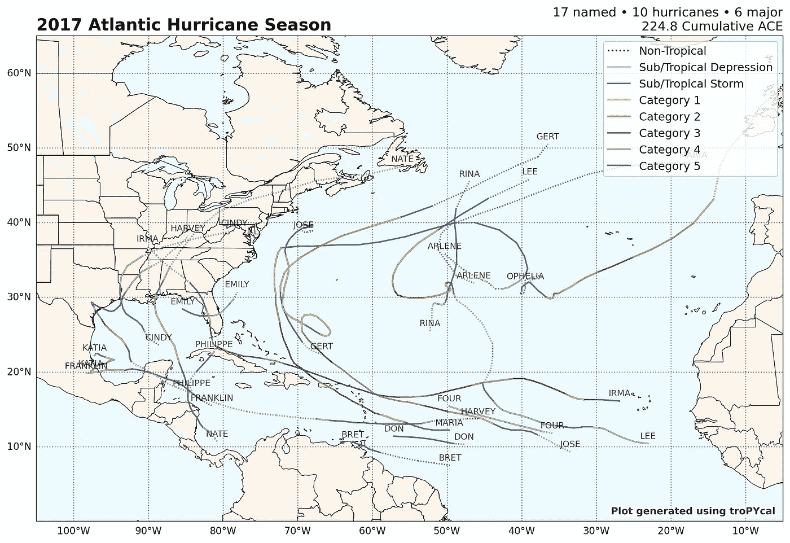
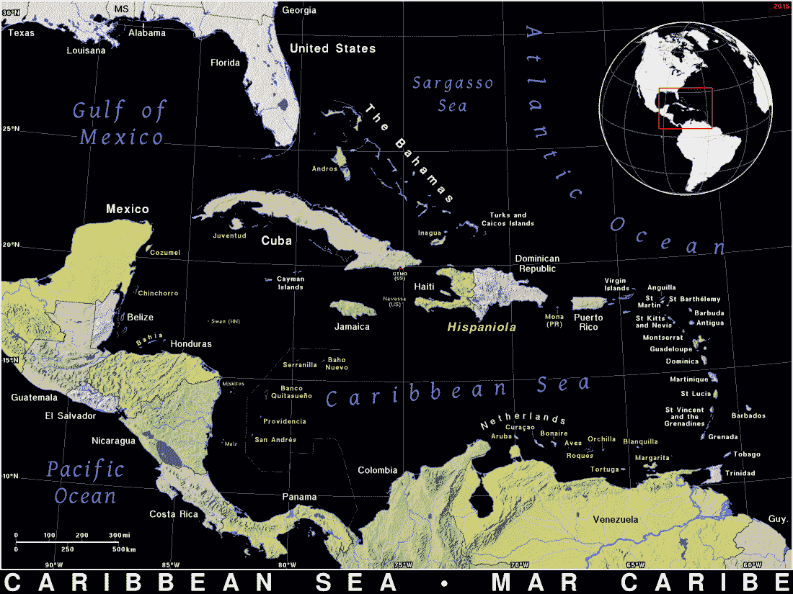

# 使用 Tropycal 轻松追踪飓风

> 原文：[`towardsdatascience.com/easy-hurricane-tracking-with-tropycal-4eaa9412382f?source=collection_archive---------7-----------------------#2024-11-06`](https://towardsdatascience.com/easy-hurricane-tracking-with-tropycal-4eaa9412382f?source=collection_archive---------7-----------------------#2024-11-06)

## 快速成功的数据科学

## 一个非常适合风暴分析的 Python 包

 [Lee Vaughan](https://medium.com/@lee_vaughan?source=post_page---byline--4eaa9412382f--------------------------------)

·发布于 [Towards Data Science](https://towardsdatascience.com/?source=post_page---byline--4eaa9412382f--------------------------------) ·阅读时间 7 分钟·2024 年 11 月 6 日

--

2017 年北大西洋飓风路径，按风暴类型着色（作者提供）

最近，一位朋友向我提出了一个有趣的请求：他希望帮助选择加勒比地区的春假度假目的地。他希望能帮助一个最近受飓风影响的地区，期望他的旅游消费能够促进该地区的复苏工作。当然，他希望避开受影响*太*近的地方，所以我们决定查看过去八年（2017-2024）内的飓风，并排除过去两年（2023-2024）内受影响的地区。

加勒比海（由 [Ian Macky](https://ian.macky.net/) 提供；[许可证](https://ian.macky.net/pat/license.html)）

当然，一个 AI 聊天机器人可以在几秒钟内完成这个任务，但我不打算轻易放弃，决定亲自使用 Python 进行分析。开源的飓风数据可以从多个来源轻松获得，包括：

+   **国家飓风中心（NHC）数据档案（HURDAT）**

+   **国际气候管理最佳轨迹档案（IBTrACS）**

+   **美国地质调查局（USGS）飓风数据**

+   **NOAA 大西洋海洋气象实验室**…
