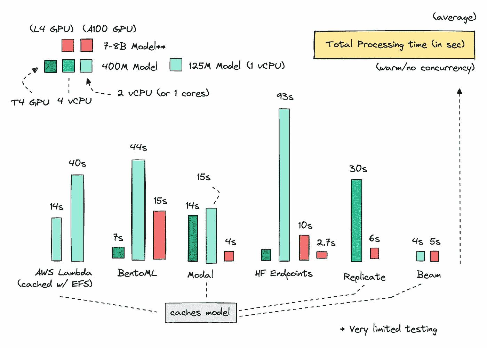
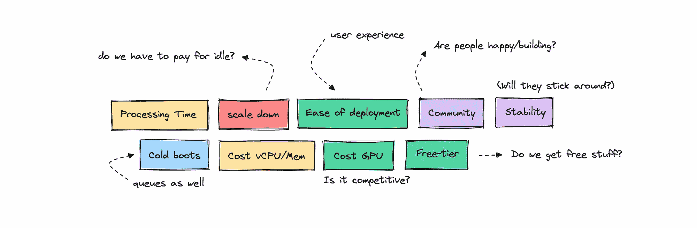

# 托管开源 LLMs 的经济学

> 原文：[`towardsdatascience.com/economics-of-hosting-open-source-llms-17b4ec4e7691?source=collection_archive---------0-----------------------#2024-11-12`](https://towardsdatascience.com/economics-of-hosting-open-source-llms-17b4ec4e7691?source=collection_archive---------0-----------------------#2024-11-12)

## 大型语言模型在生产中的应用

## 利用各种部署选项

 [Ida Silfverskiöld](https://medium.com/@ilsilfverskiold?source=post_page---byline--17b4ec4e7691--------------------------------)

·发表于[Towards Data Science](https://towardsdatascience.com/?source=post_page---byline--17b4ec4e7691--------------------------------) ·阅读时间 19 分钟·2024 年 11 月 12 日

--

GPU 与 CPU 上的总处理时间 — 非比例缩放* | 图片由作者提供

*如果你不是会员但想阅读本文，请查看这个朋友链接* [*这里。*](https://medium.com/@ilsilfverskiold/17b4ec4e7691?sk=2649166d7d7a839885bb3fff2a3922bd)

如果你已经在尝试不同规模的开源模型，你可能会问自己：部署它们最有效的方式是什么？

**按需**和**无服务器提供商**之间的定价差异是什么？当有 LLM 服务平台时，真的值得与像 AWS 这样的玩家打交道吗？

我决定深入探讨这个话题，将 AWS 等云服务商与 Modal、BentoML、Replicate、Hugging Face Endpoints 和 Beam 等新兴替代方案进行比较。

我们将研究处理时间、冷启动延迟、CPU、内存和 GPU 成本等指标，以了解哪种方式最有效且经济。我们还将涵盖一些软性指标，如部署的难易程度、开发者体验和社区支持。

我们将查看的一些指标 | 图片由作者提供

我们将探讨一些使用案例，比如在 CPU 上部署**较小的模型**与在 GPU 上运行**70 亿到 80 亿参数的模型**的区别。
