# 使用 AI 编辑图片中的文字

> 原文：[`towardsdatascience.com/editing-text-in-images-with-ai-03dee75d8b9c?source=collection_archive---------5-----------------------#2024-02-18`](https://towardsdatascience.com/editing-text-in-images-with-ai-03dee75d8b9c?source=collection_archive---------5-----------------------#2024-02-18)

## 场景文本编辑的研究综述：STEFANN、SRNet、TextDiffuser、AnyText 等。

 [Julia Turc](https://medium.com/@turc.raluca?source=post_page---byline--03dee75d8b9c--------------------------------)

·发表于[Towards Data Science](https://towardsdatascience.com/?source=post_page---byline--03dee75d8b9c--------------------------------) ·13 分钟阅读·2024 年 2 月 18 日

--

如果你曾尝试过更改图片中的文字，你就会知道这并不简单。保持背景、纹理和阴影需要一份 Photoshop 许可证和辛苦获得的设计师技能。在下面的视频中，一位 Photoshop 专家花了 13 分钟时间修正海报中几个拼写错误，而这张海报的设计风格也并不复杂。好消息是——在人类不断追求 AGI 的过程中，我们也在构建一些实际生活中有用的 AI 模型。例如那些让我们能够以最小的努力编辑图片中文字的模型。

Photoshop 专家手动编辑一张 AI 生成的图片，将“午夜之城”正确拼写出来，花费了超过 13 分钟的时间。

自动更新图片中文字的任务正式被称为*场景文本编辑（STE）*。本文将描述 STE 模型架构是如何随着时间的发展而演变的，以及它们所解锁的能力。我们还将讨论它们的局限性和仍需完成的工作。对[GANs](https://arxiv.org/abs/1406.2661)和[扩散模型](https://jalammar.github.io/illustrated-stable-diffusion/)的先前了解会有所帮助，但不是严格必要的。

*免责声明：我是* [*Storia AI*](https://storia.ai/?utm_source=article&utm_medium=medium.com&utm_campaign=editing-text-in-images-with-ai)*的共同创始人，正在构建一个用于视觉编辑的 AI 助手。此文献综述是开发* [*Textify*](https://storia.ai/textify?utm_source=article&utm_medium=medium.com&utm_campaign=editing-text-in-images-with-ai)*功能的一部分，该功能允许用户无缝地修改图像中的文本。虽然 Textify 是闭源的，但我们开源了一个相关的库，* [*Detextify*](https://github.com/iuliaturc/detextify)*，它可以自动从图像集合中移除文本。*

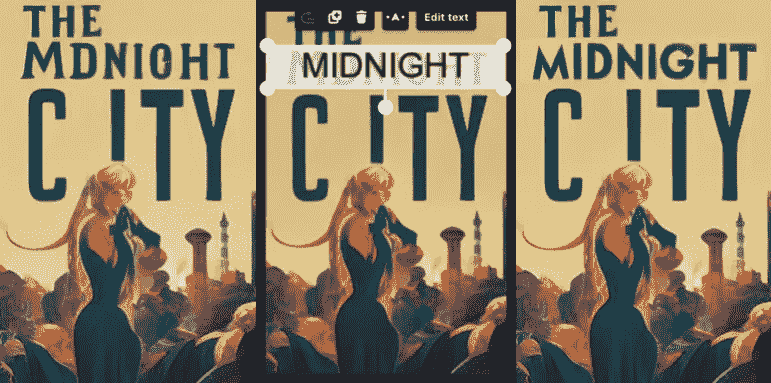

场景文本编辑（STE）示例。原始图像（左）是通过[Midjourney](https://midjourney.com)生成的。我们使用[Textify](https://storia.ai/textify?utm_source=article&utm_medium=medium.com&utm_campaign=editing-text-in-images-with-ai)对图像进行了注释（中），并自动修正了拼写错误（右）。

# 场景文本编辑（STE）任务

## 定义

场景文本编辑（STE）是指自动修改捕捉到视觉场景的图像中的文本（与主要包含文本的图像，如扫描文档不同）。目标是在不需要昂贵人工劳动的情况下，改变文本内容，同时保持原始的美学效果（如排版、书法、背景等）。

## 使用案例

场景文本编辑可能看起来像是一个人为的任务，但实际上它有多个实际应用场景：

**(1) 场景文本识别（STR）的合成数据生成**

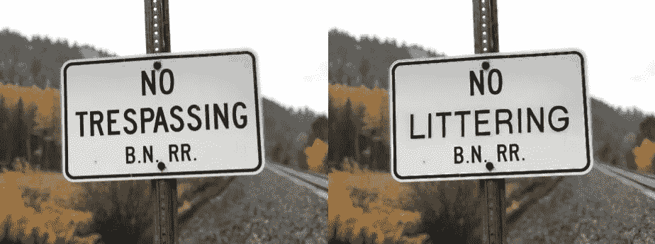

通过编辑原始图像（左，来自[Unsplash](https://unsplash.com/photos/no-trespassing-bn-rr-sign-i5O8-90L2P8)）中的文本获得的合成图像（右）。该技术可用于增强场景文本识别（STR）模型的训练集。

当我开始研究这个任务时，我惊讶地发现[阿里巴巴](https://www.alibaba.com/)（一个电子商务平台）和[百度](https://www.baidu.com/)（一个搜索引擎）一直在持续发布关于场景文本编辑（STE）的研究。

至少在阿里巴巴的案例中，他们的研究可能是为了支持[AMAP](https://www.alibabagroup.com/en-US/about-alibaba-businesses-1496655358913937408)，这是他们的谷歌地图替代品[[source](https://www.alibabacloud.com/blog/evolution-of-text-recognition-in-amap-data-production_596817)]。为了绘制世界地图，你需要一个强大的文本识别系统，它能够在各种字体下读取交通和街道标志，并能在现实世界的各种条件下，如遮挡或几何失真，甚至多语言环境中识别。

为了构建一个场景文本识别的训练集，可以收集现实世界的数据并由人工进行标注。但这种方法受到人工劳动的瓶颈，且可能无法保证数据的多样性。相反，合成数据生成提供了几乎无限的多样化数据源，并带有自动标签。

**(2) 对 AI 生成图像的控制**

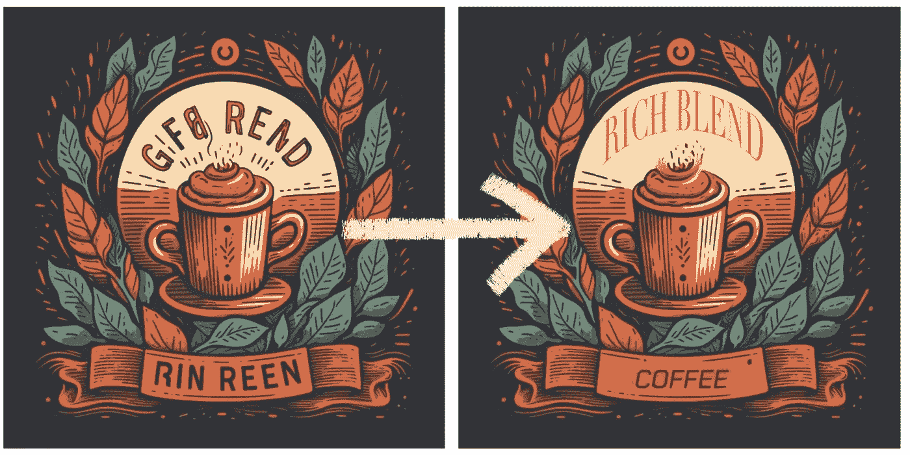

通过 Midjourney 生成的 AI 图像（左）并通过场景文本编辑进行修正。

类似于[Midjourney](http://midjourney.com)、[Stability](http://stability.ai)和[Leonardo](http://leonardo.ai)的 AI 图像生成器已经使视觉资产的创建民主化。小企业主和社交媒体营销人员现在可以通过简单地输入文本提示来创建图像，而无需艺术家或设计师的帮助。然而，文本到图像的模式缺乏在概念艺术之外的实际资产所需的可控性——如活动海报、广告或社交媒体帖子。

这些资产通常需要包含文本信息（如日期和时间、联系方式或公司名称）。拼写正确一直是文本到图像模型的一个难点，尽管最近有了进展——[DeepFloyd IF](https://github.com/deep-floyd/IF?tab=readme-ov-file)、[Midjourney v6](https://www.reddit.com/r/midjourney/comments/18p1jwp/midjourney_v6_can_now_do_text/)。但即使这些模型最终学会了完美拼写，文本到图像界面的用户体验约束依然存在。用文字描述文本放置的位置和方式仍然很繁琐。

**(3) 视觉媒体的自动本地化**

电影和游戏常常需要进行不同地区的本地化。这有时可能意味着[将西兰花换成青椒](https://www.slashfilm.com/727914/why-inside-out-changed-so-many-scenes-for-its-overseas-release/)，但大多数时候则需要翻译屏幕上可见的文本。随着电影和游戏行业的其他方面开始实现自动化（如[配音和口型同步](https://flawlessai.com)），没有理由让视觉文本编辑仍然保持手动操作。

# 架构时间线：从 GAN 到扩散模型

用于场景文本编辑的训练技术和模型架构在很大程度上跟随了图像生成这一更大任务的趋势。

## GAN 时代（2019–2021）

[GANs](https://arxiv.org/abs/1406.2661)（生成对抗网络）在 2010 年代中期主导了图像生成任务。GAN 指的是一种特定的训练框架（而不是规定模型架构），其本质上是对抗性的。一个*生成器*模型被训练来捕捉数据分布（从而具备*生成*新数据的能力），而一个*判别器*则被训练来区分生成器输出与真实数据。在训练过程中，当判别器的猜测接近于随机抛硬币时，训练过程即完成。在推理阶段，判别器被丢弃。

GAN 特别适合用于图像生成，因为它们可以执行无监督学习——也就是说，学习数据分布而无需标记数据。沿着图像生成的总体趋势，最初的场景文本编辑模型也采用了 GAN。

## GAN 第 1 轮：字符级编辑——STEFANN

> [STEFANN](https://arxiv.org/pdf/1903.01192.pdf)，被认为是首个修改场景图像中文本的工作，操作的是字符级别。字符编辑问题被分为两部分：字体适应和颜色适应。

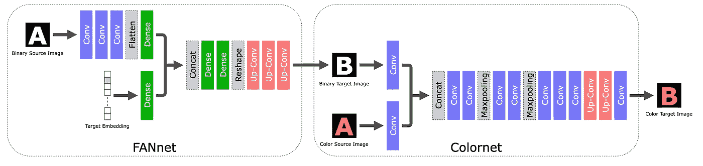

[**STEFANN**](https://arxiv.org/pdf/1903.01192.pdf)模型架构（[来源](https://prasunroy.github.io/stefann/)）。字符编辑任务被分为两部分：FANnet（字体适应网络）生成所需形状的黑白目标字符，Colornet 则填充合适的颜色。

[STEFANN](https://arxiv.org/pdf/1903.01192.pdf)被认为是首个修改场景图像中文本的工作。它基于先前的*字体合成*（即创建与输入数据中观察到的字体或文本风格相似的新字体或文本样式）工作，并增加了一个约束，即输出需要无缝地融合回原始图像。与之前的工作相比，STEFANN 采用纯机器学习方法（而非例如显式的几何建模），且不依赖于字符识别来标注源字符。

STEFANN 模型架构基于[CNN](https://en.wikipedia.org/wiki/Convolutional_neural_network)（卷积神经网络），并将问题分解为（1）通过 FANnet 进行*字体适应*——将源字符的二值化版本转换为目标字符的二值化版本，（2）通过 Colornet 进行*颜色适应*——将 FANnet 的输出着色，以匹配图像中其余文本的颜色，以及（3）*字符放置*——使用已建立的技术，如[修补](https://www.olivier-augereau.com/docs/2004JGraphToolsTelea.pdf)和[接缝雕刻](https://perso.crans.org/frenoy/matlab2012/seamcarving.pdf)，将目标字符融合回原始图像。前两个模块是通过 GAN 目标训练的。

官方 STEFANN 演示由其作者制作。

尽管 STEFANN 为场景文本编辑开辟了道路，但它在实际应用中存在多项限制。它一次只能操作一个字符；修改整个单词需要多次调用（每个字母一次），并且要求目标单词与源单词具有相同的长度。此外，步骤（3）中的字符放置算法假设字符之间不重叠。

## GAN 第 2 轮：词级编辑——SRNet 和 3 模块网络

> [**SRNet**](https://arxiv.org/abs/1908.03047)是首个在**词级别**进行场景文本编辑的模型。SRNet 将 STE 任务分解为三个（联合训练的）模块：文本转换、背景修复和融合。

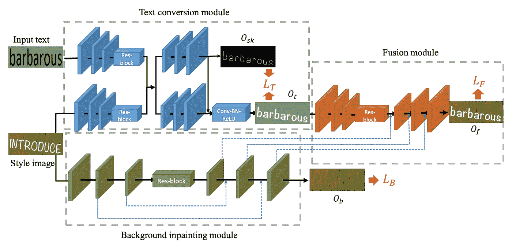

[**SRNet**](https://arxiv.org/abs/1908.03047)模型架构。三个模块将 STE 问题分解成更小的构建块（文本转换、背景修复和融合），并在联合训练的过程中进行优化。这个架构被该领域的后续工作广泛采用。

[SRNet](https://arxiv.org/abs/1908.03047)是第一个在词级别上执行场景文本编辑的模型。SRNet 将 STE 任务分解为三个（联合训练的）模块：

1.  **文本转换模块**（蓝色部分）接收目标文本的程序化渲染（如上图中的“barbarous”），并旨在将其以与输入单词（“introduce”）相同的字体在纯背景上渲染出来。

1.  **背景修复模块**（绿色部分）从输入图像中去除文本，并填补空白，重建原始背景。

1.  **融合模块**（橙色部分）将渲染的目标文本粘贴到背景上。

**SRNet 架构。** 三个模块都是全卷积网络（FCNs）的变体，其中背景修复模块特别类似于[U-Net](https://arxiv.org/abs/1505.04597)（一种具有特定属性的 FCN，编码器层与解码器层之间有跳跃连接，且大小相同）。

**SRNet 训练。** 每个模块都有自己的损失函数，网络是通过损失总和(*LT + LB + LF*)进行联合训练的，其中后两个损失通过 GAN 进行训练。虽然这种模块化概念上非常优雅，但也带来了需要配对训练数据的缺点，每个中间步骤都需要监督。实际上，这只能通过人工数据来实现。对于每个数据点，随机选择一张图像（来自像[COCO](https://cocodataset.org/#home)这样的数据集），从字典中选择两个任意单词，并用任意字体渲染它们，以模拟“前后”图像。因此，训练集不包含任何照片级真实的示例（尽管它可以在一定程度上超越渲染字体进行泛化）。

**荣誉提及。** [SwapText](https://arxiv.org/abs/2003.08152)采用了相同的基于 GAN 的三模块网络方法进行场景文本编辑，并对文本转换模块提出了改进。

## GAN Epoch #3: 自监督和混合网络

**跃迁到自监督学习。** STE 研究的下一个跃迁是采用自监督训练方法，在这种方法中，模型在未配对的数据上进行训练（即仅包含文本的图像库）。为了实现这一点，需要去除依赖标签的中间损失 LT 和 LB。由于 GANs 的设计，剩下的最终损失也不需要标签；模型只是根据*鉴别器*区分真实图像和由*生成器*产生的图像的能力进行训练。[TextStyleBrush](https://arxiv.org/abs/2106.08385) 在 STE 的自监督训练方面开创了先河，而 [RewriteNet](https://arxiv.org/pdf/2107.11041.pdf) 和 [MOSTEL](https://arxiv.org/abs/2212.01982) 通过两阶段训练充分发挥了两者的优势：一阶段为监督学习（优势：合成标签数据的丰富性），另一阶段为自监督学习（优势：自然无标签数据的真实性）。

**解耦文本内容与风格。** 为了去除中间损失，[TextStyleBrush](https://arxiv.org/abs/2106.08385) 和 [RewriteNet](https://arxiv.org/pdf/2107.11041.pdf) 将问题重新定义为解耦*文本内容*与*文本风格*。再强调一次，STE 系统的输入包括（a）包含原始文本的图像和（b）所需的文本——更具体地说，是在白色或灰色背景上使用固定字体（如 Arial）渲染的所需文本。目标是将（a）中的*风格*与（b）中的*内容*结合起来。换句话说，我们互补地旨在丢弃（a）中的*内容*和（b）中的*风格*。这就是为什么在给定图像中需要将文本*内容*与*风格*解耦的原因。

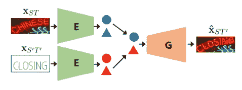

[**RewriteNet**](https://arxiv.org/pdf/2107.11041.pdf) 的推理架构。编码器 E 将文本风格（圆形）和文本内容（三角形）解耦。来自原始图像的风格嵌入和来自文本渲染的内容嵌入被送入生成器，生成器将二者融合成输出图像。

**TextStyleBrush 以及为什么 GANs 逐渐不再流行**。虽然将文本内容与风格解耦的想法很简单，但在实践中实现这一点需要复杂的架构。[TextStyleBrush](https://arxiv.org/abs/2106.08385)，该领域最著名的论文，使用了不少于*七个*联合训练的子网络，一个预训练的字体分类器，一个预训练的 OCR 模型和多个损失函数。设计这样的系统一定非常昂贵，因为所有这些组件都需要进行消融研究来确定它们的效果。再加上 GANs [众所周知难以训练](https://machinelearningmastery.com/how-to-train-stable-generative-adversarial-networks/)（理论上，生成器和鉴别器需要达到纳什均衡），这使得 STE 研究人员在扩散模型证明非常适合图像生成后，迫不及待地希望转向扩散模型。

## 扩散时代（2022 — 至今）

2022 年初，图像生成领域从 GANs 转向了[潜在扩散模型](https://arxiv.org/abs/2112.10752)（LDM）。这里不涉及 LDM 的详细解释，但你可以参考[The Illustrated Stable Diffusion](https://jalammar.github.io/illustrated-stable-diffusion/)进行出色的教程。在这里，我将重点介绍与场景文本编辑任务最相关的 LDM 架构部分。

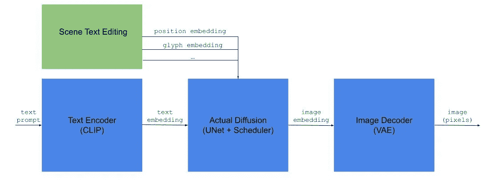

基于扩散的场景文本编辑。除了在标准文本到图像模型中传递给实际扩散模块的文本嵌入，STE 架构还创建反映目标文本（位置、形状、样式等）所需属性的嵌入。作者插图。

如上所示，基于 LDM 的文本生成图像模型有三个主要组件：(1) 一个文本编码器——通常是[CLIP](http://CLIP)，(2) 实际的扩散模块——将文本嵌入转换为潜在空间中的图像嵌入，(3) 一个图像解码器——将潜在图像放大为完整尺寸的图像。

## 场景文本编辑作为扩散图像修补任务

文本到图像并不是扩散模型支持的唯一范式。毕竟，[CLIP](http://CLIP)同样是一个文本*和*图像编码器，因此传递给*图像信息创作者*模块的嵌入也可以编码图像。实际上，它可以编码任何模态，或者多个输入的拼接。

这就是**修补**的原理，即根据给定的指令，只修改输入图像的一个子区域，并使其与图像的其他部分看起来协调一致。*图像信息创作者*摄取一个编码，该编码包含输入图像、需要修补区域的掩模和文本指令。

场景文本编辑可以看作是修补的一个专门化形式。大多数 STE 研究都归结为以下问题：*我们如何用有关任务的附加信息（即原始图像、期望文本及其位置等）来增强文本嵌入？* 正式来说，这被称为**条件性引导**。

归入这一类别的研究论文（[TextDiffuser](https://arxiv.org/abs/2305.10855)，[TextDiffuser 2](https://arxiv.org/abs/2311.16465)，[GlyphDraw](https://arxiv.org/abs/2303.17870)，[AnyText](https://arxiv.org/abs/2311.03054)等）提出了各种形式的条件性引导。

## 位置信息引导

显然，需要一种方法来指定*在哪里*对原始图像进行更改。这可以是文本指令（例如“更改底部的标题”）、文本行的细粒度指示，或者每个目标字符的更精细的位置信息。

**通过图像掩码的位置信息**。指示所需文本位置的一种方式是通过灰度掩码图像，然后可以通过 CLIP 或其他图像编码器将其编码到潜在空间中。例如，[DiffUTE](https://arxiv.org/pdf/2305.10825.pdf)模型仅使用一张黑色图像，其中有一条白色条带指示所需的文本位置。

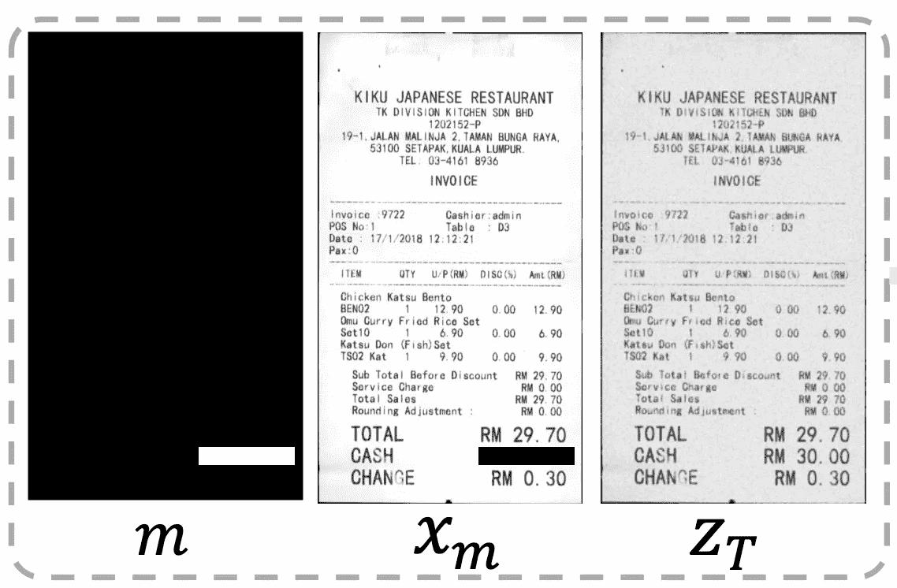

输入到[DiffUTE](https://arxiv.org/pdf/2305.10825.pdf)模型。位置指导通过掩码 m 和被掩盖的输入 xm 实现。这些是基于用户输入以确定的方式渲染的。

[TextDiffuser](https://arxiv.org/pdf/2305.10855.pdf)生成字符级分割掩码：首先，它大致渲染所需文本的位置（白色背景上的黑色文本，字体为 Arial），然后将此渲染结果传递给分割器，以获得一个灰度图像，其中包含每个字符的单独边界框。该分割器是一个[U-Net](https://arxiv.org/abs/1505.04597)模型，单独于主网络进行训练，使用了 400 万的合成实例。

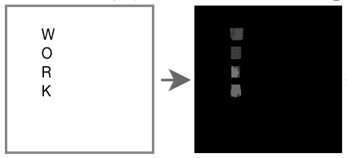

[TextDiffuser](https://arxiv.org/pdf/2305.10855.pdf)使用的字符级分割掩码。目标词（“WORK”）以标准字体在白色背景上渲染，然后通过分割器（U-Net）得到灰度掩码。

**通过语言建模的位置信息**。在[A Unified Sequence Inference for Vision Tasks](https://arxiv.org/abs/2206.07669)中，作者展示了大型语言模型（LLM）通过简单地生成数值令牌，可以有效地描述图像中物体的位置。可以说，这是一个反直觉的发现。由于 LLM 是基于统计频率学习语言的（即通过观察令牌在相同上下文中出现的频率），人们可能认为它们生成正确的数值令牌是不现实的。但是，当前 LLM 的巨大规模往往超出了我们的预期。

[TextDiffuser 2](https://arxiv.org/pdf/2311.16465.pdf)以一种有趣的方式利用了这一发现。它们在一个由<文本，OCR 检测>对组成的合成语料库上微调 LLM，教它生成文本边界框的左上角和右下角坐标，如下图所示。值得注意的是，它们决定为文本*行*生成边界框（而不是*字符*），从而为图像生成器提供更多灵活性。它们还进行了一个有趣的消融实验，使用单个点来编码文本位置（无论是左上角还是框的中心），但观察到拼写表现较差——当模型没有明确告知文本应如何结束时，它经常会生成多余的字符。

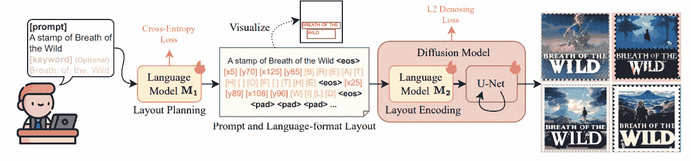

[**TextDiffuser 2**](https://arxiv.org/pdf/2311.16465.pdf)的架构。语言模型 M1 从用户获取目标文本，然后将其拆分成多行，并预测它们的位置，作为[x1] [y1] [x2] [y2]令牌。语言模型 M2 是 CLIP 的一个微调版本，它将修改后的提示（包括文本行及其位置）编码到潜在空间中。

## 字形引导

除了位置，另一个可以输入图像生成器的信息是*字符的形状*。有人可能会认为形状信息是多余的。毕竟，当我们提示文本到图像模型生成火烈鸟时，通常不需要传递关于它长腿或羽毛颜色的任何额外信息——模型应该已经从训练数据中学到了这些细节。然而，实际上，训练集（如 Stable Diffusion 的[LAION-5B](https://laion.ai/blog/laion-5b/)）主要由自然图像组成，其中文本的比例较低（非拉丁文字的比例更低）。

多项研究（[DiffUTE](https://arxiv.org/pdf/2305.10825.pdf)，[GlyphControl](https://arxiv.org/abs/2305.18259)，[GlyphDraw](http://GlyphDraw)，[GlyphDiffusion](https://arxiv.org/pdf/2304.12519.pdf)，[AnyText](https://arxiv.org/pdf/2311.03054.pdf)等）尝试通过显式的**字形引导**来弥补这种不平衡——有效地使用标准字体程序化呈现字形，然后将渲染的编码传递给图像生成器。有些方法只是将字形放置在附加图像的中央，有些则将字形放置在接近目标位置（让人想起[ControlNet](https://arxiv.org/abs/2302.05543)）。

## 通过扩散进行 STE 仍然很复杂

尽管扩散模型的训练过程比 GAN 更稳定，但特别是 STE 的扩散架构仍然相当复杂。下图展示了[AnyText](https://arxiv.org/pdf/2311.03054.pdf)的架构，其中包括（1）一个辅助潜在模块（包括上述讨论的位置和字形引导），（2）一个文本嵌入模块，其中包括需要预训练的 OCR 模块等组件，和（3）生成图像的标准扩散管道。很难说这在概念上比基于 GAN 的[TextStyleBrush](https://arxiv.org/abs/2106.08385)简单得多。

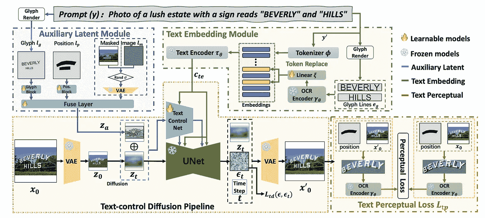

[**AnyText**](https://arxiv.org/pdf/2311.03054.pdf)的（复杂）架构**。**

# 场景文本编辑的未来

当现状过于复杂时，我们有一种天然的倾向，即继续工作，直到它收敛到一个清晰的解决方案。从某种意义上说，这正是自然语言处理领域发生的事情：计算语言学理论、语法、依存句法分析——所有这些都在 Transformer 面前崩溃，Transformer 提出了一个非常简单的陈述：*一个符号的意义依赖于其周围所有其他符号的意义。* 显然，场景文本编辑离这种清晰度还相差甚远。其架构包含许多共同训练的子网络、预训练组件，并且需要特定的训练数据。

文本到图像模型在特定方面（如拼写、字体多样性、字符的清晰度）会随着适当数量和质量的训练数据变得更好。但可控性问题将会存在很长时间。即使模型最终学会完全按照你的指示执行，文本到图像的范式可能仍然是一个不尽人意的用户体验——你是宁愿详细描述文本的位置、外观和感觉，还是宁愿仅仅画一个大致的框并从调色板中选择一个灵感颜色？

# 结语：防止滥用

生成式 AI 揭示了许多伦理问题，从著作权/版权/许可到真实性和虚假信息。虽然这些问题在我们的集体意识中显得十分重要，并以各种抽象的方式体现出来，但场景文本编辑的滥用则是切实而明显的——人们伪造文档。

在构建 [*Textify*](https://storia.ai/textify?utm_source=article&utm_medium=medium.com&utm_campaign=editing-text-in-images-with-ai) 时，我们见识过各种情况。有些人在 Instagram 截图中提高他们的粉丝数，有些人在 Strava 截图中提高他们的跑步速度。是的，有些人甚至试图伪造身份证、信用卡和文凭。临时的解决方法是为某些类型的文档构建分类器，并直接拒绝编辑这些文档，但从长远来看，生成式 AI 社区需要投资于自动化方式来确定文档的真实性，无论是文本片段、图像还是视频。
