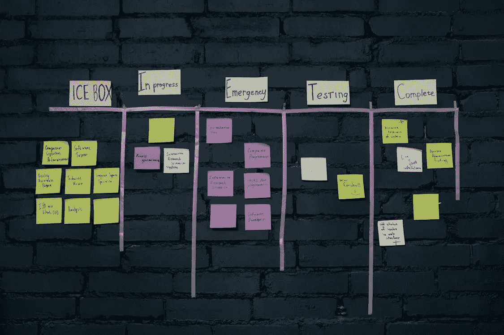
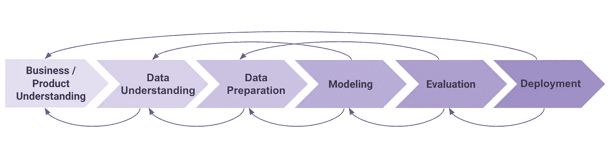

# 有效的管理机器学习项目的策略

> 原文：[`towardsdatascience.com/effective-strategies-for-managing-ml-initiatives-21c6f7432436?source=collection_archive---------8-----------------------#2024-06-04`](https://towardsdatascience.com/effective-strategies-for-managing-ml-initiatives-21c6f7432436?source=collection_archive---------8-----------------------#2024-06-04)

## 接受不确定性、合适的人才以及从数据中学习

 [Anna Via](https://annaviaba.medium.com/?source=post_page---byline--21c6f7432436--------------------------------)

·发布于 [Towards Data Science](https://towardsdatascience.com/?source=post_page---byline--21c6f7432436--------------------------------) ·6 分钟阅读·2024 年 6 月 4 日

--

图片来源：[Cottonbro](https://www.pexels.com/es-es/@cottonbro/)，来自[Pexels](https://www.pexels.com/)

*这篇博客文章是我去年在 GOTO 阿姆斯特丹会议上所做部分演讲的更新版本。该演讲也可以* [*在线观看*](https://www.youtube.com/watch?v=dFxFYukNmvE)*。*

通过机器学习产品项目提供价值和积极影响并非易事。造成这种复杂性的主要原因之一是，在为数字产品开发的机器学习项目中，有两个不确定性来源相交。首先，是与机器学习解决方案本身相关的不确定性（*我们能否以足够好的质量预测我们需要预测的内容？*）。其次，是与整个系统可能提供的影响相关的不确定性（*用户会喜欢这个新功能吗？它真的能解决我们试图解决的问题吗？*）。

所有这些不确定性意味着，在机器学习（ML）产品项目中，失败是相对常见的。然而，仍然有一些策略可以帮助管理并提高成功的概率（*或者至少让我们在面对失败时保持尊严生存下来！*）。从正确的起点开始 ML 项目至关重要。我在之前的一篇文章中讨论了这个领域的主要经验：从问题入手（并从一开始就定义预测如何使用），从小做起（如果可以，保持小规模），并优先考虑正确的数据（质量、数量、历史）。

 ## 从正确的起点开始 ML 产品项目

### 三大经验教训：问题、规模和数据

[towardsdatascience.com

然而，启动一个项目仅仅是开始。成功管理一个机器学习项目并在整个项目生命周期内提供积极影响的挑战将持续存在。在这篇文章中，我将分享我在机器学习项目中生存和成功的三大心得：

+   **接受不确定性**：创新、停顿、调整方向和失败。

+   **与合适的人为伍：**角色、技能、多样性，以及*人脉网络*。

+   **从数据中学习**：正确的方向、能够改进、发现失败并有应对计划。

# **接受不确定性**

> *提前规划机器学习项目并根据初步计划进行开发，真的很困难（甚至是不可能的！）*

最受欢迎的机器学习项目计划是***ML 生命周期***，它将机器学习项目的阶段分为业务理解、数据理解、数据准备、建模、评估和部署。尽管这些阶段通常被视为连续步骤，但在许多生命周期的表示中，你会看到箭头指向后方：在项目的任何阶段，你可能会学到一些东西，这迫使你回到前一个阶段。

机器学习生命周期（及其指向后方的箭头），图像来源：作者

这意味着项目的结束时间很难预知。例如，在评估阶段，你可能会通过模型可解释性技术意识到某个特征编码不当，这迫使你回到数据准备阶段。也可能发生模型无法达到你所需的预测质量，这可能迫使你回到业务理解阶段，从头开始重新定义项目和业务逻辑。

无论你在机器学习（ML）项目中扮演什么角色，关键是要意识到**事情不会按照计划进行**，从一开始就接受这种不确定性，并将其转化为你的优势。这对管理利益相关者（期望、信任）以及你自己和团队其他成员（动力、挫败感）都很重要。如何做到？

+   **避免过于雄心勃勃的时间或交付限制，**通过确保机器学习项目被看作它们真正的样子：需要探索未知的创新，具有高风险，但也有高回报和潜力。

+   **知道何时停止，**通过平衡每次增量改进的价值**（**机器学习模型总是可以改进的！）与其在时间、精力和机会成本方面的代价。

+   **准备好调整方向并接受失败，**通过不断利用项目带给你的学习和洞察，决定修改项目范围，甚至如果新的学习结果要求，就干脆终止项目。

# 与合适的人为伍

图片由[Fauxels](https://www.pexels.com/es-es/@fauxels/)提供，来源于[Pexels](https://www.pexels.com/)

> 每个项目都始于人。合适的人选、技能、视角的结合，以及一个能赋能你的网络。

曾几何时，机器学习（ML）模型仅限于数据科学家的笔记本电脑。如今，机器学习的真正潜力是在模型被部署并集成到公司流程中时得以实现。这意味着更多的人和技能需要合作，以使这一切成为可能（数据科学家、机器学习工程师、后端开发人员、数据工程师等）。

第一步是确定成功构建端到端机器学习解决方案所需的**技能和角色**。然而，成功所需的不仅仅是一个涵盖技能清单的角色组。拥有一个**多元化的团队**，能够带来不同的视角并能够同情不同的用户群体，已经被证明能够帮助团队改进工作方式，构建更好的解决方案（“[*为什么拥有一个多元化的团队能让你的产品更好*](https://open.nytimes.com/why-having-a-diverse-team-will-make-your-products-better-c73e7518f677)”）。

人们通常不会充分讨论这一点，但成功交付项目的关键人物远不止团队本身。我称这些人群体为“***网络***”。网络是你知道在特定领域非常擅长的人，是你在需要时可以信赖寻求帮助和建议的人，他们能帮助你和团队打破障碍、加速进程或赋能。网络可以是你的业务利益相关者、经理、技术人员、用户研究人员、其他团队的数据科学家、客户支持团队等……确保建立自己的网络，并识别出那个可以在每个特定情况下提供帮助的盟友。

# 从数据中学习

> 项目是一个持续的学习机会，许多时候，学习和洞察来源于检查正确的数据和监控。

在机器学习的各项工作中，有三个主要的指标和度量可以在学习和洞察方面带来巨大价值：模型性能监控、服务性能和最终影响监控。在之前的文章中，我深入探讨了这个话题。

 [## ML 系统监控：从服务性能到正向业务影响

### 对机器学习系统在生产环境中进行 360 度监控的方式

levelup.gitconnected.com](https://levelup.gitconnected.com/ml-systems-monitoring-from-service-performance-to-positive-business-impact-b40dbbd31927?source=post_page-----21c6f7432436--------------------------------)

在开发或部署机器学习（ML）解决方案时，检查正确的数据和监控是关键：

+   **确保朝着正确的方向前进：** 这包括从解决方案的正确设计或选择合适的特征，到了解是否需要调整方向甚至停止项目的多个方面。

+   **了解如何改进：** 了解是否达成了预期的结果目标（例如通过实验或 A/B 测试），深入分析哪些做得好，哪些没有做好，以及如何继续提供价值。

+   **及时发现失败并制定计划：** 以便快速响应问题，理想情况下是在它们影响业务之前。如果问题已经影响到业务，拥有正确的指标应该能让你理解失败背后的原因，保持事情在可控范围内，并制定前进的计划（同时维护利益相关者的信任）。

# 总结

从头到尾有效管理机器学习项目是一项复杂的任务，涉及多个维度。在这篇博文中，我分享了自己作为数据科学家以及最近作为机器学习产品经理的经验，阐述了我在处理机器学习项目时认为关键的因素：接受不确定性、与合适的人合作以及从数据中学习。

我希望这些见解能帮助你成功管理你的机器学习（ML）项目，并通过它们推动积极的影响。敬请期待更多关于机器学习与产品管理交集的文章 :)
