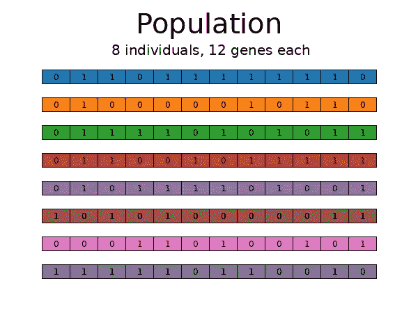
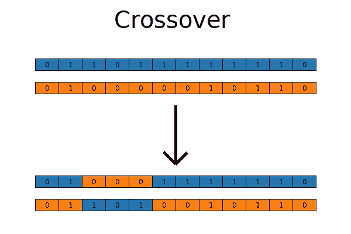
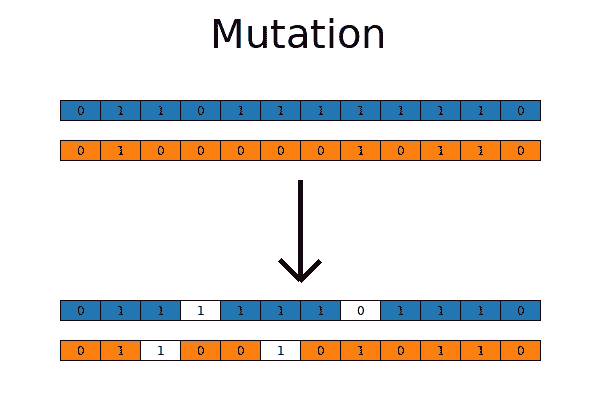
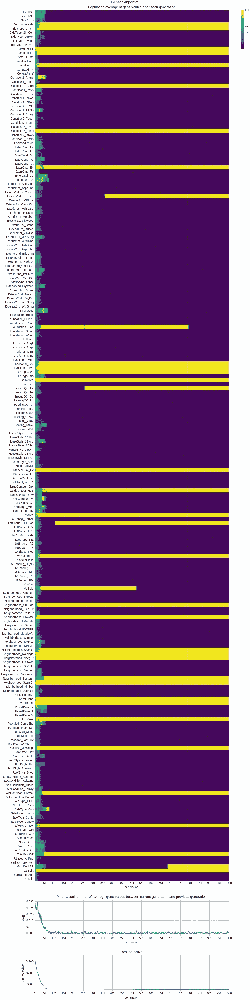

# 高效特征选择：基于遗传算法

> 原文：[`towardsdatascience.com/efficient-feature-selection-via-genetic-algorithms-d6d3c9aff274?source=collection_archive---------5-----------------------#2024-01-12`](https://towardsdatascience.com/efficient-feature-selection-via-genetic-algorithms-d6d3c9aff274?source=collection_archive---------5-----------------------#2024-01-12)

## 使用进化算法进行大数据集的快速特征选择

[](https://florin-andrei.medium.com/?source=post_page---byline--d6d3c9aff274--------------------------------)[](https://towardsdatascience.com/?source=post_page---byline--d6d3c9aff274--------------------------------) [Florin Andrei](https://florin-andrei.medium.com/?source=post_page---byline--d6d3c9aff274--------------------------------)

·发布于[Towards Data Science](https://towardsdatascience.com/?source=post_page---byline--d6d3c9aff274--------------------------------) ·8 分钟阅读·2024 年 1 月 12 日

--

*这是关于特征选择的两部分系列文章的最后一部分。阅读* *第一部分在这里**.*

简要回顾：在将模型拟合到数据集时，你可能希望选择特征的子集（而不是使用所有特征），原因有很多。但是即使你有一个明确的目标函数来搜索最佳特征组合，如果特征数量 N 非常大，搜索可能会花费很长时间。寻找最佳组合并不总是容易的。暴力搜索通常无法处理超过几十个特征的情况。需要启发式算法来执行更高效的搜索。

如果你有 N 个特征，你要寻找的是一个 N 长度的向量`[1, 1, 0, 0, 0, 1, ...]`，其中的值来自`{0, 1}`。每个向量分量对应一个特征。0 表示该特征被拒绝，1 表示该特征被选择。你需要找到那个最小化你使用的成本/目标函数的向量。

在上一篇文章中，我们介绍了一个经典算法——SFS（序列特征搜索），并将其与一种高效的进化算法 CMA-ES 进行了比较。我们从 Kaggle 的房价数据集开始，该数据集经过处理后包含 213 个特征和 1453 条观测数据。我们尝试拟合的模型是`statsmodels.api.OLS()`，目标函数是模型的 BIC——贝叶斯信息准则，它衡量信息损失。较低的 BIC 意味着更好的拟合，因此我们正在尝试最小化这个目标。

在本文中，我们将讨论另一种进化技术：遗传算法。背景（数据集、模型、目标）保持不变。

# 遗传算法 — Genetic Algorithms

遗传算法的灵感来源于生物进化和自然选择。在自然界中，生物体（宽泛地说）是根据那些有助于生存和繁殖成功的基因（特征）在其所处环境中的适应性被“选择”的。

现在想想特征选择。你有 N 个特征。你试图找到长度为 N 的二进制向量`[1, 0, 0, 1, 1, 1, ...]`，以选择特征（0 = 特征被排除，1 = 特征被包含），从而最小化成本/目标函数。

每个这样的向量可以看作是一个“个体”。每个向量的组成部分（值为 0 或 1）就是一个“基因”。通过合理地应用进化和选择，可能可以使一群个体进化，从而接近我们感兴趣的目标函数的最佳值。

简而言之，遗传算法是这样的。首先生成一个个体种群（向量），每个向量的长度为 N。向量的组成部分（基因）从{0, 1}中随机选择。在下图中，N=12，种群规模为 8。



遗传算法种群

在种群生成之后，通过目标函数评估每个个体。

现在进行选择：保留目标值最好的个体，淘汰那些目标值最差的个体。这里有许多可能的策略，从简单的排名选择（反直觉地，这种方法效果不佳）到随机锦标赛选择，这种方法在长期内非常高效。如果你记得探索与开发的困境，那么在遗传算法中，很容易陷入过于简单的开发陷阱，导致探索变慢。遗传算法的核心是探索。[这里有一份简短的选择技术列表](https://www.tutorialspoint.com/genetic_algorithms/genetic_algorithms_parent_selection.htm)，并且可以查看文末的链接获取更多信息。

一旦选择出最优的个体，并淘汰掉不适应的个体，就该通过两种技术：交叉和突变，引入基因池中的变异。

交叉的过程完全像自然界中的交配一样，两个生物体交配并产生后代：来自父母的遗传物质在后代中“混合”，并带有一定的随机性。



遗传算法交叉

突变再次发生时，基本上就像自然界中基因物质发生随机突变一样，新值被引入基因库，从而增加了基因库的多样性。



遗传算法突变

经过这一切，算法会回到循环：再次通过目标函数评估个体，进行选择，然后是交叉、突变等。

可以使用各种停止准则：如果目标函数在若干代中没有改善，循环可能会终止。或者你可以设置一个硬性停止条件来限制评估的代数。或者使用基于时间的停止，或者等待外部信号等。无论如何，目标值最好的个体应被认为是问题的解。

关于精英策略的几点说明：使用如锦标赛等随机选择技术时，代际中最优秀的个体可能会因为纯粹的偶然而被淘汰——这种情况不太可能，但确实会发生。精英策略绕过了这个问题，直接规定最优秀的个体必须生存下来，无论如何。精英策略是一种利用技巧。它可能会导致算法陷入局部极值，错失全局解。再说一遍，遗传算法的核心是探索。根据我有限的 GA 经验，似乎表明利用偏向对 GA 并不有利。但你可以根据自己的需求调整；如果你喜欢实验不同的算法变种，GA 为你提供了很多机会。

遗传算法有几个超参数可以调节：

+   种群大小（个体数量）

+   变异概率（每个个体，每个基因）

+   交叉概率

+   选择策略等

通过手动尝试不同超参数值来进行实验是找出最佳代码的一种方式。或者，你可以将 GA 封装在 Optuna 中，让 Optuna 找到最佳超参数——但这在计算上比较昂贵。

# 用于特征选择的遗传算法（GA），在代码中

这是一个可以用于特征选择的简单 GA 代码。它使用了[deap 库](https://github.com/DEAP/deap)，这个库非常强大，但学习曲线可能较陡。然而，这个简单版本应该足够清晰。

```py
# to maximize the objective
# fitness_weights = 1.0
# to minimize the objective
fitness_weights = -1.0

# copy the original dataframes into local copies, once
X_ga = X.copy()
y_ga = y.copy()

# 'const' (the first column) is not an actual feature, do not include it
X_features = X_ga.columns.to_list()[1:]

try:
    del creator.FitnessMax
    del creator.Individual
except Exception as e:
    pass

creator.create("FitnessMax", base.Fitness, weights=(fitness_weights,))
creator.create(
    "Individual", array.array, typecode='b', fitness=creator.FitnessMax
)

try:
    del toolbox
except Exception as e:
    pass

toolbox = base.Toolbox()
# Attribute generator
toolbox.register("attr_bool", random.randint, 0, 1)
# Structure initializers
toolbox.register(
    "individual",
    tools.initRepeat,
    creator.Individual,
    toolbox.attr_bool,
    len(X_features),
)
toolbox.register("population", tools.initRepeat, list, toolbox.individual)

def evalOneMax(individual):
    # objective function
    # create True/False selector list for features
    # and add True at the start for 'const'
    cols_select = [True] + [i == 1 for i in list(individual)]
    # fit model using the features selected from the individual
    lin_mod = sm.OLS(y_ga, X_ga.loc[:, cols_select], hasconst=True).fit()
    return (lin_mod.bic,)

toolbox.register("evaluate", evalOneMax)
toolbox.register("mate", tools.cxTwoPoint)
toolbox.register("mutate", tools.mutFlipBit, indpb=0.05)
toolbox.register("select", tools.selTournament, tournsize=3)

random.seed(0)
pop = toolbox.population(n=300)
hof = tools.HallOfFame(1)
pop, log = algorithms.eaSimple(
    pop, toolbox, cxpb=0.5, mutpb=0.2, ngen=10, halloffame=hof, verbose=True
)

best_individual_ga_small = list(hof[0])
best_features_ga_small = [
    X_features[i] for i, val in enumerate(best_individual_ga_small) if val == 1
]
best_objective_ga_small = (
    sm.OLS(y_ga, X_ga[['const'] + best_features_ga_small], hasconst=True)
    .fit()
    .bic
)
print(f'best objective: {best_objective_ga_small}')
print(f'best features:  {best_features_ga_small}')
```

代码创建了定义个体和整个种群的对象，并包含用于评估（目标函数）、交叉/配对、变异和选择的策略。它从一个 300 个体的种群开始，然后调用`eaSimple()`（一个简单的交叉、变异、选择序列），只运行 10 代，为了简化。定义了一个大小为 1 的名人堂，其中最优秀的个体被保存下来，避免在选择等过程中意外被变异或跳过。

名人堂不是精英策略。名人堂复制了种群中最优秀的个体，并只保留一个非活跃的副本在储存中。精英策略则会在每一代中保留最优秀的个体。

这个简单代码易于理解，但效率低下。查看[仓库](https://github.com/FlorinAndrei/fast_feature_selection)中的笔记本，那里有一个更复杂的 GA 代码版本，我不会在这里引用。不过，从笔记本中运行更复杂、优化过的代码，经过 1000 代，产生了这些结果：

```py
best objective:  33705.569572544795
best generation: 787
objective runs:  600525
time to best:    158.027 sec
```

再次提醒，任何特征选择前的基准 BIC 是：

```py
baseline BIC: 34570.166173470934
```

这里是完整的优化过的 GA 代码历史，从笔记本中运行，进行了 1000 代的演化，尝试寻找最佳特征。由左至右，热图显示了各特征在不同代中的受欢迎程度（色块越亮=越受欢迎）。你可以看到一些特征始终受到青睐，另一些特征很快就被淘汰，而其他特征则随着时间的推移可能会变得更受欢迎或逐渐失去关注。



GA 优化历史

# 方法比较

我们尝试了三种不同的技术：SFS、CMA-ES 和 GA。它们在找到最佳目标值以及所需时间方面如何比较？

这些测试是在一台配备 AMD Ryzen 7 5800X3D（8/16 核心）的机器上进行的，运行的是 Ubuntu 22.04 和 Python 3.11.7。SFS 和 GA 通过一个 16 个工作线程的多进程池运行目标函数。CMA-ES 是单进程的——尝试多进程运行时似乎没有显著提升，但我相信如果更多的工作集中在使算法并行化上，结果可能会有所不同。

这些是运行时间。对于 SFS 来说是总运行时间，对于 CMA-ES 和 GA 来说是达到最佳解的时间。时间越短越好。

```py
SFS:    42.448 sec
GA:     158.027 sec
CMA-ES: 48.326 sec
```

目标函数调用的次数——次数越少越好：

```py
SFS:    22791
GA:     600525
CMA-ES: 20000
```

相较于基准，目标函数找到的最佳值——值越小越好：

```py
baseline BIC: 34570.1662
SFS:          33708.9860
GA:           33705.5696
CMA-ES:       33703.0705
```

GA 能够在目标函数上击败 SFS，利用尽可能多的 CPU 核心运行目标函数，但它是最慢的。它调用目标函数的次数是其他方法的一个数量级以上。进一步的超参数优化可能会改善结果。

SFS 运行迅速（在所有 CPU 核心上运行），但其性能适中。它也是最简单的算法。

如果你只是想快速估算最佳特征集，使用简单算法，SFS 还不错。

另一方面，如果你追求最佳的目标值，CMA-ES 似乎是最好的选择。

*这是关于特征选择的两部分系列的最后一部分。阅读* *第一部分这里**。*

# 注意事项和链接

所有图像均由作者制作。

包含所有代码的代码库：[`github.com/FlorinAndrei/fast_feature_selection`](https://github.com/FlorinAndrei/fast_feature_selection)

房价数据集（MIT 许可证）：[`www.kaggle.com/c/house-prices-advanced-regression-techniques/data`](https://www.kaggle.com/c/house-prices-advanced-regression-techniques/data)

deap 库：[`github.com/DEAP/deap`](https://github.com/DEAP/deap)

一份免费的遗传算法教程：[`www.tutorialspoint.com/genetic_algorithms/index.htm`](https://www.tutorialspoint.com/genetic_algorithms/index.htm)
