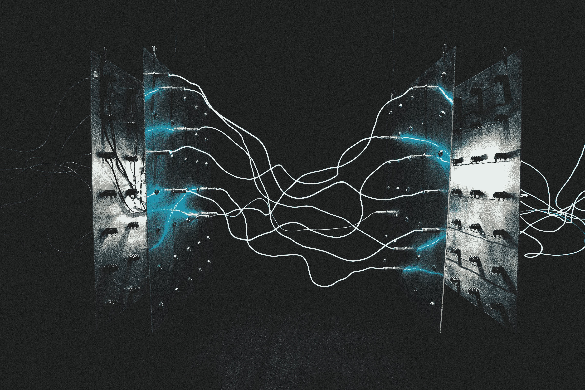
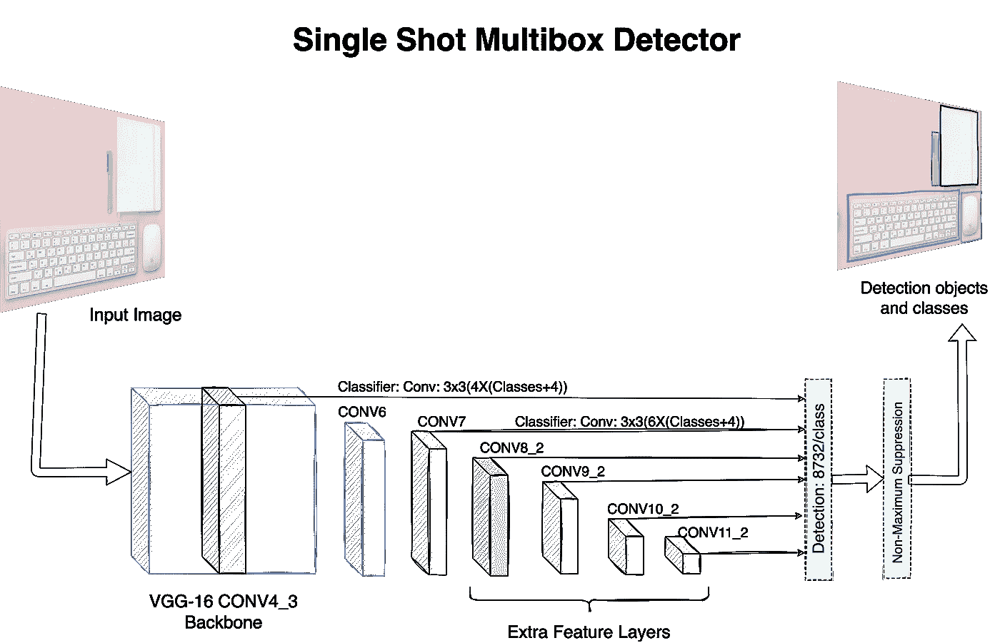
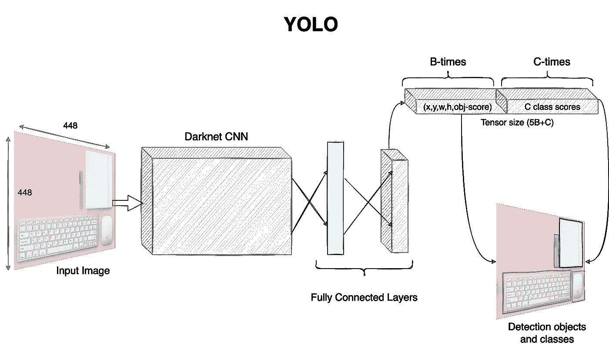
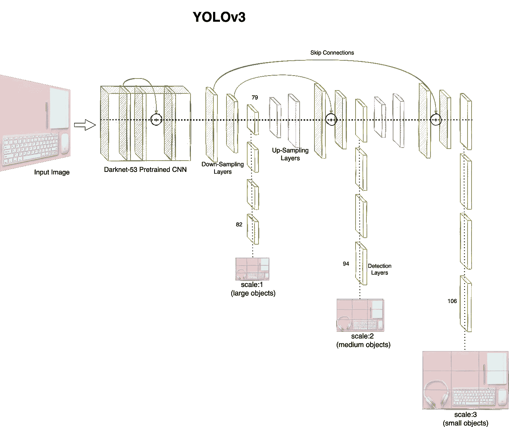

# 使用 SSD 和 YoLO 模型的高效目标检测——初学者综合指南（第三部分）

> 原文：[`towardsdatascience.com/efficient-object-detection-with-ssd-and-yolo-models-a-comprehensive-beginners-guide-part-3-2b0c720175d5?source=collection_archive---------6-----------------------#2024-03-08`](https://towardsdatascience.com/efficient-object-detection-with-ssd-and-yolo-models-a-comprehensive-beginners-guide-part-3-2b0c720175d5?source=collection_archive---------6-----------------------#2024-03-08)

## 了解单阶段目标检测模型及其不同的权衡

 [Raghav Bali](https://medium.com/@Rghv_Bali?source=post_page---byline--2b0c720175d5--------------------------------)

·发表于 [Towards Data Science](https://towardsdatascience.com/?source=post_page---byline--2b0c720175d5--------------------------------) ·阅读时间 7 分钟·2024 年 3 月 8 日

--

图片来源：[israel palacio](https://unsplash.com/@othentikisra?utm_source=medium&utm_medium=referral) 来自 [Unsplash](https://unsplash.com/?utm_source=medium&utm_medium=referral)

在这篇关于目标检测模型的初学者指南系列中，我们已经涵盖了[目标检测基础](https://medium.com/towards-data-science/object-detection-basics-a-comprehensive-beginners-guide-part-1-f57380c89b78)（第一部分）以及[基于 R-CNN 的目标检测模型](https://medium.com/towards-data-science/exploring-object-detection-with-r-cnn-models-a-comprehensive-beginners-guide-part-2-685bc89775e2)（第二部分）。在本文中，我们将重点介绍一些著名的**单阶段目标检测**模型。这些模型在推理速度上大大优于多阶段检测器，但在 mAP 和其他检测指标上稍显不足。让我们深入了解这些模型的细节。

# 单次多框检测器

[单次多框检测器（SSD）](https://arxiv.org/abs/1512.02325)架构由 Liu 等人于 2016 年提出，作为一种高性能的单阶段目标检测模型。该论文提出的模型在性能（mAP 方面）上与 Faster R-CNN 相当，但在训练和推理过程中速度要快得多。

R-CNN 家族与 SSD 之间的主要区别在于缺少区域提议组件（RPN）。SSD 系列模型并不从选择性搜索算法或 RPN 开始寻找 ROI。SSD 采用卷积方法来完成这一物体检测任务。它生成一个预定义数量的边界框及其对应的类别分数作为最终输出。它从一个大型的预训练网络（如 VGG-16）开始，在任何分类层开始之前就会被截断。这被称为 SSD 术语中的基础网络。基础网络后面跟着一个独特的辅助结构，用以生成所需的输出。以下是关键组件：

+   **多尺度特征图**：基础网络之后的辅助结构是一系列卷积层。这些层逐步减小特征图的尺度或分辨率。这样可以帮助检测不同大小（相对于图像）的物体。SSD 网络采用卷积方法来定义类别分数以及边界框的相对偏移值。例如，网络使用 3x3xp 大小的滤波器，在大小为 m x n x p 的特征图上进行操作，其中 p 是通道数。模型对 m x n 的每个单元格生成一个输出，滤波器应用于该位置。

+   **默认锚框**：网络利用一组预定义的锚框（具有不同的尺度和长宽比）。对于给定的大小为 m x n 的特征图，k 个此类默认锚框会应用于每个单元格。这些默认锚框在 SSD 中被称为先验框。对于每个单元格中的每个先验框，模型生成 c 个类别分数和 4 个边界框坐标。因此，对于一个大小为 m x n 的特征图，模型总共生成(c+4)kmn 个输出。这些输出是从网络不同深度的特征图中生成的，这是处理不同尺寸物体的一次性传递的关键。

图 1 展示了 SSD 的高层架构，其中基础网络为 VGG-16，后面跟着辅助卷积层，以支持多尺度特征图。

图 1：基于 VGG-16 的高层 SSD 架构。该架构展示了额外的特征层，用于检测不同大小的物体。来源：作者

如图 1 所示，模型生成了总共 8732 个预测，然后通过非最大抑制算法进行分析，最终为每个识别的物体得到一个边界框。在论文中，作者展示了两个变体 SSD-300 和 SSD-512 的性能指标（FPS 和 mAP），其中数字表示输入图像的大小。与 R-CNN 相比，两个变体都更快，并且在 mAP 方面表现相同，其中 SSD-300 比 SSD-512 有更高的 FPS。

正如我们刚才讨论的，SSD 在每个特征图上产生大量的输出。这会导致正负类之间的巨大不平衡（为了确保覆盖，假阳性的数量非常大）。为了解决这个问题以及其他一些细节，作者详细描述了*困难负样本挖掘*和*数据增强*等技术。我鼓励读者仔细阅读这篇精心撰写的论文，以获取更多细节。

# 你只看一次（YOLO）

2016 年，Redmon 等人在他们的论文《"[You Only Look Once: Unified, Real-time Object Detection](https://arxiv.org/abs/1506.02640)"》中提出了另一种流行的单阶段物体检测架构。这一架构大约与 SSD 同时出现，但采取了稍微不同的方式，通过单阶段模型来处理物体检测。就像 R-CNN 系列，YOLO 模型也随着时间的推移不断发展，后续版本在前一个版本的基础上有所改进。让我们首先了解这项工作的关键要点。

YOLO 的灵感来源于用于图像分类的*GoogleNet*架构。与 GoogleNet 类似，YOLO 使用了在 ImageNet 数据集上预训练的 24 层卷积层。预训练的网络使用 224x224 的训练图像，但训练完成后，模型会使用大小为 448x448 的重新缩放输入图像。这个重新缩放的做法是为了确保模型能够在不出现问题的情况下识别小物体和大物体。YOLO 首先将输入图像划分为一个 S x S 的网格（文中提到 PASCAL VOC 数据集使用的是 7x7 的网格）。网格中的每个单元预测 B 个边界框、物体置信度分数以及每个类别的置信度分数。因此，类似于 SSD，每个网格单元在 YOLO 中输出 4 个边界框的坐标和一个物体置信度分数，接着是 C 个类别的预测概率。总的来说，每个输入图像会得到 S x S x (B x 5 + C)个输出。输出的边界框数量非常高，类似于 SSD。通过 NMS 算法，这些边界框会被减少为每个物体的一个边界框。图 2 展示了 YOLO 的整体设置。

图 2：高层次的 YOLO 架构，使用了 24 层卷积层，后面接几个全连接层进行最终预测。来源：作者

如图 2 所示，YOLO 中的全连接层与完全卷积设计的 SSD 有所不同。YOLO 是使用一个名为 Darknet 的开源框架构建的，具有 45FPS 的推理速度。其速度是以牺牲检测精度为代价的。特别是，YOLO 在识别小物体以及物体重叠的情况下存在一定的局限性。

**YOLOv2 或** [**YOLO-9000**](https://arxiv.org/abs/1612.08242)在 2017 年发布，具备检测 9000 个物体的能力（因此得名），每秒可以处理 45 到 90 帧！他们所做的一个小改动是，在简单地将输入重新缩放到 448x448 之前，增加了一个额外的步骤。具体来说，作者在原始分类模型（输入尺寸为 224x224）训练完成后，增加了一个步骤，将输入缩放到 448x448，并进一步微调。这使得模型能够更好地适应更大的分辨率，从而提升对小物体的检测性能。此外，使用的卷积模型是一个 30 层的 CNN。第二个改动是使用了锚框，并且这一实现尝试根据训练数据的特点来计算锚框的大小和数量（这与 SSD 不同，后者只是使用预定义的锚框列表）。最后一个变化是引入了多尺度训练，即作者不仅仅在某个固定尺寸下训练模型，而是在不同分辨率下进行训练，帮助模型学习不同尺寸物体的特征。这些改动在很大程度上提升了模型的性能（具体的数字和实验请参见论文）。

[**YOLOv3**](https://arxiv.org/abs/1804.02767)于 2018 年提出，以克服 YOLOv2 的 mAP 不足。该模型的第三个版本使用了比初始版本（24 层）更深的卷积网络，共有 53 层。另加上 53 层堆叠在预训练模型上用于检测任务。它还使用了残差块、跳跃连接和上采样层，以提升整体性能（需要注意的是，在前两个版本发布时，这些概念还不普遍使用）。为了更好地处理不同尺寸的物体，这个版本在网络的不同深度做出预测。YOLOv3 的架构如图 3 所示，供参考。

图 3：YOLOv3 高层架构，采用 Darknet-53 和多尺度预测分支。来源：作者

如图 3 所示，模型从第 79 层开始分支，并在第 82、94 和 106 层分别在尺度为 13x13、26x26 和 52x52 的位置进行大、中、小物体的预测。该模型使用了 9 个锚框，每个尺度使用 3 个锚框以处理不同的形状。这进一步增加了模型每个物体所做的预测总数。最后一步是应用 NMS（非极大值抑制），将输出结果减少为每个检测到的物体只有一个边界框。YOLOv3 引入的另一个关键改动是将类检测中的 softmax 替换为 sigmoid 损失函数。这一变化有助于处理物体重叠的场景。

尽管 YOLO 模型的原始作者 Joseph Redmon 已经停止了在[目标检测](https://twitter.com/pjreddie/status/1230523827446091776)[[1]](#_ftn1)方面的工作，但整个计算机视觉社区并没有停滞不前。2020 年发布了后续版本[**YOLOv4**](https://arxiv.org/abs/2004.10934)，几周后又推出了一个名为[**YOLOv5**](https://github.com/ultralytics/yolov5)的分支（请注意，这项工作没有官方的论文或出版物）。尽管是否应该将这些后续版本称为 YOLO 还有待讨论，但看到这些思想得到细化并不断发展是非常有趣的。在撰写本文时，**YOLOv8**已经可以供公众使用，而[**YOLOv9**](https://arxiv.org/abs/2402.13616)则进一步推动了效率和其他基准的提升。

这篇简短的介绍总结了不同的目标检测模型，包括多阶段模型和单阶段模型。我们已经覆盖了关键组件和主要贡献，以帮助更好地理解这些模型。还有许多其他实现方法，如*SPP-Net*、*RetinaNet*等，它们对目标检测任务有不同的处理方式。尽管不同，这些方法的思想仍然符合我们在本系列中讨论的总体框架。在下一篇文章中，让我们动手实践一些目标检测模型。
