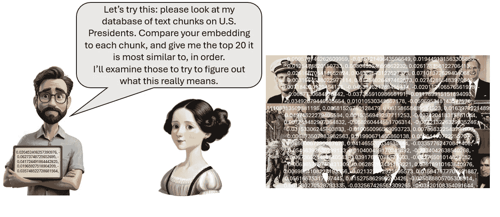

# 嵌入是有点“浅”的

> 原文：[`towardsdatascience.com/embeddings-are-kind-of-shallow-727076637ed5?source=collection_archive---------1-----------------------#2024-09-23`](https://towardsdatascience.com/embeddings-are-kind-of-shallow-727076637ed5?source=collection_archive---------1-----------------------#2024-09-23)

## 我通过四种语言模型嵌入进行美国总统语义搜索时学到的东西

 [Nathan Bos, Ph.D.](https://medium.com/@nathanbos?source=post_page---byline--727076637ed5--------------------------------)

·发表于[Towards Data Science](https://towardsdatascience.com/?source=post_page---byline--727076637ed5--------------------------------) ·25 分钟阅读·2024 年 9 月 23 日

--

本文中的所有照片均来自 WikiCommons，且要么是公共领域的，要么是已授权用于商业用途的。

我有兴趣尝试弄清楚语言模型嵌入（embedding）内部的内容。如果以下任意一条适用于你，你也应该感兴趣：

· 大型语言模型（LLMs）的“思维过程”令你感到兴趣。

· 你构建基于数据驱动的 LLM 系统（特别是检索增强生成系统），或者你有此兴趣。

· 你计划未来将 LLMs 用于研究（正式或非正式）。

· 一种全新类型的语言表示方法令你感到兴趣。

本文旨在让任何好奇的人都能理解，但即使你是每天都在与语言模型打交道的专家，我认为你也会学到一些有用的知识，就像我一样。以下是我通过进行语义搜索所学到的关于语言模型嵌入的一些要点总结：

# 成绩单

嵌入在较大的数据集中，能够“看见”哪些内容，从而找到相关的段落？

和很多人一样，我一直对近期在尝试揭开大型语言模型“黑箱”的进展感到着迷。最近，在理解语言模型内部工作机制方面出现了一些令人难以置信的突破。以下是[Anthropic](https://www.anthropic.com/news/mapping-mind-language-model)、[Google](https://deepmind.google/discover/blog/gemma-scope-helping-the-safety-community-shed-light-on-the-inner-workings-of-language-models/)以及一篇很好的综述文章（[Rai 等，2024](https://arxiv.org/abs/2407.02646)）的相关工作示例。

这项探索有类似的目标，但我们研究的是嵌入，而不是完整的语言模型，并且限制于从问题回答中进行“黑盒”推理，这可能仍然是目前最好的可解释性方法。

嵌入是 LLM 在第一步中创建的，当它们将一块文本转换为语言模型网络可以理解和使用的长串数字时。嵌入用于检索增强生成（RAG）系统中，允许在语义（含义）上进行搜索，而不仅仅是关键字搜索。一个文本集，在我的例子中是关于美国总统的维基百科条目，被分成小块文本并转换为这些数值嵌入，然后保存在数据库中。当用户提出问题时，该问题也会被转换为嵌入。然后，RAG 系统通过简单的数学比较（通常是余弦相似度）在数据库中搜索与用户查询相似的嵌入。这是“检索”步骤，我提供的示例代码到此为止。在完整的 RAG 系统中，从数据库中检索到的最相似的文本块将被传递给 LLM，用作回答原始问题的“上下文”。

如果你使用 RAG 系统，你知道这个基本过程有许多设计变体。一个设计选择是从众多可用的嵌入模型中选择一个特定的模型。有些模型更大，训练的数据更多，费用也更高，但如果不了解它们的特点以及它们的区别，选择使用哪个模型往往是凭猜测。它们到底有多大的差异呢？

## 如果你不关心 RAG 部分

如果你不关心 RAG 系统，只是对语言模型如何工作有概念性的兴趣，你可以跳到问题部分。总结如下：嵌入封装了从文本中提取的有趣数据、信息、知识，甚至可能是智慧，但无论是设计者还是用户都不知道它们究竟捕捉到了什么，遗漏了什么。本文将使用不同的嵌入来搜索信息，试图理解它们内部包含了什么，以及缺少了什么。

# 技术细节：数据、嵌入和块大小

我使用的数据集包含关于美国总统的维基百科条目。我使用 LlamaIndex 来创建并搜索这些文本条目的向量数据库。我使用了比平常更小的块大小，即 128 个标记，因为较大的块往往会叠加更多内容，而我希望清楚地测试系统在寻找语义匹配时的能力。（我也测试了块大小为 512 的情况，大多数测试结果相似。）

我将测试四种嵌入：

1\. **BGE** (bge-small-en-v1.5) 在长度为 384 时相当小。它是北京人工智能研究院开发的一系列 BGE 模型中最小的。就其大小而言，它在检索的基准测试中表现良好（见[排行榜](https://huggingface.co/spaces/mteb/leaderboard)）。它是 F=免费使用的，可以在 HuggingFace 上使用。

2. **ST**（all-MiniLM-L6-v2）是另一种 384 长度的嵌入。它在句子比较方面表现出色；我曾用它来评估转录准确性。它是在第一个十亿句对语料库上训练的，这大约一半来自 Reddit 数据。它也可以在 HuggingFace 上使用。

作者制作的图形，使用 Leonardo.ai

3. **Ada**（text-embedding-ada-002）是 OpenAI 从 GPT-2 到 GPT-4 使用的嵌入方案。它比其他嵌入更长，长度为 1536，但它也较老。它能与更新的模型竞争吗？

4. **Large**（text-embedding-3-large）是 Ada 的替代方案——更新、更长，基于更多数据进行训练，更加昂贵。我们将以最大长度 3,072 来使用它。它值得额外的成本和计算力吗？让我们一探究竟。

## 问题和代码可以在 GitHub 上找到

这里有一个问题响应的电子表格、一个 Jupyter 笔记本和总统维基百科条目的文本数据集：

 [## GitHub - nathanbos/blog_embeddings: 与 Medium 博客有关的嵌入文件

### 与 Medium 博客有关的嵌入文件。通过创建一个…参与 nathanbos/blog_embeddings 的开发。

github.com](https://github.com/nathanbos/blog_embeddings?source=post_page-----727076637ed5--------------------------------)

如果你想构建自己的模型，可以下载文本和 Jupyter 笔记本；我的在 Google Colab 上运行良好。

## 问题的电子表格

我推荐下载[电子表格](https://github.com/nathanbos/blog_embeddings/blob/main/Presidential_RAG_queries.xlsx)以便理解这些结果。它显示了每个问题返回的前 20 个文本片段，以及一些变体和后续内容。点击链接并选择“下载”，就像这样：

作者截图

为了浏览问题和回答，我发现最容易的方式是将顶部的文本输入单元格拖大，并通过标签切换来阅读响应中的文本片段，就像这张截图一样。

作者截图

请注意，这仅是检索到的上下文，并没有 LLM 合成的响应。代码包含了如何获取这些响应的说明，使用查询引擎而不是像我那样仅使用检索器。

# **提供超越排行榜的理解**

在这篇文章中，我们将做一些反潮流的事情：我们将专注于单个问题响应的实际结果。这与当前 LLM 评估的趋势形成对比，后者更注重使用越来越大的数据集，并呈现更高层次的汇总结果。语料库大小对训练非常重要，但对于评估来说，尤其是当目标是理解时，情况并非如此。

要对嵌入式搜索性能进行汇总评估，请参考使用（非常出色的）MTEB 数据集的（非常完善的）HuggingFace 排行榜：[`huggingface.co/spaces/mteb/leaderboard`](https://huggingface.co/spaces/mteb/leaderboard)。

排行榜非常适合广泛比较性能，但并不利于发展有用的理解。大多数排行榜不会发布实际的逐题结果，从而限制了对这些结果的理解。（它们通常会提供代码，供你自己重新运行测试。）排行榜也往往专注于当前技术能力范围内的测试，这样做在比较当前模型时是合理的，但无法帮助我们理解最前沿技术的局限性。为了发展对系统能做和不能做的可用理解，我发现没有什么能替代反复测试和对结果的深入分析。

我在这里展示的基本上是一个初步研究。下一步将是开发更大、更精确设计、以理解为重点的测试集，然后进行以更深理解性能为目标的迭代测试。只有当资助机构和计算机科学以外的学术领域开始关注大语言模型的可解释性时，这种类型的研究才可能在大规模上进行。在此期间，通过提问你也可以学到很多东西。

**问题：哪些美国总统曾在海军服役？**

让我们用我测试集中的第一个问题来说明使用搜索辅助理解的“黑箱”方法。

图形由作者制作，使用 Leonardo.ai

图形由作者制作，使用 Leonardo.ai

动画图形由作者制作，使用 Leonardo.ai。总统肖像来自 WikiCommons，公有领域或商业许可。

## **结果：**

我把海军问题给了每个嵌入索引（数据库）。在四个嵌入中，只有一个名为 Large 的嵌入能够在前十个搜索结果中找到所有六位曾在海军服役的总统。下表展示了每个嵌入模型找到的前 10 条段落。完整的前 20 条内容请参见电子表格。列表中有重复的总统，因为每个维基百科条目都被划分成了许多单独的部分，任何给定的搜索可能会找到同一位总统的多个条目。

为什么会有这么多错误的结果？我们来看几个例子。

BGE 的第一个错误匹配是来自德怀特·D·艾森豪威尔的片段，他是二战中的一位陆军将军，内容包含很多军事信息，但与海军无关。看来 BGE 确实有某种形式的‘海军’语义表示。BGE 的搜索比简单的‘海军’关键词匹配要好，因为它可以推广到其他意思相近的词汇。但是它过于泛化，未能区分海军与一般军事话题，例如，它没有始终如一地区分海军与陆军。我在安纳波利斯的朋友们可不会喜欢这个。

那么这两个中级嵌入模型表现如何呢？它们似乎对‘海军’这一概念有清晰的理解，能够区分海军与陆军。但它们在一些一般性的海军话题上出现了许多错误匹配；例如，关于切斯特·A·阿瑟的海军现代化努力的部分在两份列表中都排得很高。其他找到的部分涉及总统与海军相关的行动，或者以总统命名的舰船，如 U.S.S. Harry Truman 号。

中间的两个嵌入模型似乎能够在语义上表示‘海军’，但没有清晰地表示‘服役于海军’这一概念。这足以使得 ST 和 Ada 都未能在前十名中找到所有六位曾在海军服役的总统。

在这个问题上，Large 显然表现优于其他模型，其前七名中的六个都对应了六位曾服役的总统：杰拉尔德·福特、理查德·尼克松、林登·B·约翰逊、吉米·卡特、约翰·F·肯尼迪和乔治·H·W·布什。Large 似乎不仅理解‘海军’，还理解‘服役于海军’。

**Large 错在哪里？**

Large 中的一个错误是什么？问题出在富兰克林·德拉诺·罗斯福作为海军助理部长的工作。在这个职务上，他是为海军工作的，但作为文职员工，而不是海军军人。我从个人经验中知道，现役军人与文职员工之间的区别有时会让人困惑。我第一次为军方做合同工作时，不清楚哪些同事是现役军人，哪些是文职员工。一位同事以他非常尊重的军事方式告诉我，这个区别非常重要，我需要弄清楚，后来我确实弄清楚了。（另一个小贴士：不要搞混军衔。）

**问题：哪些美国总统曾作为海军的文职员工工作？**

在这个问题中，我探讨了嵌入模型是否“理解”我最初忽视的这个区别：它们是否知道海军的文职员工和实际服役人员有何不同？罗斯福家族的两位成员都曾在海军担任文职工作。西奥多·罗斯福还曾在陆军服役（领导圣胡安山之战），写过关于海军的书，并在担任总统期间发展了海军，因此关于西奥多·罗斯福的海军相关信息很多，但他从未在海军服役。（除了作为三军统帅；这一角色使所有总统在技术上都算作美国海军的一部分，但这个关系并未影响搜索结果。）

“文职员工”查询的结果可以在结果表格中看到。Large 的第一次命中和 Ada 的第二次命中是描述 FDR 在海军工作的一段文字，但这部分内容有些运气成分，因为它包含了“文职”一词，且用法与此问题不同。提到 LBJ 和尼克松的工作人员工作，尽管从段落内容来看，他们当时是现役。 （一些工作人员职位可以由军事或文职人员担任。）没有提到西奥多·罗斯福的文职工作，这使得基于这些搜索结果的 LLM 无法正确回答问题。

总体来看，“海军”、“《海军进行曲》和‘文职员工’这几个搜索之间只有细微的差异。直接询问现役海军也得到了类似的结果。较大的嵌入模型有一些正确的关联，但总体而言，它们无法充分区分这些概念，因此无法准确回答问题。

图表由作者提供，使用 Leonardo.ai 绘制

# 常见概念

## **问题：哪位美国总统在担任总统之前曾是美国参议员？**

所有向量似乎普遍理解像这样的常见概念，并能够给出良好的结果，LLM 可以根据这些结果生成准确的回答。嵌入模型还能够区分美国参议院和美国众议院。他们对副总统和总统的区别非常清晰，也能区分律师和法官之间的差异，并理解当选代表的基本概念。

当被问及哪些总统是艺术家、音乐家或扑克牌玩家时，它们的表现也不错。当涉及到“作家”时，由于与其他作家的数据中存在大量的错误匹配，它们的表现稍有困难。

# 更专业的概念

如我们所见，每个模型都有其表现极限，对 Large 模型来说，“海军的文职员工”就是其中的一个局限。它们在区分国家代表和州级代表方面也表现不佳。

## **问题：哪位美国总统曾在州级担任选举代表？**

没有任何模型返回了所有，甚至大多数在州立立法机关服役的总统。所有模型主要返回的结果都与美国众议院相关，并且有一些提到了州或州长。Large 的第一个命中是准确的：“波尔克于 1823 年当选为州立立法机关的成员”，但错过了其余的内容。这个话题可能需要更多的探讨，但总体而言，这个概念是失败的。

## **问题：哪些美国总统不是出生在美国的州内？**

所有四种嵌入方式都把巴拉克·奥巴马作为这个问题的顶级答案之一返回。这并不准确——奥巴马于 1961 年出生在夏威夷，当时夏威夷已是美国的一州，但这种错误信息广泛传播（谢谢你，唐纳德），以至于出现在编码中。那些出生在美国以外的总统大多是早期的总统，例如乔治·华盛顿，因为他出生时弗吉尼亚州还不是一个州。这个隐含的事实在嵌入中无法获取。威廉·亨利·哈里森在所有情况下都被返回，因为他的条目包括了这样一段话：“……他成为了最后一位没有出生为美国公民的美国总统”，但早期总统的条目中并没有直接提到这一点，因此在搜索中没有找到。

# 搜索特定的、半知名的人物和地点

## **问题：哪些美国总统曾被要求向约翰·苏努努传达一个困难的信息？**

约翰·苏努努，来自 WikiCommons。照片由迈克尔·瓦东提供

那些在 1990 年代曾关注过美国政治的人，应该还记得这个独特的名字：约翰·苏努努曾是新罕布什尔州的州长，是一个颇有影响力的政治人物，并且曾担任乔治·H·W·布什（布什#1）总统的幕僚长。然而，他并未在布什#1 的条目中被提及。他在乔治·W·布什（布什#2）的条目中被提到，作为一个有趣的插曲，提到布什#1 曾要求布什#2 让苏努努辞职。我认为提到这个，是为了说明布什#2 的一个关键优点——亲和力，以及两位布什之间的关系。对约翰·苏努努的搜索本应因为其独特的名字而轻松找到这一段，但在四个嵌入方式中的三个都未能找到这一段。而唯一正确的结果？令人惊讶的是，是 BGE，这个冷门模型。

还有一个有趣的模式：Large 返回了许多关于布什#1 的结果，这位总统历史上与约翰·苏努努有着最深的关联，尽管在返回的段落中他从未被提及。这似乎不仅仅是巧合；嵌入编码了一种关于苏努努与布什#1 之间的某种关联，超出了文本中所述内容。

## 哪些美国总统曾被海伦·普雷尚批评过？

海伦·普雷尚修女，来自 WikiCommons。照片由[唐·拉范吉](https://www.flickr.com/people/26667277@N00)提供

我在第二个半知名的名字上观察到了同样的现象：海伦·普雷让修女（Sister Helen Prejean）是死刑的温和批评者；她写了*Dead Man Walking*，而维基百科简要提到她批评了布什二号的政策。没有一个嵌入能够找到海伦·普雷让的相关提及，而这类关键词搜索会轻松找到。大型模型的几个最重要的结果是与死刑相关的段落，这似乎不完全是巧合。像对待孙努努一样，模型似乎与这个名字有某种关联，尽管它在嵌入词汇中的表达不够清晰，导致无法有效搜索到。

我测试了多个具体的名字、地点和一个奇怪的词——‘normalcy’，以检验嵌入模型在维基百科文本中对它们的编码和匹配能力。下表展示了匹配和未匹配的情况。

作者截屏

## 这告诉我们什么？

语言模型对更多频繁出现的名字进行编码，即更多的名人，但对不太常见的名字编码的可能性较小。一般来说，较大的嵌入能够编码更多具体的细节。但在这里有一些情况，小模型的表现超过了大模型，而且有时模型即使对一些无法完全识别的名字，也不得不进行某种关联。对此进行系统化的后续研究，探讨名词频率如何影响嵌入表示，会是一个很好的方向。

# **切入点 #1：押韵**

这有点跑题，但我在测试时玩得很开心。大型语言模型的押韵能力不好，因为它们既不说话也不听。大多数人首先学习大声朗读，然后才学会默读。当我们默读时，我们仍然可以在心里默默发音，并且能够‘听到’写作中的韵律。语言模型并不这样做。它们的世界是无声的、只有文本的。它们了解押韵只是通过阅读相关的内容，而永远不能做到很熟练。理论上，嵌入可以表示音韵学，并且通常可以为一个特定的单词提供准确的发音。然而，自从 GPT-3 以来，我就一直在测试押韵，语言模型通常无法在此进行搜索。然而，嵌入在这次测试中几次让我感到惊讶。

## **哪个总统的名字和‘Gimme Barter’押韵？**

来自 WikiCommons。吉米·卡特的照片，由[Commonwealth Club](https://www.flickr.com/people/9555120@N08)提供

这一项测试结果很简单；所有四个向量都把“Jimmy Carter”作为第一个返回的结果。余弦相似度较低，但因为这基本上是一个多项选择的总统测试，它们都很容易匹配上。我认为“Gimme Barter”和“Jimmy Carter”的拼写太相似了，所以我们来尝试一些更难的，韵律相似但拼写不同的例子。

## **哪个美国总统的名字和‘Laybramam Thinkin’’押韵？**

来自 WikiCommons：亚伯拉罕·林肯的照片，由亚历山大·加德纳（Alexander Gardner）拍摄。

这个更难一些。亚伯拉罕·林肯没有出现在 BGE 或 ST 的前十名中，但在 Ada 中排名第 1，在 Large 中排名第 3。

## **哪个美国总统的名字和 Will-Ard Syl-Bor 押韵？**

米拉德·菲尔莫尔是一个难度较大的押韵。它在 Ada 中排名第 2，在 Large 中排名第 5，在其他分类中不在前 10 名内。关于菲尔莫尔总统的网络诗歌似乎是一个有待填补的空白。关于比尔·克林顿的错误匹配较多，可能是因为双“L”？

Google 搜索结果由作者获得；米拉德·菲尔莫尔肖像，乔治·彼得·亚历山大·希利（George Peter Alexander Healey）绘制，来自 WikiCommons

然而，这个确实存在：[`www.classroompoems.com/millard-fillmore-poem.htm`](https://www.classroompoems.com/millard-fillmore-poem.htm)。因为它就是互联网。

## **哪个美国总统的名字和 Mayrolled Gored 押韵？**

杰拉尔德·福特在 BGE 中排名第 7，在 Ada 中排名第 4，在 Large 中排名第 5。

押韵在我家乡密歇根州大急流城的杰拉尔德·R·福特总统博物馆并没有被涵盖。我知道，因为我去了很多次。稍后会详细介绍。

收获：更大的嵌入方案可以略微押韵，尽管可能没有人类那么好。它们是如何做到的，有限制是什么？它们是在分析语音学，利用现有的押韵内容，还是通过其他方式做出正确的猜测？我不知道。嵌入系统中的语音编码似乎是一个非常适合有创业精神的语言学学生的论文题目，或者是非常痴迷的英语文学专业学生。

# 嵌入无法进行布尔操作：没有 NOT、AND 或 OR

简单的语义搜索无法执行一些关键字查询系统通常能够完成的基本操作，也不擅长搜索事件序列。

## **问题：哪些总统不是先当副总统的？**

使用‘NOT’进行向量搜索类似于老生常谈的“不要想着粉红色大象”——通常说出这个词组会让人不由自主地去想它。嵌入没有“不是副总统”的表示，它们只有副总统。

图片由作者提供，使用 GPT-4o（Dall-E）

代表问题的向量将同时包含“总统”和“副总统”，并倾向于找到同时包含这两个词的块。可以尝试拼凑一个复合查询，先搜索所有总统，再搜索所有副总统，然后相减，但返回的上下文数量限制会阻止返回完整的第一个列表，并且也不能保证返回第二个列表中的所有内容。带嵌入的布尔搜索仍然是一个问题。

## **问题：哪个美国总统既没有作为副总统当选，也从未当选为总统？**

一个‘NOT’失败的例外：所有的嵌入都能够找到一段文字，表明杰拉尔德·福特是唯一一位既没有当选为副总统（当斯皮罗·阿格纽辞职时被任命）也没有当选为总统（当尼克松辞职时接任，之后在与吉米·卡特的再选竞赛中失败）的总统。它们能够找到这一点，因为‘not’在文本中得到了明确的表示，不需要推理，而且这也是关于福特的一个广为人知的事实。

## **为什么这个问题中有双重否定？**

前一个问题中的不必要的双重否定使得这个搜索结果更好。搜索“哪位美国总统既没有被选为副总统，也没有被选为总统？”给出的结果较差。我添加了双重否定的表述，直觉告诉我，双重否定会产生复合效应，使查询更加消极，并且更容易将‘not’与两个职位关联起来。这在语法上没有意义，但在重叠语义的世界里是有道理的。

## 杰拉尔德·R·福特的诸多成就

来自我家乡密歇根州大急流市的杰拉尔德·R·福特总统博物馆的参观者，如果次数足够多，会知道福特尽管没有当选为最高职位，依然做出了**许多**重要贡献。只是想把这一点说出来。

杰拉尔德·福特的就职典礼。来自 WikiCommons；由 Robert LeRoy Knudsen 拍摄的公共领域照片

## **问题：哪些总统曾同时担任总统和副总统？**

语义搜索有一种弱 AND，更像是 OR，但这两者都不是逻辑布尔查询。嵌入并不会以严格的逻辑方式连接概念。相反，应该把它们看作是将概念叠加在同一个向量上的。这个查询会找到与总统（在这个数据集中几乎所有的条目）和副总统相关的片段，但并没有以任何方式强制执行逻辑 AND。在这个数据集中，它提供了一些正确的结果，以及大量多余的副总统提及。对于叠加的概念而言，这种搜索也不是一个真正的逻辑 OR。

## 嵌入和一系列动作

嵌入是否足够好地按顺序连接概念，以便在这些序列上进行搜索？我最初的假设是它们无法做到这一点，但嵌入的表现比预期的要好。

人类有一种特定的记忆类型用于记忆顺序，称为情景记忆。故事是我们非常重要的一类信息；我们会将个人历史、社交信息以及有用的教训编码成故事。我们还能识别出那些与我们已经知道的故事相似的故事。我们可以阅读关于一个因为致命缺陷而失败的英雄的故事，或者一个普通人如何崛起到伟大高度的故事，并不仅仅识别出其中的概念，还能识别出行动的顺序。在我之前的[博客文章](https://medium.com/@nathanbos/what-your-gpt-rag-cant-see-a4ef19ef2724)中，讲的是使用伊索寓言的 RAG 搜索系统，该系统似乎没有能力搜索动作的顺序。我本以为在这里会遇到类似的失败，但结果有些不同。

**问题：哪些美国总统在担任总统后曾在国会任职？**

有许多总统在担任总统之前曾在国会任职，但只有两位总统在担任总统之后曾在国会任职。所有嵌入结果都返回了约翰·昆西亚当斯的一段文字，这段文字直接给出了答案，作为最相关的结果：*亚当斯和安德鲁·约翰逊是唯一两位曾担任总统后再担任国会职务的前总统。*它们还分别在前十名中找到了安德鲁·约翰逊的相关条目。虽然有一些错误的结果，但关键信息是存在的。

嵌入在后续测试中表现不佳，比如**哪些美国总统在担任总统后曾担任法官？**但所有的测试结果都提到了塔夫特，塔夫特是唯一一位既担任过首席大法官又担任过总统的人。

这是否真正代表了成功地搜索到一个顺序呢？可能不是；在这些情况下，顺序可能被封装成了一个单一的可搜索概念，比如“前总统”。我仍然怀疑，嵌入在更复杂的故事型搜索中会远远逊色于人类。但这是一个微妙的问题，需要更多的分析。

## 那么因果关系呢？

因果推理是人类推理中非常重要的一部分，因此我想单独测试一下因果联系是否能清晰地表示并被搜索到。我使用了两个配对查询，因果关系被颠倒了，并查看了返回的搜索结果以及这两个配对的不同之处。这两个问题配对都非常有趣，结果已显示在电子表格中；我将集中讨论这个：

**问题：总统的行动何时导致了一个重要的世界事件？ - 与 - 一个重要的世界事件何时导致了总统的行动？**

ST 未通过这个测试，它返回了两个查询完全相同的结果，并且顺序也一样。因果关系未能清晰地表示出来，无法影响搜索。

所有的嵌入结果都返回了多个与总统世界旅行相关的片段，奇怪的是未能将旅行和官方行动分开。

没有任何嵌入在因果反转方面表现良好。每个嵌入都有一些涉及世界事件与总统行为相吻合的结果，通常是非常微小的行为，但没有任何因果联系。所有结果中都有逻辑联系错误的情况（总统引起事件与回应事件的方向搞错）。还有多个例子表明评论员指出总统的不作为，这表明“行动”和“不行动”被混淆了。因果语言，尤其是“cause”（原因）一词，触发了很多匹配，即使它并没有与总统的行动或世界事件相关联。

需要更深入地探讨嵌入如何表示因果关系，也许在像医学这样的关键领域中更为合适。我观察到的是，嵌入缺乏能够正确表示和使用因果关系的证据。

# 类比

## 问题：哪些美国总统与西蒙·玻利瓦尔相似？怎么相似？

西蒙·玻利瓦尔，南美洲的革命领袖和后来的政治领袖，有时被称为“南美洲的乔治·华盛顿”。嵌入模型能否在反向中感知到这一类比？

+   BGE- 返回了一组非常奇怪的上下文，除了提到一些中美洲/南美洲的内容外，没有明显的联系。

+   ST- 找到了一段关于威廉·亨利·哈里森 1828 年访问哥伦比亚以及与博尔瓦尔发生争执的内容，还有一些关于拉丁美洲的提及，但没有匹配的摘要。

+   Ada- 找到了关于哈里森的段落和南美洲的相关引用，但我能看出来的没有匹配的摘要。

+   Large- 返回了乔治·华盛顿，排名第 5，排在博尔瓦尔/南美洲相关的结果之后。

Large 在这次测试中大获全胜。这个匹配显示了较大/较好的向量在抽象比较中优于其他向量的最清晰模式。

公有领域的图片，来自维基共享资源。西蒙·玻利瓦尔的雕像，由埃马纽埃尔·弗雷米特（Emmanuel Frémiet）创作，照片由[Jebulon](https://commons.wikimedia.org/wiki/User:Jebulon)提供。乔治·华盛顿过德拉瓦河的画作，由埃马纽埃尔·洛伊茨（Emmanuel Leutze）创作。

# 抽象概念

我在更抽象的概念上进行了多个搜索测试。以下是两个示例：

**问题：哪些美国总统超越了他们的权力？**

BGE: 最高匹配：“*自 1948 年以来，美国学者对总统的排名调查中，排名前三的总统通常是林肯、华盛顿和富兰克林·德拉诺·罗斯福，尽管顺序有所不同。*” BGE 找到的匹配都与总统的显著性有关，特别是历史学家的排名，我认为是关注了“权力”和“超越”这两个词。这是一个失误。

ST: “*罗斯福被广泛认为是美国历史上最重要的人物之一。*” 与 BGE 的模式相同；这是一个失误。

Ada: Ada 的重点都集中在总统权力的话题上，而不仅仅是声望，因此比小型模型更为精准。这里有一个共同的主题是权力的增长，并且有一些段落暗示了超越，比如这一段：*《爱国者法案》“增加了行政部门的权力，但以牺牲司法意见为代价……”* 总体而言，这并非完全的胜利，但更接近了目标。

Large: 它没有找到最好的 10 个段落，但这些命中更为精准。所有段落都包含了总统权力增长的概念，而且大多数有某种超越先前限制的味道，例如“*保守派专栏作家乔治·威尔在《华盛顿邮报》上写道，西奥多·罗斯福和威尔逊是今天‘帝国总统制’的先驱*”

同样，有一个模式是较大的模型有更精确、更贴近目标的抽象。大型模型是唯一一个接近正确表现“总统超越权力”的模型，但即便如此，其表现依然有很大的改进空间。

# 嵌入模型无法理解潜台词

潜台词是指文本中未直接陈述的含义。人们在阅读时，会为所读内容赋予意义，产生情感关联，或识别与直接表述无关的相关概念，而嵌入式表示只能在非常有限的范围内做到这一点。

**问题：举一个美国总统因选举失败而感到沮丧的例子？**

1960 年，当时的副总统理查德·尼克松在一场历史上极为接近的选举中败给了约翰·F·肯尼迪。因失败深受打击，尼克松决定回到自己家乡加利福尼亚，并在 1962 年竞选州长。尼克松也输了这场竞选。他在一次新闻发布会上著名地宣布：“你们以后再也没有尼克松可以踢了，先生们，这将是我的最后一次新闻发布会。” 从而结束了他的政治生涯，至少大家是这么认为的。

图片由作者和 GPT4（Dall-E）提供。与特定总统没有刻意的相似性；这些是 Dall-E 关于典型总统形象表达情感的构思。还不错。

当你搜索：“举一个美国总统因选举失败而感到沮丧的例子”时会发生什么？没有一个嵌入返回了尼克松的这段引述。为什么？因为维基百科从未直接表明他感到沮丧或有其他特定情感；这都是潜台词。当一个成熟的人类阅读到“你们以后不会再有尼克松可以踢来踢去了”时，我们会识别出一些隐含的情感，可能是在没有刻意思考的情况下做出的。这可能是在阅读时的自动反应，以至于我们认为它就存在于文本中。但在这段话中，情感从未被直接表述。如果它是潜台词而非明示内容，嵌入式模型（可能）无法表示或搜索到它。

维基百科避免在基于事实的报道中推测情感潜台词。即便目标是传达强烈的情感，使用潜台词而非直接陈述也是小说作家的一种良好技巧。对新作家的常见建议是：“展示，而不是告知。” 熟练的作家能通过不直接说明的方式，揭示人物的思想和情感。甚至有一种术语形容那些直接解释事物的写作风格，叫做“直白对话”。

但“展示，而不是告知”使得一些内容对嵌入表示不可见，从而也无法被基于向量的 RAG 检索系统检索到。这在情感潜台词的领域，甚至其他超越直接陈述的意义层次中，提出了某些根本性障碍。我还深入探讨了类似“总统错误”、“总统意图”以及那些仅仅超出直接陈述的分析模式等概念。基于嵌入表示的搜索通常在这些方面失败，主要返回的只是直接的陈述，甚至即使它们不相关。

## **为什么嵌入表示相比大型语言模型较为浅显？**

大型语言模型如 Claude 和 GPT-4 具有理解潜台词的能力；它们能够可信地解释故事、笑话、诗歌以及泰勒·斯威夫特的歌词。那么，为什么嵌入表示不能做到这些呢？

语言模型由多个层次组成，通常较低的层次是处理的浅层形式，代表了语法和表面意义等方面，而较高的层次则进行更高层次的抽象。嵌入表示是语言模型处理的第一阶段；它们将文本转化为数字，然后交由 LLM 接管。这是我所知道的最好的解释，说明为什么嵌入表示搜索测试在语义匹配的浅层次上似乎会遇到瓶颈。

嵌入表示最初并非为 RAG（检索增强生成）设计；将它们用于语义搜索是一种聪明但最终有限的二次使用方式。随着嵌入系统优化用于搜索，这一情况正在改变。BGE 在某种程度上被优化为搜索，而 ST 则是为句子比较设计的；我认为这也是为什么 BGE 和 ST 尽管只有 Ada 和 Large 的极小规模，但仍不落后它们太多的原因。Large 大概在一定程度上考虑到了搜索的需求。但与完全的大型语言模型处理的语义相比，很容易将它们推向语义的极限。

# 结论

在他的练习中，我们在概念上学到了关于嵌入表示什么？

总的来说，嵌入表示模型在某些方面让我感到惊讶。语义深度比我预期的要浅，这与使用它们的语言模型的表现相比。然而，它们在一些我认为它们完全会失败的方面超出了我的预期，比如押韵和搜索顺序活动。这项活动激发了我对一些更具体领域的探究兴趣，也许它同样激发了你们的兴趣。

对于 RAG 开发人员而言，这些内容阐明了大型模型在一些特定方面可能优于小型模型，包括其表示的精确度、知识的广度和抽象范围。作为一个曾经的 RAG 构建者，我曾对为嵌入支付更多费用是否会提高性能持怀疑态度，但这次实验让我相信，嵌入选择对于某些应用来说确实能带来差异。

嵌入系统将继续逐步改进，但我认为这一领域仍需要一些突破。目前有一些关于如通用文本嵌入等创新的研究。

知识图谱是当前流行的补充语义搜索的方式。图谱擅长进行跨文档连接，但我见过的基于 LLM 的图谱在语义上相当浅薄。要从知识图谱中获得语义深度，可能需要一个专业开发的本体作为起点；对于一些专业领域，这些本体是可用的。

我自己偏好的方法是通过更多的文本来改进文本。由于完整的语言模型能够感知和理解嵌入中没有的意义，为什么不让语言模型在你的语料库中预处理并注解你感兴趣的特定语义类型呢？对于真正巨大的数据集来说，这可能太昂贵，但对于中小规模的数据集来说，这可以是一个非常好的解决方案。

我尝试在总统数据集中添加注解。为了让情感潜台词能够被搜索，我让 GPT4o 为每位总统写了讲述个人和情感内容的叙事。这些注解被添加回到语料库中。虽然这些叙述不是很优美，但这个概念是有效的。GPT 为尼克松条目添加的注解包括了这一句话：“这次失败是一个苦涩的教训，尤其是在他失去了 1962 年加利福尼亚州州长选举之后。在一次沮丧的时刻，尼克松对媒体说道：‘你们再也不会有机会拿我开涮了，’这被许多人认为是他政治生涯的终结。”这有效地将潜台词转化为文本，使得它可以被搜索。

我尝试了多种类型的注解。其中我特别满意的一种方法是使用 Claude 来检查每一任总统，并对诸如延迟反馈和正反馈循环等潜在的系统动力学现象进行注解。在原文中搜索这些术语没有找到有用的信息，但通过注解大大改善了搜索结果。Claude 的分析并不出色，甚至不总是正确的，但它找到了足够多的不错的例子，通过使用系统动力学语言的搜索能够找到有价值的内容。

这是位于密歇根州大急流市的杰拉尔德·福特总统博物馆。图片来自 WikiCommons，由博物馆工作人员拍摄。

杰拉尔德·R·福特总统博物馆内最酷的东西——椭圆形办公室复制品。图片来自 WikiCommons；摄影师：[JJonahJackalope](https://commons.wikimedia.org/wiki/User:JJonahJackalope)
