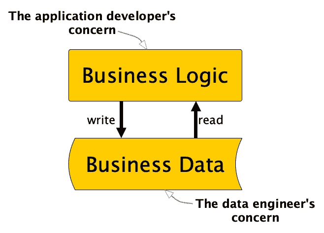

# 在数据工程中拥抱简洁性和可组合性

> 原文：[`towardsdatascience.com/embracing-simplicity-and-composability-in-data-engineering-1eb1fd7aa190?source=collection_archive---------2-----------------------#2024-08-03`](https://towardsdatascience.com/embracing-simplicity-and-composability-in-data-engineering-1eb1fd7aa190?source=collection_archive---------2-----------------------#2024-08-03)

## 从 30 多年数据工程的经验中汲取的教训：忽视保持简单性的价值

 [Bernd Wessely](https://medium.com/@bernd.wessely?source=post_page---byline--1eb1fd7aa190--------------------------------)

·发表于 [Towards Data Science](https://towardsdatascience.com/?source=post_page---byline--1eb1fd7aa190--------------------------------) ·阅读时间：8 分钟·2024 年 8 月 3 日

--

图片由作者提供

在计算机编程中，我们有一个直接且基本的原则：逻辑和数据之间的关注点分离。然而，当我看到当前的数据工程领域时，很明显我们已经偏离了这一原则，导致我们的工作变得复杂化——[我之前曾写过关于这个问题的文章](https://medium.com/towards-data-science/data-engineering-redefined-643249cbbadd)。

还有一些优雅简洁的原则，我们常常忽视并未遵循。例如，Unix 操作系统的开发者们引入了深思熟虑且简单的软件构建抽象方法。这些原则经得起时间的考验，在基于它们构建的数百万个应用中得到了验证。然而，不知为何，我们常常通过复杂且往往封闭的生态系统走弯路，忽视了[KISS 原则](https://en.wikipedia.org/wiki/KISS_principle)和[Unix 哲学](https://en.m.wikipedia.org/wiki/Unix_philosophy)的简洁性和可组合性。

为什么会发生这种情况？

让我们通过一些例子并深入探索一点历史，以更好地理解这一现象。这一探索或许有助于我们理解为什么我们反复未能保持事物的简单性。

# 数据库

类 Unix 系统提供了将数据抽象为文件的基本方式。在这些系统中，几乎所有与数据相关的内容都是文件，包括：

+   **常规文件**：通常是文本、图片、程序等。

+   **目录**：一种特殊类型的文件，包含其他文件的列表，并按层级组织它们。

+   **设备**：代表硬件设备的文件，包括面向块的设备（磁盘）和面向字符的设备（终端）。

+   **管道**：使进程间通信成为可能的文件。

+   **套接字**：促进计算机节点间网络通信的文件。

每个应用程序可以使用一些常见操作，这些操作在不同的文件类型上表现相似，如 open()、read()、write()、close()和 lseek（改变文件内部位置）。文件的内容只是字节流，系统对文件内容的结构没有假设。对于每个文件，系统维护着关于所有者、访问权限、时间戳、大小以及数据块在磁盘上位置的基本元数据。

这种紧凑且同时非常灵活的抽象支持构建非常灵活的数据系统。例如，它也被用来创建著名的关系型数据库系统，这些系统为我们引入了称为“关系”（或表）的新抽象。

不幸的是，这些系统朝着远离将关系视为文件的方向发展。现在，要访问这些关系中的数据，就需要调用数据库应用程序，使用结构化查询语言（SQL），这被定义为访问数据的新接口。这使得数据库能够更好地控制访问并提供比文件系统更高级的抽象。

这总体上是一次改进吗？在几个十年里，我们显然相信了这一点，关系型数据库系统风靡一时。像 ODBC 和 JDBC 这样的接口标准化了对各种数据库系统的访问，使得关系型数据库成为许多开发者的默认选择。供应商将他们的系统宣传为全面解决方案，不仅包括数据管理，还包括业务逻辑，鼓励开发者完全在数据库环境中工作。

一位勇敢的人，名叫 Carlos Strozzi，试图抵制这一发展并坚持 Unix 哲学。他旨在保持简单，并将数据库视为[仅仅是 Unix 文件抽象的一个薄扩展](http://www.strozzi.it/cgi-bin/CSA/tw7/I/en_US/NoSQL/Home%20Page)。因为他不想强迫应用程序只使用 SQL 来访问数据，所以他称其为 NoSQL RDBMS。后来，NoSQL 这一术语被用于推动替代数据存储模型的运动，这一运动源自于需要处理互联网规模的日益增加的数据量。关系型数据库被 NoSQL 社区视为过时，并且无法满足现代数据系统的需求。一种混乱的新 API 层出不穷。

具有讽刺意味的是，NoSQL 社区最终认识到标准接口的价值，导致了对 NoSQL 的重新解释为“Not Only SQL”，并重新引入了 SQL 接口到 NoSQL 数据库中。与此同时，开源运动和新兴的开源数据格式如 Parquet 和 Avro 也出现了，将数据存储在兼容传统 Unix 文件抽象的普通文件中。像 Apache Spark 和 DuckDB 这样的系统现在使用这些格式，通过仅依赖于文件抽象的库直接访问数据，其中 SQL 是众多访问方法之一。

最终，数据库实际上并没有为企业中所有多方面的需求提供更好的抽象。SQL 是一个有价值的工具，但并不是唯一或最好的选择。我们不得不通过 RDBMS 和 NoSQL 数据库的绕道，最终回到了文件。也许我们意识到，简单的类 Unix 抽象实际上为数据管理的多功能需求提供了一个稳固的基础。

别误会，数据库依然至关重要，提供诸如 ACID、精细访问控制、索引等功能。然而，我认为，单一的、庞大的系统，以一种受限且固定的数据表示方式来处理企业级的各种需求并不是正确的方式。数据库增加了价值，但应该是开放的，并能作为更大系统和架构中的组件来使用。

# 新的生态系统无处不在

数据库只是创建新生态系统趋势的一个例子，这些生态系统旨在为应用程序提供更好的抽象，以处理数据甚至逻辑。大数据运动中也出现了类似的现象。为了处理传统数据库显然无法再处理的庞大数据量，一个全新的生态系统围绕分布式数据系统 Hadoop 应运而生。

Hadoop 实现了分布式文件系统 HDFS，紧密地与处理框架 MapReduce 耦合。两个组件都是完全基于 Java 的，并在 JVM 中运行。因此，Hadoop 提供的抽象并不是操作系统的无缝扩展。相反，应用程序必须采用全新的抽象层和 API，以利用大数据运动中的进展。

这个生态系统催生了大量的工具和库，最终产生了数据工程师这一新角色。这个新角色似乎是不可避免的，因为生态系统已经变得如此复杂，以至于常规的软件工程师无法跟上。显然，我们未能保持简单。

# 分布式操作系统等效物

通过认识到大数据不能通过单一系统来处理，我们见证了新型分布式操作系统等效物的出现。这个有些笨拙的术语指的是那些将资源分配给跨计算节点集群运行的软件组件的系统。

对于 Hadoop 来说，这一角色由 YARN（Yet Another Resource Negotiator）担任，它负责管理 Hadoop 集群中正在运行的 MapReduce 作业之间的资源分配，就像操作系统在单一系统中为进程分配资源一样。

因此，另一种方法本应是将类 Unix 操作系统扩展到多个节点，同时保留熟悉的单系统抽象。实际上，这种系统，称为[单系统镜像（SSI）](https://en.wikipedia.org/wiki/Single_system_image)，是在大数据运动之外独立发展的。该方法将类 Unix 系统运行在多个分布式节点的事实进行了抽象，承诺提供水平扩展，同时发展了经过验证的抽象。然而，显然这些系统的开发非常复杂，并且在 2015 年左右停滞了。

这一停滞的一个关键因素可能是受有影响力的云服务提供商的平行开发推动，他们将 YARN 的功能发展成了一个用于标准 Linux 系统的分布式编排层。例如，Google 通过其内部系统 Borg 开创了这一领域，而 Borg 显然所需的努力比重写操作系统本身要少。但我们再次牺牲了简洁性。

如今，我们缺乏一个能够透明地在集群节点之间扩展单系统进程的系统。相反，我们得到了（或者说被诅咒了？）Kubernetes，它从 Google 的 Borg 演变而来，成为了一个分布式资源和编排层，负责在 Linux 节点集群中运行容器。Kubernetes 以其复杂性著称，学习它需要了解持久化卷、持久化卷声明、存储类、Pod、部署、状态集、副本集等内容。这是一个全新的抽象层，与类 Unix 系统中简单且熟悉的抽象几乎没有相似之处。

# 敏捷性

不仅仅是计算机系统遭遇了忽视 KISS 原则的所谓进步，组织开发过程的系统也面临同样的问题。

自 2001 年以来，我们有了一套精简且经过深思熟虑的敏捷软件开发原则宣言。遵循这些简单明了的原则有助于团队进行协作、创新，并最终开发出更好的软件系统。

然而，在确保成功应用的过程中，我们试图更精确地规定这些通用原则，详细说明得如此之多，以至于团队现在需要参加敏捷培训课程，才能完全掌握这些复杂的流程。最终，我们得到了像 SAFe 这样过于复杂的框架，很多敏捷实践者甚至不再认为它们是敏捷的了。

你不必相信敏捷原则——有些人认为敏捷工作已经失败——就能理解我所表达的观点。当商业利益占上风，或者我们僵化地制定我们认为必须遵守的规则时，我们往往会把事情复杂化。有一个[由戴夫·托马斯（敏捷宣言的作者之一）主讲的精彩演讲](https://www.youtube.com/watch?v=a-BOSpxYJ9M)，他解释了当我们忽视简洁性时会发生什么。

# 信任原则和架构，而不是产品和仪式

KISS 原则和 Unix 哲学容易理解，但在 IT 项目的数据架构的日常混乱中，它们可能很难遵循。我们有太多的工具，太多的供应商，卖着太多的产品，而这些产品都承诺能解决我们的挑战。

唯一的出路是真正理解并遵守合理的原则。我认为在用新的时髦事物替代经过验证的简单抽象之前，我们应该始终三思而后行。

我曾写过关于我[个人的应对复杂事务和理解大局的策略](https://medium.com/@bernd.wessely/abstract-and-conquer-data-engineering-e2b7c0b92f9f)，以应对我们所面临的极端复杂性。

## 商业化不能决定决策

当你的组织在喧嚣要求一个新的巨型 AI 平台（或者任何其他平台）时，遵循 Unix 哲学中给出的简单原则是很难的。

[企业资源规划（ERP）](https://en.wikipedia.org/wiki/Enterprise_resource_planning)的供应商，例如，在当时让我们相信他们能提供覆盖公司所有相关业务需求的系统。你怎么敢与这些专家相矛盾？

[统一实时（数据）平台（URP）](https://www.rtinsights.com/unified-real-time-platforms/)的供应商现在声称他们的系统将解决我们所有的数据问题。你怎么敢不使用这么全面的系统？

但是，产品始终只是整个系统架构中的一小块砖块，无论其功能范围如何广泛地被宣传。

数据工程应该基于与软件工程中使用的相同的软件架构原则。而软件架构就是在平衡权衡和保持灵活性中，专注于长期的业务价值。简洁性和可组合性能帮助你保持这个焦点。

## 来自封闭思维模型的压力

不仅仅是商业化让我们无法坚持简洁，开放源代码社区有时也会显得教条。虽然我们寻求完美系统开发的黄金规则，但现实中并不存在这样的规则。

Python 社区可能会说非 Pythonic 代码是不好的。函数式编程社区可能会声称应用面向对象编程原则会让你走向地狱。敏捷编程的倡导者可能会试图说服你，任何遵循瀑布方法的开发都会使你的项目注定失败。当然，他们在其绝对主义的立场上都是错的，但我们常常会把超出自己思维范围的观点视为不合适的。

我们喜欢那些我们只需要遵循就能取得成功的清晰规则。举个例子，在我的一个客户公司，软件开发团队曾深入研究过软件设计模式。这些模式在为常见问题找到经过验证的解决方案时非常有帮助。但我在团队中实际观察到的是，他们将这些模式视为必须严格遵循的规则。不遵循这些规则就像是一个不称职的软件工程师。但这往往导致了对非常简单问题的过度复杂设计。基于扎实原则的批判性思维不能被对规则的僵硬遵守所替代。

最终，拥抱简洁性和可组合性需要勇气和对原则的深刻理解。这种方法对于设计可靠的数据系统至关重要，能够扩展、维护并与企业一起发展。

如果你觉得这些信息有用，请考虑点赞。我非常乐意收到你们的反馈、意见和问题。
